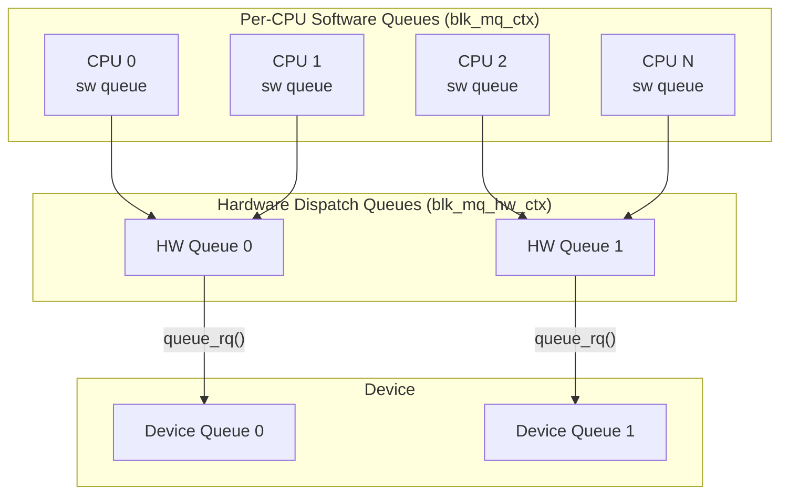
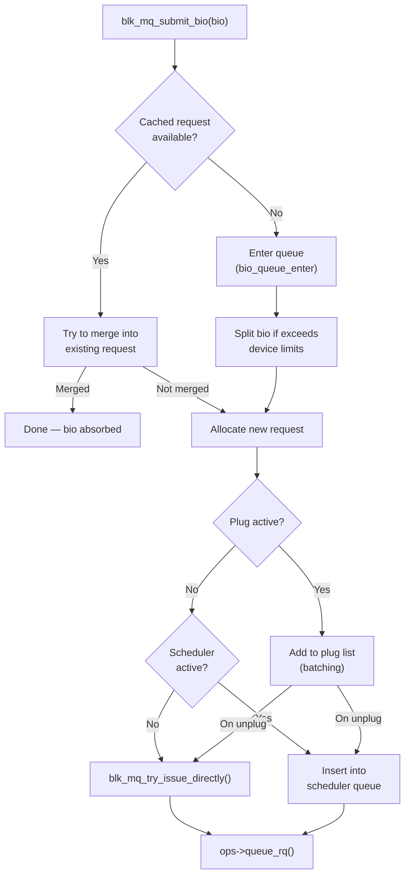
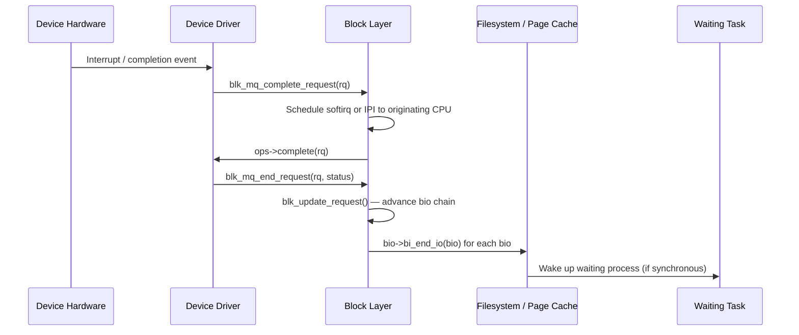

# The Block I/O Layer in Linux 6.19

> Source base: `/home/inineapa/Lab/linux-6.19`

---

## Before You Begin

In user space, reading a file feels instantaneous: you call `read()`, and bytes appear in your buffer. But between that system call and the actual movement of data from a storage device, an entire subsystem is at work. The block I/O layer sits between filesystems (which think in terms of files, directories, and byte offsets) and device drivers (which think in terms of hardware commands, DMA addresses, and interrupts). Its job is to translate, batch, sort, and dispatch I/O operations so that the hardware is used as efficiently as possible.

If you have worked with user-space I/O, think of the block layer as a post office. A filesystem hands it letters (individual I/O requests), and the block layer sorts them by ZIP code (disk sector), batches them into mail bags (merged requests), picks the most efficient delivery route (I/O scheduling), and hands them to the delivery truck (the device driver). The result is that a spinning hard disk does not have to seek back and forth randomly, and an NVMe SSD can fill all of its hardware queues in parallel.

This document walks through the block layer from the ground up: the fundamental data structures (`bio`, `request`, `gendisk`, `request_queue`), the multi-queue dispatch machinery (`blk-mq`), the submission and completion paths, I/O schedulers, partitions, and how to observe and debug block I/O in a running system. All line references point to the Linux 6.19 source tree.

---

## 1. What the Block Layer Does

The block layer is the kernel subsystem responsible for managing I/O to block devices — storage devices that transfer data in fixed-size blocks (typically 512 bytes or 4096 bytes). Every hard disk, SSD, NVMe drive, USB flash drive, and virtual disk (virtio-blk, loop device) is a block device.

### 1.1 Position in the Stack

The block layer sits between two worlds:

```
 ┌─────────────────────────────────────────────────────┐
 │                   User Space                        │
 │           read() / write() / io_uring               │
 └─────────────────────┬───────────────────────────────┘
                       │ system call
 ┌─────────────────────▼───────────────────────────────┐
 │                 VFS (Virtual File System)            │
 │        Translates file ops → page cache / I/O       │
 └─────────────────────┬───────────────────────────────┘
                       │
 ┌─────────────────────▼───────────────────────────────┐
 │               Filesystem (ext4, btrfs, xfs)         │
 │     Maps file offsets → block device sectors         │
 └─────────────────────┬───────────────────────────────┘
                       │ submit_bio()
 ┌─────────────────────▼───────────────────────────────┐
 │               Block I/O Layer (block/)              │
 │   Merging, scheduling, queueing, accounting         │
 └─────────────────────┬───────────────────────────────┘
                       │ ops->queue_rq()
 ┌─────────────────────▼───────────────────────────────┐
 │            Device Driver (NVMe, SCSI, virtio)       │
 │        Programs hardware to perform the I/O         │
 └─────────────────────┬───────────────────────────────┘
                       │ hardware command
 ┌─────────────────────▼───────────────────────────────┐
 │                Physical Device                      │
 └─────────────────────────────────────────────────────┘
```

### 1.2 Core Responsibilities

The block layer performs several critical functions:

| Function | Description |
|----------|-------------|
| **Translation** | Converts filesystem-level I/O (a `bio`) into hardware-level I/O (a `request`) |
| **Merging** | Combines adjacent I/O operations into larger ones, reducing per-request overhead |
| **Scheduling** | Orders I/O to minimize seek time (HDD) or maximize parallelism (SSD/NVMe) |
| **Queueing** | Manages software and hardware queues to match device capabilities |
| **Accounting** | Tracks I/O statistics exposed via `/proc/diskstats` and `/sys/block/` |
| **Splitting** | Breaks oversized I/O into chunks that fit device constraints |
| **Plugging** | Batches I/O submissions to allow more merging opportunities |

### 1.3 Key Source Files

| File | Purpose |
|------|---------|
| `block/blk-core.c` | Core submission path, `submit_bio()` |
| `block/blk-mq.c` | Multi-queue dispatch, `blk_mq_submit_bio()` |
| `block/bio.c` | `bio` allocation and manipulation |
| `block/genhd.c` | Disk registration (`add_disk()`, `del_gendisk()`) |
| `block/elevator.c` | I/O scheduler framework |
| `block/blk-merge.c` | I/O merging logic |
| `block/bdev.c` | Block device open/close and lookup |
| `block/partitions/` | Partition table parsing (MBR, GPT, etc.) |
| `include/linux/blk_types.h` | `struct bio` definition |
| `include/linux/blk-mq.h` | `struct request`, `blk_mq_ops`, `blk_mq_tag_set` |
| `include/linux/blkdev.h` | `struct gendisk`, `struct request_queue`, `queue_limits` |

---

## 2. The bio — The Basic I/O Unit

The `bio` (block I/O) is the fundamental unit of I/O in the block layer. Every time a filesystem needs to read or write data from a block device, it creates a `bio` and submits it. If you are familiar with user-space programming, a `bio` is roughly analogous to a `struct iovec` array passed to `readv()`/`writev()` — it describes a set of memory regions that should be transferred to or from a contiguous range of disk sectors.

### 2.1 struct bio

Defined in `include/linux/blk_types.h:210`:

```c
struct bio {
    struct bio          *bi_next;       /* request queue link */
    struct block_device *bi_bdev;       /* target block device */
    blk_opf_t           bi_opf;         /* operation + flags (REQ_OP_READ, etc.) */
    unsigned short      bi_flags;       /* BIO_* flags */
    unsigned short      bi_ioprio;      /* I/O priority */
    enum rw_hint        bi_write_hint;  /* write lifetime hint */
    blk_status_t        bi_status;      /* completion status */
    atomic_t            __bi_remaining; /* remaining chained bios */
    struct bvec_iter    bi_iter;        /* sector/size iterator */
    bio_end_io_t        *bi_end_io;     /* completion callback */
    void                *bi_private;    /* private data for bi_end_io */
    unsigned short      bi_vcnt;        /* number of bio_vecs */
    unsigned short      bi_max_vecs;    /* max bio_vecs capacity */
    atomic_t            __bi_cnt;       /* reference count */
    struct bio_vec      *bi_io_vec;     /* the actual scatter/gather list */
    struct bio_set       *bi_pool;      /* pool this bio was allocated from */
};
```

The most important fields for understanding how a `bio` works:

| Field | Purpose |
|-------|---------|
| `bi_bdev` | Which block device this I/O targets (e.g., `/dev/sda`, `/dev/nvme0n1p2`) |
| `bi_opf` | The operation type. Lower bits encode the operation (`REQ_OP_READ`, `REQ_OP_WRITE`, `REQ_OP_DISCARD`, etc.), upper bits encode flags (`REQ_SYNC`, `REQ_META`, `REQ_FUA`, etc.) |
| `bi_iter` | A `bvec_iter` that tracks the current sector on disk and remaining byte count |
| `bi_io_vec` | An array of `bio_vec` structures — each one points to a page of memory |
| `bi_end_io` | A callback function invoked when the I/O completes (success or failure) |
| `bi_status` | Set to `BLK_STS_OK` on success, or an error code on failure |

### 2.2 struct bvec_iter — Tracking Position

Defined in `include/linux/bvec.h:77`:

```c
struct bvec_iter {
    sector_t        bi_sector;     /* device address in 512-byte sectors */
    unsigned int    bi_size;       /* residual I/O count in bytes */
    unsigned int    bi_idx;        /* current index into bi_io_vec */
    unsigned int    bi_bvec_done;  /* bytes completed in current bvec */
};
```

The `bi_sector` field specifies where on the disk this I/O starts. Sectors are always 512 bytes in the kernel's view, regardless of the device's physical sector size. The `bi_size` field tracks how many bytes are left to transfer.

### 2.3 struct bio_vec — A Single Memory Chunk

Defined in `include/linux/bvec.h:28`:

```c
struct bio_vec {
    struct page     *bv_page;    /* the physical page */
    unsigned int    bv_len;      /* length in bytes */
    unsigned int    bv_offset;   /* offset within the page */
};
```

A `bio_vec` represents one contiguous chunk of memory: a page, a length, and an offset within that page. A single `bio` can contain many `bio_vec` entries, allowing it to describe a scatter/gather list — data that is contiguous on disk but scattered across multiple memory pages.

### 2.4 How a bio Represents I/O

The following diagram shows how these structures fit together. The `bio` describes a transfer of 12KB starting at disk sector 1000, scattered across three memory pages:

```
 struct bio
 ┌──────────────────────────┐
 │ bi_bdev  → /dev/sda      │
 │ bi_opf   = REQ_OP_READ   │
 │ bi_iter.bi_sector = 1000  │   (512-byte sectors → byte offset 512000)
 │ bi_iter.bi_size   = 12288 │   (12 KB)
 │ bi_vcnt  = 3              │
 │ bi_io_vec ─────────┐     │
 └─────────────────────┼─────┘
                       │
                       ▼
  bi_io_vec[] (array of bio_vec)
  ┌────────────────────────────────────┐
  │ [0] page=0xA000  len=4096  off=0  │  → first 4KB
  │ [1] page=0xB000  len=4096  off=0  │  → next 4KB
  │ [2] page=0xC000  len=4096  off=0  │  → last 4KB
  └────────────────────────────────────┘
```

The key insight: the data is contiguous on the disk (sectors 1000-1023, i.e., 12KB), but scattered across three different physical memory pages. The block layer and the device driver use DMA scatter/gather to handle this efficiently.

### 2.5 bio Lifecycle Functions

The main functions for working with bios are in `block/bio.c`:

| Function | File:Line | Purpose |
|----------|-----------|---------|
| `bio_alloc_bioset()` | `block/bio.c:512` | Allocate a bio from a bio_set pool |
| `bio_add_page()` | `block/bio.c:1025` | Add a page to a bio's scatter/gather list |
| `__bio_add_page()` | `block/bio.c:984` | Add a page without checking limits |
| `bio_put()` | `block/bio.c:819` | Decrement reference count, free if zero |
| `submit_bio()` | `block/blk-core.c:911` | Submit a bio for I/O |

A typical lifecycle:

```c
/* 1. Allocate */
struct bio *bio = bio_alloc(bdev, nr_pages, REQ_OP_READ, GFP_KERNEL);

/* 2. Set target sector */
bio->bi_iter.bi_sector = target_sector;

/* 3. Add memory pages */
bio_add_page(bio, page1, 4096, 0);
bio_add_page(bio, page2, 4096, 0);

/* 4. Set completion callback */
bio->bi_end_io = my_completion_handler;
bio->bi_private = my_private_data;

/* 5. Submit */
submit_bio(bio);
/* bio is now owned by the block layer — do not touch it */
```

---

## 3. The request — Merged I/O

While the `bio` is what the filesystem creates, the `request` is what the device driver actually sees. The block layer merges multiple adjacent bios into a single request to reduce overhead. For example, if a filesystem submits three consecutive 4KB reads (sectors 0-7, 8-15, 16-23), the block layer can merge them into one 12KB request, which is much more efficient for the hardware.

### 3.1 struct request

Defined in `include/linux/blk-mq.h:103`:

```c
struct request {
    struct request_queue    *q;             /* owning request queue */
    struct blk_mq_ctx       *mq_ctx;       /* software queue context */
    struct blk_mq_hw_ctx    *mq_hctx;      /* hardware queue context */

    blk_opf_t               cmd_flags;     /* operation + flags */
    req_flags_t             rq_flags;      /* internal request flags */

    int                     tag;           /* driver tag for HW tracking */
    int                     internal_tag;  /* scheduler tag */

    unsigned int            timeout;       /* request timeout */

    unsigned int            __data_len;    /* total data length in bytes */
    sector_t                __sector;      /* starting sector */

    struct bio              *bio;          /* first bio in the chain */
    struct bio              *biotail;      /* last bio in the chain */

    struct block_device     *part;         /* partition device */
    u64                     start_time_ns; /* allocation timestamp */
    u64                     io_start_time_ns; /* dispatch timestamp */

    unsigned short          nr_phys_segments; /* scatter/gather segments */

    enum mq_rq_state        state;         /* IDLE / IN_FLIGHT / COMPLETE */
    atomic_t                ref;           /* reference count */

    rq_end_io_fn            *end_io;       /* completion callback */
    void                    *end_io_data;
};
```

### 3.2 Key Differences: bio vs request

| Aspect | bio | request |
|--------|-----|---------|
| **Created by** | Filesystem / page cache | Block layer (from one or more bios) |
| **Seen by** | Block layer internals | Device driver |
| **Merging** | Single contiguous range | Chain of merged bios |
| **Tracking** | No hardware tag | Has a tag for hardware queue tracking |
| **Lifetime** | submit_bio() to bi_end_io() | Allocation to blk_mq_end_request() |

### 3.3 The bio Chain Inside a request

When multiple bios are merged, they form a singly-linked list inside the request via `bio->bi_next`:

```
 struct request
 ┌──────────────────────────────┐
 │ __sector  = 1000             │
 │ __data_len = 32768 (32 KB)   │
 │ bio ──────────┐              │
 │ biotail ──────┼──┐           │
 └───────────────┼──┼───────────┘
                 │  │
                 ▼  │
  bio (sectors 1000-1015)       │
  ┌──────────────────┐          │
  │ bi_next ─────┐   │          │
  └──────────────┼───┘          │
                 ▼              │
  bio (sectors 1016-1039)       │
  ┌──────────────────┐          │
  │ bi_next ─────┐   │          │
  └──────────────┼───┘          │
                 ▼              │
  bio (sectors 1040-1063) ◄─────┘
  ┌──────────────────┐
  │ bi_next = NULL   │
  └──────────────────┘
```

The device driver iterates over the bio chain using the `__rq_for_each_bio()` macro (`include/linux/blk-mq.h:1086`), or more commonly iterates over the scatter/gather segments using `rq_for_each_segment()`.

### 3.4 Request States

A request passes through three states, tracked by the `state` field (`include/linux/blk-mq.h:91`):

```
 MQ_RQ_IDLE ──────► MQ_RQ_IN_FLIGHT ──────► MQ_RQ_COMPLETE
  (allocated)       (sent to driver)         (hardware done)
```

- **MQ_RQ_IDLE (0)**: The request has been allocated but not yet dispatched.
- **MQ_RQ_IN_FLIGHT (1)**: The request has been handed to the device driver via `queue_rq()`.
- **MQ_RQ_COMPLETE (2)**: The device has completed the I/O; completion processing can begin.

---

## 4. The gendisk — Representing a Disk

Every block device visible in the system — `/dev/sda`, `/dev/nvme0n1`, `/dev/vda` — is backed by a `struct gendisk`. This structure is the kernel's representation of a disk and ties together the device name, major/minor numbers, the request queue, and the driver's operations.

### 4.1 struct gendisk

Defined in `include/linux/blkdev.h:144`:

```c
struct gendisk {
    int major;                                  /* major device number */
    int first_minor;                            /* first minor number */
    int minors;                                 /* max minor numbers (partitions) */

    char disk_name[DISK_NAME_LEN];              /* e.g., "sda", "nvme0n1" */

    unsigned short events;                      /* supported events */
    unsigned short event_flags;                 /* event processing flags */

    struct xarray part_tbl;                     /* partition table */
    struct block_device *part0;                 /* whole-disk block_device */

    const struct block_device_operations *fops; /* driver operations */
    struct request_queue *queue;                /* associated request queue */
    void *private_data;                         /* driver-private data */

    struct bio_set bio_split;                   /* pool for split bios */

    int flags;                                  /* GENHD_FL_* flags */
    unsigned long state;                        /* GD_NEED_PART_SCAN, GD_DEAD, etc. */

    struct mutex open_mutex;                    /* open/close serialization */
    unsigned open_partitions;                   /* count of open partitions */

    struct backing_dev_info *bdi;               /* writeback info */
    u64 diskseq;                                /* disk sequence number */
};
```

### 4.2 struct block_device_operations

Defined in `include/linux/blkdev.h:1643`, this is the driver's operation table for a disk:

```c
struct block_device_operations {
    void (*submit_bio)(struct bio *bio);        /* direct bio submission (stacking) */
    int (*poll_bio)(struct bio *bio, ...);      /* polled I/O completion */
    int (*open)(struct gendisk *disk, blk_mode_t mode);
    void (*release)(struct gendisk *disk);
    int (*ioctl)(struct block_device *bdev, blk_mode_t mode,
                 unsigned cmd, unsigned long arg);
    int (*compat_ioctl)(...);
    unsigned int (*check_events)(struct gendisk *disk, unsigned int clearing);
    int (*getgeo)(struct gendisk *, struct hd_geometry *);
    int (*set_read_only)(struct block_device *bdev, bool ro);
    void (*free_disk)(struct gendisk *disk);
    int (*report_zones)(...);                   /* for zoned devices */
    struct module *owner;
    const struct pr_ops *pr_ops;                /* persistent reservations */
};
```

Most block drivers do not implement `submit_bio` — that is only for stacking drivers (like device-mapper or md) that intercept bios before passing them to a lower driver. Normal drivers implement `blk_mq_ops.queue_rq` instead (covered in Section 6).

### 4.3 Disk Registration

A driver registers a disk with the block layer using functions in `block/genhd.c`:

| Function | File:Line | Purpose |
|----------|-----------|---------|
| `__alloc_disk_node()` | `block/genhd.c:1446` | Allocate a gendisk for an existing queue |
| `__blk_alloc_disk()` | `block/genhd.c:1508` | Allocate a gendisk with a new blk-mq queue |
| `add_disk_fwnode()` | `block/genhd.c:585` | Register disk with the kernel (makes it visible) |
| `del_gendisk()` | `block/genhd.c:809` | Remove a disk (device removal) |

The typical driver flow:

```c
/* 1. Set up the tag set (see Section 6) */
err = blk_mq_alloc_tag_set(&tag_set);

/* 2. Allocate gendisk + request queue together */
disk = blk_mq_alloc_disk(&tag_set, &limits, driver_data);

/* 3. Configure the disk */
disk->major = MY_MAJOR;
disk->first_minor = 0;
disk->fops = &my_block_ops;
snprintf(disk->disk_name, DISK_NAME_LEN, "myblk0");
set_capacity(disk, nr_sectors);

/* 4. Register — disk becomes visible as /dev/myblk0 */
err = add_disk(disk);

/* Later, on removal: */
del_gendisk(disk);
blk_mq_free_tag_set(&tag_set);
```

---

## 5. The Request Queue

The `struct request_queue` is the central coordination point between the block layer and a device driver. Every `gendisk` has exactly one `request_queue`, which holds the queuing infrastructure, the device's I/O limits, the elevator (scheduler), and pointers to the hardware queues.

### 5.1 struct request_queue

Defined in `include/linux/blkdev.h:479`:

```c
struct request_queue {
    void                    *queuedata;         /* driver-private data */

    struct elevator_queue   *elevator;          /* I/O scheduler */

    const struct blk_mq_ops *mq_ops;            /* blk-mq operation table */

    /* software queues (per-CPU) */
    struct blk_mq_ctx __percpu *queue_ctx;

    unsigned long           queue_flags;        /* QUEUE_FLAG_* */
    unsigned int            rq_timeout;         /* request timeout */
    unsigned int            queue_depth;        /* max outstanding requests */

    /* hardware dispatch queues */
    unsigned int            nr_hw_queues;
    struct blk_mq_hw_ctx * __rcu *queue_hw_ctx;

    struct request          *last_merge;        /* last merged request */
    spinlock_t              queue_lock;

    struct gendisk          *disk;              /* back-pointer to disk */

    struct queue_limits     limits;             /* device I/O constraints */

    unsigned long           nr_requests;        /* max queued requests */

    struct blk_flush_queue  *fq;                /* flush handling */
};
```

### 5.2 Queue Limits

The `queue_limits` structure (`include/linux/blkdev.h:371`) tells the block layer what the device can handle. These limits are critical for splitting and merging decisions:

| Limit Field | Meaning |
|-------------|---------|
| `max_sectors` | Maximum size of a single request in 512-byte sectors |
| `max_hw_sectors` | Hardware maximum (set by driver) |
| `max_segments` | Maximum number of scatter/gather segments per request |
| `max_segment_size` | Maximum bytes in a single scatter/gather segment |
| `logical_block_size` | Minimum addressable unit (usually 512 or 4096) |
| `physical_block_size` | Physical sector size of the device |
| `io_min` | Minimum I/O size (often equals physical_block_size) |
| `io_opt` | Optimal I/O size (e.g., RAID stripe size) |

You can inspect these from user space:

```bash
# Logical block size (bytes)
cat /sys/block/sda/queue/logical_block_size

# Physical block size (bytes)
cat /sys/block/sda/queue/physical_block_size

# Maximum request size (in 512-byte sectors)
cat /sys/block/sda/queue/max_sectors_kb

# Maximum segments per request
cat /sys/block/sda/queue/max_segments
```

---

## 6. Multi-Queue Block Layer (blk-mq)

This is the heart of the modern Linux block layer. The multi-queue (blk-mq) architecture was introduced to replace the old single-queue design, which had become a severe bottleneck on modern hardware with fast NVMe devices and many CPU cores.

### 6.1 The Problem with Single-Queue

The original block layer had a single request queue per device, protected by a single spinlock (`queue_lock`). On a system with 64 CPU cores all doing I/O to the same NVMe device (which can handle millions of IOPS), every core had to contend for that one lock. This was the bottleneck, not the device.

### 6.2 The Multi-Queue Solution

The blk-mq architecture uses two levels of queues:



- **Software staging queues** (`struct blk_mq_ctx`): One per CPU. I/O submitted on a CPU goes into that CPU's software queue first. No cross-CPU lock contention.
- **Hardware dispatch queues** (`struct blk_mq_hw_ctx`): One per hardware queue. Multiple software queues map to each hardware queue. The hardware queue is where the I/O scheduler runs and where requests are dispatched to the driver.

The mapping is flexible: a single-queue device (SATA HDD) has one hardware queue with all CPUs mapping to it. An NVMe SSD with 32 hardware queues has 32 `blk_mq_hw_ctx` structures, each mapping to a subset of CPUs.

### 6.3 struct blk_mq_hw_ctx — Hardware Queue Context

Defined in `include/linux/blk-mq.h:320`:

```c
struct blk_mq_hw_ctx {
    struct {
        spinlock_t          lock;              /* protects dispatch list */
        struct list_head    dispatch;          /* requests ready to dispatch */
        unsigned long       state;             /* BLK_MQ_S_* flags */
    } ____cacheline_aligned_in_smp;

    struct delayed_work     run_work;          /* deferred queue run */
    cpumask_var_t           cpumask;           /* CPUs mapped to this hctx */

    unsigned long           flags;             /* BLK_MQ_F_* flags */
    void                    *sched_data;       /* scheduler-private data */
    struct request_queue    *queue;            /* parent queue */
    void                    *driver_data;      /* driver-private data */

    struct sbitmap          ctx_map;           /* bitmap of active sw queues */
    struct blk_mq_ctx      *dispatch_from;    /* current sw queue for dispatch */
    unsigned int            dispatch_busy;     /* dispatch busy tracking */

    unsigned short          nr_ctx;            /* number of sw queues */
    struct blk_mq_ctx      **ctxs;            /* array of sw queues */

    struct blk_mq_tags      *tags;            /* driver tags */
    struct blk_mq_tags      *sched_tags;      /* scheduler tags */
    unsigned int             queue_num;        /* index of this hw queue */
};
```

### 6.4 struct blk_mq_tag_set — Shared Configuration

Defined in `include/linux/blk-mq.h:532`:

```c
struct blk_mq_tag_set {
    const struct blk_mq_ops *ops;             /* driver callbacks */
    struct blk_mq_queue_map map[HCTX_MAX_TYPES]; /* CPU → HW queue mapping */
    unsigned int            nr_maps;          /* number of queue type maps */
    unsigned int            nr_hw_queues;     /* number of HW queues */
    unsigned int            queue_depth;      /* tags per HW queue */
    unsigned int            reserved_tags;    /* reserved for internal use */
    unsigned int            cmd_size;         /* extra bytes per request */
    int                     numa_node;        /* NUMA node */
    unsigned int            timeout;          /* request timeout (jiffies) */
    unsigned int            flags;            /* BLK_MQ_F_* */
    void                    *driver_data;     /* driver-private */
    struct blk_mq_tags      **tags;           /* per-HW-queue tag sets */
    struct blk_mq_tags      *shared_tags;     /* shared tag set */
};
```

The `tag_set` is typically shared across all disks managed by the same driver instance (e.g., all namespaces on one NVMe controller).

### 6.5 The Tag System

Each request in flight gets a unique integer tag (from 0 to `queue_depth - 1`). The tag serves two purposes:

1. **Hardware tracking**: Many devices (NVMe, SCSI) use the tag to identify which completion corresponds to which command.
2. **Request lookup**: The block layer can quickly convert a tag back to a `struct request *` using `blk_mq_tag_to_rq()` (`include/linux/blk-mq.h:792`).

Tags are managed using a scalable bitmap (`struct sbitmap_queue`) defined in `include/linux/blk-mq.h:772`:

```c
struct blk_mq_tags {
    unsigned int            nr_tags;
    unsigned int            nr_reserved_tags;
    unsigned int            active_queues;
    struct sbitmap_queue    bitmap_tags;       /* free tag bitmap */
    struct sbitmap_queue    breserved_tags;    /* reserved tag bitmap */
    struct request          **rqs;            /* tag → request mapping */
    struct request          **static_rqs;     /* pre-allocated requests */
};
```

### 6.6 struct blk_mq_ops — Driver Callbacks

Defined in `include/linux/blk-mq.h:574`, this is the most important structure a block driver implements:

```c
struct blk_mq_ops {
    /* Core: dispatch a request to the hardware */
    blk_status_t (*queue_rq)(struct blk_mq_hw_ctx *,
                             const struct blk_mq_queue_data *);

    /* Batch: dispatch a list of requests at once */
    void (*queue_rqs)(struct rq_list *rqlist);

    /* Kick hardware when last request was not issued due to error */
    void (*commit_rqs)(struct blk_mq_hw_ctx *);

    /* Budget management for resource-constrained devices */
    int (*get_budget)(struct request_queue *);
    void (*put_budget)(struct request_queue *, int);

    /* Handle request timeout */
    enum blk_eh_timer_return (*timeout)(struct request *);

    /* Polled I/O completion */
    int (*poll)(struct blk_mq_hw_ctx *, struct io_comp_batch *);

    /* Mark request complete (usually handles IRQ affinity) */
    void (*complete)(struct request *);

    /* Hardware queue init/teardown */
    int (*init_hctx)(struct blk_mq_hw_ctx *, void *, unsigned int);
    void (*exit_hctx)(struct blk_mq_hw_ctx *, unsigned int);

    /* Per-request init/teardown */
    int (*init_request)(struct blk_mq_tag_set *, struct request *,
                        unsigned int, unsigned int);
    void (*exit_request)(struct blk_mq_tag_set *, struct request *,
                         unsigned int);

    /* Custom CPU → HW queue mapping */
    void (*map_queues)(struct blk_mq_tag_set *set);
};
```

The `queue_rq` callback is the single most important function. It is called by the block layer to hand a request to the device driver. The driver must:

1. Map the request's scatter/gather list to DMA addresses.
2. Build a hardware command (e.g., an NVMe submission queue entry).
3. Submit the command to the hardware.
4. Return `BLK_STS_OK` on success, or an error status.

---

## 7. The I/O Submission Path

This section traces what happens from the moment a filesystem calls `submit_bio()` to when the request reaches the device driver. Understanding this path is essential for debugging and performance analysis.

### 7.1 submit_bio()

Defined in `block/blk-core.c:911`:

```c
void submit_bio(struct bio *bio)
{
    if (bio_op(bio) == REQ_OP_READ) {
        task_io_account_read(bio->bi_iter.bi_size);
        count_vm_events(PGPGIN, bio_sectors(bio));
    } else if (bio_op(bio) == REQ_OP_WRITE) {
        count_vm_events(PGPGOUT, bio_sectors(bio));
    }

    bio_set_ioprio(bio);
    submit_bio_noacct(bio);
}
```

This is the entry point. It does basic accounting (updating `/proc/vmstat` counters), sets the I/O priority, and calls `submit_bio_noacct()` which performs validation and dispatches to either the driver's `submit_bio` callback (for stacking drivers) or `blk_mq_submit_bio()` (for normal blk-mq devices).

### 7.2 blk_mq_submit_bio()

Defined in `block/blk-mq.c:3131`, this is where the real work happens. Here is the simplified flow:



### 7.3 The Plug/Unplug Mechanism

Plugging is one of the block layer's most effective optimizations. When a filesystem is about to submit multiple bios (e.g., readahead or writing back multiple dirty pages), it "plugs" the queue first. Submitted bios accumulate in the plug list without being dispatched. When the plug is released, all pending bios are dispatched at once, giving the block layer a batch to merge and sort.

```c
/* In filesystem code (simplified readahead): */
struct blk_plug plug;

blk_start_plug(&plug);         /* start batching */
for (each page to read) {
    bio = create_bio_for_page();
    submit_bio(bio);            /* bio goes into plug list, not dispatched yet */
}
blk_finish_plug(&plug);        /* unplug: all bios dispatched with merging */
```

The plug is stored in `current->plug` — a per-task structure. When `blk_mq_submit_bio()` sees an active plug, it adds the request to the plug list instead of dispatching it immediately.

### 7.4 I/O Merging

When a new bio arrives, the block layer checks whether it can be merged with an existing request. Two types of merging:

| Type | Description |
|------|-------------|
| **Back-merge** | New bio's starting sector is adjacent to the end of an existing request. The bio is appended to the request. |
| **Front-merge** | New bio's ending sector is adjacent to the start of an existing request. The bio is prepended. |

Merging is attempted in `block/blk-merge.c`. The `last_merge` field in `request_queue` caches the most recently merged request, because sequential I/O (the most common pattern) will likely merge with the same request again.

### 7.5 Direct Issue vs Queue Insert

After merging and scheduling decisions, the request takes one of two paths:

- **`blk_mq_try_issue_directly()`** (`block/blk-mq.c:2758`): Attempt to send the request to the driver immediately via `queue_rq()`. If the device is busy or a scheduler is active, the request is inserted into the hardware queue instead.
- **`blk_mq_insert_request()`** (`block/blk-mq.c:2613`): Place the request on the scheduler's or hardware queue's dispatch list for later processing.

The typical fast path for NVMe (no scheduler) is: `submit_bio()` -> `blk_mq_submit_bio()` -> `blk_mq_try_issue_directly()` -> `queue_rq()`. The request goes from filesystem to hardware in a single function call chain.

---

## 8. I/O Schedulers

I/O schedulers reorder and prioritize requests to improve performance. They sit between the software queues and the hardware dispatch, deciding which request to send to the driver next.

### 8.1 The Elevator Interface

The scheduler framework is defined in `block/elevator.h:57`:

```c
struct elevator_mq_ops {
    int (*init_sched)(struct request_queue *, struct elevator_queue *);
    void (*exit_sched)(struct elevator_queue *);

    bool (*allow_merge)(struct request_queue *, struct request *, struct bio *);
    bool (*bio_merge)(struct request_queue *, struct bio *, unsigned int);
    int (*request_merge)(struct request_queue *, struct request **, struct bio *);
    void (*request_merged)(struct request_queue *, struct request *, enum elv_merge);
    void (*requests_merged)(struct request_queue *, struct request *, struct request *);

    void (*insert_requests)(struct blk_mq_hw_ctx *, struct list_head *, blk_insert_t);
    struct request *(*dispatch_request)(struct blk_mq_hw_ctx *);
    bool (*has_work)(struct blk_mq_hw_ctx *);

    void (*completed_request)(struct request *, u64);
    void (*prepare_request)(struct request *);
    void (*finish_request)(struct request *);
};
```

The two critical callbacks are:
- **`insert_requests()`**: Called to add requests to the scheduler's internal data structures.
- **`dispatch_request()`**: Called when the hardware queue is ready; returns the next request to dispatch.

### 8.2 Available Schedulers

Linux 6.19 provides four options:

| Scheduler | Source | Best For | Algorithm |
|-----------|--------|----------|-----------|
| **none** | (passthrough) | NVMe SSDs | No reordering; requests go directly to hardware queues. Lowest overhead, best for devices with negligible seek time and internal parallelism. |
| **mq-deadline** | `block/mq-deadline.c` | HDDs, SATA SSDs | Maintains separate read and write queues sorted by sector. Assigns deadlines to prevent starvation. Reads get priority (500ms deadline) over writes (5s deadline). |
| **bfq** | `block/bfq-iosched.c` | Desktop, interactive | Budget Fair Queueing. Assigns I/O budgets to processes, ensuring fair sharing and low latency for interactive tasks. More CPU-intensive. |
| **kyber** | `block/kyber-iosched.c` | Fast SSDs/NVMe | Lightweight token-based scheduler. Limits queue depth for reads and synchronous writes separately. Auto-tunes based on completion latencies. |

### 8.3 Changing the Scheduler

The scheduler is a per-device setting, changed at runtime via sysfs:

```bash
# View current scheduler (active one is in brackets)
cat /sys/block/sda/queue/scheduler
# Example output: [mq-deadline] kyber bfq none

# Change to kyber
echo kyber > /sys/block/sda/queue/scheduler

# Change to none (passthrough)
echo none > /sys/block/sda/queue/scheduler
```

The default scheduler is chosen when the disk is registered:
- For single-queue or shared-queue devices: `mq-deadline` is the default.
- For devices with `BLK_MQ_F_NO_SCHED_BY_DEFAULT`: `none` is the default.

### 8.4 When to Use Which Scheduler

```
                    ┌──────────────────────────┐
                    │   Is the device rotational?│
                    └─────────┬────────────────┘
                              │
                    ┌─────────▼────────┐
                    │       Yes        │──────► mq-deadline
                    │   (HDD / tape)   │        (minimizes seek)
                    └──────────────────┘
                              │ No
                    ┌─────────▼────────────────┐
                    │   Is low latency for      │
                    │   interactive tasks needed?│
                    └─────────┬────────────────┘
                              │
                    ┌─────────▼────────┐
                    │       Yes        │──────► bfq
                    │   (desktop)      │        (fair queueing)
                    └──────────────────┘
                              │ No
                    ┌─────────▼────────────────┐
                    │   Is the device NVMe/fast? │
                    └─────────┬────────────────┘
                              │
                    ┌─────────▼────────┐
                    │       Yes        │──────► none or kyber
                    │ (NVMe, fast SSD) │
                    └──────────────────┘
```

---

## 9. The I/O Completion Path

When the device finishes processing a request, the completion path runs in the reverse direction: from driver back to filesystem.

### 9.1 Completion Flow



### 9.2 blk_mq_complete_request()

Defined in `block/blk-mq.c:1344`:

```c
void blk_mq_complete_request(struct request *rq)
{
    if (!blk_mq_complete_request_remote(rq))
        rq->q->mq_ops->complete(rq);
}
```

This function attempts to run the completion on the CPU that submitted the request (for better cache locality). If the current CPU is the right one, it calls `complete()` directly. Otherwise, it sends an IPI (inter-processor interrupt) or schedules a softirq on the originating CPU.

### 9.3 blk_mq_end_request()

Defined in `block/blk-mq.c:1167`:

```c
void blk_mq_end_request(struct request *rq, blk_status_t error)
{
    if (blk_update_request(rq, error, blk_rq_bytes(rq)))
        BUG();
    __blk_mq_end_request(rq, error);
}
```

`blk_update_request()` iterates through the bio chain, calling `bio_endio()` on each completed bio. `bio_endio()` invokes the bio's `bi_end_io` callback, which is typically set by the filesystem or page cache layer. For example, when reading a file, `bi_end_io` marks the page as uptodate and unlocks it, allowing the waiting `read()` system call to return.

### 9.4 The bi_end_io Callback

This is where the block layer hands control back to whoever submitted the bio. Common implementations:

| Caller | bi_end_io Implementation | Action on Completion |
|--------|-------------------------|---------------------|
| Page cache readahead | `end_bio_async_read()` | Mark pages uptodate, unlock them |
| Filesystem write | `end_bio_async_write()` | Mark pages clean, unlock them |
| Direct I/O | `dio_bio_end_aio()` | Complete the AIO/io_uring request |
| Buffer head | `end_bio_bh_io_sync()` | Mark buffer_head uptodate |

---

## 10. Partitions and Block Devices

### 10.1 How Partitions Work

When the kernel discovers a disk (via `add_disk()`), it scans for a partition table. Partition parsing code lives in `block/partitions/`:

| File | Format |
|------|--------|
| `block/partitions/msdos.c` | MBR (Master Boot Record) |
| `block/partitions/efi.c` | GPT (GUID Partition Table) |
| `block/partitions/mac.c` | Apple Partition Map |
| `block/partitions/check.c` | Partition scanner dispatcher |

Each partition is represented as a `struct block_device` (defined in `include/linux/blk_types.h`). The whole disk is `part0`, and partitions are children stored in the `part_tbl` xarray of the `gendisk`.

### 10.2 Whole Disk vs Partition

In kernel terms, `/dev/sda` and `/dev/sda1` are both `struct block_device` objects, but they differ:

| Aspect | `/dev/sda` (whole disk) | `/dev/sda1` (partition) |
|--------|------------------------|------------------------|
| `block_device` | `gendisk->part0` | Separate `block_device` in `part_tbl` |
| Sector range | 0 to disk capacity | Partition start to partition end |
| Request queue | `gendisk->queue` | Same queue (shared) |
| I/O submission | Sector numbers are absolute | Sector numbers are remapped to absolute by adding partition start offset |

When a filesystem on `/dev/sda1` submits a bio at sector 0, the block layer transparently adds the partition's start offset, so the bio reaches the correct location on the physical disk.

### 10.3 Block Device Lookup

The `block/bdev.c` file handles block device open/close operations. When user space opens `/dev/sda1`, the kernel:

1. Looks up the `block_device` by major/minor number.
2. Calls `blkdev_get_by_dev()` which opens the device and optionally triggers partition scanning.
3. Returns a `struct file` backed by the `block_device`.

---

## 11. I/O Accounting and /proc/diskstats

The block layer tracks detailed I/O statistics for every disk and partition. These counters are the source of data for tools like `iostat`, `sar`, and `/proc/diskstats`.

### 11.1 /proc/diskstats Format

Each line in `/proc/diskstats` has the following columns:

| Column | Field | Description |
|--------|-------|-------------|
| 1 | major | Major device number |
| 2 | minor | Minor device number |
| 3 | name | Device name (e.g., sda, sda1) |
| 4 | rd_ios | Reads completed |
| 5 | rd_merges | Reads merged before dispatch |
| 6 | rd_sectors | Sectors read (512-byte) |
| 7 | rd_ticks | Time spent reading (ms) |
| 8 | wr_ios | Writes completed |
| 9 | wr_merges | Writes merged before dispatch |
| 10 | wr_sectors | Sectors written |
| 11 | wr_ticks | Time spent writing (ms) |
| 12 | in_flight | I/Os currently in progress |
| 13 | io_ticks | Time spent doing I/O (ms) |
| 14 | time_in_queue | Weighted time spent doing I/O (ms) |
| 15 | dc_ios | Discards completed |
| 16 | dc_merges | Discards merged |
| 17 | dc_sectors | Sectors discarded |
| 18 | dc_ticks | Time spent discarding (ms) |
| 19 | fl_ios | Flush requests completed |
| 20 | fl_ticks | Time spent flushing (ms) |

### 11.2 How Accounting Works

I/O accounting is handled by two pairs of functions in `include/linux/blkdev.h`:

```c
/* Called when I/O starts */
unsigned long bdev_start_io_acct(struct block_device *bdev, enum req_op op,
                                 unsigned long start_time);
/* Called when I/O completes */
void bdev_end_io_acct(struct block_device *bdev, enum req_op op,
                      unsigned int sectors, unsigned long start_time);
```

These are declared at `include/linux/blkdev.h:1699` and `include/linux/blkdev.h:1701`. For bio-based drivers, the convenience wrappers `bio_start_io_acct()` and `bio_end_io_acct()` are available.

The blk-mq layer calls these automatically for normal requests when `RQF_IO_STAT` is set (the default for filesystem I/O). The counters are per-`block_device`, so both the whole disk and individual partitions get their own stats.

### 11.3 Reading Stats from User Space

```bash
# Raw stats
cat /proc/diskstats

# Formatted with iostat (from sysstat package)
iostat -x 1               # extended stats, 1-second interval
iostat -xz /dev/nvme0n1   # specific device, skip idle devices

# Key iostat columns and their meaning:
# r/s, w/s       — reads/writes per second
# rkB/s, wkB/s   — KB read/written per second
# await           — average I/O latency (ms), including queue time
# r_await, w_await — read/write latency separately
# %util           — percentage of time device was busy
#                   (100% does NOT mean saturated for NVMe!)
```

A warning for NVMe users: `%util` is misleading for multi-queue devices. An NVMe drive can handle many requests in parallel, so `%util` can be 100% while the device still has spare capacity. Use `await` (average latency) and IOPS to judge NVMe saturation instead.

---

## 12. Function Quick Reference

| Function | File:Line | Description |
|----------|-----------|-------------|
| `submit_bio()` | `block/blk-core.c:911` | Entry point: submit a bio for I/O |
| `submit_bio_noacct()` | `block/blk-core.c:782` | Submit bio with access checks |
| `blk_mq_submit_bio()` | `block/blk-mq.c:3131` | blk-mq bio submission path |
| `blk_mq_try_issue_directly()` | `block/blk-mq.c:2758` | Try to dispatch request immediately |
| `blk_mq_insert_request()` | `block/blk-mq.c:2613` | Insert request into scheduler/hw queue |
| `blk_mq_complete_request()` | `block/blk-mq.c:1344` | Trigger request completion processing |
| `blk_mq_end_request()` | `block/blk-mq.c:1167` | End a request and call bio callbacks |
| `blk_mq_start_request()` | `block/blk-mq.c:1359` | Mark request as in-flight |
| `blk_mq_alloc_tag_set()` | `include/linux/blk-mq.h:742` | Allocate a tag set |
| `blk_mq_alloc_queue()` | `block/blk-mq.c:4402` | Allocate a request queue |
| `bio_alloc_bioset()` | `block/bio.c:512` | Allocate a bio from a pool |
| `bio_add_page()` | `block/bio.c:1025` | Add a page to a bio |
| `bio_put()` | `block/bio.c:819` | Release a bio reference |
| `__alloc_disk_node()` | `block/genhd.c:1446` | Allocate a gendisk |
| `__blk_alloc_disk()` | `block/genhd.c:1508` | Allocate gendisk + queue |
| `add_disk_fwnode()` | `block/genhd.c:585` | Register a disk |
| `del_gendisk()` | `block/genhd.c:809` | Unregister a disk |
| `blk_mq_alloc_request()` | `include/linux/blk-mq.h:763` | Allocate a request (for passthrough) |
| `blk_mq_free_request()` | `include/linux/blk-mq.h:748` | Free a request |
| `blk_mq_tag_to_rq()` | `include/linux/blk-mq.h:792` | Convert tag to request pointer |
| `blk_rq_map_sg()` | `include/linux/blk-mq.h:1236` | Build scatter/gather list for DMA |
| `bdev_start_io_acct()` | `include/linux/blkdev.h:1699` | Start I/O accounting |
| `bdev_end_io_acct()` | `include/linux/blkdev.h:1701` | End I/O accounting |

---

## 13. Debugging and Observing Block I/O

### 13.1 blktrace — Detailed I/O Tracing

`blktrace` is the most powerful tool for understanding block layer behavior. It uses the kernel's tracepoints to capture every event in the I/O path.

```bash
# Install blktrace
sudo apt install blktrace    # Debian/Ubuntu
sudo dnf install blktrace    # Fedora/RHEL

# Trace all I/O on /dev/sda for 10 seconds
sudo blktrace -d /dev/sda -o trace -w 10

# Parse the trace
blkparse -i trace -o trace.txt

# Or combine both steps:
sudo blktrace -d /dev/sda -o - | blkparse -i - -o trace.txt
```

The output shows each I/O event with action codes:

| Code | Meaning |
|------|---------|
| **Q** | Bio queued (submitted) |
| **G** | Request allocated (get request) |
| **M** | Bio merged into existing request |
| **I** | Request inserted into scheduler |
| **D** | Request dispatched to driver |
| **C** | Request completed |
| **P** | Plug |
| **U** | Unplug |

Example blktrace output:

```
  8,0    1     1   0.000000000  1234  Q   R 1000 + 8 [myapp]
  8,0    1     2   0.000001500  1234  G   R 1000 + 8 [myapp]
  8,0    1     3   0.000002000  1234  I   R 1000 + 8 [myapp]
  8,0    1     4   0.000003000  1234  D   R 1000 + 8 [myapp]
  8,0    1     5   0.000150000     0  C   R 1000 + 8 [0]
```

Reading: Process 1234 (`myapp`) queued a read (R) at sector 1000, size 8 sectors (4KB). It was allocated a request (G), inserted into the scheduler (I), dispatched to the driver (D), and completed (C) 150 microseconds later.

### 13.2 trace-cmd with Block Tracepoints

The `trace-cmd` tool provides access to the block layer's ftrace tracepoints:

```bash
# List available block tracepoints
sudo trace-cmd list -e 'block:*'

# Trace request issue and completion
sudo trace-cmd record -e block:block_rq_issue -e block:block_rq_complete sleep 5
sudo trace-cmd report

# Trace bio submission and merging
sudo trace-cmd record -e block:block_bio_queue \
    -e block:block_bio_backmerge \
    -e block:block_bio_frontmerge \
    sleep 5
sudo trace-cmd report

# Trace plug/unplug events
sudo trace-cmd record -e block:block_plug -e block:block_unplug sleep 5
```

Key block tracepoints:

| Tracepoint | When it fires |
|------------|--------------|
| `block:block_bio_queue` | A bio is submitted to the block layer |
| `block:block_bio_backmerge` | A bio is merged at the back of a request |
| `block:block_bio_frontmerge` | A bio is merged at the front of a request |
| `block:block_rq_issue` | A request is dispatched to the driver |
| `block:block_rq_complete` | A request completes |
| `block:block_rq_insert` | A request is inserted into the scheduler |
| `block:block_plug` | A plug is started |
| `block:block_unplug` | A plug is released |

### 13.3 Sysfs Tuning Parameters

Every block device exposes tunable parameters in `/sys/block/<dev>/queue/`:

```bash
# I/O scheduler
cat /sys/block/sda/queue/scheduler

# Queue depth (maximum outstanding requests)
cat /sys/block/sda/queue/nr_requests

# Read-ahead (in KB)
cat /sys/block/sda/queue/read_ahead_kb

# Whether the device advertises rotation (1 = HDD, 0 = SSD)
cat /sys/block/sda/queue/rotational

# Number of hardware queues
cat /sys/block/nvme0n1/queue/nr_hw_queues

# Maximum request size
cat /sys/block/sda/queue/max_sectors_kb

# Merge behavior (0 = merging disabled)
cat /sys/block/sda/queue/nomerges

# Device model for write caching
cat /sys/block/sda/queue/write_cache
```

Useful tuning commands:

```bash
# Increase read-ahead for sequential workloads
echo 1024 > /sys/block/sda/queue/read_ahead_kb

# Increase queue depth
echo 256 > /sys/block/nvme0n1/queue/nr_requests

# Disable merging (useful for benchmarking raw device IOPS)
echo 2 > /sys/block/nvme0n1/queue/nomerges

# Set rotational hint (useful for VMs where device type is wrong)
echo 0 > /sys/block/vda/queue/rotational
```

### 13.4 /proc/diskstats for Quick Diagnostics

```bash
# Watch I/O rates in real time (updates every second)
watch -n 1 'cat /proc/diskstats | grep -E "sda |nvme"'

# Quick check: is the device doing any I/O?
# Column 12 (in_flight) shows current queue depth
cat /proc/diskstats | awk '{if ($13 > 0) print $3, "in_flight="$13}'
```

### 13.5 bpftrace One-Liners

For more advanced tracing with eBPF:

```bash
# Histogram of block I/O request sizes (in KB)
sudo bpftrace -e 'tracepoint:block:block_rq_issue {
    @bytes = hist(args.bytes / 1024);
}'

# I/O latency histogram per device
sudo bpftrace -e 'tracepoint:block:block_rq_issue {
    @start[args.dev, args.sector] = nsecs;
}
tracepoint:block:block_rq_complete /@start[args.dev, args.sector]/ {
    @usecs = hist((nsecs - @start[args.dev, args.sector]) / 1000);
    delete(@start[args.dev, args.sector]);
}'

# Top processes by block I/O
sudo bpftrace -e 'tracepoint:block:block_rq_issue {
    @[comm] = count();
}'
```

### 13.6 debugfs (CONFIG_BLK_DEBUG_FS)

When `CONFIG_BLK_DEBUG_FS` is enabled, each hardware queue has a debugfs directory:

```bash
# List all hardware queue debug info
ls /sys/kernel/debug/block/sda/

# View pending requests on hw queue 0
cat /sys/kernel/debug/block/nvme0n1/hctx0/dispatched
cat /sys/kernel/debug/block/nvme0n1/hctx0/queued
cat /sys/kernel/debug/block/nvme0n1/hctx0/run
cat /sys/kernel/debug/block/nvme0n1/hctx0/busy

# View scheduler state
cat /sys/kernel/debug/block/sda/sched/
```

### 13.7 Common Debugging Scenarios

**High await in iostat?**
1. Check if the device is saturated: look at IOPS, bandwidth, and queue depth.
2. Use blktrace to see where time is spent (queuing vs device time).
3. Check scheduler choice — mq-deadline with HDD is usually optimal; `none` for NVMe.

**I/O not merging?**
1. Check `cat /sys/block/<dev>/queue/nomerges` (should be 0).
2. Look at the bio submission pattern — bios must be adjacent in sector space.
3. Use `trace-cmd` with `block:block_bio_backmerge` to see merge attempts.

**Device appears stuck?**
1. Check `cat /proc/diskstats` — is in_flight growing without completions?
2. Check `dmesg` for timeout messages.
3. Use `cat /sys/kernel/debug/block/<dev>/hctx*/busy` to see in-flight requests.
4. The blk-mq timeout handler fires after `rq_timeout` jiffies and calls `ops->timeout()`.

---

*This document covers the Linux 6.19 block I/O layer. For the latest changes, check `Documentation/block/` in the kernel source tree, as well as the commit logs for the `block/` directory.*
