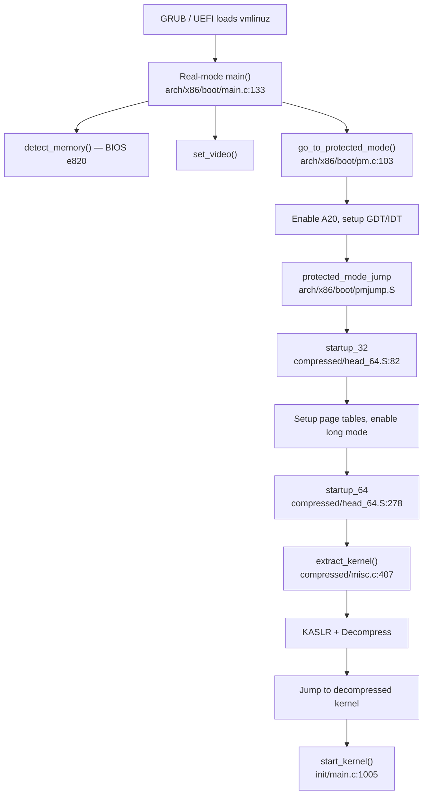
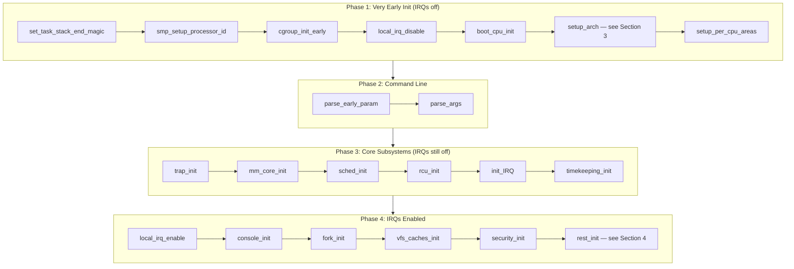
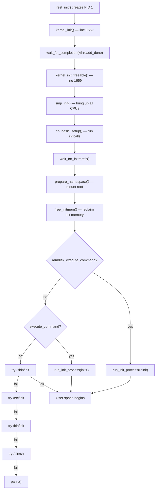

# Boot and Initialization in Linux 6.19

> Source base: `/home/inineapa/Lab/linux-6.19`

---

## Before You Begin

In user space, your world begins at `main()`. The C runtime sets up the stack, initializes `libc`, and calls your function. You never think about who set up the page tables, initialized the interrupt controller, or brought up the other CPU cores. All of that happens during kernel boot — a precisely ordered sequence of hundreds of function calls that transforms a flat binary loaded from disk into a fully operational operating system.

This document traces that entire journey from the moment the bootloader hands control to the kernel, through the compressed kernel stub, into `start_kernel()`, and finally to the `exec` of `/sbin/init` as PID 1. If you understand the user-space process model (processes, virtual memory, system calls), you have all the background you need. The key insight is this: the kernel must build the very infrastructure it depends on — page tables, memory allocators, schedulers, interrupt handlers — from scratch, in the right order, with interrupts disabled, on a single CPU, before it can do anything resembling normal operation.

We focus on x86_64 throughout, since that is the most common development target, but the architecture-independent portions (everything in `init/main.c`) apply to all architectures.

---

## 1. The x86_64 Boot Protocol

Before `start_kernel()` ever runs, there is a long and architecture-specific journey. On x86_64, the CPU starts in 16-bit real mode (just like in 1981), and the kernel must transition through protected mode and long mode before reaching C code. This section traces that path.

### 1.1 The Bootloader Loads the Kernel Image

When you select a kernel in GRUB (or when UEFI's boot manager picks one), the bootloader reads the kernel image (`vmlinuz`) from disk. This image is not a simple ELF binary — it is a specially formatted file with a real-mode setup header, followed by a compressed payload containing the actual kernel.

The bootloader:

1. Loads the real-mode setup code (first ~64KB of `vmlinuz`) to low memory
2. Loads the compressed kernel payload to high memory (typically at or above 1MB)
3. Fills in the `boot_params` structure (memory map, command line, video mode)
4. Jumps to the setup code's entry point

For UEFI systems, the kernel image contains a PE/COFF header (visible at the very start of `arch/x86/boot/header.S:44`), allowing the firmware to load it as an EFI application directly.

### 1.2 The Real-Mode Setup Header — header.S

The file `arch/x86/boot/header.S` defines the boot protocol header — a binary structure at a fixed offset that bootloaders read to discover how to load the kernel. This is one of the oldest files in the kernel, with roots tracing back to Linus's original 1991 code.

Key fields in the header (`arch/x86/boot/header.S:234`):

```asm
	.globl	hdr
hdr:
		.byte setup_sects - 1
root_flags:	.word ROOT_RDONLY
syssize:	.long ZO__edata / 16
		...
		.ascii	"HdrS"		# header signature
		.word	0x020f		# header version number
```

The `"HdrS"` magic and version number tell the bootloader which features this kernel supports. The `code32_start` field (`arch/x86/boot/header.S:284`) tells the bootloader where to jump after the real-mode setup completes — by default `0x100000` (1MB), the start of the compressed kernel.

| Header Field | Offset | Purpose |
|-------------|--------|---------|
| `boot_flag` | 0x1FE | `0xAA55` — same MBR signature as a boot sector |
| `"HdrS"` | 0x202 | Magic number identifying a Linux kernel |
| `version` | 0x206 | Boot protocol version (0x020f in 6.19) |
| `loadflags` | 0x211 | Flags: `LOADED_HIGH` means kernel loaded above 1MB |
| `code32_start` | 0x214 | 32-bit entry point for the protected-mode kernel |
| `cmd_line_ptr` | 0x228 | Pointer to the kernel command line string |
| `ramdisk_image` | 0x218 | Address of the initrd/initramfs |
| `ramdisk_size` | 0x21C | Size of the initrd in bytes |

### 1.3 Real-Mode main() — arch/x86/boot/main.c

After the bootloader jumps to `_start` in `header.S`, execution flows to the real-mode C entry point at `arch/x86/boot/main.c:133`:

```c
void main(void)
{
	init_default_io_ops();

	/* First, copy the boot header into the "zeropage" */
	copy_boot_params();

	/* Initialize the early-boot console */
	console_init();
	if (cmdline_find_option_bool("debug"))
		puts("early console in setup code\n");

	/* End of heap check */
	init_heap();

	/* Make sure we have all the proper CPU support */
	if (validate_cpu()) {
		puts("Unable to boot - please use a kernel appropriate "
		     "for your CPU.\n");
		die();
	}

	/* Tell the BIOS what CPU mode we intend to run in */
	set_bios_mode();

	/* Detect memory layout */
	detect_memory();

	/* Set keyboard repeat rate (why?) and query the lock flags */
	keyboard_init();

	/* Query Intel SpeedStep (IST) information */
	query_ist();

	/* Set the video mode */
	set_video();

	/* Do the last things and invoke protected mode */
	go_to_protected_mode();
}
```

This function runs in 16-bit real mode with full BIOS access. It performs hardware detection that can only happen via BIOS interrupts — once the kernel enters protected mode, BIOS calls are no longer available (without virtualization tricks). The `detect_memory()` call is especially important: it uses BIOS `int 0x15` to build the e820 memory map, which the kernel later uses to know which physical addresses are usable RAM versus reserved hardware regions.

### 1.4 Protected Mode Transition — pm.c and pmjump.S

The function `go_to_protected_mode()` (`arch/x86/boot/pm.c:103`) prepares the CPU for the transition:

```c
void go_to_protected_mode(void)
{
	/* Hook before leaving real mode, also disables interrupts */
	realmode_switch_hook();

	/* Enable the A20 gate */
	if (enable_a20()) {
		puts("A20 gate not responding, unable to boot...\n");
		die();
	}

	/* Reset coprocessor (IGNNE#) */
	reset_coprocessor();

	/* Mask all interrupts in the PIC */
	mask_all_interrupts();

	/* Actual transition to protected mode... */
	setup_idt();
	setup_gdt();
	protected_mode_jump(boot_params.hdr.code32_start,
			    (u32)&boot_params + (ds() << 4));
}
```

Step by step:

1. **A20 gate** — A legacy quirk from the 8086. Address line 20 must be explicitly enabled to access memory above 1MB. Yes, in 2026, the kernel still has to deal with this.
2. **Mask PIC interrupts** — Disable all hardware interrupts at the Programmable Interrupt Controller. The kernel will set up its own interrupt handling later.
3. **Setup GDT** — Load a minimal Global Descriptor Table with flat code and data segments spanning all 4GB. This is required for protected mode.
4. **Setup IDT** — Load a null Interrupt Descriptor Table (no handlers yet).
5. **protected_mode_jump** — Assembly in `arch/x86/boot/pmjump.S` that sets the PE bit in CR0, performs a far jump to flush the pipeline, and lands at `code32_start` — the compressed kernel's entry point.

### 1.5 The Compressed Kernel — Decompression and Long Mode

The protected-mode jump lands in the compressed kernel stub at `arch/x86/boot/compressed/head_64.S`. This code has two entry points:

**startup_32** (`arch/x86/boot/compressed/head_64.S:82`) — The 32-bit entry point:

```asm
SYM_FUNC_START(startup_32)
	/*
	 * 32bit entry is 0 and it is ABI so immutable!
	 * If we come here directly from a bootloader,
	 * kernel(text+data+bss+brk) ramdisk, zero_page, command line
	 * all need to be under the 4G limit.
	 */
	cld
	cli
```

This code sets up identity-mapped page tables, enables long mode (64-bit), and jumps to `startup_64`.

**startup_64** (`arch/x86/boot/compressed/head_64.S:278`) — The 64-bit entry point:

```asm
SYM_CODE_START(startup_64)
	/*
	 * 64bit entry is 0x200 and it is ABI so immutable!
	 * We come here either from startup_32 or directly from a
	 * 64bit bootloader.
	 */
	cld
	cli
```

After setting up segments and computing the decompression target address, `startup_64` calls `extract_kernel()` in C code.

**extract_kernel()** (`arch/x86/boot/compressed/misc.c:407`) performs the actual decompression:

```c
asmlinkage __visible void *extract_kernel(void *rmode,
					  unsigned char *output)
{
	unsigned long virt_addr = LOAD_PHYSICAL_ADDR;
	...
	boot_params_ptr = rmode;

	console_init();
	debug_putstr("early console in extract_kernel\n");
	...
	choose_random_location((unsigned long)input_data, input_len,
				(unsigned long *)&output,
				needed_size,
				&virt_addr);
	...
	debug_putstr("\nDecompressing Linux... ");
	entry_offset = decompress_kernel(output, virt_addr, error);
	debug_putstr("done.\nBooting the kernel (entry_offset: 0x");
	...
	return output + entry_offset;
}
```

Key things that happen here:

1. **KASLR** — `choose_random_location()` picks a random physical and virtual address for the decompressed kernel (if `CONFIG_RANDOMIZE_BASE` is set). This is a security feature that makes ROP/JOP attacks harder.
2. **Decompression** — The kernel supports multiple compression algorithms (gzip, bzip2, lzma, xz, lzo, lz4, zstd). The compressed payload is decompressed into the chosen location.
3. **Return** — The function returns the address of the decompressed kernel's entry point. The assembly stub jumps there, and we finally arrive at architecture-independent C code.



---

## 2. start_kernel() — Where Everything Begins

This is the most important function in the entire boot process. Every Linux system — from a Raspberry Pi to a cloud server — executes `start_kernel()` (`init/main.c:1005`). By the time we get here, we have a working 64-bit CPU with identity-mapped page tables, but almost nothing else: no memory allocator, no scheduler, no interrupts, no file system, no processes. `start_kernel()` builds all of that, one subsystem at a time, in a carefully ordered sequence.

```c
asmlinkage __visible __init __no_sanitize_address __noreturn
__no_stack_protector
void start_kernel(void)
{
```

The function never returns — it ends with `rest_init()`, which turns the boot thread into the idle task. Let us walk through its ~200 lines, grouped into phases.

### 2.1 Phase 1 — Very Early Init (lines 1010-1038)

These calls happen before even the command line is parsed. Interrupts are disabled. The memory allocator does not exist yet — only the boot-time `memblock` allocator is available.

```c
	set_task_stack_end_magic(&init_task);       /* line 1010 */
	smp_setup_processor_id();                   /* line 1011 */
	debug_objects_early_init();                 /* line 1012 */
	init_vmlinux_build_id();                    /* line 1013 */

	cgroup_init_early();                        /* line 1015 */

	local_irq_disable();                        /* line 1017 */
	early_boot_irqs_disabled = true;            /* line 1018 */

	boot_cpu_init();                            /* line 1024 */
	page_address_init();                        /* line 1025 */
	pr_notice("%s", linux_banner);              /* line 1026 */
	setup_arch(&command_line);                  /* line 1027 */
	jump_label_init();                          /* line 1029 */
	static_call_init();                         /* line 1030 */
	early_security_init();                      /* line 1031 */
	setup_boot_config();                        /* line 1032 */
	setup_command_line(command_line);            /* line 1033 */
	setup_nr_cpu_ids();                         /* line 1034 */
	setup_per_cpu_areas();                      /* line 1035 */
	smp_prepare_boot_cpu();                     /* line 1036 */
	early_numa_node_init();                     /* line 1037 */
	boot_cpu_hotplug_init();                    /* line 1038 */
```

| Function | Why It Must Happen Here |
|----------|------------------------|
| `set_task_stack_end_magic(&init_task)` | Writes a magic value at the bottom of the boot thread's stack. Used to detect stack overflows. Must be first — every subsequent function uses this stack. |
| `smp_setup_processor_id()` | Records which CPU we are running on. On x86, reads the APIC ID. Must happen before any per-CPU data access. |
| `cgroup_init_early()` | Initializes the root cgroup. Done early because the init task needs to be in a cgroup from the start. |
| `local_irq_disable()` | Explicitly disables interrupts (they should already be off, but this makes it explicit). Many early init functions would crash if an interrupt fired before handlers are installed. |
| `boot_cpu_init()` | Marks the boot CPU as online, active, and present in the CPU bitmasks. Without this, per-CPU operations would fail. |
| `setup_arch(&command_line)` | The big one — architecture-specific initialization. On x86, this sets up the memory map, page tables, CPU features, APIC, and much more. See Section 3. |
| `setup_per_cpu_areas()` | Allocates the per-CPU data areas. Each CPU gets its own copy of variables declared with `DEFINE_PER_CPU()`. This must happen after `setup_arch()` (which determines NUMA topology) and before any per-CPU variable is used. |
| `smp_prepare_boot_cpu()` | Architecture-specific preparation of the boot CPU for SMP. On x86, this sets up the GDT and other per-CPU structures. |

### 2.2 Phase 2 — Command Line and Per-CPU (lines 1040-1053)

With per-CPU areas set up and the architecture initialized, the kernel can now process the command line:

```c
	print_kernel_cmdline(saved_command_line);    /* line 1040 */
	parse_early_param();                         /* line 1042 */
	after_dashes = parse_args("Booting kernel",  /* line 1043 */
			  static_command_line, __start___param,
			  __stop___param - __start___param,
			  -1, -1, NULL, &unknown_bootoption);
	print_unknown_bootoptions();                 /* line 1047 */
	if (!IS_ERR_OR_NULL(after_dashes))           /* line 1048 */
		parse_args("Setting init args", after_dashes, NULL, 0,
			   -1, -1, NULL, set_init_arg);
	if (extra_init_args)                         /* line 1051 */
		parse_args("Setting extra init args", extra_init_args,
			   NULL, 0, -1, -1, NULL, set_init_arg);
```

The command line is parsed in two passes:

1. **`parse_early_param()`** — Processes parameters registered with `early_param()`. These are parameters that must be handled before normal subsystem init (e.g., `memmap=`, `earlyprintk=`, `nokaslr`).
2. **`parse_args()`** — Processes the remaining parameters, matching them against `module_param()` declarations and `__setup()` handlers. Anything after `--` on the command line is passed to init as its arguments.

### 2.3 Phase 3 — Core Subsystem Init (lines 1062-1131)

This is the bulk of the kernel's infrastructure being built. Interrupts are still disabled.

```c
	setup_log_buf(0);                            /* line 1062 */
	vfs_caches_init_early();                     /* line 1063 */
	sort_main_extable();                         /* line 1064 */
	trap_init();                                 /* line 1065 */
	mm_core_init();                              /* line 1066 */
	maple_tree_init();                           /* line 1067 */
	poking_init();                               /* line 1068 */
	ftrace_init();                               /* line 1069 */
	early_trace_init();                          /* line 1072 */

	sched_init();                                /* line 1079 */

	radix_tree_init();                           /* line 1084 */
	housekeeping_init();                         /* line 1090 */
	workqueue_init_early();                      /* line 1097 */
	rcu_init();                                  /* line 1099 */

	trace_init();                                /* line 1103 */
	context_tracking_init();                     /* line 1108 */
	early_irq_init();                            /* line 1110 */
	init_IRQ();                                  /* line 1111 */
	tick_init();                                 /* line 1112 */
	rcu_init_nohz();                             /* line 1113 */
	timers_init();                               /* line 1114 */
	srcu_init();                                 /* line 1115 */
	hrtimers_init();                             /* line 1116 */
	softirq_init();                              /* line 1117 */
	timekeeping_init();                          /* line 1118 */
	time_init();                                 /* line 1119 */

	random_init();                               /* line 1122 */
	kfence_init();                               /* line 1125 */
	boot_init_stack_canary();                    /* line 1126 */
	perf_event_init();                           /* line 1128 */
	profile_init();                              /* line 1129 */
	call_function_init();                        /* line 1130 */
```

The ordering here is critical. Let us look at why:

| Function | What It Does | Why This Order |
|----------|-------------|----------------|
| `trap_init()` | Installs CPU exception handlers (page faults, divide-by-zero, etc.) into the IDT. | Must happen before `mm_core_init()` — the memory allocator triggers page faults during setup. |
| `mm_core_init()` | Initializes the page allocator, slab allocator, and vmalloc. After this call, `kmalloc()` works. | Must happen after `trap_init()` (needs page fault handlers) and after `setup_arch()` (needs to know the memory map). |
| `sched_init()` | Initializes per-CPU run queues, the idle task, and the scheduling framework. | Must happen before interrupts are enabled — timer interrupts trigger the scheduler. No `schedule()` calls can happen before this. |
| `rcu_init()` | Initializes Read-Copy-Update, the kernel's primary lock-free synchronization mechanism. | Must happen after `sched_init()` (RCU callbacks run in softirq/kthread context) and before subsystems that use RCU. |
| `init_IRQ()` | Sets up the platform interrupt controller (APIC on x86). | Must happen after `trap_init()` (IDT must exist) and before `timekeeping_init()` (timers need interrupts). |
| `tick_init()` | Initializes the tick/clock event framework. | Must happen after `init_IRQ()` — needs interrupt infrastructure. |
| `softirq_init()` | Initializes the softirq mechanism (deferred interrupt processing). | Must happen after `sched_init()` — softirqs are scheduled on per-CPU tasklets. |
| `timekeeping_init()` | Initializes the kernel's notion of wall-clock time. | Must happen after `tick_init()` and `hrtimers_init()` — needs timer infrastructure. |

The comment at `init/main.c:1074` captures the essential constraint:

```c
	/*
	 * Set up the scheduler prior starting any interrupts (such as the
	 * timer interrupt). Full topology setup happens at smp_init()
	 * time - but meanwhile we still have a functioning scheduler.
	 */
	sched_init();
```

### 2.4 Phase 4 — Interrupts Enabled, Higher-Level Init (lines 1133-1206)

After `call_function_init()`, the kernel is ready to enable interrupts:

```c
	early_boot_irqs_disabled = false;            /* line 1133 */
	local_irq_enable();                          /* line 1134 */

	kmem_cache_init_late();                      /* line 1136 */

	/*
	 * HACK ALERT! This is early. We're enabling the console before
	 * we've done PCI setups etc, and console_init() must be aware of
	 * this. But we do want output early, in case something goes wrong.
	 */
	console_init();                              /* line 1143 */

	lockdep_init();                              /* line 1148 */
	locking_selftest();                          /* line 1155 */

	setup_per_cpu_pageset();                     /* line 1166 */
	numa_policy_init();                          /* line 1167 */
	acpi_early_init();                           /* line 1168 */
	calibrate_delay();                           /* line 1172 */
	arch_cpu_finalize_init();                    /* line 1174 */

	pid_idr_init();                              /* line 1176 */
	anon_vma_init();                             /* line 1177 */
	thread_stack_cache_init();                   /* line 1178 */
	cred_init();                                 /* line 1179 */
	fork_init();                                 /* line 1180 */
	proc_caches_init();                          /* line 1181 */
	uts_ns_init();                               /* line 1182 */
	key_init();                                  /* line 1184 */
	security_init();                             /* line 1185 */
	net_ns_init();                               /* line 1187 */
	vfs_caches_init();                           /* line 1188 */
	pagecache_init();                            /* line 1189 */
	signals_init();                              /* line 1190 */
	proc_root_init();                            /* line 1192 */
	nsfs_init();                                 /* line 1193 */
	cpuset_init();                               /* line 1195 */
	cgroup_init();                               /* line 1197 */
	taskstats_init_early();                      /* line 1198 */

	acpi_subsystem_init();                       /* line 1201 */
	arch_post_acpi_subsys_init();                /* line 1202 */
	kcsan_init();                                /* line 1203 */

	/* Do the rest non-__init'ed, we're now alive */
	rest_init();                                 /* line 1206 */
```

| Function | What It Does |
|----------|-------------|
| `local_irq_enable()` | Enables hardware interrupts for the first time. The timer starts ticking, the scheduler can preempt. |
| `console_init()` | Initializes the console subsystem so `printk()` output appears on screen/serial. The "HACK ALERT" comment is real — this happens before PCI is set up, so only simple console drivers (VGA text, serial UART) work here. |
| `lockdep_init()` | Initializes the lock dependency validator (if `CONFIG_LOCKDEP` is enabled). This is a debugging tool that detects potential deadlocks at runtime. |
| `calibrate_delay()` | Measures the CPU's `loops_per_jiffy` value by busy-waiting for a known duration. This is the "Calibrating delay loop..." message you see during boot. |
| `fork_init()` | Initializes the task/thread creation infrastructure and computes the maximum number of threads based on available memory. After this, `kernel_thread()` works. |
| `vfs_caches_init()` | Initializes the dentry cache, inode cache, and mounts the initial rootfs (a tiny in-memory filesystem). |
| `security_init()` | Initializes the Linux Security Module (LSM) framework — SELinux, AppArmor, etc. |
| `rest_init()` | Creates PID 1 and PID 2, then becomes the idle thread. See Section 4. |



---

## 3. setup_arch() — Architecture-Specific Setup

The call to `setup_arch()` at `init/main.c:1027` is the single most complex step in Phase 1. On x86_64, it is implemented in `arch/x86/kernel/setup.c:880` and spans roughly 200 lines of densely packed initialization. Its job: take the raw hardware information provided by the BIOS/bootloader and transform it into the kernel's internal data structures.

### 3.1 What setup_arch() Does

The function receives a pointer to the command line string and fills it in for later parsing. Here is a simplified walkthrough of the major operations:

```c
void __init setup_arch(char **cmdline_p)
{
	/* On x86_64: */
	printk(KERN_INFO "Command line: %s\n", boot_command_line);
	boot_cpu_data.x86_phys_bits = MAX_PHYSMEM_BITS;

	/* Handle built-in command line */
	strscpy(command_line, boot_command_line, COMMAND_LINE_SIZE);
	*cmdline_p = command_line;

	/* Early CPU and trap setup */
	idt_setup_early_traps();
	early_cpu_init();
	...
```

### 3.2 Memory Map Setup (e820)

The e820 memory map is the BIOS-provided table of physical memory regions. `setup_arch()` processes it at `arch/x86/kernel/setup.c:959`:

```c
	early_reserve_memory();
	iomem_resource.end = (1ULL << boot_cpu_data.x86_phys_bits) - 1;
	e820__memory_setup();
	parse_setup_data();
```

`e820__memory_setup()` parses the raw BIOS table and builds the kernel's `e820_table`, which classifies every physical address range as one of:

| e820 Type | Meaning |
|-----------|---------|
| `E820_TYPE_RAM` | Usable system memory |
| `E820_TYPE_RESERVED` | Reserved by BIOS/firmware (do not touch) |
| `E820_TYPE_ACPI` | ACPI tables (reclaimable after parsing) |
| `E820_TYPE_NVS` | ACPI Non-Volatile Storage (must be preserved) |
| `E820_TYPE_UNUSABLE` | Defective memory |

Later, `e820__memblock_setup()` (`arch/x86/kernel/setup.c:1075`) converts this table into the `memblock` allocator's internal format, making physical memory available for early allocation.

### 3.3 CPU Feature Detection

`early_cpu_init()` identifies the CPU vendor (Intel, AMD, etc.) and runs vendor-specific detection code to populate the `boot_cpu_data` structure with feature flags. These flags control which code paths the kernel uses throughout its lifetime — for example, whether to use `XSAVE` for FPU state, or whether the CPU supports 5-level page tables.

### 3.4 APIC Setup

```c
	apic_setup_apic_calls();                     /* line 980 */
```

The Advanced Programmable Interrupt Controller (APIC) is the interrupt routing hardware on modern x86 systems. `setup_arch()` initializes early APIC detection, determines whether xAPIC or x2APIC mode should be used, and prepares the interrupt routing tables. The full APIC initialization happens later in `init_IRQ()`.

### 3.5 Memory Reservations

Throughout `setup_arch()`, various regions of physical memory are reserved to prevent the allocator from handing them out:

```c
	early_reserve_memory();                      /* line 956 */
	...
	reserve_brk();                               /* line 1071 */
	e820__memblock_setup();                      /* line 1075 */
```

Reserved regions include:
- The kernel's own text, data, and BSS sections
- The initial page tables built by the compressed kernel stub
- The BIOS data area (first 4KB)
- The initrd/initramfs (if loaded by the bootloader)
- ACPI tables
- The `brk` area used for early boot allocations

### 3.6 Page Table Setup

By the time `setup_arch()` runs, the compressed kernel stub has already set up minimal identity-mapped page tables. `setup_arch()` builds the proper kernel page tables:

```c
	max_pfn = e820__end_of_ram_pfn();            /* line 1032 */
	...
	kernel_randomize_memory();                   /* line 1045 */
	...
	early_alloc_pgt_buf();                       /* line 1064 */
	...
	init_mem_mapping();                          /* later in the function */
```

On x86_64 with 4-level paging, the kernel maps:
- All physical memory into the "direct map" region starting at `PAGE_OFFSET` (typically `0xffff888000000000`)
- The kernel text at its link-time address (`0xffffffff81000000`)
- The vmalloc area for dynamic kernel virtual mappings

---

## 4. rest_init() — The Birth of PID 1

After `start_kernel()` has initialized every core subsystem, its last act is to call `rest_init()` (`init/main.c:711`). This function creates the first two kernel threads and transforms the boot context into the idle thread:

```c
static noinline void __ref __noreturn rest_init(void)
{
	struct task_struct *tsk;
	int pid;

	rcu_scheduler_starting();                    /* line 716 */
	/*
	 * We need to spawn init first so that it obtains pid 1, however
	 * the init task will end up wanting to create kthreads, which, if
	 * we schedule it before we create kthreadd, will OOPS.
	 */
	pid = user_mode_thread(kernel_init, NULL, CLONE_FS);  /* line 722 */
	...
	pid = kernel_thread(kthreadd, NULL, NULL,
			    CLONE_FS | CLONE_FILES);  /* line 735 */
	...
	system_state = SYSTEM_SCHEDULING;            /* line 747 */
	complete(&kthreadd_done);                    /* line 749 */
	schedule_preempt_disabled();                 /* line 755 */
	cpu_startup_entry(CPUHP_ONLINE);             /* line 757 */
}
```

### 4.1 The Three Primordial Tasks

After `rest_init()` completes, there are exactly three tasks:

| PID | Name | Created By | Role |
|-----|------|-----------|------|
| 0 | `swapper/0` (idle) | Exists from boot | The boot thread, now the idle task. Runs `cpu_startup_entry()` — an infinite loop that executes `HLT` (or equivalent) when there is nothing else to run. |
| 1 | `init` | `user_mode_thread(kernel_init, ...)` at line 722 | Will become `/sbin/init` (or systemd). First runs `kernel_init()` in kernel mode to finish boot, then `exec`s the user-space init program. |
| 2 | `kthreadd` | `kernel_thread(kthreadd, ...)` at line 735 | The kernel thread daemon. All subsequent kernel threads (kworker, ksoftirqd, kcompactd, etc.) are created by `kthreadd`. |

### 4.2 Why PID 1 Is Created Before PID 2

The comment at line 717-720 explains this directly:

> We need to spawn init first so that it obtains pid 1, however the init task will end up wanting to create kthreads, which, if we schedule it before we create kthreadd, will OOPS.

PID 1 is special throughout the kernel — orphaned processes are reparented to PID 1, and many subsystems assume PID 1 exists. So it must get PID 1 specifically. But PID 1 needs `kthreadd` (PID 2) to create kernel threads. The solution: create PID 1 first (to claim the PID), pin it to the boot CPU so it cannot run yet, then create PID 2, and only then signal PID 1 to proceed (via the `kthreadd_done` completion at line 749).

### 4.3 The Boot CPU Becomes Idle

After creating both threads, the boot context calls `cpu_startup_entry(CPUHP_ONLINE)` at line 757. This function never returns — it enters the idle loop, executing low-power `HLT` instructions whenever the scheduler has no runnable tasks. This is the same idle loop that runs on every CPU. The boot thread, which has been executing since the bootloader, becomes PID 0 — the idle task for CPU 0.

---

## 5. kernel_init() and kernel_init_freeable() — Finishing the Boot

PID 1 begins life as a kernel thread running `kernel_init()` (`init/main.c:1569`). Its job is to finish all remaining initialization and then transition to user space.

### 5.1 kernel_init()

```c
static int __ref kernel_init(void *unused)
{
	int ret;

	/*
	 * Wait until kthreadd is all set-up.
	 */
	wait_for_completion(&kthreadd_done);         /* line 1576 */

	kernel_init_freeable();                      /* line 1578 */
	async_synchronize_full();                    /* line 1580 */

	system_state = SYSTEM_FREEING_INITMEM;       /* line 1582 */
	kprobe_free_init_mem();                      /* line 1583 */
	ftrace_free_init_mem();                      /* line 1584 */
	exit_boot_config();                          /* line 1586 */
	free_initmem();                              /* line 1587 */
	mark_readonly();                             /* line 1588 */

	system_state = SYSTEM_RUNNING;               /* line 1596 */
	numa_default_policy();                       /* line 1597 */
	rcu_end_inkernel_boot();                     /* line 1599 */
```

After `kernel_init_freeable()` returns, the kernel frees all `__init` memory (see Section 8) and sets `system_state = SYSTEM_RUNNING`. Then it attempts to execute the init program.

### 5.2 kernel_init_freeable() — The Final Setup Phase

`kernel_init_freeable()` (`init/main.c:1659`) performs the last round of initialization, now with the full kernel infrastructure available:

```c
static noinline void __init kernel_init_freeable(void)
{
	gfp_allowed_mask = __GFP_BITS_MASK;          /* line 1662 */
	set_mems_allowed(node_states[N_MEMORY]);     /* line 1667 */
	cad_pid = get_pid(task_pid(current));         /* line 1669 */

	smp_prepare_cpus(setup_max_cpus);            /* line 1671 */
	workqueue_init();                            /* line 1673 */
	init_mm_internals();                         /* line 1675 */
	do_pre_smp_initcalls();                      /* line 1677 */
	lockup_detector_init();                      /* line 1678 */

	smp_init();                                  /* line 1680 */
	sched_init_smp();                            /* line 1681 */

	workqueue_init_topology();                   /* line 1683 */
	padata_init();                               /* line 1685 */
	page_alloc_init_late();                      /* line 1686 */

	do_basic_setup();                            /* line 1688 */

	kunit_run_all_tests();                       /* line 1690 */

	wait_for_initramfs();                        /* line 1692 */
	console_on_rootfs();                         /* line 1693 */
```

### 5.3 smp_init() — Bringing Up Secondary CPUs (line 1680)

Up to this point, only the boot CPU (CPU 0) has been running. `smp_init()` wakes up all other CPUs detected during `setup_arch()`. Each secondary CPU:

1. Receives an IPI (Inter-Processor Interrupt) from CPU 0
2. Runs through its own startup sequence (similar to the boot CPU's)
3. Initializes its local APIC, timer, and per-CPU data
4. Enters the idle loop via `cpu_startup_entry()`

After `smp_init()`, the system is fully symmetric — all CPUs are online and the scheduler distributes work across them.

### 5.4 do_basic_setup() — Running Initcalls (line 1688)

```c
static void __init do_basic_setup(void)
{
	cpuset_init_smp();
	driver_init();
	init_irq_proc();
	do_ctors();
	do_initcalls();
}
```

`do_initcalls()` is where the bulk of driver and subsystem initialization happens. See Section 6 for details.

### 5.5 Mounting Root and Transitioning to User Space

After `do_basic_setup()`, the kernel:

1. **`wait_for_initramfs()`** (line 1692) — Waits for the initramfs to be unpacked (see Section 7).
2. **`console_on_rootfs()`** (line 1693) — Opens `/dev/console` and sets up stdin/stdout/stderr (file descriptors 0, 1, 2) for the init process.
3. **`prepare_namespace()`** (line 1705) — Mounts the real root filesystem (if initramfs does not contain `/init`).

### 5.6 The run_init_process Fallback Chain

Back in `kernel_init()`, after `kernel_init_freeable()` returns and init memory is freed, the kernel tries to execute the init program (`init/main.c:1603-1641`):

```c
	if (ramdisk_execute_command) {
		ret = run_init_process(ramdisk_execute_command);
		if (!ret)
			return 0;
	}

	if (execute_command) {
		ret = run_init_process(execute_command);
		if (!ret)
			return 0;
		panic("Requested init %s failed (error %d).",
		      execute_command, ret);
	}

	if (CONFIG_DEFAULT_INIT[0] != '\0') {
		ret = run_init_process(CONFIG_DEFAULT_INIT);
		if (ret)
			pr_err("Default init %s failed (error %d)\n",
			       CONFIG_DEFAULT_INIT, ret);
		else
			return 0;
	}

	if (!try_to_run_init_process("/sbin/init") ||       /* line 1634 */
	    !try_to_run_init_process("/etc/init") ||         /* line 1635 */
	    !try_to_run_init_process("/bin/init") ||         /* line 1636 */
	    !try_to_run_init_process("/bin/sh"))              /* line 1637 */
		return 0;

	panic("No working init found.  Try passing init= option to "  /* line 1640 */
	      "kernel. See Linux Documentation/admin-guide/init.rst "
	      "for guidance.");
```

The search order:

1. `rdinit=` from the command line (runs from initramfs)
2. `init=` from the command line (user-specified path)
3. `CONFIG_DEFAULT_INIT` (compile-time default)
4. `/sbin/init` (standard location — systemd, SysVinit)
5. `/etc/init`
6. `/bin/init`
7. `/bin/sh` (last resort — drops to a shell)
8. **`panic()`** — If none of the above exist, the kernel panics. There is nothing else it can do.

`run_init_process()` calls `kernel_execve()`, which replaces the kernel thread's context with the user-space init binary. At this point, PID 1 transitions from kernel mode to user mode, and user-space Linux begins.



---

## 6. The Initcall Mechanism

One of the most elegant design patterns in the kernel is the initcall mechanism. If you have ever wondered how hundreds of drivers get initialized during boot without a giant `switch` statement in `start_kernel()`, initcalls are the answer.

### 6.1 How It Works

A driver or subsystem registers an initialization function using a macro:

```c
/* In a driver, e.g., drivers/net/ethernet/intel/e1000e/netdev.c */
module_init(e1000_init_module);
```

For built-in code (not loadable modules), `module_init()` expands to `device_initcall()`, which places a pointer to the init function in a special linker section. At boot time, `do_initcalls()` iterates through these sections and calls each function.

### 6.2 The Initcall Levels

The initcall system defines eight priority levels, each corresponding to a linker section. Functions in lower-numbered levels run first (`init/main.c:1411`):

```c
static const char *initcall_level_names[] __initdata = {
	"pure",
	"core",
	"postcore",
	"arch",
	"subsys",
	"fs",
	"device",
	"late",
};
```

The macros are defined in `include/linux/init.h:293-309`:

```c
#define pure_initcall(fn)		__define_initcall(fn, 0)

#define core_initcall(fn)		__define_initcall(fn, 1)
#define core_initcall_sync(fn)		__define_initcall(fn, 1s)
#define postcore_initcall(fn)		__define_initcall(fn, 2)
#define postcore_initcall_sync(fn)	__define_initcall(fn, 2s)
#define arch_initcall(fn)		__define_initcall(fn, 3)
#define arch_initcall_sync(fn)		__define_initcall(fn, 3s)
#define subsys_initcall(fn)		__define_initcall(fn, 4)
#define subsys_initcall_sync(fn)	__define_initcall(fn, 4s)
#define fs_initcall(fn)			__define_initcall(fn, 5)
#define fs_initcall_sync(fn)		__define_initcall(fn, 5s)
#define rootfs_initcall(fn)		__define_initcall(fn, rootfs)
#define device_initcall(fn)		__define_initcall(fn, 6)
#define device_initcall_sync(fn)	__define_initcall(fn, 6s)
#define late_initcall(fn)		__define_initcall(fn, 7)
#define late_initcall_sync(fn)		__define_initcall(fn, 7s)
```

| Level | Macro | Typical Users |
|-------|-------|--------------|
| 0 (pure) | `pure_initcall` | Pure data initialization — no dependencies |
| 1 (core) | `core_initcall` | Core subsystems: memory, IRQ, DMA frameworks |
| 2 (postcore) | `postcore_initcall` | Bus types (PCI, USB, platform) |
| 3 (arch) | `arch_initcall` | Architecture-specific init (IOMMU, ACPI tables) |
| 4 (subsys) | `subsys_initcall` | Subsystem frameworks (networking, block layer) |
| 5 (fs) | `fs_initcall` | Filesystem types (ext4, btrfs, NFS) |
| rootfs | `rootfs_initcall` | initramfs unpacking (`populate_rootfs`) |
| 6 (device) | `device_initcall` | Individual device drivers (default for `module_init`) |
| 7 (late) | `late_initcall` | Things that should happen after all drivers |

### 6.3 The _sync Variants

Each level (except pure and rootfs) has a `_sync` variant (e.g., `core_initcall_sync`). The `_sync` initcalls run after all regular initcalls at that level, with an `async_synchronize_full()` barrier in between. This ensures that any asynchronous probing started by regular initcalls completes before the sync ones run.

### 6.4 do_initcalls() — The Execution Loop

```c
static void __init do_initcalls(void)                    /* line 1443 */
{
	int level;
	size_t len = saved_command_line_len + 1;
	char *command_line;

	command_line = kzalloc(len, GFP_KERNEL);
	...
	for (level = 0; level < ARRAY_SIZE(initcall_levels) - 1; level++) {
		strcpy(command_line, saved_command_line);
		do_initcall_level(level, command_line);
	}
	kfree(command_line);
}
```

For each level, `do_initcall_level()` iterates through the function pointers in that level's linker section and calls each one via `do_one_initcall()`.

### 6.5 How Drivers Hook In Without Explicit Calls

This is the key insight: **a driver never needs to be called from `start_kernel()` or any central dispatch function.** By using `module_init(my_driver_init)`, the driver places a function pointer in the `.initcall6.init` section. The linker collects all such pointers, and `do_initcalls()` calls them all. To add a new driver to the boot sequence, you just write the code and use the macro — no need to modify any central file.

For loadable modules, `module_init()` has a different expansion: it defines the `init_module()` entry point that the module loader calls when the module is loaded via `modprobe` or `insmod`.

---

## 7. Initramfs and Root Filesystem

### 7.1 What Initramfs Is

Initramfs is a small filesystem archive (in `cpio` format, optionally compressed) that the kernel extracts into a `tmpfs` instance before mounting the real root filesystem. It exists because mounting the real root often requires drivers (disk controller, filesystem, LVM, encryption) that may not be compiled into the kernel.

There are two sources of initramfs:

1. **Built-in** — Embedded in the kernel image at compile time (configured via `CONFIG_INITRAMFS_SOURCE`). Always present, even if it is just an empty directory.
2. **External** — Loaded by the bootloader as a separate file (the `initrd` in GRUB configuration). The bootloader places it in memory and records the address/size in the `boot_params` header fields `ramdisk_image` and `ramdisk_size`.

### 7.2 Unpacking — init/initramfs.c

The unpacking is triggered by `populate_rootfs()` (`init/initramfs.c:782`), which is registered as a `rootfs_initcall`:

```c
static int __init populate_rootfs(void)
{
	initramfs_cookie = async_schedule_domain(do_populate_rootfs, NULL,
						 &initramfs_domain);
	usermodehelper_enable();
	if (!initramfs_async)
		wait_for_initramfs();
	return 0;
}
rootfs_initcall(populate_rootfs);
```

The actual work happens in `do_populate_rootfs()` (`init/initramfs.c:718`):

```c
static void __init do_populate_rootfs(void *unused, async_cookie_t cookie)
{
	/* Load the built in initramfs */
	char *err = unpack_to_rootfs(__initramfs_start, __initramfs_size);
	if (err)
		panic_show_mem("%s", err);

	if (!initrd_start || IS_ENABLED(CONFIG_INITRAMFS_FORCE))
		goto done;

	printk(KERN_INFO "Unpacking initramfs...\n");
	err = unpack_to_rootfs((char *)initrd_start,
			       initrd_end - initrd_start);
	...
}
```

`unpack_to_rootfs()` (`init/initramfs.c:511`) is the core extraction function. It detects the compression format, decompresses if needed, parses the `cpio` headers, and creates files/directories in the rootfs. It supports all the kernel's compression algorithms (gzip, bzip2, xz, lz4, zstd, etc.).

### 7.3 The Transition to the Real Root Filesystem

After initramfs is unpacked, there are two possible paths:

**Path A: initramfs contains /init** — The kernel runs `/init` from the initramfs directly (via `ramdisk_execute_command`). The initramfs `/init` script (typically provided by dracut, mkinitramfs, or similar tools) loads necessary drivers, assembles RAID/LVM/dm-crypt, mounts the real root filesystem, and calls `switch_root` to pivot to it.

**Path B: initramfs does not contain /init** — The kernel falls through to `prepare_namespace()` (`init/do_mounts.c:465`):

```c
void __init prepare_namespace(void)
{
	if (root_delay) {
		printk(KERN_INFO "Waiting %d sec before mounting "
		       "root device...\n", root_delay);
		ssleep(root_delay);
	}

	wait_for_device_probe();
	md_run_setup();

	if (saved_root_name[0])
		ROOT_DEV = parse_root_device(saved_root_name);

	if (initrd_load(saved_root_name))
		goto out;

	if (root_wait)
		wait_for_root(saved_root_name);
	mount_root(saved_root_name);
out:
	devtmpfs_mount();
	init_mount(".", "/", NULL, MS_MOVE, NULL);
	init_chroot(".");
}
```

This function:
1. Waits for device probing to complete
2. Parses the `root=` kernel parameter to determine the root device
3. Mounts the root filesystem
4. Moves it to `/` and `chroot`s into it

### 7.4 initramfs vs. initrd (Legacy)

The terms are often used interchangeably, but they are different mechanisms:

| Feature | initramfs (modern) | initrd (legacy) |
|---------|-------------------|----------------|
| Format | cpio archive | Filesystem image (ext2, etc.) |
| Mounted as | tmpfs (rootfs) | ramdisk block device |
| Memory | Pages freed after use | Entire ramdisk stays in memory |
| Kernel support | `CONFIG_BLK_DEV_INITRD` | `CONFIG_BLK_DEV_RAM` |
| Default since | 2.6.13 | 2.0 |

Modern systems almost universally use initramfs, but the kernel command-line parameter is still called `initrd=` for historical reasons.

---

## 8. The __init and __initdata Annotations

### 8.1 What They Are

The `__init` and `__initdata` annotations are section attributes that tell the linker to place marked functions and data into special sections that are freed after boot. They are defined in `include/linux/init.h:45-48`:

```c
#define __init		__section(".init.text") __cold __latent_entropy \
						__no_kstack_erase
#define __initdata	__section(".init.data")
#define __initconst	__section(".init.rodata")
```

| Annotation | Section | Used For |
|-----------|---------|----------|
| `__init` | `.init.text` | Functions only needed during boot |
| `__initdata` | `.init.data` | Initialized data only needed during boot |
| `__initconst` | `.init.rodata` | Read-only data only needed during boot |
| `__exit` | `.exit.text` | Module cleanup functions (discarded for built-ins) |

### 8.2 How Init Memory Is Freed

After `kernel_init_freeable()` completes and all `__init` functions have run, `kernel_init()` frees the init sections (`init/main.c:1587`):

```c
	system_state = SYSTEM_FREEING_INITMEM;       /* line 1582 */
	kprobe_free_init_mem();
	ftrace_free_init_mem();
	kgdb_free_init_mem();
	exit_boot_config();
	free_initmem();                              /* line 1587 */
	mark_readonly();
```

`free_initmem()` (`init/main.c:1564`) returns the pages occupied by `.init.text` and `.init.data` to the page allocator:

```c
void __weak free_initmem(void)
{
	free_initmem_default(POISON_FREE_INITMEM);
}
```

The `POISON_FREE_INITMEM` flag fills the freed memory with a poison pattern, so any accidental access to freed init memory produces a recognizable crash rather than silent corruption.

On a typical system, this frees several megabytes of memory. You can see this in dmesg:

```
Freeing unused kernel image (initmem) memory: 2568K
```

### 8.3 Why Calling an __init Function After Boot Crashes

Once `free_initmem()` runs, the pages containing `__init` functions are returned to the page allocator and may be reallocated for any purpose. If code attempts to call a freed `__init` function, the CPU will execute whatever data happens to be at that address — typically resulting in an "unable to handle kernel paging request" oops or a random instruction stream that crashes the system.

The build system catches most of these bugs at compile time. The `modpost` tool (part of Kbuild) scans all object files for references from non-init sections to init sections and reports them as errors:

```
WARNING: modpost: vmlinux: section mismatch in reference:
driver_probe (section: .text) -> driver_init_hw (section: .init.text)
```

If you see this warning, it means your non-`__init` function calls an `__init` function, which will crash after boot. The fix is either to remove the `__init` annotation from the callee (if it is needed after boot) or to ensure the caller is also `__init`.

---

## 9. Command Line Parameters

The kernel command line (e.g., `root=/dev/sda2 quiet splash`) is the primary mechanism for configuring boot behavior. Parameters are processed by three distinct mechanisms.

### 9.1 early_param() — Earliest Processing

```c
/* include/linux/init.h:354 */
#define early_param(str, fn)						\
	__setup_param(str, fn, fn, 1)
```

Parameters registered with `early_param()` are processed by `parse_early_param()` at `init/main.c:1042`, before most subsystems are initialized. These are for parameters that affect early boot behavior:

```c
/* Example: arch/x86/kernel/setup.c */
early_param("memmap", parse_memmap_opt);
early_param("earlyprintk", setup_early_printk);
```

The handler function receives the value string and returns 0 on success:

```c
static int __init setup_early_printk(char *buf)
{
	/* Configure early console output */
	...
	return 0;
}
```

### 9.2 __setup() — Standard Boot Parameters

```c
/* include/linux/init.h:345 */
#define __setup(str, fn)						\
	__setup_param(str, fn, fn, 0)
```

Parameters registered with `__setup()` are processed during `parse_args()` at `init/main.c:1043`. They handle standard boot parameters:

```c
/* Example: init/do_mounts.c */
__setup("root=", root_dev_setup);
__setup("rootwait", rootwait_setup);
```

The `__setup_param` macro creates an `obs_kernel_param` struct (`include/linux/init.h:318`) and places it in the `.init.setup` linker section:

```c
struct obs_kernel_param {
	const char *str;
	int (*setup_func)(char *);
	int early;
};
```

### 9.3 module_param() — Module Parameters

For loadable modules, parameters are declared with `module_param()`:

```c
static int debug = 0;
module_param(debug, int, 0644);
MODULE_PARM_DESC(debug, "Enable debug output");
```

When the module is built-in (not loaded as a module), these parameters can be set on the kernel command line using the format `module_name.param=value`:

```
e1000e.debug=1  i915.enable_fbc=1
```

### 9.4 Viewing the Command Line

The kernel command line is available at runtime via `/proc/cmdline`:

```bash
$ cat /proc/cmdline
BOOT_IMAGE=/vmlinuz-6.19.0 root=/dev/sda2 ro quiet splash
```

### 9.5 parse_early_param() vs. parse_args()

| Aspect | `parse_early_param()` | `parse_args()` |
|--------|----------------------|----------------|
| When | Before most subsystem init | After `parse_early_param()` |
| Handlers | `early_param()` only | `__setup()` + `module_param()` |
| Purpose | Parameters affecting early boot | Everything else |
| Called at | `init/main.c:1042` | `init/main.c:1043` |
| Runs twice? | No — only early params | Yes — also processes module params |

---

## 10. Function Quick Reference

| Function | File:Line | Role |
|----------|----------|------|
| `main()` (real-mode) | `arch/x86/boot/main.c:133` | Real-mode hardware detection (memory, video, CPU) |
| `go_to_protected_mode()` | `arch/x86/boot/pm.c:103` | Transition from real mode to protected mode |
| `startup_32` | `arch/x86/boot/compressed/head_64.S:82` | 32-bit entry of compressed kernel, sets up long mode |
| `startup_64` | `arch/x86/boot/compressed/head_64.S:278` | 64-bit entry, prepares for decompression |
| `extract_kernel()` | `arch/x86/boot/compressed/misc.c:407` | KASLR randomization and kernel decompression |
| `start_kernel()` | `init/main.c:1005` | Main kernel initialization — calls everything |
| `setup_arch()` | `arch/x86/kernel/setup.c:880` | x86 memory map, CPU features, page tables, APIC |
| `trap_init()` | (arch-specific) | Install CPU exception handlers into IDT |
| `mm_core_init()` | `mm/mm_init.c` | Initialize page allocator, slab, vmalloc |
| `sched_init()` | `kernel/sched/core.c` | Initialize per-CPU run queues and scheduling |
| `rcu_init()` | `kernel/rcu/tree.c` | Initialize Read-Copy-Update subsystem |
| `init_IRQ()` | (arch-specific) | Set up interrupt controller (APIC on x86) |
| `timekeeping_init()` | `kernel/time/timekeeping.c` | Initialize wall-clock time |
| `console_init()` | `kernel/printk/printk.c` | Initialize console for printk output |
| `fork_init()` | `kernel/fork.c` | Initialize process creation infrastructure |
| `vfs_caches_init()` | `fs/dcache.c` | Initialize dentry/inode caches, mount rootfs |
| `security_init()` | `security/security.c` | Initialize LSM framework |
| `rest_init()` | `init/main.c:711` | Create PID 1 and PID 2, become idle |
| `kernel_init()` | `init/main.c:1569` | PID 1 — finish boot, exec /sbin/init |
| `kernel_init_freeable()` | `init/main.c:1659` | SMP bringup, initcalls, mount root |
| `smp_init()` | `kernel/smp.c` | Bring up secondary CPUs |
| `do_basic_setup()` | `init/main.c:1469` | Run driver_init + all initcalls |
| `do_initcalls()` | `init/main.c:1443` | Iterate all initcall levels and execute them |
| `do_pre_smp_initcalls()` | `init/main.c:1478` | Run early initcalls before SMP bringup |
| `populate_rootfs()` | `init/initramfs.c:782` | Unpack initramfs archive |
| `unpack_to_rootfs()` | `init/initramfs.c:511` | Core cpio/decompression extraction |
| `prepare_namespace()` | `init/do_mounts.c:465` | Mount real root filesystem |
| `free_initmem()` | `init/main.c:1564` | Free __init sections after boot |
| `cpu_startup_entry()` | `kernel/sched/idle.c` | Enter the idle loop (PID 0 on each CPU) |

---

## 11. Debugging the Boot Process

When the boot process fails — a kernel panic, a hang, or a missing root filesystem — you need tools to see what happened. This section covers the key techniques.

### 11.1 earlycon / earlyprintk — Pre-Console Output

The normal console (`console_init()`) is not available until deep into `start_kernel()`. If the kernel crashes before that point, you will see nothing on screen. The solution is `earlycon` (or the older `earlyprintk`):

```
# On the kernel command line:
earlycon=uart,io,0x3f8,115200n8    # Serial port COM1
earlycon=efifb                      # EFI framebuffer
earlyprintk=vga                     # VGA text mode (legacy)
```

`earlycon` registers a minimal console driver immediately during `setup_arch()`, before the full console subsystem exists. This allows `printk()` messages to appear from the very first moments of boot.

### 11.2 initcall_debug — Tracing Init Functions

Adding `initcall_debug` to the kernel command line causes each initcall to be logged with its function name and execution time:

```
# On the kernel command line:
initcall_debug

# dmesg output:
calling  pci_init+0x0/0x40 @ 1
initcall pci_init+0x0/0x40 returned 0 after 1234 usecs
calling  e1000_init_module+0x0/0x60 @ 1
initcall e1000_init_module+0x0/0x60 returned 0 after 5678 usecs
```

This is handled at `init/main.c:1105`:

```c
	if (initcall_debug)
		initcall_debug_enable();
```

This is invaluable for:
- Finding which initcall causes a hang (the last one printed before the hang)
- Identifying slow initcalls that delay boot
- Understanding the order in which drivers initialize

### 11.3 dmesg — Reading Boot Messages

The kernel ring buffer captures all `printk()` messages from boot onward. After boot:

```bash
# View the full ring buffer
dmesg

# View only errors and warnings
dmesg --level=err,warn

# View with timestamps since boot
dmesg -T

# Follow new messages in real time
dmesg -w

# View kernel command line
dmesg | grep "Command line"

# Find boot timing
dmesg | grep "Freeing unused kernel"
```

Key messages to look for:

| Message | What It Tells You |
|---------|-------------------|
| `Command line: ...` | The exact kernel command line used |
| `Memory: ...K/...K available` | How much RAM the kernel sees |
| `Calibrating delay loop...` | CPU speed detection (lpj value) |
| `Freeing unused kernel image (initmem) memory: ...K` | __init memory reclaimed — boot init is done |
| `Run /sbin/init as init process` | Transition to user space |
| `VFS: Cannot open root device` | Root filesystem not found — wrong `root=` parameter |

### 11.4 ftrace — Tracing Init Functions

For deeper analysis, ftrace can trace function calls during boot:

```bash
# Add to kernel command line to enable tracing from boot:
ftrace=function ftrace_filter=do_one_initcall

# Or after boot, trace specific boot-related functions:
echo function > /sys/kernel/debug/tracing/current_tracer
echo 'do_one_initcall' > /sys/kernel/debug/tracing/set_ftrace_filter
cat /sys/kernel/debug/tracing/trace
```

### 11.5 trace-cmd for Boot Analysis

`trace-cmd` is a user-space tool that wraps ftrace with a friendlier interface:

```bash
# Record initcall events (from a booted system, analyzing recorded traces):
trace-cmd record -e initcall

# View the trace:
trace-cmd report

# Record function graph for boot-related functions:
trace-cmd record -p function_graph -l 'start_kernel' \
    -l 'do_basic_setup' -l 'kernel_init'
trace-cmd report
```

For boot-time tracing (tracing the boot itself), add to the kernel command line:

```
trace_event=initcall:* tp_printk
```

This enables initcall tracepoints from the very start of boot and prints them through `printk` so they appear in dmesg.

### 11.6 Common Boot Failures and How to Debug Them

| Symptom | Likely Cause | Debug Approach |
|---------|-------------|---------------|
| Black screen, no output | Crash before console_init | Add `earlycon=` or `earlyprintk=` |
| Hang with no messages | Initcall stuck in a loop | Add `initcall_debug` to see the last initcall |
| "VFS: Cannot open root device" | Wrong root= parameter | Check device naming: `/dev/sda2` vs `UUID=...` |
| "No working init found" | Missing init binary | Verify initramfs contents or init= parameter |
| "Kernel panic - not syncing" | Fatal error during boot | Read the stack trace in dmesg; the function names indicate the subsystem |
| Boot is very slow | Slow initcall or device probe | Use `initcall_debug` and look for large usec values |
| "unable to handle kernel paging request" in __init function | Code calling freed __init memory | Check for section mismatches with `modpost` |

### 11.7 Useful Kernel Command Line Parameters for Debugging

```
# Maximum verbosity
loglevel=7 debug ignore_loglevel

# Early console output
earlycon=uart,io,0x3f8,115200n8

# Trace all initcalls
initcall_debug

# Disable features that complicate debugging
nokaslr                    # Disable address randomization
nosmp                      # Boot with single CPU only
maxcpus=1                  # Same effect, different mechanism

# Drop to a shell instead of init (for rootfs debugging)
init=/bin/sh

# Wait before mounting root (for slow storage)
rootwait
rootdelay=10
```

---

**End of document.** The boot sequence is one of the most deterministic parts of the kernel — every system follows the same path through `start_kernel()`. Understanding it gives you a mental framework for where any subsystem fits in the kernel's lifecycle and why initialization order matters so deeply.
