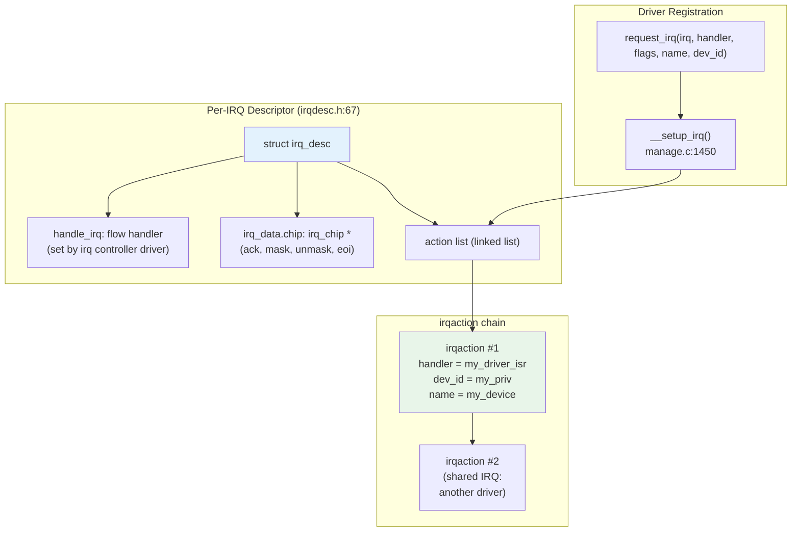
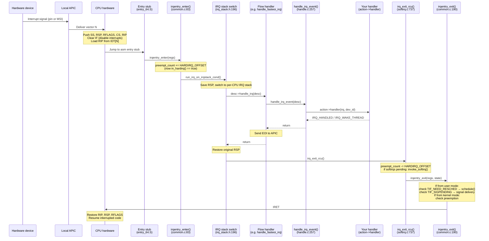
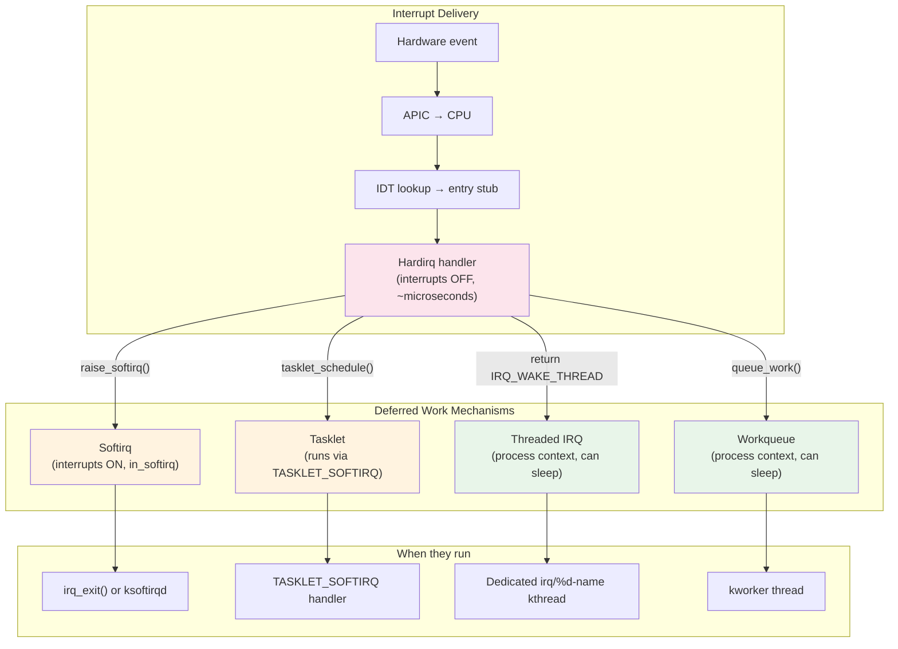

# Interrupts and Interrupt Context in Linux 6.19

> Source base: `/home/inineapa/Lab/linux-6.19`

---

## Before You Begin

If you have been writing user-space code for a few years, you already understand interrupts at a high level: hardware tells the CPU "something happened," and the CPU jumps to a handler. What you might not know is what *exactly* happens inside the kernel when that interrupt fires — especially the uncomfortable truth that the handler runs on behalf of whatever random process happened to be on the CPU at that moment, borrowing its kernel stack and its `current` pointer, even though the interrupt has absolutely nothing to do with that process.

This document traces the full interrupt path: from how a driver registers a handler, through the hardware delivery and the CPU's transition into interrupt context, to the deferred-work mechanisms (softirqs, tasklets, threaded IRQs) that let the kernel do heavy lifting outside the strict hardirq window. Everything is specific to x86_64 on Linux 6.19.

---

## 1. The Interrupt Descriptor Table (IDT) — Where It All Starts

### 1.1 What the IDT Is

On x86, the **IDT** (Interrupt Descriptor Table) is the hardware contract between the CPU and the OS. It is an array of 256 entries — one per interrupt vector (0–255). Each entry tells the CPU: "when vector N fires, jump to this code address, with these privilege-level rules." The CPU consults the IDT on *every* interrupt, exception, and software trap.

If you have ever wondered what the kernel equivalent of `signal()` is for hardware events — this is it, except it is configured once at boot and talks directly to the CPU hardware, not to a kernel API.

The IDT lives at `arch/x86/kernel/idt.c:173`:

```c
static gate_desc idt_table[IDT_ENTRIES] __page_aligned_bss;   // 256 entries
```

### 1.2 How the IDT Is Populated

The 256 vectors are divided into three groups:

| Vectors | Purpose | Configured by |
|---------|---------|---------------|
| 0–31 | **CPU exceptions** — divide-by-zero (#DE), page fault (#PF), general protection fault (#GP), double fault (#DF), etc. These are architecturally defined by Intel/AMD. | `idt_setup_early_traps()` and `idt_setup_traps()` at early boot |
| 32–255 | **Device interrupts** — keyboard, disk controller, network card, timers, IPIs, etc. Vector assignment is managed by the APIC (Advanced Programmable Interrupt Controller). | `idt_setup_apic_and_irq_gates()` (`idt.c:284`) at boot |
| Special | **APIC system vectors** — reschedule IPI, local timer, thermal, etc. | `idt_setup_apic_and_irq_gates()` from `apic_idts[]` table (`idt.c:133`) |

The key function `idt_setup_apic_and_irq_gates()` (`idt.c:284`) installs the entry stubs for device interrupts. For each vector from `FIRST_EXTERNAL_VECTOR` (32) to 255, it writes an IDT gate descriptor that points to a small assembly stub in `arch/x86/entry/entry_64.S`. This stub saves registers, pushes the vector number, and jumps to the C-level handler.

**What you should take away**: by the time the first device driver loads, every interrupt vector already has an entry point installed in the IDT. When a device fires an interrupt, the CPU knows exactly where to jump — the IDT is the lookup table.

---

## 2. How a Driver Registers an Interrupt Handler

### 2.1 request_irq() — The Driver's Entry Point

In user space, you register a signal handler with `sigaction()`. In kernel space, a driver registers an interrupt handler with `request_irq()`. This is a thin wrapper around `request_threaded_irq()` (`kernel/irq/manage.c:2090`):

```c
// The wrapper that most drivers call:
static inline int __must_check
request_irq(unsigned int irq, irq_handler_t handler, unsigned long flags,
            const char *name, void *dev_id)
{
    return request_threaded_irq(irq, handler, NULL, flags, name, dev_id);
}
```

The arguments:

| Argument | Meaning |
|----------|---------|
| `irq` | The Linux IRQ number (not the hardware vector — the kernel maps between them). You get this from the device tree, PCI subsystem, or `platform_get_irq()`. |
| `handler` | Your **hardirq handler** — a function the kernel calls *with interrupts disabled* on the CPU. Must be fast. Must not sleep. |
| `thread_fn` | (Optional) A **threaded handler** — runs in a dedicated kernel thread, in process context, where sleeping is allowed. More on this in Section 6. |
| `flags` | Behavior flags: `IRQF_SHARED` (share the line with other devices), `IRQF_ONESHOT` (keep the line masked until the threaded handler finishes), `IRQF_TRIGGER_RISING`, etc. |
| `name` | A human-readable name, shown in `/proc/interrupts`. |
| `dev_id` | An opaque pointer passed to your handler. Required for shared interrupts (so `free_irq()` knows which handler to remove). Typically a pointer to your driver's private data structure. |

### 2.2 What Happens Inside request_threaded_irq()

The full function is at `manage.c:2090–2179`. Here is the simplified flow:

1. **Validate inputs** (lines 2098–2132): Check that the IRQ number is valid, that shared interrupts have a `dev_id`, and that the combination of flags makes sense.

2. **Allocate an `irqaction`** (line 2134): This structure (`include/linux/interrupt.h:123`) holds everything about your handler registration — the function pointer, flags, name, and (optionally) the threaded handler's kernel thread:

```c
struct irqaction {
    irq_handler_t       handler;       // hardirq handler function
    void               *dev_id;        // device cookie
    irq_handler_t       thread_fn;     // threaded handler function (or NULL)
    struct task_struct  *thread;        // the kernel thread (created by __setup_irq)
    unsigned int         irq;           // IRQ number
    unsigned int         flags;         // IRQF_* flags
    const char          *name;          // name in /proc/interrupts
    struct irqaction    *next;          // next action in shared-IRQ chain
    ...
};
```

3. **Call `__setup_irq()`** (line 2150): This is where the real work happens — it links the `irqaction` into the `irq_desc`'s action chain, creates a kernel thread for threaded handlers, validates that shared-IRQ trigger types are compatible, and enables the interrupt line.

### 2.3 The irq_desc — The Kernel's Per-IRQ Bookkeeping

Every IRQ number in the system has a corresponding `struct irq_desc` (`include/linux/irqdesc.h:67`). Think of it as the kernel's "file" for that interrupt line — it tracks who is registered, what state the line is in, and how to talk to the hardware interrupt controller:

| Field | Purpose |
|-------|---------|
| `action` | Head of a linked list of `irqaction` structs — one per registered handler. For shared IRQs, multiple drivers hang their handlers off this list. |
| `handle_irq` | The **flow handler** — a function pointer that implements the interrupt acknowledgment protocol. Set by the interrupt controller driver, not by your device driver. (Section 3.2.) |
| `irq_data` | Hardware-specific data: the IRQ chip operations (`irq_chip *`), hardware IRQ number, trigger type, affinity mask. |
| `depth` | Disable nesting depth. When `depth > 0`, the interrupt is disabled. `disable_irq()` increments it; `enable_irq()` decrements it. |
| `lock` | A raw spinlock protecting the descriptor. |
| `kstat_irqs` | Per-CPU interrupt counters — what you see in `/proc/interrupts`. |

The relationship between these structures:



### 2.4 What /proc/interrupts Shows You

After registration, your interrupt appears in `/proc/interrupts`:

```
           CPU0       CPU1       CPU2       CPU3
  1:         42          0          0          0   IR-IO-APIC   1-edge      i8042
 18:          0          0         38          0   IR-IO-APIC  18-fasteoi   my_device
```

Each column is a per-CPU counter from `irq_desc.kstat_irqs`. The "IR-IO-APIC" is the interrupt controller name. "edge" / "fasteoi" is the flow handler type (Section 3.2). The last column is the `name` you passed to `request_irq()`.

---

## 3. What Happens When an Interrupt Fires

This is the heart of the matter. An interrupt just fired — your network card received a packet, or a disk controller finished a DMA transfer. Here is exactly what happens on x86_64, step by step.

### 3.1 The CPU's Immediate Response (Hardware)

The CPU itself — not the kernel — does the first part. This happens in silicon:

1. **The device signals the APIC**: The device asserts its interrupt line (or sends an MSI — Message Signaled Interrupt — write to a special memory address). The APIC translates this into a vector number (32–255) and delivers it to the target CPU.

2. **The CPU checks IF (Interrupt Flag)**: If `RFLAGS.IF` is clear (interrupts disabled, e.g., inside `local_irq_disable()`), the interrupt is held pending until IF is set again.

3. **The CPU saves minimal state and switches stacks**:
   - Pushes SS, RSP, RFLAGS, CS, RIP onto the **kernel stack** (or the IST stack for certain critical exceptions). This is the interrupted context's register snapshot — just enough to return later.
   - If the interrupt came from user mode (CPL 3), the CPU loads the kernel stack pointer from the TSS (Task State Segment) — this is how the CPU "enters" kernel mode.
   - Clears `RFLAGS.IF` (disabling further interrupts).
   - Loads RIP from the IDT entry for this vector — jumping to the kernel's entry stub.

**Key insight for user-space developers**: There is no "context switch" in the scheduler sense. The CPU does not pick a different process. It just pushes a few registers onto the *current* process's kernel stack and starts running the IDT handler code. The interrupted process's `task_struct` is still `current`. Its page tables are still in CR3. The interrupt handler is, from the kernel's perspective, "borrowing" this process's kernel context.

### 3.2 The Assembly Entry Stub

The IDT entry points to a small assembly stub in `arch/x86/entry/entry_64.S` (generated from macros in `arch/x86/include/asm/idtentry.h`). For device interrupts, the relevant macro is `DEFINE_IDTENTRY_IRQ` (`idtentry.h:206`):

```c
// Simplified — the actual macro also handles instrumentation and KVM:
#define DEFINE_IDTENTRY_IRQ(func)
__visible noinstr void func(struct pt_regs *regs, unsigned long error_code)
{
    irqentry_state_t state = irqentry_enter(regs);   // (1) Enter interrupt context
    u32 vector = (u32)(u8)error_code;                 // (2) Extract vector number

    run_irq_on_irqstack_cond(__##func, regs, vector); // (3) Switch to IRQ stack & call handler

    irqentry_exit(regs, state);                       // (4) Exit interrupt context
}
```

Let's unpack each step.

### 3.3 Entering Interrupt Context

`irqentry_enter()` (`kernel/entry/common.c:83`) records whether we came from user mode or kernel mode. This is important for the exit path — returning to user mode requires checking for pending signals and rescheduling, while returning to kernel mode does not (unless kernel preemption is enabled).

Then, `irq_enter_rcu()` (`kernel/softirq.c:662`) marks the CPU as being in hardirq context by adding `HARDIRQ_OFFSET` (0x10000) to the per-CPU `preempt_count`:

```c
#define __irq_enter_raw()                 \
do {                                       \
    preempt_count_add(HARDIRQ_OFFSET);     \
    lockdep_hardirq_enter();               \
} while (0)
```

**Why this matters**: The `preempt_count` is a 32-bit integer on x86, and each bit range encodes a different nesting level:

```
Bit layout of preempt_count:

  bits  0- 7  (0x000000FF)  preempt_disable() nesting depth
  bits  8-15  (0x0000FF00)  softirq disable depth (BH disable)
  bits 16-19  (0x000F0000)  hardirq nesting depth    ← HARDIRQ_OFFSET lands here
  bits 20-23  (0x00F00000)  NMI nesting depth
  bit  31     (0x80000000)  PREEMPT_NEED_RESCHED (x86 only, inverted)
```

Adding `HARDIRQ_OFFSET` (1 << 16 = 0x10000) sets bit 16, which means the kernel's context-checking macros now know we are inside a hardirq:

| Macro | What it checks | When it is true |
|-------|---------------|-----------------|
| `in_hardirq()` | `preempt_count & HARDIRQ_MASK` | We are in a hardirq handler |
| `in_softirq()` | `preempt_count & SOFTIRQ_MASK` | We are in a softirq handler or BH-disabled section |
| `in_interrupt()` | `preempt_count & (HARDIRQ_MASK | SOFTIRQ_MASK | NMI_MASK)` | We are in *any* interrupt context |
| `in_task()` | `!(in_interrupt())` | We are in normal process context (safe to sleep) |

This is the kernel's mechanism for knowing *what kind of code is currently running*. User space has nothing comparable — you are always in "process context." But in the kernel, the same CPU can be executing process code, hardirq code, softirq code, or NMI code, and the rules for what you can do differ in each. `preempt_count` is how the kernel tracks this.

### 3.4 The IRQ Stack Switch

Here is something that might surprise you: on x86_64, the interrupt handler does **not** run on the interrupted process's kernel stack (at least not if we came from kernel mode). Instead, it switches to a dedicated **per-CPU IRQ stack**.

Why? Because the kernel stack is only 16KB (or 32KB with `KASAN`). An interrupt can arrive at any nesting depth — a process might be deep in the filesystem code, which is deep in the block layer, which is holding several locks. If the interrupt handler runs on that same stack, and the handler itself calls non-trivial code, you risk a stack overflow. The per-CPU IRQ stack provides a fresh 16KB to work with.

The switch is done by `run_irq_on_irqstack_cond()` (`arch/x86/include/asm/irq_stack.h:196`):

```c
// Simplified:
#define run_irq_on_irqstack_cond(func, regs, vector)
    if (user_mode(regs) || __this_cpu_read(hardirq_stack_inuse))
        func(regs, vector);      // already on a good stack, or stack in use — don't switch
    else
        call_on_irqstack(func, regs, vector);  // switch RSP to hardirq_stack_ptr
```

`call_on_irqstack()` (`irq_stack.h:81`) saves the current RSP at the top of the IRQ stack, loads the IRQ stack pointer into RSP, calls the handler, and restores the original RSP on return. The `hardirq_stack_inuse` flag prevents double-switching if an interrupt arrives while already on the IRQ stack (nested interrupts).

The per-CPU IRQ stack is allocated at boot and stored in `hardirq_stack_ptr` (`arch/x86/kernel/irq.c:40`):

```c
DEFINE_PER_CPU_CACHE_HOT(struct irq_stack *, hardirq_stack_ptr);

struct irq_stack {
    char stack[IRQ_STACK_SIZE];   // 16KB
} __aligned(IRQ_STACK_SIZE);
```

### 3.5 Dispatching to Your Handler

Once on the IRQ stack, the C handler runs. For device interrupts, this eventually calls `generic_handle_irq_desc()`, which invokes the **flow handler** stored in `irq_desc->handle_irq`. The flow handler implements the protocol for talking to the interrupt controller:

| Flow handler | Used for | Protocol |
|-------------|----------|----------|
| `handle_level_irq()` (`chip.c:685`) | Level-triggered interrupts | Mask → ack → handle → unmask |
| `handle_edge_irq()` (`chip.c:823`) | Edge-triggered interrupts | Ack immediately → handle → loop if pending |
| `handle_fasteoi_irq()` (`chip.c:736`) | Modern APIC-based interrupts (most common) | Handle → send EOI (End Of Interrupt) |

Let's trace `handle_fasteoi_irq()` since it is the most common on modern x86 hardware:

```c
void handle_fasteoi_irq(struct irq_desc *desc)
{
    guard(raw_spinlock)(&desc->lock);

    // 1. Check if the IRQ can be handled (not disabled, not in-flight migration)
    if (!irq_can_handle_pm(desc)) { ... return; }
    if (!irq_can_handle_actions(desc)) { mask_irq(desc); ... return; }

    // 2. Update statistics
    kstat_incr_irqs_this_cpu(desc);

    // 3. Call every registered handler on this IRQ line
    handle_irq_event(desc);

    // 4. Send EOI to the interrupt controller (tell it we're done)
    cond_unmask_eoi_irq(desc, chip);
}
```

`handle_irq_event()` (`kernel/irq/handle.c:257`) drops the descriptor lock (so the handler can run without holding it), then calls `__handle_irq_event_percpu()` (`handle.c:185`), which iterates the `irqaction` chain:

```c
irqreturn_t __handle_irq_event_percpu(struct irq_desc *desc)
{
    irqreturn_t retval = IRQ_NONE;
    struct irqaction *action;

    for_each_action_of_desc(desc, action) {
        irqreturn_t res;

        res = action->handler(irq, action->dev_id);   // <-- YOUR HANDLER IS CALLED HERE

        switch (res) {
        case IRQ_WAKE_THREAD:
            __irq_wake_thread(desc, action);   // wake the threaded handler
            break;
        default:
            break;
        }
        retval |= res;
    }
    return retval;
}
```

For shared interrupts, *every* handler on the chain is called. Each handler is expected to check whether its device actually generated the interrupt (by reading a device status register) and return `IRQ_NONE` if not, or `IRQ_HANDLED` if it handled the interrupt. If the handler needs to defer work to a threaded handler, it returns `IRQ_WAKE_THREAD`.

### 3.6 The Return Value Contract

Your hardirq handler must return one of:

| Return value | Meaning |
|-------------|---------|
| `IRQ_NONE` | This interrupt was not from my device. (Important for shared IRQs.) |
| `IRQ_HANDLED` | I handled it. Done. |
| `IRQ_WAKE_THREAD` | I did the urgent part; now wake my threaded handler to do the rest. |

If all handlers on a shared line return `IRQ_NONE`, the kernel increments a "spurious interrupt" counter. After too many spurious interrupts (tracked by `note_interrupt()`), the kernel disables the line to prevent an interrupt storm from locking up the system.

### 3.7 Exiting Interrupt Context

After the handler chain returns, the kernel unwinds:

1. **`irq_exit_rcu()`** (`softirq.c:737`): Subtracts `HARDIRQ_OFFSET` from `preempt_count`, returning us to whatever context we came from. Then checks: *are there pending softirqs, and are we no longer in any interrupt context?* If yes, process softirqs now (Section 4).

```c
static inline void __irq_exit_rcu(void)
{
    preempt_count_sub(HARDIRQ_OFFSET);        // leave hardirq context
    if (!in_interrupt() && local_softirq_pending())
        invoke_softirq();                      // run softirqs if pending
}
```

2. **`irqentry_exit()`** (`kernel/entry/common.c:190`): If we interrupted user mode, call `irqentry_exit_to_user_mode()`, which checks `TIF_NEED_RESCHED` (should the scheduler run?), `TIF_SIGPENDING` (pending signals?), and `TIF_NOTIFY_RESUME` (deferred work?) before returning to user space. If we interrupted kernel mode, check if preemption is needed (`preempt_schedule_irq()`).

3. **Restore registers and IRET**: The assembly epilogue pops the saved registers and executes `IRET` (Interrupt Return), which atomically restores RIP, CS, RFLAGS, RSP, and SS — resuming the interrupted code exactly where it left off.

### 3.8 The Complete Interrupt Path



---

## 4. Softirqs — Deferred Work in Interrupt Context

### 4.1 The Problem Softirqs Solve

Hardirq handlers run with interrupts disabled (or at least with the current line masked). They must be *fast* — ideally under a few microseconds. But many interrupt-driven operations need more time: a network card interrupt needs to process an entire batch of received packets; a block device interrupt needs to complete I/O requests and wake waiting processes.

The solution is **softirqs**: a deferred-execution mechanism that runs *after* the hardirq handler returns but *before* the kernel returns to the interrupted code. Softirqs run with interrupts **enabled** (so new hardirqs can still be serviced) but with a "software interrupt" flag set in `preempt_count`, which means the kernel knows it is still in an interrupt-like context and certain things (like sleeping) are still forbidden.

### 4.2 The Softirq Table

Softirqs are statically defined — there are exactly 10, registered at boot via `open_softirq()` (`softirq.c:793`). You cannot add new ones from a driver module. They are stored in a fixed-size table (`softirq.c:60`):

```c
static struct softirq_action softirq_vec[NR_SOFTIRQS] __cacheline_aligned_in_smp;
```

The 10 softirq types (`include/linux/interrupt.h:560`):

| Index | Name | Subsystem | What it does |
|-------|------|-----------|-------------|
| 0 | `HI_SOFTIRQ` | High-priority tasklets | Runs high-priority tasklets |
| 1 | `TIMER_SOFTIRQ` | Timer subsystem | Processes expired timers |
| 2 | `NET_TX_SOFTIRQ` | Networking | Transmit packet processing |
| 3 | `NET_RX_SOFTIRQ` | Networking | Receive packet processing (NAPI) |
| 4 | `BLOCK_SOFTIRQ` | Block I/O | Block device completion |
| 5 | `IRQ_POLL_SOFTIRQ` | IRQ polling | IRQ polling mode |
| 6 | `TASKLET_SOFTIRQ` | Normal-priority tasklets | Runs normal tasklets |
| 7 | `SCHED_SOFTIRQ` | Scheduler | Load balancing |
| 8 | `HRTIMER_SOFTIRQ` | High-res timers | High-resolution timer processing |
| 9 | `RCU_SOFTIRQ` | RCU | RCU callback processing |

Registration is simple — the subsystem calls `open_softirq()` once during initialization:

```c
// In net/core/dev.c, during boot:
open_softirq(NET_RX_SOFTIRQ, net_rx_action);
open_softirq(NET_TX_SOFTIRQ, net_tx_action);
```

### 4.3 Raising a Softirq

A hardirq handler (or any code running with interrupts disabled) can *raise* a softirq — meaning "please run this softirq's handler when it is safe to do so":

```c
raise_softirq(NET_RX_SOFTIRQ);   // sets a bit in a per-CPU pending bitmask
```

Internally (`softirq.c:777`), this sets a bit in the per-CPU `__softirq_pending` variable:

```c
void __raise_softirq_irqoff(unsigned int nr)
{
    or_softirq_pending(1UL << nr);   // set bit nr in the pending mask
}
```

### 4.4 When Softirqs Are Processed

Softirqs are checked at three points:

1. **On return from a hardirq** — `__irq_exit_rcu()` (`softirq.c:713`) checks `local_softirq_pending()`. If any bits are set and we are not in interrupt context, it calls `invoke_softirq()` → `__do_softirq()`.

2. **At the end of `local_bh_enable()`** — When code that had disabled softirqs re-enables them.

3. **By `ksoftirqd`** — A per-CPU kernel thread that processes softirqs when they keep being raised faster than they can be processed inline (to prevent softirqs from monopolizing the CPU and starving user-space processes).

### 4.5 Inside handle_softirqs()

The core softirq loop is `handle_softirqs()` (`softirq.c:579`):

```c
static void handle_softirqs(bool ksirqd)
{
    unsigned long end = jiffies + MAX_SOFTIRQ_TIME;
    int max_restart = MAX_SOFTIRQ_RESTART;       // 10 restarts max
    __u32 pending;

    pending = local_softirq_pending();
    softirq_handle_begin();                       // preempt_count += SOFTIRQ_OFFSET
    set_softirq_pending(0);                       // clear pending bits

    local_irq_enable();                           // *** RE-ENABLE INTERRUPTS ***

    while ((softirq_bit = ffs(pending))) {        // find first set bit
        h += softirq_bit - 1;
        h->action();                              // call the softirq handler
        h++;
        pending >>= softirq_bit;
    }

    local_irq_disable();
    pending = local_softirq_pending();            // check for new pending softirqs
    if (pending && time_before(jiffies, end) && !need_resched() && --max_restart)
        goto restart;                             // loop again if within budget
    if (pending)
        wakeup_softirqd();                        // too many — defer to ksoftirqd

    softirq_handle_end();                         // preempt_count -= SOFTIRQ_OFFSET
}
```

**Two critical observations**:

1. **Interrupts are re-enabled** during softirq processing (`local_irq_enable()` at line 606). This is why softirqs are better than doing everything in the hardirq handler — new device interrupts can still be serviced. The hardirq handler runs, raises a softirq, returns, and then the softirq processes the data with interrupts on.

2. **There is a time budget**. If softirqs keep getting re-raised (e.g., a network driver under heavy load keeps raising `NET_RX_SOFTIRQ`), the loop gives up after 10 restarts or 2ms (whichever comes first) and defers to `ksoftirqd`. This prevents softirqs from starving user-space processes.

### 4.6 What You Cannot Do in Softirq Context

Softirq context (`in_softirq() == true`) has similar restrictions to hardirq context:

- **No sleeping**. You cannot call `kmalloc(GFP_KERNEL)` (use `GFP_ATOMIC`), `mutex_lock()`, `msleep()`, `schedule()`, or any function that might sleep.
- **No user-space access**. `copy_to_user()` / `copy_from_user()` are forbidden.
- **No blocking I/O**.

The reason is the same: the current `task_struct` is borrowed. The softirq is running "on top of" whatever process happened to be on the CPU. Sleeping would block that process, which has nothing to do with the softirq's work.

---

## 5. Tasklets — Per-Driver Deferred Work

### 5.1 What Tasklets Are

A **tasklet** is a dynamically allocatable deferred-work mechanism built on top of softirqs. While softirqs are statically defined (only 10 exist) and must handle their own serialization, tasklets are designed for driver authors:

- You can create as many tasklets as you want.
- A given tasklet is **serialized against itself** — it will never run concurrently on two CPUs. (Different tasklets can run concurrently.)
- A given tasklet runs on the CPU that scheduled it.

Tasklets are scheduled onto either `TASKLET_SOFTIRQ` (normal priority) or `HI_SOFTIRQ` (high priority).

### 5.2 Using Tasklets

```c
// Define a tasklet (usually in your driver's init):
DECLARE_TASKLET(my_tasklet, my_tasklet_handler);

// The handler function:
void my_tasklet_handler(struct tasklet_struct *t)
{
    struct my_device *dev = from_tasklet(dev, t, tasklet);
    // process data, update state — still cannot sleep!
}

// In your hardirq handler:
irqreturn_t my_isr(int irq, void *dev_id)
{
    // ... ack hardware, grab data from device registers ...
    tasklet_schedule(&my_tasklet);   // defer heavy processing
    return IRQ_HANDLED;
}
```

The `tasklet_struct` (`include/linux/interrupt.h:701`):

```c
struct tasklet_struct {
    struct tasklet_struct *next;    // linked list
    unsigned long state;            // TASKLET_STATE_SCHED, TASKLET_STATE_RUN
    atomic_t count;                 // disable count (0 = enabled)
    void (*callback)(struct tasklet_struct *t);
    unsigned long data;
};
```

`tasklet_schedule()` (`softirq.c:825`) adds the tasklet to a per-CPU list and raises `TASKLET_SOFTIRQ`. When the softirq runs, `tasklet_action_common()` (`softirq.c:903`) iterates the list and calls each tasklet's handler.

### 5.3 When to Use Tasklets (and When Not To)

Tasklets are considered **legacy** in modern kernel development. New drivers should prefer **threaded IRQs** (Section 6) because:

- Tasklets run in softirq context — they cannot sleep, which limits what they can do.
- Tasklets have coarse-grained serialization — all instances of the same tasklet are serialized, even across CPUs, which limits scalability.
- Threaded IRQs run in process context, can sleep, can use mutexes, and are easier to debug.

The kernel community is gradually moving away from tasklets. For new code, use `request_threaded_irq()`.

---

## 6. Threaded IRQs — The Modern Approach

### 6.1 The Motivation

The restrictions of hardirq and softirq context (no sleeping, no mutexes, no blocking I/O) make it difficult to write complex interrupt handlers. Many devices — especially buses like I2C, SPI, and USB — require communication with the device to process an interrupt, and that communication involves transactions that may sleep.

**Threaded IRQs** solve this by splitting the interrupt handling into two parts:

1. A **hardirq handler** (the "top half") that runs in hardirq context. It does the bare minimum: acknowledge the interrupt at the hardware level, and return `IRQ_WAKE_THREAD`.
2. A **threaded handler** (the "bottom half") that runs in a dedicated kernel thread — in full process context, where sleeping is allowed.

### 6.2 Registration

```c
int request_threaded_irq(unsigned int irq,
                         irq_handler_t handler,      // hardirq handler (or NULL)
                         irq_handler_t thread_fn,    // threaded handler
                         unsigned long irqflags,
                         const char *devname,
                         void *dev_id);
```

If you pass `handler = NULL`, the kernel uses `irq_default_primary_handler()`, which simply returns `IRQ_WAKE_THREAD`. This means the hardirq handler does nothing except wake the thread — useful when the device doesn't need any hardirq-level acknowledgment.

### 6.3 How the Thread Works

When `__setup_irq()` sees a `thread_fn`, it calls `setup_irq_thread()` (`manage.c:1381`), which creates a kernel thread:

```c
t = kthread_create(irq_thread, new, "irq/%d-%s", irq, new->name);
```

The resulting kernel thread (`irq_thread()`, `manage.c:1223`) runs a simple loop:

```c
static int irq_thread(void *data)
{
    struct irqaction *action = data;

    sched_set_fifo(current);   // SCHED_FIFO priority (real-time)

    while (!irq_wait_for_interrupt(desc, action)) {
        action_ret = handler_fn(desc, action);    // calls action->thread_fn(irq, dev_id)
        ...
    }
    return 0;
}
```

The thread sleeps until `__irq_wake_thread()` wakes it (called from the hardirq handler when it returns `IRQ_WAKE_THREAD`). It then calls your `thread_fn` in full process context — you can use `kmalloc(GFP_KERNEL)`, `mutex_lock()`, `i2c_transfer()`, etc.

The thread runs at `SCHED_FIFO` priority (real-time), so it will preempt normal tasks quickly after being woken.

### 6.4 IRQF_ONESHOT

When using threaded IRQs with level-triggered interrupts, the interrupt line must stay **masked** from the time the hardirq handler runs until the threaded handler finishes. Otherwise, the device will keep asserting the interrupt (because the threaded handler hasn't cleared the condition yet), and the system will be stuck in an interrupt storm.

`IRQF_ONESHOT` does exactly this: it keeps the interrupt line masked until the threaded handler returns. It is required for threaded IRQs on shared, level-triggered lines.

### 6.5 Example: A Complete Threaded IRQ Driver

```c
static irqreturn_t my_hardirq(int irq, void *dev_id)
{
    struct my_device *dev = dev_id;

    // Read the device's interrupt status register (fast MMIO read)
    u32 status = readl(dev->regs + IRQ_STATUS);
    if (!(status & MY_DEVICE_IRQ_PENDING))
        return IRQ_NONE;     // not my interrupt (shared line)

    // Acknowledge the interrupt at the hardware level
    writel(status, dev->regs + IRQ_ACK);

    // Save the status for the threaded handler
    dev->irq_status = status;

    return IRQ_WAKE_THREAD;  // wake the threaded handler
}

static irqreturn_t my_thread_fn(int irq, void *dev_id)
{
    struct my_device *dev = dev_id;

    // Now in process context — can sleep!
    mutex_lock(&dev->lock);

    if (dev->irq_status & DATA_READY) {
        // Read data from the device over I2C (this can sleep)
        i2c_smbus_read_i2c_block_data(dev->client, REG_DATA, sizeof(buf), buf);
        // Process the data...
    }

    mutex_unlock(&dev->lock);
    return IRQ_HANDLED;
}

// In probe():
ret = request_threaded_irq(client->irq, my_hardirq, my_thread_fn,
                           IRQF_ONESHOT | IRQF_TRIGGER_LOW,
                           "my_device", dev);
```

---

## 7. The Borrowed-Context Problem

### 7.1 Why the Interrupted Process Matters

This section ties together a theme that runs through everything above: *the interrupt handler borrows the interrupted process's context*.

When a hardirq fires, the CPU does not switch to a special "interrupt process." It stays in the same `task_struct`. The `current` macro still returns the same pointer. The kernel stack (if we didn't switch to the IRQ stack) is the same kernel stack. The page tables in CR3 are the same.

This has concrete consequences:

| What | In hardirq context | Implication |
|------|-------------------|-------------|
| `current` | Points to the interrupted task | Do NOT use `current` for anything meaningful — it has nothing to do with the interrupt. |
| `preempt_count` | Has HARDIRQ_OFFSET set | Preemption is disabled. `schedule()` will BUG. |
| Memory allocation | Must use `GFP_ATOMIC` | Cannot perform direct reclaim (no sleeping). |
| Locks | Only `spin_lock()` / `spin_lock_irqsave()` | `mutex_lock()` may sleep — forbidden. |
| User-space memory | Inaccessible | `copy_to_user()` is undefined — the "user" is unrelated. |
| Sleeping | Absolutely forbidden | `msleep()`, `wait_event()`, etc. will deadlock or BUG. |

### 7.2 The Connection to Process Scheduling

You might wonder: "if the interrupt handler runs on some random process's behalf, how does the kernel ever get back to that process?"

The answer is straightforward: the CPU saved the process's register state (RIP, RSP, RFLAGS, etc.) when it entered the interrupt. When the handler returns and `irqentry_exit()` executes `IRET`, those registers are restored and the process resumes exactly where it left off. The process never knows it was interrupted — unless the kernel decided to reschedule.

If the timer interrupt set `TIF_NEED_RESCHED` on the interrupted task (because its time slice expired), then `irqentry_exit()` will call `preempt_schedule_irq()` (if returning to kernel mode) or `schedule()` (if returning to user mode). This is how the scheduler gets control — not by running continuously, but by being invoked at interrupt return points. The process document (process.md, Section 3.2) covers these scheduling intervention points in detail.

### 7.3 Nesting

On x86_64, hardirqs can nest: while processing one interrupt, a higher-priority interrupt can arrive and preempt it (if the handler or flow handler re-enabled interrupts). The `preempt_count` HARDIRQ field supports up to 15 levels of nesting (4 bits). Each nested interrupt pushes more state onto the IRQ stack.

NMIs (Non-Maskable Interrupts) are special — they cannot be blocked and can arrive at any time, even during another interrupt handler. They have their own dedicated stack (IST-based on x86_64) and their own bits in `preempt_count`.

---

## 8. Putting It All Together: The Deferred-Work Hierarchy

The kernel provides a hierarchy of deferred-work mechanisms, each with different trade-offs:

| Mechanism | Context | Can sleep? | Latency | Use case |
|-----------|---------|-----------|---------|----------|
| **Hardirq handler** | Hardirq (interrupts off) | No | Lowest | Acknowledge device, grab urgent data |
| **Softirq** | Softirq (interrupts on) | No | Low | High-throughput, per-subsystem (networking, block) |
| **Tasklet** | Softirq (interrupts on) | No | Low | Per-driver deferred work (legacy) |
| **Threaded IRQ** | Process (full) | Yes | Medium | Modern drivers, especially I2C/SPI/USB |
| **Workqueue** | Process (full) | Yes | Higher | General deferred work, not tied to a specific IRQ |

The typical pattern for a modern driver:

```
Hardware interrupt fires
    → hardirq handler: ack device, read status register, return IRQ_WAKE_THREAD
        → threaded handler: process data, communicate with device, wake user-space
```

The typical pattern for a high-performance subsystem (networking):

```
Hardware interrupt fires
    → hardirq handler: disable device interrupts, raise_softirq(NET_RX_SOFTIRQ)
        → softirq: process packet batch (NAPI poll), re-enable device interrupts
```



---

## 9. Function Quick Reference

| Function | File:Line | Role |
|----------|-----------|------|
| `request_irq()` | `include/linux/interrupt.h:168` | Register a hardirq handler (wrapper) |
| `request_threaded_irq()` | `kernel/irq/manage.c:2090` | Register hardirq + threaded handler |
| `free_irq()` | `kernel/irq/manage.c:1979` | Unregister a handler |
| `__setup_irq()` | `kernel/irq/manage.c:1450` | Internal: link irqaction, create thread |
| `idt_setup_apic_and_irq_gates()` | `arch/x86/kernel/idt.c:284` | IDT setup for device IRQs at boot |
| `irqentry_enter()` | `kernel/entry/common.c:83` | Enter interrupt context |
| `irqentry_exit()` | `kernel/entry/common.c:190` | Exit interrupt context, check resched |
| `irq_enter_rcu()` | `kernel/softirq.c:662` | Add HARDIRQ_OFFSET to preempt_count |
| `irq_exit_rcu()` | `kernel/softirq.c:737` | Remove HARDIRQ_OFFSET, check softirqs |
| `handle_fasteoi_irq()` | `kernel/irq/chip.c:736` | Modern APIC flow handler |
| `handle_level_irq()` | `kernel/irq/chip.c:685` | Level-triggered flow handler |
| `handle_edge_irq()` | `kernel/irq/chip.c:823` | Edge-triggered flow handler |
| `handle_irq_event()` | `kernel/irq/handle.c:257` | Call registered handlers |
| `__handle_irq_event_percpu()` | `kernel/irq/handle.c:185` | Per-CPU handler chain walk |
| `open_softirq()` | `kernel/softirq.c:793` | Register a softirq handler (boot only) |
| `raise_softirq()` | `kernel/softirq.c:777` | Raise a softirq (set pending bit) |
| `handle_softirqs()` | `kernel/softirq.c:579` | Core softirq processing loop |
| `__do_softirq()` | `kernel/softirq.c:654` | Entry point for inline softirq processing |
| `tasklet_schedule()` | `kernel/softirq.c:825` | Schedule a tasklet for deferred execution |
| `tasklet_action_common()` | `kernel/softirq.c:903` | Process pending tasklets |
| `irq_thread()` | `kernel/irq/manage.c:1223` | Threaded IRQ kernel thread main loop |
| `setup_irq_thread()` | `kernel/irq/manage.c:1381` | Create the kernel thread for a threaded IRQ |

---

## 10. entry_64.S — The Gateway Between Hardware and C Code

Everything in this document — from the IDT lookup to your driver's handler — passes through a single file: `arch/x86/entry/entry_64.S`. If you have not looked at assembly before, don't worry — we will walk through what the file *does*, not every instruction.

### 10.1 What entry_64.S Is

`entry_64.S` is the **assembly-language gateway** between the CPU hardware and the kernel's C code. Every time the CPU transitions from "doing whatever it was doing" to "running kernel entry code" — whether because of a system call, a hardware interrupt, an exception (page fault, divide-by-zero), or an NMI — the first kernel instructions executed live in this file.

Think of it like the front door of a building. The building has many rooms (C functions for different subsystems), but every visitor enters through the same door, gets checked in by the same receptionist, and is directed to the right room. `entry_64.S` is that receptionist.

The file's own header comment (`entry_64.S:9`) summarizes it:

> *entry.S contains the system-call and fault low-level handling routines.*

### 10.2 The Major Sections

The file handles four categories of CPU-to-kernel transitions:

| Section | Entry point(s) | What triggers it | Where it goes |
|---------|---------------|-----------------|---------------|
| **System calls** | `entry_SYSCALL_64` (line 88) | User process executes `SYSCALL` instruction | `do_syscall_64()` in C |
| **Exceptions & interrupts** | `idtentry` / `idtentry_irq` macros (lines 330, 377) | CPU looks up IDT vector → jumps here | C handler via `idtentry_body` macro |
| **Context switch** | `__switch_to_asm` (line 178) | Scheduler calls `switch_to()` | `__switch_to()` in C |
| **Fork return** | `ret_from_fork_asm` (line 229) | Newly created process runs for the first time | `ret_from_fork()` in C |

Plus two exit paths:

| Exit path | Entry point | What it does |
|-----------|-------------|-------------|
| **Return to user mode** | `swapgs_restore_regs_and_return_to_usermode` (line 561) | Restores all registers, swaps GS, executes `IRET` |
| **Return to kernel mode** | `restore_regs_and_return_to_kernel` (line 620) | Restores registers, executes `IRET` |

### 10.3 How Interrupts Flow Through entry_64.S

When a device interrupt fires, the path through `entry_64.S` is:

1. **The CPU looks up the IDT** and jumps to an assembly stub. The stub is generated by the `idtentry_irq` macro (line 377), which expands the `idtentry` macro (line 330). The stub does:
   - `ENDBR` — Intel CET indirect-branch landing pad
   - `ASM_CLAC` — Clear the AC flag (prevent SMAP bypasses)
   - `cld` — Clear direction flag (C code assumes forward string operations)
   - Push the vector number as a fake error code

2. **`idtentry_body`** (line 290) takes over:
   - Calls `error_entry` (line 1005) — this saves *all* general-purpose registers into a `struct pt_regs` on the stack, handles SWAPGS (swapping the user/kernel GS base if coming from user mode), and switches CR3 for KPTI (Kernel Page Table Isolation)
   - Passes the `pt_regs` pointer in `%rdi` (first argument per x86_64 ABI)
   - Calls the C function — for device interrupts, this is `common_interrupt()`, which is defined by `DEFINE_IDTENTRY_IRQ` in `idtentry.h:206`

3. **The C function runs** (as described in Section 3 of this document): `irqentry_enter()` → IRQ stack switch → flow handler → your driver's handler → `irqentry_exit()`

4. **`error_return`** restores the saved registers and dispatches to either `swapgs_restore_regs_and_return_to_usermode` or `restore_regs_and_return_to_kernel`, depending on whether the interrupt came from user mode or kernel mode. Both paths end with `IRET`.

### 10.4 The System Call Path (For Comparison)

System calls take a *different* path through the same file, which helps illustrate why `entry_64.S` exists at all. The `SYSCALL` instruction does not go through the IDT — it uses MSR-programmed entry points. The hardware:

- Saves RIP in RCX, RFLAGS in R11
- Loads a new RIP from `MSR_LSTAR` (which the kernel set to `entry_SYSCALL_64` at boot)
- Does NOT switch stacks or push anything

So `entry_SYSCALL_64` (line 88) must do all the work the IDT does for interrupts:
- `swapgs` — swap to kernel GS base
- Load the kernel stack pointer from the per-CPU TSS
- Manually build a `pt_regs` frame by pushing SS, RSP, RFLAGS, CS, RIP, then all GPRs
- Call `do_syscall_64()`
- On return, use `SYSRET` (fast path) or `IRET` (slow path) to get back to user mode

The key insight: **interrupts and system calls both need the same register-save / privilege-transition / register-restore dance**, but the hardware does different amounts of work for each. `entry_64.S` fills in the gaps for both cases.

### 10.5 Context Switch and Fork

Two other pieces of `entry_64.S` deserve a mention because they interact with interrupts indirectly:

**`__switch_to_asm`** (line 178): When the scheduler picks a new process, it calls `switch_to()` → `__switch_to_asm()`. This function saves the callee-saved registers (RBP, RBX, R12–R15) of the old process, swaps the stack pointer (`%rsp`) to the new process's kernel stack, restores the new process's callee-saved registers, and tail-calls `__switch_to()` in C. The full walkthrough is in `process.md` Section 3.3.

**`ret_from_fork_asm`** (line 229): When `fork()` or `clone()` creates a new process, that process has never run before — there is no "interrupted state" to return to. Instead, `copy_thread()` sets up the new process's kernel stack so that when the scheduler context-switches to it, `__switch_to_asm` "returns" into `ret_from_fork_asm`. This function calls `ret_from_fork()` in C (which runs `schedule_tail()` and optionally calls the kernel thread function), then returns to user mode.

### 10.6 Why This Matters for Understanding Interrupts

Without `entry_64.S`, you are missing the connective tissue between "the CPU jumped to IDT vector N" and "my C handler was called with a `pt_regs*`." The file is responsible for:

- **Saving and restoring all registers** — your C handler can use any register freely because entry_64.S saved them all
- **Stack management** — switching from user stack to kernel stack, or from kernel stack to IRQ stack
- **Privilege transitions** — SWAPGS, CR3 switches for KPTI, segment register management
- **Security mitigations** — Spectre/Meltdown defenses (IBRS, retpolines, CPU buffer clearing, RSB filling) are applied at entry and exit
- **The IRET instruction** — the only way to atomically restore RIP+RSP+RFLAGS and return to the interrupted context

The ARM64 equivalent is `arch/arm64/kernel/entry.S`, which serves the same purpose but with a completely different mechanism — exception vectors instead of the IDT. The next section compares these two approaches.

---

## 11. ARM64 Exceptions vs x86_64 Interrupts — A Comparison

If you have read ARM64 kernel code (or plan to), you will notice that ARM uses the word **"exception"** where x86 uses **"interrupt."** This is not just different terminology — ARM's exception model is a broader, more unified concept. This section explains what overlaps, what differs, and why Linux handles them similarly despite the hardware differences.

### 11.1 The Core Difference: One Model vs Two

**ARM64** uses a single unified concept: **exceptions**. Every event that causes the CPU to transfer control from the running code to a handler is an exception. This includes:

- Synchronous exceptions — caused by the current instruction: system calls (`SVC`), page faults, undefined instructions, breakpoints, alignment faults
- IRQ — asynchronous hardware interrupts (equivalent to x86 device interrupts)
- FIQ — fast interrupts (used by secure-world or hypervisor, rarely seen by Linux)
- SError — system errors (asynchronous, typically caused by external memory errors)

**x86_64** has two overlapping mechanisms:

- **Interrupts** — asynchronous events from devices or the APIC, delivered via IDT vectors 32–255
- **Exceptions** — synchronous events caused by the current instruction (divide error, page fault, GP fault, etc.), delivered via IDT vectors 0–31
- **System calls** — use a completely separate mechanism (`SYSCALL`/`SYSRET` instructions), bypassing the IDT entirely

The key distinction: on ARM64, **everything goes through the exception vector table** — system calls, page faults, and device interrupts all use the same dispatch mechanism. On x86_64, system calls take a separate fast path (`entry_SYSCALL_64` via the `LSTAR` MSR), while interrupts and exceptions go through the IDT.

### 11.2 The Vector Table vs the IDT

Both architectures use a table that maps events to handler addresses, but the structure is very different:

**x86_64: Interrupt Descriptor Table (IDT)**

- 256 entries, one per vector number (0–255)
- Each entry is a "gate descriptor" (16 bytes) containing the handler address, segment selector, privilege level, IST index, and gate type
- The CPU uses the vector number as an index: `IDT[vector]` → handler address
- Configured at `arch/x86/kernel/idt.c:173`
- All 256 vectors share the same format — the CPU does not distinguish "interrupt" from "exception" at the table level

**ARM64: Exception Vector Table**

- A fixed-layout block of 16 entries, each 128 bytes (32 instructions) apart
- Organized as a 4×4 grid:
  - 4 exception types: **Synchronous**, **IRQ**, **FIQ**, **SError**
  - 4 source contexts: **EL1t** (kernel, SP_EL0), **EL1h** (kernel, SP_EL1), **EL0 64-bit** (user), **EL0 32-bit** (compat user)
- Set via the `VBAR_EL1` system register
- Defined at `arch/arm64/kernel/entry.S:519`:

```asm
SYM_CODE_START(vectors)
    kernel_ventry  1, t, 64, sync      // Synchronous EL1t
    kernel_ventry  1, t, 64, irq       // IRQ EL1t
    kernel_ventry  1, t, 64, fiq       // FIQ EL1t
    kernel_ventry  1, t, 64, error     // Error EL1t

    kernel_ventry  1, h, 64, sync      // Synchronous EL1h
    kernel_ventry  1, h, 64, irq       // IRQ EL1h
    kernel_ventry  1, h, 64, fiq       // FIQ EL1h
    kernel_ventry  1, h, 64, error     // Error EL1h

    kernel_ventry  0, t, 64, sync      // Synchronous 64-bit EL0
    kernel_ventry  0, t, 64, irq       // IRQ 64-bit EL0
    kernel_ventry  0, t, 64, fiq       // FIQ 64-bit EL0
    kernel_ventry  0, t, 64, error     // Error 64-bit EL0

    kernel_ventry  0, t, 32, sync      // Synchronous 32-bit EL0
    kernel_ventry  0, t, 32, irq       // IRQ 32-bit EL0
    kernel_ventry  0, t, 32, fiq       // FIQ 32-bit EL0
    kernel_ventry  0, t, 32, error     // Error 32-bit EL0
SYM_CODE_END(vectors)
```

The ARM64 table separates by **origin** (user vs kernel) and **exception type** at the hardware level — you get a *different* entry point for "IRQ from user mode" vs "IRQ from kernel mode." On x86, the *same* IDT entry handles vector N regardless of where the interrupt came from; the software (in `entry_64.S`) checks the saved CS to determine the origin.

### 11.3 Exception Levels vs Privilege Rings

**ARM64** has four Exception Levels:

| Level | Purpose | Linux usage |
|-------|---------|-------------|
| EL0 | User-space applications | User processes |
| EL1 | OS kernel | Linux kernel |
| EL2 | Hypervisor | KVM |
| EL3 | Secure monitor | Firmware (ARM Trusted Firmware) |

When an exception is taken, the CPU transitions to the target exception level. Interrupts arriving at EL0 are taken at EL1 (the kernel). The exception vector table at each level is separate (`VBAR_EL1`, `VBAR_EL2`, etc.).

**x86_64** has four privilege rings (0–3), but only two are used:

| Ring | Purpose | Linux usage |
|------|---------|-------------|
| Ring 0 | Kernel | Linux kernel |
| Ring 3 | User | User processes |

When an interrupt fires, the CPU checks the CPL (Current Privilege Level) in the CS register. If transitioning from Ring 3 → Ring 0, it loads a new stack pointer from the TSS. The IDT is shared across all privilege levels.

**What's the same**: both architectures use a two-level privilege split (user vs kernel) for normal Linux operation. Both automatically save minimal state and switch to a kernel stack when transitioning from user to kernel mode.

### 11.4 Register Save/Restore

This is where the architectures diverge significantly:

**x86_64**: The CPU hardware pushes only 5 values (SS, RSP, RFLAGS, CS, RIP) onto the kernel stack — the "IRET frame." The software in `entry_64.S` must save all other registers (RAX through R15, plus some special registers) by executing explicit `push` instructions (via the `PUSH_AND_CLEAR_REGS` macro). This builds a `struct pt_regs` on the stack. On return, the software pops them all back and executes `IRET`.

**ARM64**: The hardware pushes *nothing*. It only updates a few system registers:
- `ELR_EL1` ← interrupted PC
- `SPSR_EL1` ← interrupted PSTATE (flags, interrupt mask, exception level)
- `ESR_EL1` ← exception syndrome (for synchronous exceptions: fault type, instruction details)

The software in `entry.S` must save *everything* — all 31 general-purpose registers (x0–x30), the stack pointer, the link register, and the system registers. This is done by the `kernel_entry` macro (line 197), which uses `stp` (Store Pair) instructions to save registers two at a time into a `struct pt_regs` frame on the stack. On return, `kernel_exit` restores them all and executes `eret` (Exception Return).

**What's the same**: in both cases, the software builds a `struct pt_regs` on the kernel stack, passes a pointer to it as the first argument to the C handler, and restores everything on return. Linux abstracts this: any C code that receives `struct pt_regs *regs` works the same way regardless of architecture.

### 11.5 System Calls: Separate Path vs Unified Path

This is the most visible architectural difference from a kernel developer's perspective:

**x86_64**: System calls use the `SYSCALL` instruction, which bypasses the IDT entirely. The CPU loads a new RIP from `MSR_LSTAR` (programmed to `entry_SYSCALL_64`), saves the old RIP in RCX and RFLAGS in R11, but does NOT switch stacks or push an IRET frame. The software must do all of this manually. This is faster than going through the IDT (no memory lookups for the gate descriptor) but requires a completely separate entry path.

**ARM64**: System calls use the `SVC` (Supervisor Call) instruction, which triggers a **Synchronous exception**. This goes through the *same* exception vector table as page faults and undefined instructions. The entry path is the same `kernel_ventry` → `kernel_entry` → C handler dispatch. The C handler `el0t_64_sync_handler()` reads `ESR_EL1` to determine the exception class and routes system calls to `el0_svc()`.

**What's the same**: from the C code's perspective, both architectures end up in a function that receives a `struct pt_regs*` and a syscall number. The `do_syscall_64()` function on x86 and `el0_svc()` on ARM64 serve the same purpose. The difference is purely in the assembly glue.

### 11.6 IRQ Stack Handling

**x86_64**: Uses a per-CPU IRQ stack (`hardirq_stack_ptr`, 16KB). The switch is done in the C code via `run_irq_on_irqstack_cond()` — it checks whether we are already on the IRQ stack and conditionally switches RSP. See Section 3.4.

**ARM64**: Also uses a per-CPU IRQ stack (`irq_stack_ptr`). The switch is done by `call_on_irq_stack()` (`entry.S:874`), which saves the current frame pointer and link register, switches SP to the IRQ stack, calls the handler, and restores SP.

**What's the same**: both architectures recognize that the 16KB kernel stack is too small to safely handle nested interrupts on top of deep kernel call chains, and both solve it with per-CPU IRQ stacks.

### 11.7 Side-by-Side: What Happens When an IRQ Fires

| Step | x86_64 | ARM64 |
|------|--------|-------|
| **1. Hardware saves state** | Pushes SS, RSP, RFLAGS, CS, RIP (IRET frame). Loads new RIP from `IDT[vector]`. Clears IF. | Saves PC → `ELR_EL1`, PSTATE → `SPSR_EL1`. Loads new PC from vector table entry. Masks DAIF. |
| **2. Entry file** | `arch/x86/entry/entry_64.S` | `arch/arm64/kernel/entry.S` |
| **3. Software saves registers** | `PUSH_AND_CLEAR_REGS` (pushes RAX–R15) | `kernel_entry` macro (stores x0–x30 via `stp`) |
| **4. User/kernel GS/context** | `swapgs` (swap user/kernel GS base) | `mrs x21, sp_el0` then `msr sp_el0, tsk` (swap user SP for current task pointer) |
| **5. Build pt_regs** | On the kernel stack | On the kernel stack |
| **6. Dispatch** | `idtentry_body` → C function (`common_interrupt`) | `entry_handler` macro → C function (`el1h_64_irq_handler`) |
| **7. C entry** | `irqentry_enter()` → `irq_enter_rcu()` → `preempt_count += HARDIRQ_OFFSET` | `irqentry_enter()` → `irq_enter_rcu()` → `preempt_count += HARDIRQ_OFFSET` |
| **8. IRQ stack switch** | `run_irq_on_irqstack_cond()` | `call_on_irq_stack()` |
| **9. Handler dispatch** | `generic_handle_irq_desc()` → flow handler → your handler | `handle_arch_irq()` (function pointer to GIC driver) → `generic_handle_irq_desc()` → your handler |
| **10. Exit** | `irqentry_exit()` → `IRET` | `irqentry_exit()` → `kernel_exit` → `eret` |

Notice that steps 7–9 are **identical** — both architectures share the same C code from `kernel/entry/common.c` and `kernel/irq/`. The differences are all in the assembly entry/exit and the hardware-level mechanisms. This is by design: Linux's generic IRQ layer abstracts away the architecture-specific details.

### 11.8 Summary: ARM64 Has the Broader Model

ARM64's "exception" is the broader concept. Everything that x86 calls "interrupts" and "exceptions" fits under ARM64's exception umbrella:

```
ARM64 Exception Model:
├── Synchronous exceptions
│   ├── SVC (system call)          ← x86: separate SYSCALL path
│   ├── Data abort (page fault)    ← x86: IDT vector 14 (#PF)
│   ├── Instruction abort          ← x86: IDT vector 14 (#PF)
│   ├── Undefined instruction      ← x86: IDT vector 6 (#UD)
│   ├── Breakpoint (BRK)           ← x86: IDT vector 3 (#BP)
│   └── Alignment fault            ← x86: IDT vector 17 (#AC)
├── IRQ (hardware interrupt)       ← x86: IDT vectors 32–255
├── FIQ (fast interrupt)           ← x86: no equivalent (NMI is closest but different)
└── SError (system error)          ← x86: IDT vector 18 (#MC, loosely)
```

x86's model splits these into separate mechanisms (IDT for exceptions and interrupts, `SYSCALL`/`SYSRET` for system calls), while ARM64 routes them all through a single vector table. Neither approach is strictly better — x86's separate system call path is faster (no IDT lookup), while ARM64's unified model is conceptually simpler and easier to reason about.

From a driver developer's perspective, none of this matters — `request_irq()`, `irq_desc`, softirqs, threaded IRQs, and the entire generic IRQ subsystem work identically on both architectures. The differences live entirely in the assembly entry/exit code and the interrupt controller driver (APIC on x86, GIC on ARM64).

---

## 12. Observing Interrupts with trace-cmd (ftrace)

### 12.1 Tracepoint Map

| Tracepoint | Fires when | Key fields |
|------------|-----------|------------|
| `irq:irq_handler_entry` | A hardirq handler is about to be called | `irq`, `name` |
| `irq:irq_handler_exit` | A hardirq handler returned | `irq`, `name`, `ret` (IRQ_HANDLED etc.) |
| `irq:softirq_entry` | A softirq handler is about to run | `vec` (0–9) |
| `irq:softirq_exit` | A softirq handler returned | `vec` |
| `irq:softirq_raise` | A softirq was raised | `vec` |

### 12.2 Recording Traces

```bash
# Trace all hardirq handler entries and exits for 5 seconds
sudo trace-cmd record -e irq:irq_handler_entry \
                      -e irq:irq_handler_exit \
                      sleep 5
trace-cmd report
```

```bash
# Trace softirq activity
sudo trace-cmd record -e irq:softirq_raise \
                      -e irq:softirq_entry \
                      -e irq:softirq_exit \
                      sleep 5
trace-cmd report
```

```bash
# Trace a specific IRQ (e.g., IRQ 18)
sudo trace-cmd record -e irq:irq_handler_entry \
    -f 'irq == 18' \
    -e irq:irq_handler_exit \
    -f 'irq == 18' \
    sleep 5
```

```bash
# Trace the full interrupt path with function_graph
sudo trace-cmd record -p function_graph \
    -g handle_fasteoi_irq \
    -o irq_trace.dat \
    sleep 1
trace-cmd report -i irq_trace.dat
```

### 12.3 Sample Output

A typical hardirq → softirq sequence:

```
myapp-1234  [002]  100.001: irq_handler_entry:  irq=18 name=my_device
myapp-1234  [002]  100.001: irq_handler_exit:   irq=18 name=my_device ret=handled
myapp-1234  [002]  100.001: softirq_raise:      vec=6 [action=TASKLET]
myapp-1234  [002]  100.001: softirq_entry:      vec=6 [action=TASKLET]
myapp-1234  [002]  100.002: softirq_exit:       vec=6 [action=TASKLET]
```

Notice that the "process" column shows `myapp-1234` — but `myapp` did not ask for any of this. It was simply the unlucky process that was on CPU 2 when the interrupt fired. The interrupt and softirq processing happened on its borrowed context, and it resumed execution afterward without knowing anything happened.
