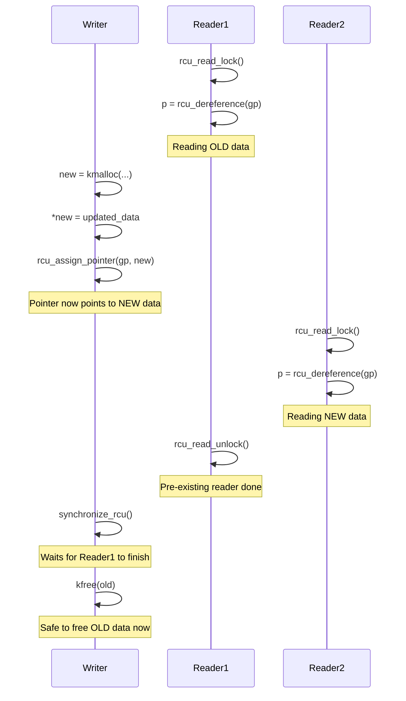
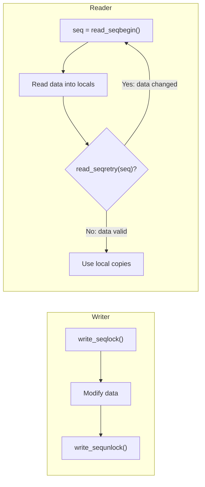
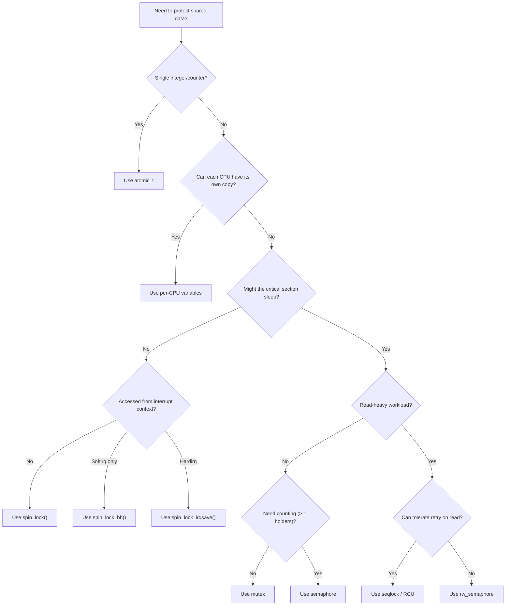

# Synchronization Primitives in Linux 6.19

> Source base: `/home/inineapa/Lab/linux-6.19`

---

## Before You Begin

In user space, synchronization is relatively tame. You have `pthread_mutex_lock()`, maybe a condition variable, and that is about all you need to think about. The kernel is a different world. In the kernel, your code can be interrupted mid-instruction by a hardware interrupt, preempted by the scheduler, or running simultaneously on four different CPUs all accessing the same data structure. There is no single "best lock" -- the kernel provides a whole toolkit of synchronization primitives because each one is optimized for a different situation.

This document walks through every major synchronization mechanism available in the Linux 6.19 kernel, from the simplest atomic operations up through RCU. We assume you already understand threading and basic mutual exclusion from user-space programming. The key shift in perspective here is this: in the kernel, you must think about *what context your code runs in* (process context, softirq, hardirq) because that determines which locks you are even allowed to use.

Throughout this document, source file references use the format `file:line` relative to the kernel source tree root. Code snippets are taken directly from the 6.19 source.

---

## 1. Why Kernel Locking Is Different from User Space

### 1.1 The User-Space Model

In user space, concurrency comes from threads. You protect shared data with `pthread_mutex_lock()` and `pthread_mutex_unlock()`. Maybe you use `pthread_rwlock_t` for read-heavy workloads. The mutex puts your thread to sleep if it cannot acquire the lock, and the scheduler wakes it up when the lock becomes available. Life is simple.

### 1.2 The Kernel Concurrency Model

In the kernel, concurrency comes from at least four sources, all of which can hit your code simultaneously:

| Source | Description |
|--------|-------------|
| **Multiple CPUs (SMP)** | Two CPUs can execute the same function at the same time, touching the same data. |
| **Preemption** | The scheduler can preempt your kernel code at almost any point (if `CONFIG_PREEMPTION` is set) and run a different task on the same CPU. |
| **Hardware interrupts (hardirqs)** | A device can interrupt your CPU at any time, and the interrupt handler may need to access the same data your code was modifying. |
| **Software interrupts (softirqs/tasklets)** | Deferred work from interrupt handlers runs at elevated priority and can preempt normal process-context code. |

### 1.3 The Context Problem

Not all locks work in all contexts. The fundamental rule is:

> **You cannot sleep in atomic context.**

Atomic context means any situation where scheduling is forbidden: inside a spinlock critical section, inside a hardware interrupt handler, inside a softirq handler, or when preemption is disabled. If you try to sleep (by calling `mutex_lock()`, `kmalloc(GFP_KERNEL)`, `schedule()`, or any function that might block), the kernel will either deadlock or emit a BUG.

This rule drives the entire locking design:

- **Spinlocks** never sleep -- they busy-wait. They are safe in any context.
- **Mutexes** do sleep. They can only be used in process context (i.e., from a task that can be scheduled).
- **RCU read locks** just disable preemption (on non-RT kernels). They are extremely lightweight.

### 1.4 The Interrupt Safety Problem

Consider this scenario: you hold spinlock A in process context. A hardware interrupt fires on the same CPU. The interrupt handler tries to acquire spinlock A. Deadlock -- the interrupt handler is spinning, waiting for the lock, but the code that holds the lock cannot run because the interrupt handler has preempted it.

This is why the kernel provides `spin_lock_irqsave()` -- it disables interrupts on the local CPU before acquiring the lock, preventing exactly this scenario. Choosing the right lock variant (plain, `_bh`, `_irq`, `_irqsave`) is not optional decoration; it is a correctness requirement.

---

## 2. Atomic Operations -- The Foundation

Atomic operations are the lowest-level synchronization primitive. They guarantee that a read-modify-write operation on a variable completes as a single indivisible step, even when multiple CPUs are accessing the same variable simultaneously.

### 2.1 The atomic_t Type

The `atomic_t` type is defined in `include/linux/types.h:182`:

```c
typedef struct {
	int counter;
} atomic_t;
```

It is just a wrapper around `int`. The struct wrapper prevents you from accidentally using normal C operators (`+`, `-`, `=`) on it -- you must use the atomic API functions.

For 64-bit values, there is `atomic64_t` (`include/linux/types.h:189`):

```c
typedef struct {
	s64 counter;
} atomic64_t;
```

### 2.2 Core Atomic Operations

The API is declared in `include/linux/atomic.h` and implemented in `include/linux/atomic/atomic-instrumented.h`. Here are the essential operations:

| Function | Description | Source |
|----------|-------------|--------|
| `atomic_read(v)` | Read the current value | `atomic-instrumented.h:30` |
| `atomic_set(v, i)` | Set the value to `i` | `atomic-instrumented.h:65` |
| `atomic_add(i, v)` | Add `i` to the value | `atomic-instrumented.h:100` (approx) |
| `atomic_sub(i, v)` | Subtract `i` from the value | |
| `atomic_inc(v)` | Increment by 1 | |
| `atomic_dec(v)` | Decrement by 1 | |
| `atomic_add_return(i, v)` | Add `i` and return the new value | |
| `atomic_fetch_add(i, v)` | Add `i` and return the old value | |
| `atomic_cmpxchg(v, old, new)` | If `*v == old`, set `*v = new`; return old `*v` | |
| `atomic_try_cmpxchg(v, old, new)` | Same, but returns `bool` (true on success) | |

Example of `atomic_read()` from `include/linux/atomic/atomic-instrumented.h:29`:

```c
static __always_inline int
atomic_read(const atomic_t *v)
{
	instrument_atomic_read(v, sizeof(*v));
	return raw_atomic_read(v);
}
```

### 2.3 Ordering Variants

Each compound atomic operation (those that both read and write) comes in four ordering flavors:

| Suffix | Ordering | Example |
|--------|----------|---------|
| (none) | Fully ordered (full memory barrier) | `atomic_add_return(i, v)` |
| `_acquire` | ACQUIRE semantics (loads after cannot move before) | `atomic_add_return_acquire(i, v)` |
| `_release` | RELEASE semantics (stores before cannot move after) | `atomic_add_return_release(i, v)` |
| `_relaxed` | No ordering guarantees | `atomic_add_return_relaxed(i, v)` |

These are built using the helpers in `include/linux/atomic.h:58`:

```c
#define __atomic_op_acquire(op, args...)				\
({									\
	typeof(op##_relaxed(args)) __ret  = op##_relaxed(args);		\
	__atomic_acquire_fence();					\
	__ret;								\
})
```

### 2.4 On x86: LOCK-Prefixed Instructions

On x86 architectures, atomic operations map to instructions with the `LOCK` prefix (e.g., `LOCK XADD`, `LOCK CMPXCHG`). The `LOCK` prefix locks the memory bus (or more precisely, the cache line) for the duration of the instruction, ensuring atomicity across all CPUs. This is why atomics are more expensive than normal memory accesses -- they force cache coherency traffic between CPUs.

### 2.5 When to Use Atomics vs. Locks

Use atomics when:
- You are protecting a single integer value (a counter, a flag, a reference count).
- The operation is simple (increment, decrement, compare-and-swap).
- You need the absolute minimum overhead.

Use locks when:
- You are protecting a data structure with multiple fields that must be consistent with each other.
- The critical section involves multiple operations that must be atomic as a group.
- You need to call functions that might sleep.

---

## 3. Spinlocks -- The Kernel's Workhorse

Spinlocks are the most commonly used lock in the kernel. A spinlock does not put the caller to sleep; instead, it busy-waits (spins) until the lock becomes available. This makes spinlocks usable in any context, including interrupt handlers, but it also means you must keep critical sections short.

### 3.1 The spinlock_t Type

Defined in `include/linux/spinlock_types.h:17`:

```c
typedef struct spinlock {
	union {
		struct raw_spinlock rlock;
#ifdef CONFIG_DEBUG_LOCK_ALLOC
# define LOCK_PADSIZE (offsetof(struct raw_spinlock, dep_map))
		struct {
			u8 __padding[LOCK_PADSIZE];
			struct lockdep_map dep_map;
		};
#endif
	};
} spinlock_t;
```

On non-RT kernels, `spinlock_t` is a thin wrapper around `raw_spinlock_t`. On PREEMPT_RT kernels, it becomes a sleeping lock based on `rt_mutex`.

### 3.2 Basic API

The core spinlock API is defined in `include/linux/spinlock.h`:

```c
/* include/linux/spinlock.h:349 */
static __always_inline void spin_lock(spinlock_t *lock)
{
	raw_spin_lock(&lock->rlock);
}

/* include/linux/spinlock.h:389 */
static __always_inline void spin_unlock(spinlock_t *lock)
{
	raw_spin_unlock(&lock->rlock);
}
```

Usage pattern:

```c
DEFINE_SPINLOCK(my_lock);      /* include/linux/spinlock_types.h:43 */

spin_lock(&my_lock);
/* ... critical section ... */
spin_unlock(&my_lock);
```

### 3.3 The Fast Path

On the fast path (no contention), acquiring a spinlock is a single atomic operation -- an `arch_spin_lock()` call that does an atomic test-and-set on the lock word. The non-debug implementation is in `include/linux/spinlock.h:184`:

```c
static inline void do_raw_spin_lock(raw_spinlock_t *lock)
{
	__acquire(lock);
	arch_spin_lock(&lock->raw_lock);
	mmiowb_spin_lock();
}
```

### 3.4 The Slow Path: Queued Spinlocks

When a spinlock is contended, Linux uses *queued spinlocks* (MCS-based), implemented in `kernel/locking/qspinlock.c`. The key insight from `kernel/locking/qspinlock.c:34`:

> "The basic principle of a queue-based spinlock can best be understood by studying a classic queue-based spinlock implementation called the MCS lock."

Instead of all waiting CPUs hammering the same cache line (which causes devastating cache-line bouncing), each CPU spins on its own local variable. When the lock holder releases the lock, it passes ownership to the next CPU in the queue. This dramatically improves scalability on systems with many CPUs.

### 3.5 Interrupt-Aware Variants

| Function | What It Disables | Use When |
|----------|-----------------|----------|
| `spin_lock()` | Preemption only | The lock is never taken from interrupt context |
| `spin_lock_bh()` | Preemption + softirqs | The lock may be taken from softirq context |
| `spin_lock_irq()` | Preemption + all interrupts | The lock may be taken from hardirq context, and you know interrupts are currently enabled |
| `spin_lock_irqsave()` | Preemption + all interrupts (saves flags) | The lock may be taken from hardirq context, and you are not sure if interrupts are currently enabled |

The `irqsave` variant is the safest. From `include/linux/spinlock.h:379`:

```c
#define spin_lock_irqsave(lock, flags)				\
do {								\
	raw_spin_lock_irqsave(spinlock_check(lock), flags);	\
} while (0)
```

The corresponding unlock restores the previous interrupt state:

```c
static __always_inline void spin_unlock_irqrestore(
    spinlock_t *lock, unsigned long flags)
{
	raw_spin_unlock_irqrestore(&lock->rlock, flags);
}
```

### 3.6 Deadlock Scenarios

Three classic spinlock deadlocks:

**AB-BA deadlock (lock ordering violation):**
```
CPU 0: spin_lock(A); spin_lock(B);    /* OK */
CPU 1: spin_lock(B); spin_lock(A);    /* DEADLOCK -- each holds what the other needs */
```

**Interrupt-context deadlock:**
```
Process context: spin_lock(A);         /* interrupts still enabled */
Hardware IRQ:    spin_lock(A);         /* same CPU, same lock -- DEADLOCK */
```
Fix: use `spin_lock_irqsave()` instead.

**Same-lock recursion:**
```
spin_lock(A);
    some_function();
        spin_lock(A);    /* DEADLOCK -- spinlocks are not recursive */
```

---

## 4. Mutexes -- Sleeping Locks

Mutexes are the kernel's primary sleeping lock. Unlike spinlocks, a mutex puts the caller to sleep if the lock is not available, freeing the CPU to do other work. This makes mutexes ideal for critical sections that may take a long time or that might need to call functions that sleep (such as memory allocation with `GFP_KERNEL`).

### 4.1 The struct mutex

Defined in `include/linux/mutex_types.h:41`:

```c
struct mutex {
	atomic_long_t		owner;
	raw_spinlock_t		wait_lock;
#ifdef CONFIG_MUTEX_SPIN_ON_OWNER
	struct optimistic_spin_queue osq; /* Spinner MCS lock */
#endif
	struct list_head	wait_list;
#ifdef CONFIG_DEBUG_MUTEXES
	void			*magic;
#endif
#ifdef CONFIG_DEBUG_LOCK_ALLOC
	struct lockdep_map	dep_map;
#endif
};
```

| Field | Purpose |
|-------|---------|
| `owner` | Stores a pointer to the owning task (plus flags in the low bits) |
| `wait_lock` | Protects the wait_list from concurrent modification |
| `osq` | Optimistic spin queue for MCS-based spinning |
| `wait_list` | List of tasks waiting to acquire this mutex |

The strict semantics of mutexes are documented at `include/linux/mutex_types.h:14`:
- Only one task can hold the mutex at a time
- Only the owner can unlock the mutex
- Multiple unlocks are not permitted
- Recursive locking is not permitted
- Mutexes may NOT be used in hardware or software interrupt contexts

### 4.2 Basic API

Declared in `include/linux/mutex.h`:

```c
/* Initialize */
mutex_init(mutex);                          /* include/linux/mutex.h:60 */
DEFINE_MUTEX(name);                         /* include/linux/mutex.h:86 */

/* Acquire */
void mutex_lock(struct mutex *lock);        /* include/linux/mutex.h:214 */
int  mutex_lock_interruptible(lock);        /* Returns -EINTR on signal */
int  mutex_lock_killable(lock);             /* Returns -EINTR on fatal signal */
int  mutex_trylock(lock);                   /* Returns 1 on success, 0 on failure */

/* Release */
void mutex_unlock(struct mutex *lock);      /* include/linux/mutex.h:249 */
```

### 4.3 The Fast Path

The fast path is a single atomic compare-and-exchange on the `owner` field. From `kernel/locking/mutex.c:152`:

```c
static __always_inline bool __mutex_trylock_fast(struct mutex *lock)
{
	unsigned long curr = (unsigned long)current;
	unsigned long zero = 0UL;

	if (atomic_long_try_cmpxchg_acquire(&lock->owner, &zero, curr))
		return true;

	return false;
}
```

If the `owner` field is zero (unlocked), atomically set it to the current task pointer. This is a single instruction on x86 (`LOCK CMPXCHG`). If it succeeds, you own the mutex. No function calls, no sleeping, no overhead.

The fast path for `mutex_lock()` is at `kernel/locking/mutex.c:285`:

```c
void __sched mutex_lock(struct mutex *lock)
{
	might_sleep();

	if (!__mutex_trylock_fast(lock))
		__mutex_lock_slowpath(lock);
}
```

### 4.4 Optimistic Spinning (MCS-Based OSQ)

When the fast path fails (the mutex is held), the kernel does not immediately put the task to sleep. If the mutex owner is currently running on a CPU, it is likely to release the lock soon. Sleeping and waking up involves expensive context switches.

Instead, the waiting task *optimistically spins*: it enters an MCS-based queue (`CONFIG_MUTEX_SPIN_ON_OWNER`) and busy-waits, checking whether the owner is still running. This spinning is organized through the Optimistic Spin Queue (`osq` field) to avoid cache-line contention.

The spinning stops when:
- The lock becomes available (success -- acquire it)
- The owner is no longer running on a CPU (it was scheduled out -- go to sleep)
- The spinner needs to reschedule

### 4.5 The Slow Path

If optimistic spinning fails, the task is added to the `wait_list`, its state is set to `TASK_UNINTERRUPTIBLE` (or `TASK_INTERRUPTIBLE` for `mutex_lock_interruptible()`), and `schedule()` is called. When the mutex holder calls `mutex_unlock()`, it wakes up the first task on the wait list.

### 4.6 Why Mutexes Are Preferred over Semaphores

Mutexes have several advantages over binary semaphores:
- **Owner tracking**: The kernel knows who holds the mutex, enabling priority inheritance and better debugging.
- **Optimistic spinning**: Reduces context switches under contention.
- **Strict semantics**: Only the owner can unlock, preventing accidental misuse.
- **Lockdep integration**: Full deadlock detection support.

---

## 5. Semaphores -- Counting Locks

Semaphores are the older, more general sleeping lock. Unlike mutexes, semaphores support a *count* greater than one, allowing multiple concurrent holders.

### 5.1 The struct semaphore

Defined in `include/linux/semaphore.h:15`:

```c
struct semaphore {
	raw_spinlock_t		lock;
	unsigned int		count;
	struct list_head	wait_list;
};
```

| Field | Purpose |
|-------|---------|
| `lock` | Protects the `count` and `wait_list` fields |
| `count` | How many more tasks can acquire this semaphore |
| `wait_list` | List of tasks waiting to acquire |

### 5.2 API

Declared in `include/linux/semaphore.h` and implemented in `kernel/locking/semaphore.c`:

```c
/* Initialize */
sema_init(&sem, count);                     /* include/linux/semaphore.h:49 */
DEFINE_SEMAPHORE(name, count);              /* include/linux/semaphore.h:46 */

/* Acquire (P operation) */
void down(struct semaphore *sem);           /* kernel/locking/semaphore.c:91 */
int  down_interruptible(sem);               /* Returns -EINTR on signal */
int  down_killable(sem);                    /* Returns -EINTR on fatal signal */
int  down_trylock(sem);                     /* Returns 0 on success, 1 on failure (!) */
int  down_timeout(sem, jiffies);            /* Returns -ETIME on timeout */

/* Release (V operation) */
void up(struct semaphore *sem);             /* kernel/locking/semaphore.c:220 */
```

**Warning:** `down_trylock()` returns 0 on success and 1 on failure -- the *opposite* convention of `mutex_trylock()` and `spin_trylock()`. The source code itself warns about this at `kernel/locking/semaphore.c:165`:

> "NOTE: This return value is inverted from both spin_trylock and mutex_trylock! Be careful about this when converting code."

### 5.3 Counting Semaphore vs. Binary Semaphore

- **Counting semaphore** (`sema_init(&sem, N)` where `N > 1`): Up to `N` tasks can hold the semaphore concurrently. Useful for limiting concurrency to a pool of resources (e.g., "allow at most 4 concurrent DMA transfers").
- **Binary semaphore** (`sema_init(&sem, 1)`): Only one holder at a time. Functionally similar to a mutex, but without owner tracking, optimistic spinning, or lockdep integration.

### 5.4 When to Use Semaphores

Semaphores are largely superseded by mutexes for mutual exclusion. Use a semaphore when:
- You need a counting semaphore (count > 1).
- You need to `up()` from a different context than the one that called `down()` (semaphores have no owner).
- You are interfacing with legacy code that already uses semaphores.

For new code, prefer mutexes for binary mutual exclusion.

---

## 6. Reader-Writer Locks

When a data structure is read far more often than it is written, a standard mutex is wasteful because it forces readers to serialize with each other. Reader-writer locks allow multiple concurrent readers but only one writer (with no concurrent readers).

### 6.1 rwlock_t -- The Spinlock Variant

Declared in `include/linux/rwlock.h`:

```c
/* include/linux/rwlock.h:56 */
#define write_lock(lock)	_raw_write_lock(lock)
#define read_lock(lock)		_raw_read_lock(lock)
```

Usage:

```c
DEFINE_RWLOCK(my_rwlock);

/* Reader side */
read_lock(&my_rwlock);
/* ... read shared data ... */
read_unlock(&my_rwlock);

/* Writer side */
write_lock(&my_rwlock);
/* ... modify shared data ... */
write_unlock(&my_rwlock);
```

Like spinlocks, `rwlock_t` has `_bh`, `_irq`, and `_irqsave` variants:

```c
read_lock_irqsave(lock, flags);      /* include/linux/rwlock.h:66 */
write_lock_irqsave(lock, flags);     /* include/linux/rwlock.h:71 */
```

**The writer starvation problem:** If readers continuously hold the lock, a writer may never get a chance to acquire it. The `rwlock_t` implementation does not prioritize writers over readers, so under heavy read contention, writers can starve indefinitely. For this reason, `rwlock_t` is best suited for situations where writes are extremely rare.

### 6.2 rw_semaphore -- The Sleeping Variant

Declared in `include/linux/rwsem.h`. This is the sleeping equivalent of `rwlock_t` -- readers can run concurrently, but the lock can also put tasks to sleep.

The structure is defined at `include/linux/rwsem.h:48`:

```c
struct rw_semaphore {
	atomic_long_t count;
	atomic_long_t owner;
#ifdef CONFIG_RWSEM_SPIN_ON_OWNER
	struct optimistic_spin_queue osq; /* spinner MCS lock */
#endif
	raw_spinlock_t wait_lock;
	struct list_head wait_list;
};
```

The `count` field encodes both the lock state and reader count using bit fields. From `kernel/locking/rwsem.c:83`:

```
On 64-bit architectures:
  Bit  0    - writer locked bit
  Bit  1    - waiters present bit
  Bit  2    - lock handoff bit
  Bits 3-7  - reserved
  Bits 8-62 - 55-bit reader count
  Bit  63   - read fail bit
```

API:

```c
/* Initialize */
DECLARE_RWSEM(name);                        /* include/linux/rwsem.h:111 */
init_rwsem(sem);                            /* include/linux/rwsem.h:117 */

/* Reader side */
void down_read(struct rw_semaphore *sem);   /* include/linux/rwsem.h:223 */
void up_read(struct rw_semaphore *sem);     /* include/linux/rwsem.h:246 */

/* Writer side */
void down_write(struct rw_semaphore *sem);  /* include/linux/rwsem.h:235 */
void up_write(struct rw_semaphore *sem);    /* include/linux/rwsem.h:251 */

/* Downgrade write to read */
void downgrade_write(struct rw_semaphore *sem); /* include/linux/rwsem.h:264 */
```

Like mutexes, `rw_semaphore` supports optimistic spinning for writers (`CONFIG_RWSEM_SPIN_ON_OWNER`). If the current holder is running on a CPU, a waiting writer will spin rather than sleep, reducing the latency of lock acquisition.

---

## 7. RCU -- Read-Copy-Update

RCU is the most unique and powerful synchronization mechanism in the Linux kernel. It provides *zero-overhead reads* at the cost of making writes more complex and more expensive. RCU is used extensively throughout the kernel -- in the networking stack, the VFS, the process list, and hundreds of other subsystems.

### 7.1 The Problem RCU Solves

Consider a linked list that is read very frequently (e.g., the routing table) but modified rarely. With a traditional reader-writer lock:
- Readers must acquire the lock (even in read mode, this involves an atomic operation).
- On a 64-core system, those atomic operations cause cache-line bouncing and become a bottleneck.

What if readers could access the data with *zero* synchronization overhead? That is what RCU provides.

### 7.2 The Core Idea

RCU splits the update operation into two phases:
1. **Copy and update**: The writer creates a new version of the data, then atomically swaps in a pointer to the new version.
2. **Wait and reclaim**: The writer waits until all pre-existing readers have finished, then frees the old version.

Readers never block, never take locks, and never execute atomic instructions. They just read the pointer and use the data. The guarantee is that the old data will not be freed until all readers that might have seen it have finished.

### 7.3 The Read-Side API

Declared in `include/linux/rcupdate.h`:

```c
/* include/linux/rcupdate.h:863 */
static __always_inline void rcu_read_lock(void)
{
	__rcu_read_lock();
	__acquire(RCU);
	rcu_lock_acquire(&rcu_lock_map);
	RCU_LOCKDEP_WARN(!rcu_is_watching(),
			 "rcu_read_lock() used illegally while idle");
}

/* include/linux/rcupdate.h:893 */
static inline void rcu_read_unlock(void)
{
	RCU_LOCKDEP_WARN(!rcu_is_watching(),
			 "rcu_read_unlock() used illegally while idle");
	rcu_lock_release(&rcu_lock_map);
	__release(RCU);
	__rcu_read_unlock();
}
```

On non-preemptible kernels, `__rcu_read_lock()` is literally just `preempt_disable()` (`include/linux/rcupdate.h:91`):

```c
static inline void __rcu_read_lock(void)
{
	preempt_disable();
}
```

That is it. No atomic operations. No memory barriers. No cache-line bouncing. This is why RCU reads are essentially free.

### 7.4 The Grace Period

The **grace period** is the central concept in RCU. After a writer updates a pointer, it must wait until all pre-existing RCU read-side critical sections have completed before freeing the old data. This waiting period is called the grace period.



### 7.5 The Write-Side API

```c
/* Wait for all pre-existing readers to finish */
void synchronize_rcu(void);        /* include/linux/rcupdate.h:43 */

/* Asynchronous version -- call func(head) after grace period */
void call_rcu(struct rcu_head *head, rcu_callback_t func);
                                    /* include/linux/rcupdate.h:41 */
```

`synchronize_rcu()` blocks the caller until a grace period has elapsed. `call_rcu()` registers a callback to be invoked after a grace period, allowing the caller to continue immediately.

### 7.6 The Publish-Subscribe Pattern

RCU uses two special accessor macros to ensure correct memory ordering between writers and readers.

**Writer (publish):**
```c
/* include/linux/rcupdate.h:588 */
#define rcu_assign_pointer(p, v)                                      \
do {                                                                  \
	uintptr_t _r_a_p__v = (uintptr_t)(v);                        \
	rcu_check_sparse(p, __rcu);                                   \
	if (__builtin_constant_p(v) && (_r_a_p__v) == (uintptr_t)NULL)\
		WRITE_ONCE((p), (typeof(p))(_r_a_p__v));              \
	else                                                          \
		smp_store_release(&p, RCU_INITIALIZER((typeof(p))v)); \
} while (0)
```

`rcu_assign_pointer()` uses `smp_store_release()` to ensure that all the initialization of the new data structure is visible to other CPUs *before* the pointer update becomes visible. Without this, a reader on another CPU might follow the new pointer and see partially initialized data.

**Reader (subscribe):**
```c
#define rcu_dereference(p) rcu_dereference_check(p, 0)
```

`rcu_dereference()` includes an `smp_load_acquire()` (or equivalent) to ensure that the CPU does not speculatively read the data structure contents before reading the pointer. This pairs with the `smp_store_release()` in `rcu_assign_pointer()`.

### 7.7 The Typical RCU Usage Pattern

Here is the canonical pattern for RCU-protected data:

```c
struct my_data {
	int value;
	struct rcu_head rcu;    /* For call_rcu() */
};

struct my_data __rcu *global_ptr;

/* Reader */
rcu_read_lock();
struct my_data *p = rcu_dereference(global_ptr);
if (p)
	do_something(p->value);
rcu_read_unlock();

/* Writer (updater) */
struct my_data *old, *new;
new = kmalloc(sizeof(*new), GFP_KERNEL);
new->value = 42;

spin_lock(&my_update_lock);    /* Writers must serialize with each other */
old = rcu_dereference_protected(global_ptr,
				lockdep_is_held(&my_update_lock));
rcu_assign_pointer(global_ptr, new);
spin_unlock(&my_update_lock);

synchronize_rcu();             /* Wait for all pre-existing readers */
kfree(old);                    /* Safe to free now */
```

### 7.8 RCU-Protected List Traversal

RCU provides specialized list macros for traversing RCU-protected linked lists. The key macro is `list_for_each_entry_rcu()` from `include/linux/rculist.h`:

```c
rcu_read_lock();
list_for_each_entry_rcu(entry, &my_list, list_member) {
	/* Safe to read entry fields here */
	process(entry);
}
rcu_read_unlock();
```

This macro uses `rcu_dereference()` internally to load each `next` pointer, ensuring correct ordering.

### 7.9 The kernel/rcu/ Directory

The RCU implementation lives in `kernel/rcu/`:

| File | Purpose |
|------|---------|
| `tree.c` | The main Tree RCU implementation (for SMP systems) |
| `tiny.c` | The Tiny RCU implementation (for UP systems) |
| `update.c` | Common RCU update-side code |
| `sync.c` | Synchronization helpers |
| `srcutree.c` | SRCU (Sleepable RCU) implementation |
| `tasks.h` | Tasks RCU implementation |
| `tree_plugin.h` | Preemptible RCU extensions |
| `tree_exp.h` | Expedited grace period support |

### 7.10 RCU Flavors

| Flavor | Read Lock | Use Case |
|--------|-----------|----------|
| RCU (classic) | `rcu_read_lock()` | General purpose; most common |
| RCU-bh | `rcu_read_lock_bh()` | Readers in softirq-disabled context |
| RCU-sched | `rcu_read_lock_sched()` | Readers in preempt-disabled context |
| SRCU | `srcu_read_lock()` | Readers that need to sleep |

Note: since Linux v5.0, classic RCU, RCU-bh, and RCU-sched have been unified. `rcu_read_lock_bh()` and `rcu_read_lock_sched()` still exist but their grace periods are now equivalent to `synchronize_rcu()`.

---

## 8. Sequence Locks (seqlocks)

Seqlocks are designed for data that is read very frequently and written very rarely, where reads must be consistent but writers must never be blocked by readers.

### 8.1 The seqlock_t Type

Defined in `include/linux/seqlock_types.h:84`:

```c
typedef struct {
	seqcount_spinlock_t seqcount;
	spinlock_t lock;
} seqlock_t;
```

The underlying `seqcount_t` is at `include/linux/seqlock_types.h:33`:

```c
typedef struct seqcount {
	unsigned sequence;
} seqcount_t;
```

The `sequence` counter is even when no writer is active, and odd when a writer is in progress.

### 8.2 How Seqlocks Work



1. The writer increments the sequence number (making it odd), modifies the data, then increments it again (making it even).
2. The reader reads the sequence number, reads the data, then reads the sequence number again. If it changed (or was odd), the data may be inconsistent -- retry.

### 8.3 API

From `include/linux/seqlock.h`:

```c
/* Reader side */
unsigned read_seqbegin(const seqlock_t *sl);    /* seqlock.h:834 */
unsigned read_seqretry(const seqlock_t *sl, unsigned start);  /* seqlock.h:850 */

/* Writer side */
void write_seqlock(seqlock_t *sl);              /* seqlock.h:874 */
void write_sequnlock(seqlock_t *sl);
```

Usage pattern:

```c
seqlock_t my_seqlock;

/* Reader -- never blocks, retries on conflict */
unsigned seq;
do {
	seq = read_seqbegin(&my_seqlock);
	/* Read data into local variables */
	local_x = shared_x;
	local_y = shared_y;
} while (read_seqretry(&my_seqlock, seq));

/* Writer -- takes the embedded spinlock */
write_seqlock(&my_seqlock);
shared_x = new_x;
shared_y = new_y;
write_sequnlock(&my_seqlock);
```

### 8.4 Use Cases

Seqlocks are ideal for:
- **Timekeeping**: The kernel uses seqlocks to protect `jiffies` and time-of-day data (`xtime`). Readers (which are extremely frequent -- every timer interrupt) never block.
- Any data that is a small set of scalars (not pointers!) that can be copied locally and validated.

**Limitation:** Seqlock-protected data must not contain pointers, because a reader might follow a pointer that the writer has already freed.

---

## 9. Per-CPU Variables

Per-CPU variables avoid the need for locking entirely by giving each CPU its own private copy of a variable. If each CPU only accesses its own copy, there is no shared data and no need for synchronization.

### 9.1 Declaration and Definition

From `include/linux/percpu-defs.h`:

```c
/* include/linux/percpu-defs.h:110 */
#define DECLARE_PER_CPU(type, name)					\
	DECLARE_PER_CPU_SECTION(type, name, "")

/* include/linux/percpu-defs.h:113 */
#define DEFINE_PER_CPU(type, name)					\
	DEFINE_PER_CPU_SECTION(type, name, "")
```

### 9.2 Accessing Per-CPU Variables

The critical requirement: **you must disable preemption while accessing per-CPU data.** If you are preempted and rescheduled on a different CPU, you will be accessing the wrong CPU's copy.

Safe accessor pattern:

```c
DEFINE_PER_CPU(int, my_counter);

/* Safe access -- preemption disabled */
int val = get_cpu_var(my_counter);   /* disables preemption, returns reference */
val++;
put_cpu_var(my_counter);             /* re-enables preemption */

/* Alternative: explicit preemption control */
preempt_disable();
this_cpu_inc(my_counter);            /* Atomic per-CPU increment */
preempt_enable();
```

The `this_cpu_*` operations (from `asm/percpu.h`) are optimized for the common case and often compile to a single instruction on x86 (using the `%gs` segment prefix for per-CPU addressing).

| Macro | Description |
|-------|-------------|
| `this_cpu_read(var)` | Read the current CPU's copy |
| `this_cpu_write(var, val)` | Write to the current CPU's copy |
| `this_cpu_inc(var)` | Increment the current CPU's copy |
| `this_cpu_dec(var)` | Decrement the current CPU's copy |
| `this_cpu_add(var, val)` | Add to the current CPU's copy |
| `per_cpu(var, cpu)` | Access a specific CPU's copy (requires external synchronization) |

### 9.3 When to Use Per-CPU Variables

Per-CPU variables are ideal for:
- **Statistics counters**: Each CPU increments its own counter, and you sum across all CPUs when you need the total.
- **Per-CPU caches**: Each CPU has a small private cache (e.g., the slab allocator's per-CPU object caches).
- **Current-CPU state**: Variables that track state specific to the current CPU.

---

## 10. Completion Variables

Completions are a lightweight mechanism for signaling that an event has occurred. They are designed for the common pattern: "one thread starts an operation, another thread waits for it to finish."

### 10.1 The struct completion

Defined in `include/linux/completion.h:26`:

```c
struct completion {
	unsigned int done;
	struct swait_queue_head wait;
};
```

The `done` field is the completion counter. When zero, the completion has not yet occurred. When non-zero, one or more completions have been signaled.

### 10.2 API

From `include/linux/completion.h`:

```c
/* Initialize */
init_completion(x);                          /* completion.h:84 */
DECLARE_COMPLETION(work);                    /* completion.h:52 */
reinit_completion(x);                        /* completion.h:97 -- reset for reuse */

/* Wait (blocks until complete() is called) */
void wait_for_completion(struct completion *);               /* completion.h:102 */
unsigned long wait_for_completion_timeout(comp, timeout);    /* completion.h:107 */
int  wait_for_completion_interruptible(comp);                /* completion.h:104 */
int  wait_for_completion_killable(comp);                     /* completion.h:105 */

/* Signal */
void complete(struct completion *);          /* completion.h:118 -- wake one waiter */
void complete_all(struct completion *);      /* completion.h:120 -- wake all waiters */

/* Query */
bool completion_done(struct completion *x);  /* completion.h:116 */
```

### 10.3 Typical Usage

Completions are commonly used in driver probe/remove, firmware loading, and any "start and wait" pattern:

```c
DECLARE_COMPLETION(firmware_loaded);

/* Thread A: initiates firmware loading */
request_firmware_nowait(..., firmware_callback, ...);

/* Thread A: waits for loading to complete */
wait_for_completion_timeout(&firmware_loaded, 5 * HZ);

/* Thread B (callback): signals completion */
void firmware_callback(...)
{
	/* ... process firmware ... */
	complete(&firmware_loaded);
}
```

Unlike semaphores, completions are specifically designed for this "signal once" pattern and use a simpler wait queue implementation (`swait_queue_head` instead of `wait_queue_head`).

---

## 11. Choosing the Right Lock

### 11.1 Comparison Table

| Lock Type | Sleeps? | IRQ Safe? | Readers Parallel? | Overhead | Best Use Case |
|-----------|---------|-----------|-------------------|----------|---------------|
| `atomic_t` | No | Yes | N/A | Lowest | Single counters, flags |
| `spinlock_t` | No | Yes (with `_irq`/`_irqsave`) | No | Very low | Short critical sections, any context |
| `mutex` | Yes | No | No | Low (fast path), Medium (contended) | Long critical sections, process context |
| `semaphore` | Yes | No (except `down_trylock`/`up`) | No (unless count > 1) | Medium | Counting access, legacy code |
| `rwlock_t` | No | Yes (with variants) | Yes | Low | Read-heavy, short sections |
| `rw_semaphore` | Yes | No | Yes | Medium | Read-heavy, long sections |
| RCU | No | Yes | Yes | Essentially zero (reads) | Read-mostly, pointer-based data |
| `seqlock_t` | No (reader) | Depends | Readers don't lock | Very low | Rarely written scalars (time, counters) |
| Per-CPU vars | N/A | Yes (with preempt_disable) | Yes (different CPUs) | Lowest | Per-CPU counters, caches |
| `completion` | Yes (waiter) | No (waiter), Yes (signaler) | N/A | Low | One-shot event signaling |

### 11.2 Decision Flowchart



---

## 12. Lockdep -- The Lock Dependency Validator

Lockdep is the kernel's runtime lock dependency validator. It detects potential deadlocks at runtime, even if the deadlock has not actually occurred yet.

### 12.1 What Lockdep Does

Implemented in `kernel/locking/lockdep.c`, lockdep tracks every lock acquisition and release in the kernel. From `kernel/locking/lockdep.c:13`:

> "This code maps all the lock dependencies as they occur in a live kernel and will warn about the following classes of locking bugs:
>  - lock inversion scenarios
>  - circular lock dependencies
>  - hardirq/softirq safe/unsafe locking bugs"

The key insight is stated at `kernel/locking/lockdep.c:22`:

> "I.e. if anytime in the past two locks were taken in a different order, even if it happened for another task, even if those were different locks (but of the same class as this lock), this code will detect it."

### 12.2 Lock Classes

Lockdep does not track individual lock instances (that would require too much memory). Instead, it groups locks into **classes** -- typically, all locks initialized at the same source code location belong to the same class.

When you write `spin_lock_init(&my_lock)`, it expands to include a static `lock_class_key`:

```c
/* include/linux/spinlock.h:331 */
# define spin_lock_init(lock)					\
do {								\
	static struct lock_class_key __key;			\
	__raw_spin_lock_init(spinlock_check(lock),		\
			     #lock, &__key, LD_WAIT_CONFIG);	\
} while (0)
```

This `__key` is what lockdep uses to identify the lock class.

### 12.3 How Lockdep Tracks Dependencies

Lockdep builds a directed graph of lock-class dependencies. If class A is ever held while acquiring class B, lockdep records the edge `A -> B`. If it later sees `B -> A`, it has detected a potential AB-BA deadlock and prints a warning.

Lockdep also tracks:
- Whether a lock class is ever acquired in hardirq context.
- Whether a lock class is ever acquired in softirq context.
- Whether a lock class is ever acquired in process context.

If a lock is used in hardirq context but is also taken without disabling interrupts elsewhere, lockdep will warn about a potential interrupt-context deadlock.

### 12.4 Common Lockdep Warnings

| Warning | Meaning |
|---------|---------|
| `possible circular locking dependency detected` | Lockdep found a cycle in the lock dependency graph -- AB-BA deadlock potential. |
| `inconsistent lock state` | A lock is used with interrupts enabled in one place and from interrupt context in another. |
| `possible recursive locking detected` | The same lock class is being acquired twice by the same task. |
| `BUG: sleeping function called from invalid context` | `might_sleep()` detected that scheduling was attempted while in atomic context. |

### 12.5 Nesting and Subclasses

Sometimes you legitimately need to acquire two locks of the same class (e.g., locking a parent inode and a child inode, both using `i_rwsem`). Lockdep would flag this as recursive locking. To handle this, use subclass annotations:

```c
mutex_lock_nested(&parent->i_rwsem, I_MUTEX_PARENT);
mutex_lock_nested(&child->i_rwsem, I_MUTEX_CHILD);
```

This tells lockdep that these are different subclasses of the same lock class and should be tracked separately.

---

## 13. Function Quick Reference

| Function | Header | Purpose |
|----------|--------|---------|
| `atomic_read(v)` | `include/linux/atomic/atomic-instrumented.h:30` | Read atomic value |
| `atomic_set(v, i)` | `include/linux/atomic/atomic-instrumented.h:65` | Set atomic value |
| `atomic_inc(v)` | `include/linux/atomic/atomic-instrumented.h` | Increment atomic |
| `atomic_dec(v)` | `include/linux/atomic/atomic-instrumented.h` | Decrement atomic |
| `atomic_cmpxchg(v, old, new)` | `include/linux/atomic/atomic-instrumented.h` | Compare and exchange |
| `spin_lock(lock)` | `include/linux/spinlock.h:349` | Acquire spinlock |
| `spin_unlock(lock)` | `include/linux/spinlock.h:389` | Release spinlock |
| `spin_lock_irqsave(lock, flags)` | `include/linux/spinlock.h:379` | Acquire spinlock, save and disable IRQs |
| `spin_unlock_irqrestore(lock, flags)` | `include/linux/spinlock.h:404` | Release spinlock, restore IRQs |
| `spin_lock_bh(lock)` | `include/linux/spinlock.h:354` | Acquire spinlock, disable softirqs |
| `spin_trylock(lock)` | `include/linux/spinlock.h:359` | Try to acquire spinlock (returns 1 on success) |
| `mutex_init(m)` | `include/linux/mutex.h:60` | Initialize mutex |
| `mutex_lock(lock)` | `kernel/locking/mutex.c:285` | Acquire mutex (sleeps) |
| `mutex_unlock(lock)` | `include/linux/mutex.h:249` | Release mutex |
| `mutex_trylock(lock)` | `include/linux/mutex.h:245` | Try to acquire (returns 1 on success) |
| `mutex_lock_interruptible(lock)` | `include/linux/mutex.h:215` | Acquire, interruptible by signals |
| `down(sem)` | `kernel/locking/semaphore.c:91` | Acquire semaphore (sleeps) |
| `up(sem)` | `kernel/locking/semaphore.c:220` | Release semaphore |
| `down_trylock(sem)` | `kernel/locking/semaphore.c:171` | Try acquire (returns 0 on success!) |
| `read_lock(lock)` | `include/linux/rwlock.h:56` | Acquire rwlock for reading |
| `write_lock(lock)` | `include/linux/rwlock.h:55` | Acquire rwlock for writing |
| `down_read(sem)` | `include/linux/rwsem.h:223` | Acquire rw_semaphore for reading |
| `down_write(sem)` | `include/linux/rwsem.h:235` | Acquire rw_semaphore for writing |
| `up_read(sem)` | `include/linux/rwsem.h:246` | Release rw_semaphore read lock |
| `up_write(sem)` | `include/linux/rwsem.h:251` | Release rw_semaphore write lock |
| `rcu_read_lock()` | `include/linux/rcupdate.h:863` | Begin RCU read-side critical section |
| `rcu_read_unlock()` | `include/linux/rcupdate.h:893` | End RCU read-side critical section |
| `synchronize_rcu()` | `include/linux/rcupdate.h:43` | Wait for RCU grace period |
| `call_rcu(head, func)` | `include/linux/rcupdate.h:41` | Schedule callback after grace period |
| `rcu_dereference(p)` | `include/linux/rcupdate.h:770` | Read RCU-protected pointer |
| `rcu_assign_pointer(p, v)` | `include/linux/rcupdate.h:588` | Publish RCU-protected pointer |
| `read_seqbegin(sl)` | `include/linux/seqlock.h:834` | Begin seqlock read |
| `read_seqretry(sl, start)` | `include/linux/seqlock.h:850` | Check if seqlock read was valid |
| `write_seqlock(sl)` | `include/linux/seqlock.h:874` | Begin seqlock write |
| `init_completion(x)` | `include/linux/completion.h:84` | Initialize completion |
| `wait_for_completion(x)` | `include/linux/completion.h:102` | Wait for completion signal |
| `complete(x)` | `include/linux/completion.h:118` | Signal one waiter |
| `complete_all(x)` | `include/linux/completion.h:120` | Signal all waiters |

---

## 14. Common Pitfalls and Debugging

### 14.1 AB-BA Deadlocks

The most common deadlock in the kernel. Two locks are acquired in different orders by different code paths.

**Prevention:** Establish a global lock ordering and document it. Always acquire locks in the same order. Lockdep will catch violations automatically.

**Example:**
```c
/* WRONG: Different code paths acquire in different order */
/* Path 1 */                     /* Path 2 */
spin_lock(&A);                   spin_lock(&B);
spin_lock(&B);  /* DEADLOCK */   spin_lock(&A);  /* DEADLOCK */
```

**Fix:** Always acquire A before B (or vice versa), in all code paths.

### 14.2 Lock Ordering Violations

Even without an immediate deadlock, inconsistent lock ordering is a latent bug. Lockdep will flag it the first time it observes both orderings, even if they have not yet occurred on different CPUs simultaneously.

### 14.3 Sleeping in Atomic Context

This is the most common locking bug for developers coming from user space. If you call any function that might sleep while holding a spinlock, inside an interrupt handler, or with preemption disabled, the kernel will BUG.

Common functions that sleep (non-exhaustive):
- `mutex_lock()`
- `kmalloc(GFP_KERNEL)` (but NOT `GFP_ATOMIC`)
- `copy_from_user()` / `copy_to_user()`
- `schedule()`
- `msleep()`
- `wait_for_completion()`

The kernel inserts `might_sleep()` checks in these functions. With `CONFIG_DEBUG_ATOMIC_SLEEP` enabled, you get an immediate stack trace when this rule is violated.

### 14.4 Forgetting to Disable Interrupts

If a lock is used in both process context and interrupt context, you must use `spin_lock_irqsave()` (not plain `spin_lock()`) in the process context code. Forgetting this leads to deadlocks that are intermittent and extremely difficult to reproduce.

### 14.5 RCU Misuse: Freeing Too Early

The most common RCU bug is freeing old data without waiting for a grace period:

```c
/* WRONG */
rcu_assign_pointer(global_ptr, new_data);
kfree(old_data);    /* Readers may still be using old_data! */

/* CORRECT */
rcu_assign_pointer(global_ptr, new_data);
synchronize_rcu();  /* Wait for all pre-existing readers */
kfree(old_data);    /* Now safe */
```

### 14.6 Debugging Tools

| Tool | Location | Purpose |
|------|----------|---------|
| `/proc/lockdep` | proc filesystem | Dump all lock classes and their dependencies |
| `/proc/lockdep_stats` | proc filesystem | Statistics on lockdep operation (number of classes, chains, etc.) |
| `/proc/lockdep_chains` | proc filesystem | All observed lock acquisition chains |
| `CONFIG_PROVE_LOCKING` | Kconfig | Enable full lockdep validation |
| `CONFIG_DEBUG_MUTEXES` | Kconfig | Enable mutex debugging (detect misuse) |
| `CONFIG_DEBUG_SPINLOCK` | Kconfig | Enable spinlock debugging (detect double-unlock, etc.) |
| `CONFIG_DEBUG_LOCK_ALLOC` | Kconfig | Enable lock allocation debugging |
| `CONFIG_DEBUG_ATOMIC_SLEEP` | Kconfig | Warn when sleeping functions are called in atomic context |
| `CONFIG_DEBUG_RWSEMS` | Kconfig | Enable rwsem debugging |
| `lockdep_assert_held(lock)` | `include/linux/lockdep.h` | BUG if lock is not held (compile-time annotation) |
| `lockdep_assert_held_write(lock)` | `include/linux/lockdep.h` | BUG if lock is not held for writing |

### 14.7 Reading Lockdep Output

A typical lockdep splat looks like:

```
======================================================
WARNING: possible circular locking dependency detected
6.19.0 #1 Not tainted
------------------------------------------------------
process_A/1234 is trying to acquire lock:
ffff8880...  (&lock_B){+.+.}-{2:2}, at: some_function+0x42/0x100

but task is already holding lock:
ffff8880...  (&lock_A){+.+.}-{2:2}, at: other_function+0x30/0x80

which lock already depends on the new lock.

the existing dependency chain (in reverse order) is:
-> #1 (&lock_A){+.+.}-{2:2}:
       lock_acquire+0x...
       _raw_spin_lock+0x...
       yet_another_function+0x...

-> #0 (&lock_B){+.+.}-{2:2}:
       lock_acquire+0x...
       _raw_spin_lock+0x...
       some_function+0x...
```

Reading this: Process A holds `lock_A` and is trying to acquire `lock_B`. But lockdep has previously observed `lock_B` being held while acquiring `lock_A` (shown in the dependency chain). This is an AB-BA deadlock potential.

The `{+.+.}` annotation encodes the lock's IRQ usage state:
- Position 1: hardirq-safe usage
- Position 2: hardirq-unsafe usage
- Position 3: softirq-safe usage
- Position 4: softirq-unsafe usage

Where `+` means "used in this context" and `.` means "not used."

---

*This document covers the Linux 6.19 ("Baby Opossum Posse") kernel synchronization primitives. For further reading, see `Documentation/locking/` in the kernel source tree, particularly `mutex-design.rst`, `spinlocks.rst`, `seqlock.rst`, and `lockdep-design.rst`.*
