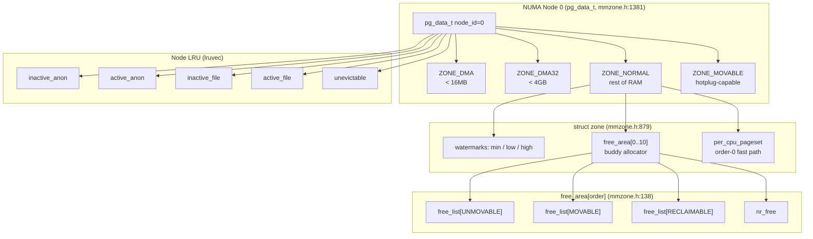
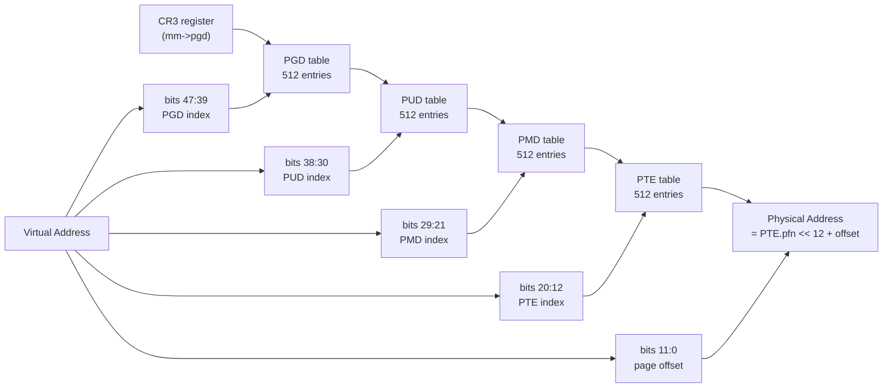
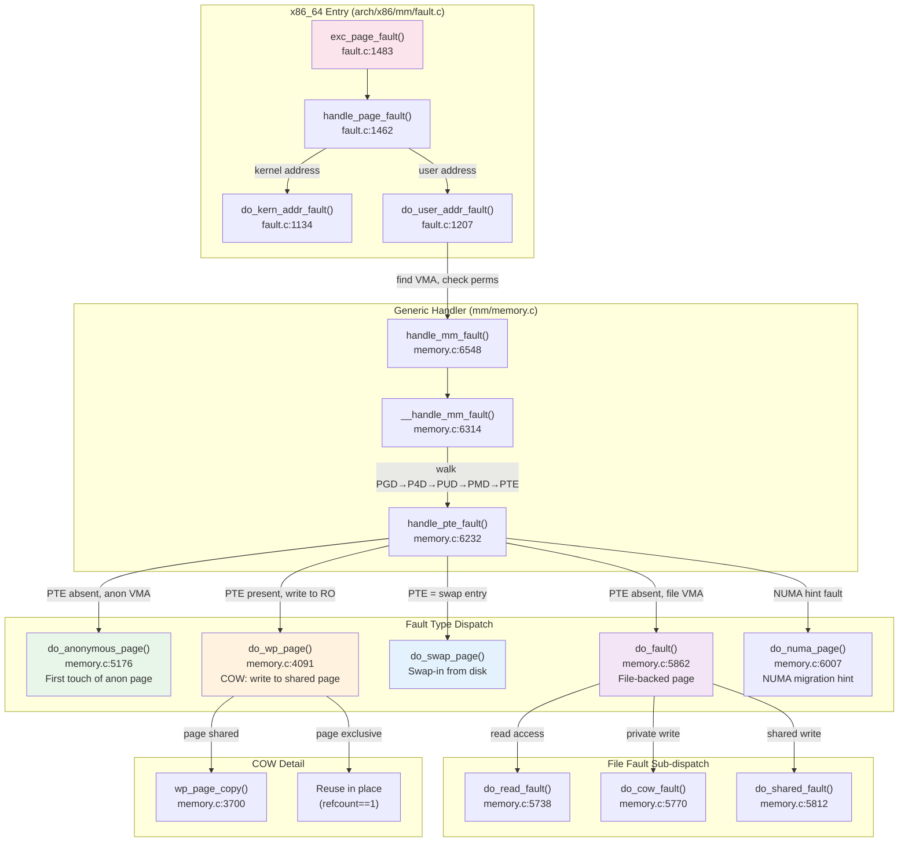
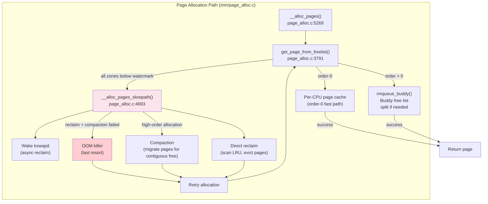
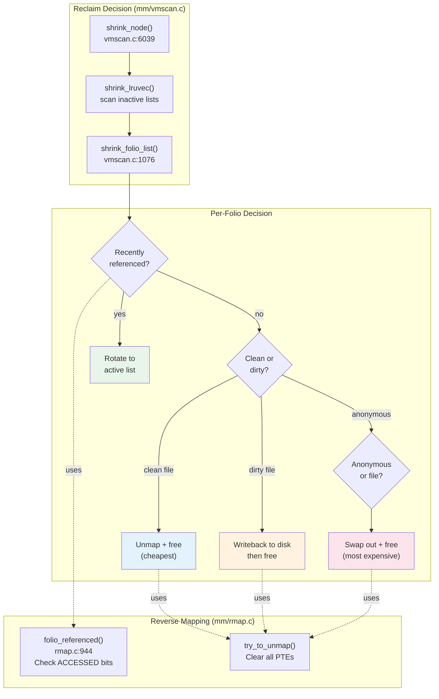
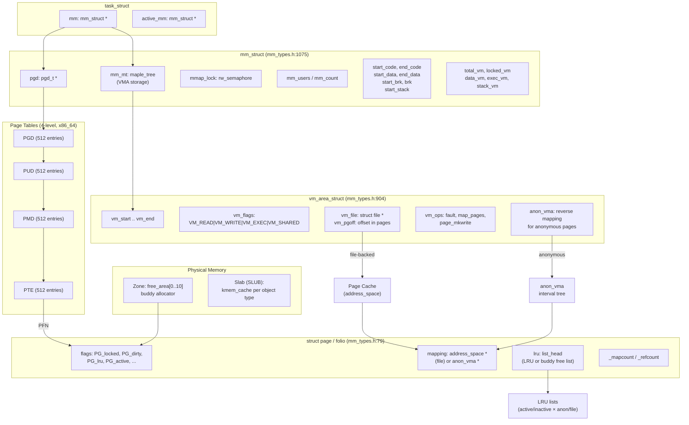

# The Linux 6.19 Memory Management Subsystem — Allocation, Mapping, and Reclaim

> Source base: `/home/inineapa/Lab/linux-6.19`

---

## Before You Begin

In user space, memory management is simple: you call `malloc()`, use the memory, and call `free()`. Behind the scenes, the kernel handles virtual-to-physical translation, demand paging, copy-on-write, swapping, and reclaim. If you have ever wondered why `fork()` is fast even though it "copies" the entire address space, or what actually happens when a process touches memory it has `mmap()`'d but never read, this document provides the answers.

We start with the data structures the kernel uses to track virtual and physical memory, then trace the key operations: `mmap()`, page faults, physical page allocation, and memory reclaim. If you are coming from user-space development, the key shift in perspective is this: `malloc()` does not allocate physical memory — it just reserves virtual addresses. Physical memory is allocated one page at a time, lazily, when the process actually touches each page.

---

## 1. Core Data Structures

The memory management subsystem revolves around three central data structures: `mm_struct` (which describes a process's entire virtual address space), `vm_area_struct` (which describes one contiguous region within that address space), and `struct page` / `struct folio` (which describe physical memory). All three are defined in `include/linux/mm_types.h`. Understanding their fields and relationships is the foundation for understanding everything else in this chapter.

### 1.1 mm_struct — The Process Address Space Descriptor

In user space, you think of your process as having "memory." In the kernel, that memory is described by an `mm_struct` — one per process. It tracks the page table root (the hardware mapping from virtual to physical addresses), all the VMAs (virtual memory areas — the regions you see in `/proc/[pid]/maps`), and accounting data like how much memory is locked, mapped, or used.

Every user-space process has exactly one `mm_struct` (`include/linux/mm_types.h:1075`), pointed to by `task_struct.mm`. Kernel threads have `mm == NULL` and instead borrow an `active_mm` from the previous user process (lazy TLB mode). The `mm_struct` holds everything the kernel needs to manage a process's virtual memory: the page table root, the VMA collection, memory accounting counters, and layout bounds.

The most important fields:

| Field | Type | Purpose |
|-------|------|---------|
| `mm_mt` | `struct maple_tree` | The VMA tree — all virtual memory regions are stored and looked up here. Replaces the older red-black tree. |
| `pgd` | `pgd_t *` | Pointer to the top-level page directory. On x86_64 with 4-level paging, this points to a 4KB-aligned array of 512 PGD entries. Loaded into CR3 during context switch. |
| `mmap_lock` | `struct rw_semaphore` | Protects the VMA tree and related fields. Taken as read for page faults, write for `mmap()`/`munmap()`/`brk()`. One of the most contended locks in the kernel. |
| `mm_users` | `atomic_t` | Number of lightweight users (threads sharing this mm via `CLONE_VM`). When it drops to zero, the address space is torn down. |
| `mm_count` | `atomic_t` | Reference count on the `mm_struct` itself. Includes one reference from `mm_users > 0`, plus any kernel threads borrowing this mm as `active_mm`. When it drops to zero, the struct is freed. |
| `mmap_base` | `unsigned long` | Base address for top-down mmap allocations, randomized by ASLR. |
| `total_vm` | `unsigned long` | Total number of pages mapped in the address space. |
| `locked_vm` | `unsigned long` | Pages locked in memory via `mlock()`. |
| `pinned_vm` | `atomic64_t` | Pages pinned by `pin_user_pages()` (e.g., for DMA). |
| `data_vm` | `unsigned long` | Pages in data mappings (writable, non-executable, non-stack). |
| `exec_vm` | `unsigned long` | Pages in executable mappings. |
| `stack_vm` | `unsigned long` | Pages in stack mappings. |
| `start_code, end_code` | `unsigned long` | Text segment bounds. |
| `start_data, end_data` | `unsigned long` | Data segment bounds. |
| `start_brk, brk` | `unsigned long` | Heap bounds. `start_brk` is the initial end of BSS; `brk` is the current program break, advanced by `brk()`. |
| `start_stack` | `unsigned long` | Bottom of the initial user stack. |
| `arg_start, arg_end` | `unsigned long` | Command-line argument region. |
| `env_start, env_end` | `unsigned long` | Environment variable region. |
| `map_count` | `int` | Number of VMAs. |
| `pgtables_bytes` | `atomic_long_t` | Total size of all page tables. |
| `write_protect_seq` | `seqcount_t` | Sequence counter for COW page table protection (ensures correctness of speculative page-table walks in `userfaultfd`). |
| `context` | `mm_context_t` | Architecture-specific context — on x86_64, this includes the LDT pointer, PCID (Process Context ID for TLB tagging), and LAM (Linear Address Masking) configuration. |

The `mm_struct` has a two-level reference counting scheme. `mm_users` counts the number of `task_struct`s actively using this address space (each thread in a process holds one). When the last user exits, `__mmput()` tears down all VMAs, frees all page tables, and decrements `mm_count`. The `mm_count` field is incremented by kernel threads that borrow the mm as `active_mm` (to avoid TLB flushes). Only when `mm_count` drops to zero is the `mm_struct` itself freed via `mmdrop()`.

### 1.2 vm_area_struct (VMA) — A Contiguous Virtual Region

If you have ever looked at `/proc/self/maps`, each line in that output corresponds to one VMA in the kernel. A VMA is the kernel's way of saying "addresses X through Y belong to this process, with these permissions, backed by this file (or nothing, for anonymous memory)."

A `vm_area_struct` (`include/linux/mm_types.h:904`) represents a single contiguous range of virtual addresses with uniform permissions and backing. When a process calls `mmap()`, one VMA is created. The heap is one VMA. Each shared library's text, data, and BSS segments are separate VMAs. A typical process has tens to hundreds of VMAs.

Key fields:

| Field | Type | Purpose |
|-------|------|---------|
| `vm_start` | `unsigned long` | Start address of the region (inclusive). Page-aligned. |
| `vm_end` | `unsigned long` | End address (exclusive). The region covers `[vm_start, vm_end)`. |
| `vm_mm` | `struct mm_struct *` | Owning address space. |
| `vm_page_prot` | `pgprot_t` | Page-table-level protection bits (derived from `vm_flags`). |
| `vm_flags` | `vm_flags_t` | High-level behavior flags: `VM_READ`, `VM_WRITE`, `VM_EXEC`, `VM_SHARED`, `VM_LOCKED`, `VM_HUGEPAGE`, etc. |
| `vm_ops` | `const struct vm_operations_struct *` | Operation callbacks. For file-backed mappings, `vm_ops->fault` handles page faults by reading from the file. For anonymous mappings, this is NULL. |
| `vm_pgoff` | `unsigned long` | File offset in pages. For `mmap(fd, offset)`, this is `offset >> PAGE_SHIFT`. |
| `vm_file` | `struct file *` | The backing file. NULL for anonymous mappings (heap, stack, `mmap(MAP_ANONYMOUS)`). |
| `anon_vma` | `struct anon_vma *` | Reverse mapping structure for anonymous pages. Enables the kernel to find all page table entries mapping a given anonymous page. |
| `anon_vma_chain` | `struct list_head` | Links this VMA into the `anon_vma` hierarchy. |
| `vm_refcnt` | `refcount_t` | Per-VMA reference count, used for lockless VMA-based page fault handling (`CONFIG_PER_VMA_LOCK`). |

The `vm_flags` field is the primary descriptor of a VMA's behavior. The permission bits are:

```
VM_READ    (bit 0)  — Pages are readable
VM_WRITE   (bit 1)  — Pages are writable
VM_EXEC    (bit 2)  — Pages are executable
VM_SHARED  (bit 3)  — Mapping is shared (writes are visible to other mappers)
```

Corresponding "may" bits (`VM_MAYREAD`, `VM_MAYWRITE`, `VM_MAYEXEC`, `VM_MAYSHARE`) are shifted by 4 and determine what `mprotect()` is allowed to upgrade permissions to. The relationship is hardcoded: `VM_MAYREAD >> 4 == VM_READ` (`include/linux/mm.h:298`).

The `vm_operations_struct` (`include/linux/mm.h:744`) provides hooks:

| Callback | Purpose |
|----------|---------|
| `fault` | Called on page fault to supply a page. For file mappings, reads from disk. |
| `huge_fault` | Same, but for transparent huge pages. |
| `map_pages` | Speculative readahead — map surrounding pages during a fault. |
| `page_mkwrite` | Called when a shared writable page is about to be dirtied. Gives the filesystem a chance to prepare for the write. |
| `open` / `close` | Called when a VMA is duplicated or removed. |

All VMAs in an `mm_struct` are stored in a **maple tree** (`mm->mm_mt`), a B-tree variant optimized for ranges. This replaces the red-black tree used in older kernels. The maple tree provides `O(log N)` lookup, insertion, and removal, and its cache-friendly node layout significantly reduces the number of cache misses during VMA walks compared to the RB-tree.

### 1.3 struct page and struct folio — Physical Memory Descriptors

While `mm_struct` and VMAs describe *virtual* memory, `struct page` describes *physical* memory — the actual RAM chips. Every 4KB frame of physical memory in the system has a corresponding `struct page`, whether that frame is currently in use or sitting free in the buddy allocator's free list.

Every physical page frame in the system has a corresponding `struct page` (`include/linux/mm_types.h:79`). On a system with 64 GB of RAM, there are 16 million `struct page` instances, arranged in a flat array (`mem_map`) or sparse sections. The structure is one of the most space-optimized in the kernel — it uses unions extensively because different page types (anonymous, file-backed, slab, compound) need different metadata.

Key fields:

| Field | Purpose |
|-------|---------|
| `flags` | Atomic page flags (`PG_locked`, `PG_uptodate`, `PG_dirty`, `PG_lru`, `PG_active`, `PG_slab`, `PG_swapbacked`, etc.). Also encodes the zone and node numbers in the upper bits. |
| `lru` | `list_head` linking the page into the LRU (Least Recently Used) list for reclaim, or into the buddy allocator's free list. |
| `mapping` | Points to the `address_space` for file-backed pages, or the `anon_vma` (with the lowest bit set as a tag) for anonymous pages. |
| `index` | Page offset within the mapping (file offset in pages, or swap entry for swapped-out pages). |
| `private` | Filesystem-specific data (e.g., buffer_head pointers for block-based filesystems). |
| `_mapcount` | Number of page table entries mapping this page. -1 means unmapped. Used by reverse mapping. |
| `_refcount` | Reference count. A page with `_refcount == 0` is free. |

The kernel is migrating from `struct page` to `struct folio` (`include/linux/mm_types.h:401`). A folio is a contiguous, power-of-two set of pages — it can be a single 4KB page or a compound page (e.g., a 2MB transparent huge page consisting of 512 pages). The folio abstraction exists because many kernel operations (writeback, reclaim, LRU management) naturally operate on multi-page units, and operating on folios avoids repeatedly checking "is this a tail page?" at every step. The internal fields overlap with `struct page` through unions — a folio is physically the head page of a compound page, with additional large-folio fields (`_large_mapcount`, `_nr_pages_mapped`, `_entire_mapcount`, `_nr_pages`).

### 1.4 Memory Zones and NUMA Nodes

Physical memory is organized into a hierarchy: **nodes** (one per NUMA socket) contain **zones** (regions with different addressing constraints), and each zone is managed by the **buddy allocator**.

The zone types are defined in `enum zone_type` (`include/linux/mmzone.h:784`):

| Zone | Purpose |
|------|---------|
| `ZONE_DMA` | Memory addressable by legacy ISA DMA devices (typically < 16 MB on x86). |
| `ZONE_DMA32` | Memory addressable by 32-bit DMA devices (< 4 GB on x86_64). |
| `ZONE_NORMAL` | Normal addressable memory. On 64-bit systems, this covers all RAM above 4 GB. |
| `ZONE_MOVABLE` | A pseudo-zone containing only movable pages, used for memory hotplug and CMA (Contiguous Memory Allocator). |
| `ZONE_DEVICE` | Device memory (GPU memory, persistent memory). |

Each zone is represented by `struct zone` (`include/linux/mmzone.h:879`), whose critical fields include:

- `_watermark[NR_WMARK]` — Three watermarks (min, low, high) that control when the page allocator triggers kswapd and direct reclaim. When free pages fall below `WMARK_LOW`, kswapd wakes. Below `WMARK_MIN`, allocations stall and perform direct reclaim.
- `free_area[NR_PAGE_ORDERS]` — The buddy allocator's free lists, one `struct free_area` per order (0 through `MAX_PAGE_ORDER`, typically 10, so 4KB to 4MB). Each `free_area` contains separate `free_list` heads for each migration type (`MIGRATE_UNMOVABLE`, `MIGRATE_MOVABLE`, `MIGRATE_RECLAIMABLE`, `MIGRATE_PCPTYPE`, `MIGRATE_HIGHATOMIC`, `MIGRATE_CMA`).
- `per_cpu_pageset` — Per-CPU page caches for fast order-0 allocations without taking the zone lock.

A NUMA node is represented by `struct pglist_data` (typedef'd to `pg_data_t`, `include/linux/mmzone.h:1381`):

- `node_zones[MAX_NR_ZONES]` — The zones in this node.
- `node_zonelists[MAX_ZONELISTS]` — Fallback lists: when the preferred zone is exhausted, the allocator walks the zonelist trying other zones on this node, then remote nodes.
- `kswapd` — The kernel swap daemon task for this node.
- `__lruvec` — The LRU lists for page reclaim on this node.



### 1.5 Page Table Structure on x86_64

Page tables are the bridge between virtual and physical addresses. When your process accesses address `0x7ffd_1234_5678`, the CPU hardware walks a multi-level tree structure to translate that virtual address into a physical page frame number. This walk happens on *every* memory access (though the TLB — Translation Lookaside Buffer — caches recent results so it is usually fast).

x86_64 uses a radix-tree page table with 4 levels (or 5 with LA57/Intel's 5-level paging). Each level indexes 9 bits of the virtual address, and each table is a 4KB page containing 512 entries of 8 bytes each. The levels are defined in `arch/x86/include/asm/pgtable_64_types.h`:

| Level | Struct | Shift | Coverage per entry | Typical use |
|-------|--------|-------|--------------------|-------------|
| PGD (Page Global Directory) | `pgd_t` | 39 (4-level) or 48 (5-level) | 512 GB (4-level) | Top-level; pointed to by `mm->pgd`, loaded into CR3 |
| P4D (Page 4th Directory) | `p4d_t` | 39 | 512 GB | Only meaningful with 5-level paging; identity-mapped with 4-level |
| PUD (Page Upper Directory) | `pud_t` | 30 | 1 GB | Can map 1GB huge pages (`_PAGE_PSE`) |
| PMD (Page Middle Directory) | `pmd_t` | 21 | 2 MB | Can map 2MB huge pages (`_PAGE_PSE`) |
| PTE (Page Table Entry) | `pte_t` | 12 | 4 KB | Maps a single 4KB page frame |

Each entry at every level is a 64-bit value encoding a physical frame number and permission/status bits. The bits relevant to software (`arch/x86/include/asm/pgtable_types.h`):

| Bit | Name | Meaning |
|-----|------|---------|
| 0 | `_PAGE_PRESENT` | Page is present in physical memory. If clear, access triggers a page fault. |
| 1 | `_PAGE_RW` | Page is writable. If clear, writes trigger a fault (used for COW). |
| 2 | `_PAGE_USER` | Page is accessible from user mode (ring 3). If clear, only kernel can access. |
| 5 | `_PAGE_ACCESSED` | Set by hardware on any access. Read by the kernel to track page hotness. |
| 6 | `_PAGE_DIRTY` | Set by hardware on writes. Used to determine which pages need writeback. |
| 7 | `_PAGE_PSE` | Page Size Extension. At PMD level, creates a 2MB mapping; at PUD level, 1GB. |
| 8 | `_PAGE_GLOBAL` | TLB entry survives CR3 reload (used for kernel mappings). |
| 59–62 | `_PAGE_PKEY` | Memory Protection Key bits (4 bits, selecting one of 16 PKRU domains). |
| 63 | `_PAGE_NX` | No-Execute. If set, instruction fetch from this page faults. |

When a PTE is not present (bit 0 clear), the remaining bits encode a **swap entry** — the swap type and offset — so that the kernel can locate the page on disk when it faults back in.

The virtual address decomposition for 4-level paging on x86_64:

```
63       48 47     39 38     30 29     21 20     12 11       0
┌─────────┬─────────┬─────────┬─────────┬─────────┬──────────┐
│  sign   │  PGD    │  PUD    │  PMD    │  PTE    │  offset  │
│ extend  │ index   │ index   │ index   │ index   │ (12 bits)│
│(16 bits)│ (9 bits)│ (9 bits)│ (9 bits)│ (9 bits)│          │
└─────────┴─────────┴─────────┴─────────┴─────────┴──────────┘
```

The top 16 bits must be a sign extension of bit 47, creating a canonical address hole between user space (0x0000_0000_0000_0000 – 0x0000_7FFF_FFFF_FFFF) and kernel space (0xFFFF_8000_0000_0000 – 0xFFFF_FFFF_FFFF_FFFF). This 128 TB + 128 TB split is the basis for the user/kernel address space layout on x86_64.



---

## 2. Process Address Space Layout

When a process is created via `execve()`, the ELF loader (`load_elf_binary()`, `fs/binfmt_elf.c:832`) sets up the virtual address space layout. The final arrangement depends on whether the binary is position-independent (PIE, `ET_DYN`) or fixed-address (`ET_EXEC`), and whether ASLR is enabled.

### 2.1 The Standard Layout

On x86_64 with ASLR, a typical process address space looks like this (addresses are approximate; ASLR randomizes the base of each region):

```
High address (0x7FFF_FFFF_FFFF)
  ┌──────────────────────────────┐
  │         Stack                │  ← grows downward; start_stack randomized
  │         (VM_STACK)           │     RLIMIT_STACK limits growth
  ├──────────────────────────────┤
  │         ↓ guard gap ↓       │  ← unmapped gap above mmap region
  ├──────────────────────────────┤
  │         mmap region          │  ← grows downward from mmap_base
  │   (shared libs, mmap files,  │     mmap_base = TASK_SIZE - gap - random
  │    MAP_ANONYMOUS allocations) │
  ├──────────────────────────────┤
  │         ↕ gap ↕             │
  ├──────────────────────────────┤
  │         Heap                 │  ← grows upward from brk
  │         (brk / sbrk)        │     start_brk = end of BSS + random
  ├──────────────────────────────┤
  │         BSS (.bss)           │  ← zero-initialized data
  ├──────────────────────────────┤
  │         Data (.data)         │  ← initialized data (start_data..end_data)
  ├──────────────────────────────┤
  │         Text (.text)         │  ← executable code (start_code..end_code)
  ├──────────────────────────────┤
  │         ELF headers          │
  └──────────────────────────────┘
Low address (0x0000_0000_0000+random)
```

### 2.2 How `load_elf_binary()` Constructs the Layout

The ELF loader (`fs/binfmt_elf.c:832`) performs the following steps:

1. **Parse ELF headers**: Read the program headers to find `PT_LOAD` segments (text, data), `PT_INTERP` (dynamic linker path), and `PT_GNU_STACK` (stack executability).

2. **Map the interpreter** (if any): The dynamic linker (`ld-linux-x86-64.so`) is loaded first. For PIE binaries (`ET_DYN`), a random `load_bias` is computed by adding `arch_mmap_rnd()` to `ELF_ET_DYN_BASE`, implementing ASLR for the main binary.

3. **Map PT_LOAD segments**: Each loadable segment is mapped via `elf_load()` → `vm_mmap()`, creating VMAs with appropriate permissions. The text segment gets `VM_READ | VM_EXEC`, the data segment gets `VM_READ | VM_WRITE`.

4. **Set up the BSS**: The portion of the data segment that extends beyond the file contents (BSS) is zero-filled.

5. **Set address bounds**: `current->mm->start_code`, `end_code`, `start_data`, `end_data`, `start_brk`, and `brk` are all set. The heap starts immediately after the BSS (`start_brk`), and `brk` is initially equal to `start_brk` (no heap yet).

6. **Set up the stack**: `setup_arg_pages()` creates the stack VMA at the top of the user address space. `randomize_stack_top(STACK_TOP)` applies ASLR. The stack VMA has `VM_STACK` flags and can grow downward automatically.

7. **Set mmap layout**: `arch_pick_mmap_layout()` determines where `mmap()` allocations go. The modern layout places `mmap_base` below the stack and grows mmap regions downward (top-down allocation).

### 2.3 ASLR (Address Space Layout Randomization)

ASLR randomizes three independent regions to prevent exploitation of known addresses:

- **Main binary**: For PIE binaries, the `load_bias` includes a random offset from `arch_mmap_rnd()`. For non-PIE (`ET_EXEC`) binaries, the text segment is at a fixed address — ASLR cannot protect it.
- **Stack**: `randomize_stack_top()` applies a random offset (up to a few MB) to the stack base.
- **mmap base**: The mmap region base includes a random offset, which also randomizes shared library load addresses and heap location (since `malloc()` falls back to `mmap()` for large allocations).

The `PF_RANDOMIZE` flag on the process (cleared by disabling ASLR via `personality(ADDR_NO_RANDOMIZE)` or `/proc/sys/kernel/randomize_va_space = 0`) controls whether randomization is applied.

---

## 3. Virtual Memory Operations

These are the kernel-side implementations of the syscalls you already know: `mmap()`, `munmap()`, `brk()`, `mprotect()`, `madvise()`, and `mlock()`. The key insight for all of them is that they mostly manipulate metadata (VMAs, page table entries, flags) — the actual allocation of physical memory is almost always deferred to the page fault handler (Section 4).

### 3.1 mmap — Creating a Virtual Memory Region

When a process calls `mmap()`, the syscall dispatches to `do_mmap()` (`mm/mmap.c:334`), which is the central function for creating virtual memory mappings. It takes a file descriptor (or NULL for anonymous), an address hint, length, protection flags, map flags, and file offset.

The function proceeds through several stages:

**Stage 1 — Validation and flag computation**: `do_mmap()` validates alignment (length must be page-aligned), computes `vm_flags` from the `prot` and `flags` arguments, and checks resource limits (`RLIMIT_DATA`, `RLIMIT_AS`, `RLIMIT_MEMLOCK`). If `MAP_FIXED` is specified, the kernel must use exactly the requested address, potentially unmapping any existing VMAs in that range. Without `MAP_FIXED`, the kernel searches for a suitable free gap.

**Stage 2 — Address selection**: The kernel finds a free virtual address range large enough to hold the mapping. For top-down layouts, it searches downward from `mmap_base`. The maple tree's gap-finding algorithm (`unmapped_area_topdown()`) efficiently locates the largest available gap.

**Stage 3 — VMA creation** (`mmap_region()`): A new `vm_area_struct` is allocated, its fields are initialized (`vm_start`, `vm_end`, `vm_flags`, `vm_file`, `vm_pgoff`, `vm_ops`), and it is inserted into the maple tree. If the new VMA is adjacent to an existing VMA with compatible flags, `vma_merge()` attempts to coalesce them into a single VMA.

**Crucially, no physical memory is allocated at this point.** The `mmap()` call only creates the VMA — a record that says "addresses X through Y are valid with these permissions and this backing." Physical pages are allocated on demand when the process first accesses the region, triggering a page fault. This is **demand paging**: the kernel defers expensive allocation and disk I/O until the moment the memory is actually needed.

For file-backed mappings, the VMA's `vm_ops` is set to the filesystem's `mmap()` handler (e.g., `ext4_file_mmap()`), which installs a `fault` callback that reads pages from disk. For anonymous mappings (`MAP_ANONYMOUS`), `vm_ops` is NULL and the page fault handler allocates zero-filled pages.

### 3.2 munmap — Removing a Virtual Memory Region

The `munmap()` syscall calls `do_munmap()` (`mm/mmap.c:1060`). Unmapping is more complex than mapping because the target range may partially overlap one or more VMAs, requiring VMA splitting.

1. **Find overlapping VMAs**: Walk the maple tree to locate all VMAs that intersect `[start, start + len)`.
2. **Split boundary VMAs**: If the target range starts in the middle of a VMA, the VMA is split into two. Similarly if it ends in the middle. This creates new VMAs for the surviving portions.
3. **Remove covered VMAs**: VMAs that fall entirely within the range are removed from the maple tree.
4. **Unmap page tables**: `unmap_region()` walks the page tables in the range, clears each PTE, and releases the corresponding physical pages. Dirty file-backed pages are scheduled for writeback.
5. **TLB invalidation**: After clearing the PTEs, the TLB must be flushed to prevent stale translations.

### 3.3 brk — Expanding (or Shrinking) the Heap

The `brk()` syscall (`mm/mmap.c:115`) adjusts the program break — the boundary of the heap region. It is the simplest way to allocate memory, and `malloc()` uses it for small allocations.

The implementation:

1. **Validate bounds**: The new `brk` must not collide with existing mappings (checked via the maple tree) and must not exceed `RLIMIT_DATA`.
2. **Shrink case**: If the new `brk` is below the current `brk`, the kernel unmaps the pages in the range `[new_brk, old_brk)` and shrinks the heap VMA.
3. **Grow case**: If the new `brk` is above the current `brk`, the kernel extends the heap VMA (or creates a new one) via `do_brk_flags()`. As with `mmap()`, no physical memory is allocated — the pages will be demand-faulted when accessed.
4. **Update `mm->brk`**: The new program break is recorded.

### 3.4 mprotect — Changing Permissions

The `mprotect()` syscall changes the permission bits (`VM_READ`, `VM_WRITE`, `VM_EXEC`) on an existing VMA range. If the target range spans multiple VMAs or partially overlaps VMAs, splitting and merging occurs. After updating `vm_flags`, the kernel walks the page tables and updates the hardware protection bits on each PTE. This requires a TLB flush.

A common use of `mprotect()` is implementing guard pages (unmapped regions at the edges of the stack to detect overflow) and W^X (write XOR execute) enforcement.

### 3.5 madvise — Hinting to the Kernel

The `madvise()` syscall (`mm/madvise.c:2037`) provides non-binding hints about how a process intends to use a memory region. Key behaviors:

| Advice | Effect |
|--------|--------|
| `MADV_DONTNEED` | Immediately discard the pages in the range. Next access will zero-fault for anonymous pages, or re-read from file. |
| `MADV_FREE` | Mark anonymous pages as lazy-free — they can be reclaimed if memory pressure occurs, but are kept if not. |
| `MADV_WILLNEED` | Initiate readahead — start bringing pages into the page cache before they're accessed. |
| `MADV_SEQUENTIAL` | Set `VM_SEQ_READ` — readahead is aggressive and already-read pages can be freed quickly. |
| `MADV_HUGEPAGE` | Set `VM_HUGEPAGE` — request transparent huge pages for this region. |
| `MADV_NOHUGEPAGE` | Set `VM_NOHUGEPAGE` — disable THP. |

### 3.6 mlock — Pinning Pages in Physical Memory

The `mlock()` syscall (`mm/mlock.c:659`) sets `VM_LOCKED` on the specified range and immediately faults in all pages, preventing them from being swapped out. The `mlock2()` variant supports `MLOCK_ONFAULT`, which sets `VM_LOCKONFAULT` — pages are only locked once they're faulted in.

`mlockall(MCL_CURRENT | MCL_FUTURE)` locks all current and future mappings, commonly used by real-time applications to avoid page fault latency.

---

## 4. Page Fault Handling

Page faults are where the real work of memory management happens. When you call `mmap()`, no physical memory is allocated — the kernel just creates a VMA. When you call `malloc()` and the C library extends the heap with `brk()`, still no physical memory. It is only when your process actually *touches* a virtual address that the CPU raises a page fault, and the kernel allocates a physical page, fills it with the right data (zeros, file contents, swap data), and wires it into the page tables.

A page fault is the mechanism by which the kernel implements demand paging, copy-on-write, swapping, and memory-mapped file I/O. When the CPU accesses a virtual address whose PTE is not present (or violates permissions), it raises a page fault exception. On x86_64, the handler is `exc_page_fault()` (`arch/x86/mm/fault.c:1483`).

### 4.1 The Fault Path Overview

The page fault entry point reads CR2 (the faulting address) and the error code (which encodes whether the fault was a read/write, user/kernel, and whether the page was present). The path then branches:

1. **Kernel-mode faults** (`do_kern_addr_fault()`, `fault.c:1134`): If the fault occurred while executing kernel code (and is not a `copy_from_user()` or similar), the kernel checks the exception fixup table. If no fixup exists, the kernel panics with an oops.

2. **User-mode faults** (`do_user_addr_fault()`, `fault.c:1207`): This is the main path. The function acquires `mmap_lock` (as read, or via the per-VMA lock in `CONFIG_PER_VMA_LOCK`), finds the VMA containing the faulting address, checks that the access type (read/write/exec) matches the VMA permissions, and calls `handle_mm_fault()`.

`handle_mm_fault()` (`mm/memory.c:6548`) is the architecture-independent fault handler. It calls `__handle_mm_fault()` (`mm/memory.c:6314`), which walks the page table levels from PGD down to PTE, allocating intermediate page table pages as needed. If it encounters a transparent huge page at the PMD level, it handles the fault at that level. Otherwise, it descends to the PTE level and calls `handle_pte_fault()` (`mm/memory.c:6232`).

### 4.2 Types of Page Faults

`handle_pte_fault()` dispatches to one of several handlers depending on the nature of the fault:

#### Anonymous Page Fault (First Access)

When a process first touches a page in an anonymous mapping (heap, stack, `MAP_ANONYMOUS`), the PTE does not exist. `do_anonymous_page()` (`mm/memory.c:5176`) handles this:

1. Allocate a zero-filled page (or folio) via `folio_prealloc()`.
2. Set up the reverse mapping (`folio_add_new_anon_rmap()`).
3. Add the page to the LRU list (`folio_add_lru_vma()`).
4. Create a PTE mapping the physical page to the faulting virtual address.

For read faults, the kernel may map the **zero page** — a single, shared, read-only page of zeros. This avoids allocating a real page until the process writes to it.

#### Copy-on-Write (COW) Fault

When a process writes to a page that is mapped read-only but the VMA allows writing (`VM_WRITE`), this is a COW fault — the page is shared between parent and child after `fork()`. `do_wp_page()` (`mm/memory.c:4091`) handles this:

1. Check the page's reference count. If the page is exclusively owned (refcount == 1), it can be reused in place — just make the PTE writable.
2. If the page is shared, call `wp_page_copy()` (`mm/memory.c:3700`):
   a. Allocate a new page.
   b. Copy the contents from the old page to the new page.
   c. Replace the PTE to point to the new page with write permission.
   d. Drop the reference to the old page.

This is how `fork()` achieves its efficient copy-on-write semantics: `copy_page_range()` (`mm/memory.c:1491`) marks all writable PTEs as read-only during fork (in `copy_pte_range()`, `mm/memory.c:1208`), and the actual page duplication is deferred until a write occurs.

#### Swap Fault

When a page was swapped out to disk, the PTE contains a **swap entry** (present bit clear, swap type and offset in the remaining bits). `do_swap_page()` reads the swap entry, looks up the page in the swap cache, or reads it from the swap device, allocates a page frame, fills it with the swapped data, and re-establishes the PTE mapping.

#### File-Backed Fault

When a process accesses a file-mapped page that is not yet in the page cache, `do_fault()` (`mm/memory.c:5862`) handles it. This dispatches to:

- `do_read_fault()` (`mm/memory.c:5738`): Calls `vma->vm_ops->fault()` to read the page from the filesystem into the page cache, then creates a read-only PTE.
- `do_cow_fault()` (`mm/memory.c:5770`): For private file mappings that are being written. Reads the page from disk, then makes a private copy (COW).
- `do_shared_fault()` (`mm/memory.c:5812`): For shared writable mappings. Reads from disk, creates a writable mapping, and calls `vma->vm_ops->page_mkwrite()` to notify the filesystem that the page is about to be dirtied.

#### NUMA Fault

If `CONFIG_NUMA_BALANCING` is enabled, the kernel periodically clears the present bit on pages and marks them with a special NUMA hint bit. When the process accesses the page, `do_numa_page()` (`mm/memory.c:6007`) fires and checks whether the page should be migrated closer to the CPU that is accessing it.

### 4.3 Page Fault Flowchart



---

## 5. Physical Memory Allocation

In user space, `malloc()` is your allocator. In the kernel, there are two layers: the **buddy allocator** hands out whole pages (4KB, 8KB, 16KB, ..., up to 4MB), and the **slab allocator** (SLUB) subdivides those pages into smaller fixed-size objects (like a 192-byte `struct dentry` or a 640-byte `struct inode`). When you call `kmalloc(128, GFP_KERNEL)` in kernel code, it goes through SLUB; when the kernel needs a full page for a page table or a user-space mapping, it goes through the buddy allocator.

### 5.1 The Buddy Allocator

The buddy allocator is the kernel's primary mechanism for managing physical page frames. It maintains free lists organized by **order** — an order-N allocation provides 2^N contiguous pages (order 0 = 4KB, order 1 = 8KB, ..., order 10 = 4MB). The allocator lives in `mm/page_alloc.c`.

The entry point is `__alloc_pages()` (`mm/page_alloc.c:5269`):

```c
struct page *__alloc_pages_noprof(gfp_t gfp, unsigned int order,
                                  int preferred_nid, nodemask_t *nodemask)
```

The `gfp_t` (Get Free Pages flags) argument encodes constraints and behaviors:

| Flag | Meaning |
|------|---------|
| `__GFP_HIGHMEM` | Can allocate from ZONE_HIGHMEM. |
| `__GFP_DMA` / `__GFP_DMA32` | Must allocate from ZONE_DMA / ZONE_DMA32. |
| `__GFP_MOVABLE` | Pages can be migrated (for compaction). |
| `__GFP_RECLAIM` | May perform direct reclaim if memory is low. |
| `__GFP_IO` | May initiate disk I/O during reclaim. |
| `__GFP_FS` | May call into the filesystem during reclaim. |
| `__GFP_NOWARN` | Suppress allocation failure warnings. |
| `__GFP_RETRY_MAYFAIL` | Try hard but may ultimately fail. |
| `__GFP_NOFAIL` | Never fail — keep retrying (dangerous, used for critical allocations). |
| `GFP_KERNEL` | `__GFP_RECLAIM | __GFP_IO | __GFP_FS` — standard kernel allocation. |
| `GFP_ATOMIC` | No sleeping. Used in interrupt context. |
| `GFP_USER` | `GFP_KERNEL + __GFP_HARDWALL` — for user-space allocations. |

#### Fast Path

1. **Check per-CPU page cache (PCP)**: For order-0 allocations, each zone maintains a per-CPU page list. Allocating from PCP avoids taking the zone lock entirely — just pop a page from the local list. This is the fastest path.

2. **`get_page_from_freelist()`** (`mm/page_alloc.c:3791`): Walk the node's zonelist (preferred zone first, then fallback zones on the same node, then remote nodes). For each zone, check whether free pages are above the watermark. If so, call `rmqueue()` to take a block from the buddy free list.

The buddy split/merge logic: when the allocator needs an order-N block but only order-M (M > N) is available, it splits the larger block recursively. The unused halves ("buddies") are placed on the free lists of the appropriate lower orders. When a block is freed, the allocator checks whether its buddy is also free; if so, they are merged into a larger block, and the process repeats up to `MAX_PAGE_ORDER`.

```
Example: Allocate order-0 (4KB) from order-3 (32KB) block:

  Order-3: [████████████████████████████████]  32KB
            split →
  Order-2: [████████████████]  [────────────────]  buddy → free_area[2]
            split →
  Order-1: [████████]  [────────]  buddy → free_area[1]
            split →
  Order-0: [████]  [────]  buddy → free_area[0]
            ↑
         Returned to caller
```

#### Slow Path

When `get_page_from_freelist()` fails (all zones are below watermarks), the allocator enters the slow path (`__alloc_pages_slowpath()`, `mm/page_alloc.c:4693`):

1. **Wake kswapd**: The per-node kswapd daemon is woken to start asynchronous reclaim.
2. **Direct reclaim**: The allocating task itself scans the LRU lists and evicts pages. This may involve writing dirty pages to disk (blocking I/O).
3. **Compaction**: If the allocation is for a high order (e.g., order-9 for THP), the kernel runs memory compaction (`compact_zone()`, `mm/compaction.c:2511`) to create contiguous free regions by migrating movable pages.
4. **OOM killer**: If reclaim and compaction fail, and the allocation has `__GFP_RECLAIM`, the OOM killer (`out_of_memory()`, `mm/oom_kill.c:1119`) selects and kills a process to free memory (see Section 7).
5. **Retry**: After reclaim/compaction/OOM, the allocator retries the allocation.



### 5.2 The Slab Allocator (SLUB)

The buddy allocator deals in whole pages (minimum 4KB). Many kernel objects are much smaller — a `struct inode` is hundreds of bytes, a `struct dentry` a few hundred. Allocating a full page for each would waste enormous amounts of memory. The **slab allocator** subdivides pages into fixed-size objects.

Linux 6.19 uses the SLUB allocator (`mm/slub.c`), the default since kernel 2.6.23. The core abstraction is `struct kmem_cache` (`mm/slab.h:220`) — a cache of identically-sized objects:

| Field | Purpose |
|-------|---------|
| `size` | Object size in bytes (including metadata and alignment). |
| `object_size` | Actual usable object size. |
| `offset` | Offset to the free pointer within a free object. |
| `oo` | Optimal order + objects per slab. |
| `cpu_slab` | Per-CPU pointer to the current active slab (fast path). |
| `node` | Per-NUMA-node slab lists (partial slabs, full slabs). |

The allocation fast path is extremely efficient:

1. **Per-CPU slab**: Each CPU has a pointer to the current "active" slab page and a freelist pointer. `kmem_cache_alloc()` simply follows the freelist pointer, advances it, and returns the object. No locks, no atomic operations — just a load and a store. This is the common case.

2. **Per-CPU slab exhausted**: If the per-CPU slab has no free objects, the allocator looks for a partial slab (a slab with some free objects) on the per-node list. If found, it becomes the new per-CPU slab.

3. **No partial slabs**: Allocate a new page from the buddy allocator, format it as a slab (divide it into objects, set up the freelist), and use it as the new per-CPU slab.

The `kmalloc()` family allocates from generic power-of-two caches (8, 16, 32, 64, ..., up to `KMALLOC_MAX_SIZE`). Named caches (e.g., `kmem_cache_create("ext4_inode_cache", ...)`) are used for frequently allocated structures.

`kfree()` returns the object to the slab's freelist. If all objects in a slab are free, the slab page is returned to the buddy allocator.

---

## 6. Memory Reclaim

You might wonder: if the kernel allocates pages on every page fault and every `kmalloc()`, what happens when physical memory fills up? The answer is **reclaim** — the kernel finds pages that are not actively needed and evicts them. Clean file-backed pages (like cached file data) are simply discarded (they can be re-read from disk). Dirty file-backed pages are written back first. Anonymous pages (heap, stack) are written to swap. This is the mechanism behind the "Linux uses all my RAM" phenomenon — the kernel fills RAM with useful page cache data and reclaims it only when needed.

When the system runs low on memory, the kernel must reclaim pages — evict data from RAM to make room for new allocations. Reclaim is governed by the LRU (Least Recently Used) lists and managed by both the asynchronous kswapd daemon and synchronous direct reclaim.

### 6.1 LRU Lists

Each NUMA node maintains five LRU lists (via `struct lruvec`):

| List | Contents |
|------|----------|
| `active_anon` | Anonymous pages (heap, stack) that have been recently accessed. |
| `inactive_anon` | Anonymous pages that have not been recently accessed — candidates for swap-out. |
| `active_file` | File-backed pages (page cache) that have been recently accessed. |
| `inactive_file` | File-backed pages not recently accessed — candidates for eviction. |
| `unevictable` | Pages that cannot be evicted (`mlock()`'d pages, `ramfs` pages, etc.). |

Pages are promoted from inactive to active when accessed (the `PG_referenced` and `PG_active` flags track this). The kernel periodically scans the active list and demotes cold pages to the inactive list.

### 6.2 The Reclaim Path

Reclaim is driven by `shrink_node()` (`mm/vmscan.c:6039`), which orchestrates scanning and eviction for a single NUMA node:

1. **Calculate scan pressure**: Based on the priority (0–12, lower = more aggressive), determine how many pages to scan from each LRU list. Higher priority means scanning a smaller fraction of the lists.

2. **Shrink LRU lists**: `shrink_lruvec()` scans the inactive lists. For each batch of isolated pages, `shrink_folio_list()` (`mm/vmscan.c:1076`) makes the eviction decision for each folio:
   - **Clean file page**: If the page is in the page cache and not dirty, simply remove the page-table mapping (`try_to_unmap()`), remove from the page cache, and free it.
   - **Dirty file page**: Write the page back to disk (`pageout()`), then free it.
   - **Anonymous page**: Write the page to swap space (`pageout()` to a swap file/partition), record the swap entry in the PTE, then free the page.
   - **Referenced page**: If the page was recently accessed (the hardware `ACCESSED` bit was set), give it a second chance — rotate it back to the active list instead of evicting.

3. **Shrink slab caches**: `shrink_slab()` calls into slab shrinkers (e.g., the dentry cache, inode cache, filesystem internal caches) to reclaim memory held by kernel data structures.

### 6.3 kswapd — The Background Reclaim Daemon

Each NUMA node has a kswapd kernel thread (`kswapd`, created at boot). It sleeps until the free page count in a zone falls below `WMARK_LOW`, at which point it wakes up and reclaims pages until the count reaches `WMARK_HIGH`. This background reclaim prevents most allocations from needing to perform direct reclaim (which would stall the allocating task).

kswapd's main loop:
1. Sleep until woken by an allocation that hit a low watermark.
2. Call `balance_pgdat()` → `shrink_node()` for each node zone that needs reclaim.
3. Sleep again when watermarks are restored.

### 6.4 Direct Reclaim

When kswapd cannot keep up and an allocation request finds that all zones are below `WMARK_MIN`, the allocating task must perform **direct reclaim** — it runs the same `shrink_node()` path synchronously. This is blocking: the task may sleep waiting for dirty page writeback or swap I/O. The `__GFP_DIRECT_RECLAIM` flag (part of `GFP_KERNEL`) enables this behavior; `GFP_ATOMIC` allocations skip direct reclaim and either succeed from available free memory or fail immediately.

### 6.5 Reverse Mapping (rmap) — Finding All Mappings of a Page

Before a page can be evicted, the kernel must remove all page table entries that reference it. **Reverse mapping** enables this: given a physical page, find every PTE that maps it.

For anonymous pages, the `anon_vma` structure (`include/linux/rmap.h:32`) provides the mapping. Each `anon_vma` maintains an interval tree of `anon_vma_chain` entries, linking to VMAs that contain pages in the `anon_vma`. The reverse mapping walk (`rmap_walk()`) iterates over these VMAs and, for each one, computes the virtual address from the page's `index` and walks that VMA's page tables to find the PTE.

For file-backed pages, the `address_space->i_mmap` interval tree stores all VMAs that map the file. The reverse mapping walk iterates over these and similarly locates PTEs.

`folio_referenced()` (`mm/rmap.c:944`) uses reverse mapping to check whether any PTE referencing a folio has the hardware `ACCESSED` bit set — this determines whether the page was recently used and should be kept in memory.

`try_to_unmap()` uses reverse mapping to clear all PTEs pointing to a folio, making it eligible for eviction.



---

## 7. The OOM Killer

If you have ever seen `dmesg` output that says "Out of memory: Killed process 1234 (myapp)" — this is the OOM killer. It is the kernel's last resort when both reclaim and compaction fail to free enough memory: pick a process, kill it, and take its memory. It is crude but necessary to keep the system alive.

When reclaim fails to free enough memory and the system is critically low, the Out-Of-Memory killer intervenes. The entry point is `out_of_memory()` (`mm/oom_kill.c:1119`).

### 7.1 Scoring: `oom_badness()`

The OOM killer selects a victim using `oom_badness()` (`mm/oom_kill.c:202`). The scoring heuristic:

1. **Base score**: The task's RSS (Resident Set Size) + swap usage + page table size, measured in pages. This is the amount of memory that killing the task would (approximately) free.
2. **`oom_score_adj` adjustment**: Each task has an `oom_score_adj` value (-1000 to +1000), settable via `/proc/[pid]/oom_score_adj`. A value of -1000 makes the task unkillable (e.g., PID 1). A value of +1000 makes it a priority victim. The adjustment is applied as a fraction of the system's total memory.
3. **The highest score wins (loses)**: The task with the highest `oom_badness()` score is selected for killing.

### 7.2 The Kill

`oom_kill_process()` (`mm/oom_kill.c:1024`) sends `SIGKILL` to the selected victim and all processes sharing its `mm_struct` (since killing just one thread of a multi-threaded process would not release the shared address space). The OOM killer also sets `TIF_MEMDIE` on the victim, which grants it preferential access to memory reserves during its death — the dying process needs some memory to complete `do_exit()` and free its resources.

### 7.3 Avoiding the OOM Killer

Several mechanisms exist to avoid or control OOM:
- **Overcommit policy** (`/proc/sys/vm/overcommit_memory`): Mode 0 (heuristic, default), mode 1 (always permit), mode 2 (strict, never overcommit). Strict mode prevents more virtual memory from being committed than physical RAM + swap, making OOM less likely but also making `malloc()` fail more often.
- **`oom_score_adj`**: Set to -1000 for critical daemons (init, database).
- **Memory cgroups**: When cgroups are used, OOM killing is scoped to the cgroup — only tasks in the group over limit are candidates.

---

## 8. Memory Compaction

Over time, the buddy allocator's free pages become fragmented — plenty of order-0 pages may be free, but no contiguous order-9 (2MB) blocks exist for transparent huge pages. **Memory compaction** (`mm/compaction.c`) defragments physical memory by migrating pages.

### 8.1 How Compaction Works

`compact_zone()` (`mm/compaction.c:2511`) runs two scanners moving toward each other:

1. **Migration scanner** (starts from the bottom of the zone): Scans upward looking for **movable pages** — pages whose `PG_movable` flag is set or that are on the LRU and can be migrated. Anonymous and file-backed pages are movable; kernel slab pages and page tables typically are not.

2. **Free scanner** (starts from the top of the zone): Scans downward looking for free pages to use as migration targets.

When the scanners meet in the middle, compaction is complete. The pages identified by the migration scanner are physically copied to the free locations, their page tables are updated (via reverse mapping), and the original locations become free — potentially forming the contiguous blocks needed for high-order allocations.

### 8.2 When Compaction Runs

- **On-demand**: When `__alloc_pages_slowpath()` needs a high-order allocation and direct reclaim alone isn't sufficient.
- **kcompactd**: A per-node kernel thread (similar to kswapd) that performs background compaction when fragmentation is detected.
- **`/proc/sys/vm/compact_memory`**: Writing to this file triggers manual compaction.

---

## 9. Transparent Huge Pages (THP)

Standard 4KB pages require one PTE per page and one TLB entry per page. For large memory regions, TLB misses become a significant performance bottleneck. **Transparent Huge Pages** (THP, `mm/huge_memory.c`) use 2MB PMD-level mappings to cover 512 pages with a single TLB entry, reducing TLB miss rates dramatically.

### 9.1 Anonymous THP Allocation

When a page fault occurs on an anonymous VMA that is eligible for THP (VMA has `VM_HUGEPAGE` or the system-wide THP policy is "always"), `__handle_mm_fault()` attempts to allocate a 2MB huge page at the PMD level. `__do_huge_pmd_anonymous_page()` (`mm/huge_memory.c:1320`):

1. Allocate a 2MB folio via `vma_alloc_anon_folio_pmd()`.
2. Pre-allocate a PTE page table for future use (in case the huge page must be split later).
3. Lock the PMD entry and verify it hasn't been populated concurrently.
4. Deposit the pre-allocated PTE table (`pgtable_trans_huge_deposit()`).
5. Set the PMD entry to map the huge page (with `_PAGE_PSE`).

If the 2MB allocation fails (due to fragmentation), the fault falls back to a regular 4KB page allocation.

### 9.2 Splitting Huge Pages

THP must be split when:
- A `munmap()` or `mprotect()` affects a partial region within a huge page.
- The page needs to be swapped out (swap currently operates at page granularity for huge pages on some paths).
- COW occurs on a portion of a shared huge page.

Splitting replaces the single PMD entry with a full PTE table of 512 entries, each pointing to one of the 512 constituent 4KB pages. The `__folio_split()` function in `mm/huge_memory.c` handles this.

### 9.3 khugepaged

The `khugepaged` kernel thread (`mm/khugepaged.c`) performs the reverse operation: it scans for regions where 512 contiguous 4KB pages could be collapsed into a single 2MB huge page. This allows THP to benefit workloads that initially allocate memory in small pieces.

---

## 10. Copy-on-Write in Detail

This is one of the most elegant tricks in the kernel. When you call `fork()`, the child gets a "copy" of the parent's entire address space. But actually copying gigabytes of memory would be absurdly slow. Instead, the kernel shares the physical pages between parent and child, marks them read-only, and only copies a page when one side writes to it. Most pages (code, read-only data, shared libraries) are never written and therefore never copied. This is why `fork()` is fast.

Copy-on-write (COW) is the mechanism that makes `fork()` efficient. Instead of duplicating the entire address space, the kernel shares physical pages between parent and child and marks them read-only. Only when one process writes does the actual copy occur.

### 10.1 The Fork Path: `copy_page_range()`

During `fork()`, `dup_mmap()` (`kernel/fork.c:1718`) duplicates every VMA. For each VMA, `copy_page_range()` (`mm/memory.c:1491`) walks the parent's page tables and copies the entries into the child's page tables.

The key operation happens in `copy_pte_range()` (`mm/memory.c:1208`): for each present PTE that maps a writable page in a private mapping, the function:

1. **Clears the write bit** on both the parent's and child's PTE (making the page read-only).
2. **Increments the page's reference count** (both PTEs now reference the same physical page).

After fork, both parent and child see the same data, but neither can write without triggering a COW fault. The `mm->write_protect_seq` sequence counter ensures that concurrent page table walkers see a consistent view during this mass write-protection.

### 10.2 The Write Path: `wp_page_copy()`

When either process writes, the CPU raises a page fault (write to read-only page). `do_wp_page()` (`mm/memory.c:4091`) handles it:

1. If the page's `_mapcount` indicates it is exclusively owned (only one PTE maps it — the other process has already COW'd or exited), then the PTE can be made writable in place. No copy needed.
2. Otherwise, `wp_page_copy()` (`mm/memory.c:3700`):
   a. Allocates a new page via `folio_prealloc()`.
   b. Copies the 4KB page contents using `__wp_page_copy_user()`.
   c. Sets up reverse mapping for the new page.
   d. Replaces the faulting PTE to point to the new page with write permission.
   e. Decrements the reference count on the old (shared) page.

This design means that pages which are never written after `fork()` (e.g., the text segment, shared libraries) are never copied — they remain shared indefinitely, saving both memory and time.

---

## 11. The mm_struct Lifecycle

### 11.1 Creation

An `mm_struct` is created in two contexts:

- **`mm_alloc()`** (`kernel/fork.c:1152`): Allocates a fresh `mm_struct` for `execve()`. Called during `exec_binprm()` when a process replaces its address space with a new binary.
- **`dup_mm()`** (`kernel/fork.c:1504`): Duplicates an existing `mm_struct` for `fork()`. Copies the structure, allocates a new PGD, and calls `dup_mmap()` to duplicate all VMAs (which in turn calls `copy_page_range()` for COW).

`mm_init()` initializes the fields: allocates the PGD (`mm_alloc_pgd()`), initializes the maple tree, sets up the `mmap_lock`, zeroes memory accounting counters, and initializes the architecture-specific context.

### 11.2 Destruction

When the last thread using an `mm_struct` exits, `mmput()` (`kernel/fork.c:1191`) decrements `mm_users`. When it reaches zero, `__mmput()` tears down the address space:

1. `uprobe_clear_state(mm)` — Clean up uprobes.
2. `exit_aio(mm)` — Close AIO contexts.
3. `ksm_exit(mm)` — KSM (Kernel Same-page Merging) cleanup.
4. `khugepaged_exit(mm)` — Remove from khugepaged's scan list.
5. **`exit_mmap(mm)`** (`mm/mmap.c:1251`) — The main teardown:
   a. `mmu_notifier_release(mm)` — Notify any registered listeners (e.g., KVM).
   b. `arch_exit_mmap(mm)` — Architecture cleanup.
   c. `unmap_vmas()` — Walk all VMAs and clear all PTEs, freeing the mapped pages.
   d. `free_pgtables()` — Free the page table pages themselves.
   e. Remove all VMAs from the maple tree.
   f. `__mt_destroy()` — Destroy the maple tree.
6. `set_mm_exe_file(mm, NULL)` — Drop reference to the executable file.
7. `mmdrop(mm)` — Decrement `mm_count`. If it reaches zero, free the `mm_struct` itself.

---

## 12. Integrated Address Space Diagram

The following diagram brings together the major data structures and their relationships:



---

## 13. Function Quick Reference

| Function | File:Line | Role |
|----------|-----------|------|
| `do_mmap()` | `mm/mmap.c:334` | Main mmap() implementation |
| `mmap_region()` | `mm/mmap.c:558` | VMA creation and insertion |
| `do_munmap()` | `mm/mmap.c:1060` | Unmap a virtual address range |
| `SYSCALL_DEFINE1(brk)` | `mm/mmap.c:115` | brk() syscall — heap management |
| `exit_mmap()` | `mm/mmap.c:1251` | Tear down entire address space |
| `exc_page_fault()` | `arch/x86/mm/fault.c:1483` | x86_64 page fault entry point |
| `do_user_addr_fault()` | `arch/x86/mm/fault.c:1207` | User-space fault handler |
| `handle_mm_fault()` | `mm/memory.c:6548` | Architecture-independent fault handler |
| `__handle_mm_fault()` | `mm/memory.c:6314` | Page table walk and dispatch |
| `handle_pte_fault()` | `mm/memory.c:6232` | PTE-level fault dispatch |
| `do_anonymous_page()` | `mm/memory.c:5176` | Anonymous first-touch fault |
| `do_wp_page()` | `mm/memory.c:4091` | COW write-protection fault |
| `wp_page_copy()` | `mm/memory.c:3700` | COW page copy implementation |
| `do_fault()` | `mm/memory.c:5862` | File-backed fault dispatch |
| `do_read_fault()` | `mm/memory.c:5738` | Read fault on file mapping |
| `do_cow_fault()` | `mm/memory.c:5770` | COW fault on private file mapping |
| `do_shared_fault()` | `mm/memory.c:5812` | Write fault on shared file mapping |
| `do_numa_page()` | `mm/memory.c:6007` | NUMA migration hint fault |
| `copy_page_range()` | `mm/memory.c:1491` | Duplicate page tables for fork (COW) |
| `copy_pte_range()` | `mm/memory.c:1208` | PTE-level COW setup |
| `__alloc_pages()` | `mm/page_alloc.c:5269` | Buddy allocator entry point |
| `get_page_from_freelist()` | `mm/page_alloc.c:3791` | Fast-path page allocation |
| `__alloc_pages_slowpath()` | `mm/page_alloc.c:4693` | Slow-path: reclaim, compact, OOM |
| `shrink_node()` | `mm/vmscan.c:6039` | Per-node memory reclaim orchestration |
| `shrink_folio_list()` | `mm/vmscan.c:1076` | Per-folio eviction decision |
| `folio_referenced()` | `mm/rmap.c:944` | Check if a folio was recently accessed |
| `out_of_memory()` | `mm/oom_kill.c:1119` | OOM killer entry point |
| `oom_badness()` | `mm/oom_kill.c:202` | OOM victim scoring |
| `oom_kill_process()` | `mm/oom_kill.c:1024` | Kill the selected OOM victim |
| `compact_zone()` | `mm/compaction.c:2511` | Zone compaction (defragmentation) |
| `load_elf_binary()` | `fs/binfmt_elf.c:832` | ELF binary loader — sets up address space |
| `mm_alloc()` | `kernel/fork.c:1152` | Allocate a new mm_struct |
| `dup_mm()` | `kernel/fork.c:1504` | Duplicate mm_struct for fork |
| `mmput()` | `kernel/fork.c:1191` | Release mm_struct reference |
| `__mmput()` | `kernel/fork.c:1165` | Tear down address space when last user exits |

---

## 14. Observing Memory Management with trace-cmd (ftrace)

The kernel embeds tracepoints throughout the memory management subsystem. These allow an observer to watch page allocation, reclaim, compaction, and fault handling in real time.

### 14.1 Tracepoint Map

| Tracepoint | Source location | Fires when | Exported fields |
|------------|----------------|------------|-----------------|
| `kmem:mm_page_alloc` | `mm/page_alloc.c:5262` | A page is allocated from the buddy allocator | `pfn`, `order`, `gfp_flags`, `migratetype` |
| `kmem:mm_page_free` | `mm/page_alloc.c:1354` | A page is returned to the buddy allocator | `pfn`, `order` |
| `kmem:kmalloc` | `mm/slub.c` | A `kmalloc()` allocation completes | `call_site`, `ptr`, `bytes_req`, `bytes_alloc`, `gfp_flags` |
| `kmem:kfree` | `mm/slub.c` | A `kfree()` call completes | `call_site`, `ptr` |
| `kmem:kmem_cache_alloc` | `mm/slub.c` | A `kmem_cache_alloc()` call completes | `call_site`, `ptr`, `bytes_req`, `bytes_alloc`, `gfp_flags` |
| `kmem:kmem_cache_free` | `mm/slub.c` | A `kmem_cache_free()` call completes | `call_site`, `ptr` |
| `vmscan:mm_vmscan_kswapd_wake` | `mm/vmscan.c` | kswapd wakes up to start reclaim | `nid`, `zid`, `order` |
| `vmscan:mm_vmscan_kswapd_sleep` | `mm/vmscan.c` | kswapd goes back to sleep | `nid` |
| `vmscan:mm_vmscan_lru_shrink_inactive` | `mm/vmscan.c:2069` | Inactive LRU list scan completes | `nid`, `nr_scanned`, `nr_reclaimed`, `priority` |
| `vmscan:mm_vmscan_lru_shrink_active` | `mm/vmscan.c:2180` | Active LRU demotion scan completes | `nid`, `nr_taken`, `nr_active`, `nr_deactivated` |
| `vmscan:mm_vmscan_writepage` | `mm/vmscan.c` | A dirty page is written back during reclaim | `pfn`, `reclaim_flags` |
| `compaction:mm_compaction_begin` | `mm/compaction.c:2589` | Zone compaction starts | `zone_start`, `migrate_pfn`, `free_pfn`, `zone_end` |
| `compaction:mm_compaction_end` | `mm/compaction.c` | Zone compaction ends | same + `status` |

### 14.2 Recording Traces

```bash
# Trace page allocation and freeing for 5 seconds
sudo trace-cmd record -e kmem:mm_page_alloc \
                      -e kmem:mm_page_free \
                      sleep 5
trace-cmd report
```

```bash
# Trace the full memory reclaim path
sudo trace-cmd record -e vmscan:mm_vmscan_kswapd_wake \
                      -e vmscan:mm_vmscan_kswapd_sleep \
                      -e vmscan:mm_vmscan_lru_shrink_inactive \
                      -e vmscan:mm_vmscan_lru_shrink_active \
                      -e vmscan:mm_vmscan_writepage \
                      sleep 10
trace-cmd report
```

```bash
# Trace memory compaction
sudo trace-cmd record -e compaction:mm_compaction_begin \
                      -e compaction:mm_compaction_end \
                      sleep 10
trace-cmd report
```

```bash
# Trace slab allocation for a specific command
sudo trace-cmd record -e kmem:kmalloc \
                      -e kmem:kfree \
                      -e kmem:kmem_cache_alloc \
                      -e kmem:kmem_cache_free \
                      -- ls /tmp
trace-cmd report
```

```bash
# Trace the page fault path using function_graph
sudo trace-cmd record -p function_graph \
    -g handle_mm_fault \
    -- cat /dev/null
trace-cmd report
```

### 14.3 Filtering Traces

```bash
# Only trace high-order allocations (order >= 2, i.e., >= 16KB)
sudo trace-cmd record -e kmem:mm_page_alloc \
    -f 'order >= 2' \
    sleep 5

# Only trace allocations that request GFP_ATOMIC
sudo trace-cmd record -e kmem:mm_page_alloc \
    -f 'gfp_flags & 0x20' \
    sleep 5

# Trace reclaim only for a specific NUMA node
sudo trace-cmd record -e vmscan:mm_vmscan_lru_shrink_inactive \
    -f 'nid == 0' \
    sleep 10
```

### 14.4 Key Patterns in trace-cmd Output

A typical memory pressure sequence looks like:

```
kswapd0-42    [001]  200.001: mm_vmscan_kswapd_wake:    nid=0 zid=2 order=0
kswapd0-42    [001]  200.010: mm_vmscan_lru_shrink_inactive: nid=0 nr_scanned=32 nr_reclaimed=28 ...
kswapd0-42    [001]  200.020: mm_vmscan_lru_shrink_active:   nid=0 nr_taken=64 nr_deactivated=48 ...
kswapd0-42    [001]  200.050: mm_vmscan_kswapd_sleep:   nid=0
```

An allocation under pressure shows the slow path:
```
myapp-1234    [003]  300.001: mm_page_alloc:  page=0x12345 pfn=74565 order=0 ... gfp_flags=GFP_KERNEL
  (preceded by vmscan events from direct reclaim if kswapd couldn't keep up)
```

A compaction event:
```
kcompactd0-40 [000]  400.001: mm_compaction_begin: zone_start=0x1000 migrate_pfn=0x2000 free_pfn=0x8000 ...
kcompactd0-40 [000]  400.100: mm_compaction_end:   status=partial
```
