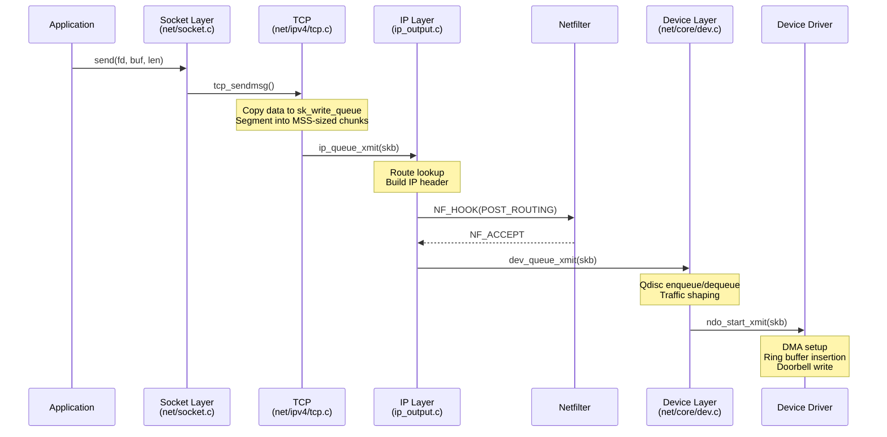
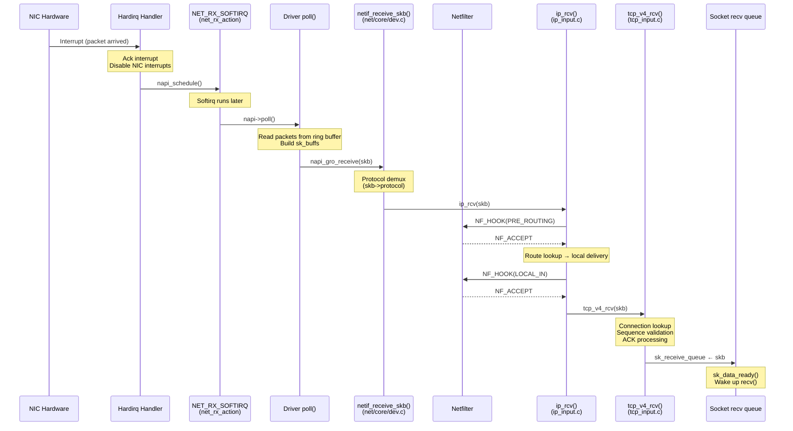

# The Networking Stack in Linux 6.19

> Source base: `/home/inineapa/Lab/linux-6.19`

---

## Before You Begin

If you have written socket programs in C — `socket()`, `bind()`, `connect()`, `send()`, `recv()` — you already know the networking stack from the outside. You hand a buffer to `send()`, and somehow it arrives on another machine. You call `recv()`, and data appears. What you have not seen is the journey that buffer takes through the kernel: how it becomes a packet, acquires headers at each protocol layer, gets queued behind a traffic control discipline, and finally reaches a hardware transmit ring — or, in reverse, how an interrupt from the NIC triggers a softirq that walks a received packet up through IP, TCP, and into your socket's receive queue.

This document traces both paths — transmit and receive — through the Linux 6.19 networking stack, with source-level references. We cover the core data structures (`sk_buff`, `net_device`, `sock`), the socket system call interface, NAPI interrupt mitigation, netfilter hooks, and the TCP/IP protocol path.

---

## 1. The Big Picture: Layers of the Network Stack

The Linux networking stack is organized in layers, mirroring the TCP/IP model. Each layer has a clean interface to the layer above and below it:

```
User space
  ┌─────────────────────────┐
  │  Application (your code) │   send(fd, buf, len, 0)
  └────────────┬────────────┘
               │  syscall boundary
═══════════════╪════════════════════════════════════════════
               │
  ┌────────────▼────────────┐
  │  Socket Layer            │   net/socket.c
  │  (struct socket + sock)  │   Multiplexes protocol families
  ├─────────────────────────┤
  │  Transport Layer         │   net/ipv4/tcp.c, net/ipv4/udp.c
  │  (TCP, UDP, SCTP, etc.) │   Segmentation, reliability, ports
  ├─────────────────────────┤
  │  Network Layer           │   net/ipv4/ip_output.c, ip_input.c
  │  (IPv4, IPv6)            │   Routing, fragmentation, addressing
  ├─────────────────────────┤
  │  Netfilter               │   net/netfilter/core.c
  │  (iptables/nftables)     │   Packet filtering at hook points
  ├─────────────────────────┤
  │  Link / Device Layer     │   net/core/dev.c
  │  (struct net_device)     │   Queueing, traffic control, driver dispatch
  ├─────────────────────────┤
  │  Device Driver           │   drivers/net/ethernet/*, etc.
  │  (ndo_start_xmit)       │   DMA to hardware, interrupt handling
  └─────────────────────────┘
               │
           Hardware (NIC)
```

The key directories in the kernel source:

| Directory | Purpose |
|-----------|---------|
| `net/socket.c` | Socket system call interface |
| `net/core/dev.c` | Network device infrastructure, NAPI, transmit/receive dispatch |
| `net/ipv4/` | IPv4: routing, IP input/output, TCP, UDP, ARP, ICMP |
| `net/ipv6/` | IPv6 equivalent |
| `net/netfilter/` | Packet filtering framework |
| `net/sched/` | Traffic control (queueing disciplines) |
| `include/linux/skbuff.h` | `struct sk_buff` — the packet buffer |
| `include/linux/netdevice.h` | `struct net_device` — the NIC abstraction |
| `include/net/sock.h` | `struct sock` — the protocol socket |

---

## 2. The Socket — User-Space Interface

### 2.1 struct socket vs struct sock

When you call `socket(AF_INET, SOCK_STREAM, 0)` from user space, the kernel creates *two* objects:

**`struct socket`** (`include/linux/net.h:116`) — the VFS-facing wrapper. It is what the file descriptor points to. It contains:

```c
struct socket {
    socket_state        state;     // SS_UNCONNECTED, SS_CONNECTED, etc.
    short               type;      // SOCK_STREAM, SOCK_DGRAM, etc.
    unsigned long       flags;     // SOCK_NOSPACE, etc.
    struct file         *file;     // The backing VFS file object
    struct sock         *sk;       // The protocol-facing socket
    const struct proto_ops *ops;   // Protocol operations (bind, connect, sendmsg, ...)
    struct socket_wq    wq;        // Wait queue for poll/select
};
```

**`struct sock`** (`include/net/sock.h:359`) — the protocol-facing object. This is where all the real networking state lives. It is a large, cache-line-optimized structure with hundreds of fields. The most important ones:

| Field | Line | Purpose |
|-------|------|---------|
| `__sk_common` | 364 | Shared fields: address, port, protocol family, state, hash |
| `sk_receive_queue` | 405 | Queue of received `sk_buff` packets waiting for `recv()` |
| `sk_write_queue` | 485 | Queue of outgoing packets waiting to be transmitted |
| `sk_backlog` | 414 | Backlog queue for packets arriving while socket lock is held |
| `sk_data_ready` | 447 | Callback invoked when data arrives (wakes up `recv()`) |
| `sk_rcvbuf` | 437 | Receive buffer size limit (set by `SO_RCVBUF`) |
| `sk_sndbuf` | 520 | Send buffer size limit (set by `SO_SNDBUF`) |
| `sk_wmem_alloc` | 479 | Write memory currently allocated |
| `sk_socket` | 454 | Back-pointer to `struct socket` |
| `sk_prot` | 391 | Protocol operations (`struct proto *`, via `__sk_common`) |
| `sk_state` | 383 | Connection state (TCP_ESTABLISHED, TCP_CLOSE, etc.) |
| `sk_dst_cache` | 508 | Cached routing entry (avoids re-lookup on every packet) |

The `struct socket` is thin — it exists mainly to bridge the VFS (file descriptors, `read()`/`write()`) with the protocol stack. The `struct sock` is where TCP state machines, buffer management, timers, and congestion control live.

### 2.2 The socket() System Call

`socket()` is defined via `SYSCALL_DEFINE3` at `net/socket.c:1759`, which calls `__sys_socket()` (line 1742):

```c
int __sys_socket(int family, int type, int protocol)
{
    struct socket *sock;
    int flags = type & ~SOCK_TYPE_MASK;  // extract SOCK_NONBLOCK, SOCK_CLOEXEC

    type &= SOCK_TYPE_MASK;              // SOCK_STREAM, SOCK_DGRAM, etc.

    retval = sock_create(family, type, protocol, &sock);   // create the socket pair
    if (retval < 0)
        return retval;

    return sock_map_fd(sock, flags & (O_CLOEXEC | O_NONBLOCK));  // allocate an fd
}
```

`sock_create()` (line 1661) calls `__sock_create()` (line 1534), which:

1. **Allocates a `struct socket`** via `sock_alloc()` (line 1569) — this also creates an inode in the `sockfs` pseudo-filesystem
2. **Looks up the protocol family** in the `net_families[]` array (line 1590) — for `AF_INET`, this is `inet_family_ops`
3. **Calls the family's `create` callback** (line 1605) — for IPv4, this is `inet_create()` (`net/ipv4/af_inet.c:254`), which allocates a `struct sock` and sets up the protocol-specific operations

### 2.3 struct proto_ops — The Protocol-Specific Interface

Each protocol family provides a `struct proto_ops` (`include/linux/net.h:160`) that implements the socket operations:

```c
struct proto_ops {
    int     family;
    int     (*release)(struct socket *sock);
    int     (*bind)(struct socket *sock, struct sockaddr_unsized *myaddr, int len);
    int     (*connect)(struct socket *sock, struct sockaddr *vaddr, int len, int flags);
    int     (*accept)(struct socket *sock, struct socket *newsock,
                      struct proto_accept_arg *arg);
    int     (*listen)(struct socket *sock, int len);
    int     (*sendmsg)(struct socket *sock, struct msghdr *msg, size_t total_len);
    int     (*recvmsg)(struct socket *sock, struct msghdr *msg, size_t total_len, int flags);
    ...
};
```

For `AF_INET` + `SOCK_STREAM` (TCP), `ops` points to `inet_stream_ops`, which routes:
- `sendmsg` → `inet_sendmsg()` → `tcp_sendmsg()`
- `recvmsg` → `inet_recvmsg()` → `tcp_recvmsg()`

---

## 3. struct sk_buff — The Packet

This is the most important data structure in the networking stack. Every packet — whether being sent or received, whether at the TCP layer or the Ethernet layer — is represented by a `struct sk_buff` (`include/linux/skbuff.h:885`).

### 3.1 The Buffer Layout

An `sk_buff` does not just hold data — it manages a buffer that grows and shrinks as protocol headers are added or removed. Four pointers define the buffer layout:

```
  ┌──────────────────────────────────────────────────┐
  │                    sk_buff                        │
  │                                                  │
  │   head ────────► ┌──────────────────────┐        │
  │                  │   headroom           │        │
  │   data ────────► ├──────────────────────┤        │
  │                  │   packet data        │        │
  │                  │   (headers + payload)│        │
  │   tail ────────► ├──────────────────────┤        │
  │                  │   tailroom           │        │
  │   end  ────────► └──────────────────────┘        │
  │                                                  │
  │   len = tail - data  (actual data length)        │
  └──────────────────────────────────────────────────┘
```

These fields are at `skbuff.h:1092–1095`:

```c
sk_buff_data_t      tail;     // end of data
sk_buff_data_t      end;      // end of buffer
unsigned char       *head,    // start of buffer
                    *data;    // start of data
```

### 3.2 How Headers Are Added

When sending a packet, each layer *prepends* its header by moving the `data` pointer backward:

```c
// TCP adds its header:
skb_push(skb, sizeof(struct tcphdr));    // data moves back by 20 bytes

// IP adds its header:
skb_push(skb, sizeof(struct iphdr));     // data moves back by 20 more bytes

// Ethernet adds its header:
skb_push(skb, ETH_HLEN);                // data moves back by 14 bytes
```

When receiving, each layer *strips* its header by moving `data` forward:

```c
// Ethernet layer strips its header:
skb_pull(skb, ETH_HLEN);                // data moves forward by 14 bytes
```

This is why `skb_reserve()` is called when allocating a fresh skb for transmission — it advances `data` past the headroom, making space for the headers that will be pushed later.

### 3.3 Key sk_buff Fields

| Field | Line | Purpose |
|-------|------|---------|
| `next`, `prev` | 889–890 | Linked list pointers (skbs live on queues) |
| `dev` | 893 | The network device this packet is associated with |
| `sk` | 906 | The socket that owns this packet (if any) |
| `tstamp` | 909 | Timestamp (arrival or departure time) |
| `cb[48]` | 918 | Control buffer — free for each layer to use for private data |
| `len` | 934 | Total packet length (linear + paged data) |
| `data_len` | 935 | Length of paged (non-linear) data |
| `protocol` | 1080 | Packet protocol (ETH_P_IP, ETH_P_ARP, etc.) |
| `transport_header` | 1081 | Offset to the transport header (TCP/UDP) |
| `network_header` | 1082 | Offset to the network header (IP) |
| `mac_header` | 1083 | Offset to the MAC header (Ethernet) |
| `head`, `data` | 1094 | Buffer start and data start |
| `tail`, `end` | 1092–1093 | Data end and buffer end |
| `truesize` | 1096 | True memory cost (for socket buffer accounting) |
| `users` | 1097 | Reference count |

### 3.4 The sk_buff Lifecycle

```
Allocation:   alloc_skb(size, GFP_ATOMIC)  →  empty skb with buffer
Reserve:      skb_reserve(skb, headroom)    →  make room for headers
Build:        skb_put(skb, len)             →  expand data area for payload
              memcpy(skb->data, payload, len)
Headers:      skb_push(skb, hdr_len)        →  prepend protocol header
Transmit:     dev_queue_xmit(skb)           →  hand to device layer
Completion:   kfree_skb(skb) or consume_skb(skb)  →  free the buffer
```

For received packets, the driver allocates the skb, the NIC DMA's data into it, and the stack processes it upward through the layers.

---

## 4. Network Device (net_device) — The NIC Abstraction

### 4.1 struct net_device

Every network interface — `eth0`, `wlan0`, `lo`, even virtual interfaces like `docker0` — is represented by a `struct net_device` (`include/linux/netdevice.h:2105`). It is a massive structure (hundreds of fields), but the critical ones are:

| Field | Line | Purpose |
|-------|------|---------|
| `name` | 2180 | Interface name ("eth0", "lo", etc.) |
| `netdev_ops` | 2118 | Driver operation callbacks (`ndo_start_xmit`, etc.) |
| `_tx` | 2120 | Array of transmit queues |
| `_rx` | 2166 | Array of receive queues |
| `mtu` | (varies) | Maximum transmission unit (default 1500 for Ethernet) |
| `flags` | (varies) | IFF_UP, IFF_RUNNING, IFF_BROADCAST, etc. |
| `qdisc` | 2362 | Traffic control queue discipline |
| `stats` | 2231 | Legacy network statistics |

### 4.2 struct net_device_ops — The Driver Interface

The `struct net_device_ops` (`include/linux/netdevice.h:1424`) is how the networking stack talks to the device driver. Every driver must implement at minimum:

```c
struct net_device_ops {
    int  (*ndo_open)(struct net_device *dev);                          // 1427 — ifconfig up
    int  (*ndo_stop)(struct net_device *dev);                          // 1428 — ifconfig down
    netdev_tx_t (*ndo_start_xmit)(struct sk_buff *skb,                // 1429 — transmit a packet
                                  struct net_device *dev);
    void (*ndo_set_rx_mode)(struct net_device *dev);                   // 1439 — set multicast/promisc
    int  (*ndo_set_mac_address)(struct net_device *dev, void *addr);   // 1440 — change MAC
    void (*ndo_tx_timeout)(struct net_device *dev, unsigned int txq);  // 1460 — TX watchdog
    void (*ndo_get_stats64)(struct net_device *dev,                    // 1463 — get statistics
                            struct rtnl_link_stats64 *stats);
    ...
};
```

**`ndo_start_xmit`** is the single most important callback. When the stack wants to transmit a packet, it calls this function with the sk_buff. The driver must:
1. Set up DMA descriptors pointing to the skb data
2. Tell the hardware to transmit
3. Return `NETDEV_TX_OK` (accepted) or `NETDEV_TX_BUSY` (queue full)

### 4.3 Registering a Network Device

A driver creates a net_device with `alloc_netdev_mqs()` and registers it with `register_netdev()` (`net/core/dev.c:11514`), which calls `register_netdevice()` (line 11295). Registration:

1. Validates the device name and configuration
2. Assigns an `ifindex` (the integer you see in `ip link`)
3. Adds the device to the global device list and namespace hash tables
4. Triggers udev events so user space discovers the new device

---

## 5. Protocol Registration — How TCP/IP Hooks In

### 5.1 The inet_init() Function

The IPv4 protocol family registers itself via `inet_init()` at `net/ipv4/af_inet.c:1891`. This function, called as an `fs_initcall` during boot (line 2029), does several things:

1. **Registers the protocol family**: `sock_register(&inet_family_ops)` (line 1921) — this installs `inet_family_ops` in `net_families[PF_INET]`, so `socket(AF_INET, ...)` knows which `create` function to call.

2. **Registers transport protocols** — TCP, UDP, ICMP, and RAW are registered with the IP layer so incoming packets can be demultiplexed:
   - Each protocol provides a `struct net_protocol` handler (`include/net/protocol.h:37`) with a `.handler` function pointer
   - For TCP: `handler = tcp_v4_rcv` — called for every incoming TCP segment
   - For UDP: `handler = udp_rcv`

3. **Initializes the TCP subsystem** — `tcp_init()` sets up the TCP connection hash tables, SYN cookies, congestion control, etc.

### 5.2 How socket(AF_INET, SOCK_STREAM, 0) Reaches TCP

When `inet_create()` is called (`af_inet.c:254`):

1. It searches the `inetsw[SOCK_STREAM]` list (line 273) — this list was populated by `inet_init()` with an entry for TCP
2. It sets `sock->ops = &inet_stream_ops` (the proto_ops for TCP sockets)
3. It allocates a `struct sock` via `sk_alloc()` (line 328)
4. The sock's `sk_prot` is set to `tcp_prot` — the protocol-specific operations (connect, sendmsg, recvmsg, etc.)

---

## 6. The Transmit Path (Sending a Packet)

When you call `send(fd, buf, len, 0)` on a TCP socket, here is what happens inside the kernel, layer by layer.

### 6.1 Socket Layer

```
send(fd, buf, len, 0)
  → SYSCALL_DEFINE6(sendto, ...)  [net/socket.c:2209]
    → __sys_sendto()              [net/socket.c:2171]
      → sock_sendmsg()            [net/socket.c:753]
        → sock->ops->sendmsg()    ← protocol dispatch
```

`sock_sendmsg()` (line 753) is the funnel — every `send()`, `sendto()`, `sendmsg()`, and even `write()` on a socket ends up here. It calls the protocol-specific `sendmsg`:

- For TCP: `inet_sendmsg()` → `tcp_sendmsg()` (`net/ipv4/tcp.c:1407`)
- For UDP: `inet_sendmsg()` → `udp_sendmsg()`

### 6.2 Transport Layer (TCP)

`tcp_sendmsg()` (line 1407) acquires the socket lock and calls `tcp_sendmsg_locked()` (line 1077), which:

1. Copies user data into sk_buff pages attached to the socket's write queue (`sk_write_queue`)
2. Segments the data into MSS-sized chunks (Maximum Segment Size, typically 1460 bytes for Ethernet)
3. Calls `tcp_push()` when it is time to actually send — this decides based on Nagle's algorithm, the send window, and congestion control whether to transmit now or wait
4. `tcp_push()` eventually calls `tcp_write_xmit()`, which calls `tcp_transmit_skb()` for each segment

`tcp_transmit_skb()` (`net/ipv4/tcp_output.c`) builds the TCP header:
- Source/destination ports, sequence number, acknowledgment number
- Flags (SYN, ACK, FIN, PSH, etc.)
- Window size, checksum, options (timestamps, SACK, window scaling)

Then it passes the skb to the IP layer via `ip_queue_xmit()`.

### 6.3 Network Layer (IP)

`__ip_queue_xmit()` (`net/ipv4/ip_output.c:463`):

1. **Route lookup**: Checks `sk_dst_cache` for a cached route. If none, performs a full routing table lookup via `ip_route_output_flow()`. The result is a `struct rtable` that tells the kernel which device and next-hop gateway to use.

2. **Build the IP header**: Source IP, destination IP, TTL, protocol (6 for TCP), total length, identification, fragment flags.

3. **Call `ip_output()`** (line 428) — which runs through the Netfilter `NF_INET_POST_ROUTING` hook (lines 438–441):

```c
int ip_output(struct net *net, struct sock *sk, struct sk_buff *skb)
{
    // ... set output device from routing table
    return NF_HOOK_COND(NFPROTO_IPV4, NF_INET_POST_ROUTING,
                        net, sk, skb, indev, dev,
                        ip_finish_output,
                        !(IPCB(skb)->flags & IPSKB_REROUTED));
}
```

If netfilter accepts the packet, `ip_finish_output()` handles IP fragmentation (if the packet exceeds the MTU) and calls the neighbor subsystem for ARP resolution.

### 6.4 Device Layer

After ARP resolution fills in the Ethernet header, `dev_queue_xmit()` takes over. The core implementation is `__dev_queue_xmit()` (`net/core/dev.c:4739`):

1. **Reset MAC header** (line 4747)
2. **Netfilter egress hooks** (lines 4764–4777) — if configured, packets pass through `tc` egress filters
3. **Traffic control** (qdisc): If the device has a queueing discipline, the packet is enqueued via `__dev_xmit_skb()`. The qdisc decides when to dequeue and transmit — this is where traffic shaping, fair queueing, and rate limiting happen.
4. **Driver transmit**: Eventually, the qdisc calls `sch_direct_xmit()`, which calls `dev_hard_start_xmit()`, which calls **`ndo_start_xmit()`** — the driver's transmit function.

### 6.5 The Complete Transmit Path



---

## 7. The Receive Path (Receiving a Packet)

The receive path is more complex than transmit because it is interrupt-driven and involves the NAPI polling mechanism.

### 7.1 Hardware to Driver

1. A packet arrives at the NIC
2. The NIC DMAs the packet data into a pre-allocated ring buffer in memory
3. The NIC raises an interrupt

### 7.2 Driver Interrupt Handler

The driver's hardirq handler (registered via `request_irq()`, as described in `interrupt.md`) does the bare minimum:

1. Acknowledge the interrupt at the hardware level
2. **Disable further interrupts** from this NIC (this is critical for NAPI)
3. Call `napi_schedule()` — which schedules the NAPI poll on the `NET_RX_SOFTIRQ`
4. Return `IRQ_HANDLED`

This is the same hardirq → softirq pattern described in `interrupt.md` Section 8.

### 7.3 NAPI Polling (Softirq)

The `NET_RX_SOFTIRQ` handler is `net_rx_action()` (`net/core/dev.c:7857`). It is registered at boot by:

```c
open_softirq(NET_RX_SOFTIRQ, net_rx_action);   // dev.c:13264
```

When the softirq runs, `net_rx_action()`:

1. Gets the per-CPU `softnet_data` and sets a budget (line 7863): `budget = READ_ONCE(net_hotdata.netdev_budget)` (default 300 packets)
2. Splices the `poll_list` — a list of NAPI devices that need polling (line 7871)
3. Iterates the list, calling `napi_poll()` for each device (line 7896):
   - `napi_poll()` calls the driver's `poll()` callback (set in `struct napi_struct`)
   - The driver's poll function reads packets from the ring buffer, builds sk_buffs, and calls `napi_gro_receive()` or `netif_receive_skb()` for each packet
4. Checks budget and time limits (lines 7902–7907) — if exceeded, re-raises `NET_RX_SOFTIRQ` to avoid starving user-space processes (same pattern as softirq budgeting in `interrupt.md` Section 4.5)

```c
static __latent_entropy void net_rx_action(void)
{
    struct softnet_data *sd = this_cpu_ptr(&softnet_data);
    unsigned long time_limit = jiffies +
        usecs_to_jiffies(READ_ONCE(net_hotdata.netdev_budget_usecs));
    int budget = READ_ONCE(net_hotdata.netdev_budget);   // default: 300

    local_irq_disable();
    list_splice_init(&sd->poll_list, &list);              // grab NAPI devices
    local_irq_enable();

    for (;;) {
        struct napi_struct *n = list_first_entry(&list, ...);
        budget -= napi_poll(n, &repoll);                  // poll the driver

        if (unlikely(budget <= 0 || time_after_eq(jiffies, time_limit))) {
            sd->time_squeeze++;                           // ran out of budget
            break;
        }
    }

    if (!list_empty(&sd->poll_list))
        __raise_softirq_irqoff(NET_RX_SOFTIRQ);          // more work to do
}
```

### 7.4 Protocol Demultiplexing

After the driver calls `netif_receive_skb()` (`net/core/dev.c:6404`), the stack determines which protocol handler should process the packet based on `skb->protocol` (set from the Ethernet header's EtherType field):

- `ETH_P_IP` (0x0800) → `ip_rcv()`
- `ETH_P_ARP` (0x0806) → `arp_rcv()`
- `ETH_P_IPV6` (0x86DD) → `ipv6_rcv()`

### 7.5 IP Input

`ip_rcv()` (`net/ipv4/ip_input.c:564`):

1. Validates the IP header: version, header length, checksum, total length
2. Runs the `NF_INET_PRE_ROUTING` netfilter hook (line 573):

```c
return NF_HOOK(NFPROTO_IPV4, NF_INET_PRE_ROUTING,
               net, NULL, skb, dev, NULL,
               ip_rcv_finish);
```

3. `ip_rcv_finish()` performs routing: is this packet for us (local delivery), or should it be forwarded?
4. For local delivery → `ip_local_deliver()` → runs `NF_INET_LOCAL_IN` hook → `ip_local_deliver_finish()`
5. Strips the IP header and looks up the transport protocol handler (TCP, UDP, ICMP, etc.) via `inet_protos[protocol]`

### 7.6 TCP Input

`tcp_v4_rcv()` (registered as the handler for protocol 6) is called for every incoming TCP segment:

1. Looks up the socket by (src_ip, src_port, dst_ip, dst_port) in the TCP connection hash table
2. If found and in `TCP_ESTABLISHED` state → `tcp_rcv_established()` (`net/ipv4/tcp_input.c`)
3. TCP processes the segment: validates sequence numbers, processes ACKs, handles window updates, congestion control, SACK, etc.
4. Data payload is extracted and queued onto `sk->sk_receive_queue`
5. `sk->sk_data_ready(sk)` is called — this wakes up any process blocked in `recv()`

### 7.7 The Complete Receive Path



---

## 8. NAPI — Interrupt Mitigation for High-Speed Networking

### 8.1 The Problem

At gigabit speeds, a NIC can receive hundreds of thousands of packets per second. If every packet generates a hardware interrupt, the CPU spends all its time handling interrupts and never gets to process the actual packets. This is called **interrupt livelock**.

### 8.2 The Solution: Poll After First Interrupt

NAPI (New API) solves this by combining interrupts with polling:

1. **First packet arrives** → NIC fires an interrupt
2. **Driver hardirq handler** → disables NIC interrupts, schedules NAPI polling
3. **Softirq runs `net_rx_action()`** → calls driver's `poll()` function in a loop
4. **poll() processes packets** without any interrupts — just reads from the ring buffer
5. **When all packets are processed** → driver calls `napi_complete_done()`, which re-enables interrupts
6. **If more packets arrive during polling** → they are picked up in the poll loop, no interrupt needed

This way, under high load, the system processes thousands of packets per poll cycle with just one interrupt. Under low load, every packet still gets an interrupt for low latency.

### 8.3 struct napi_struct

The NAPI state is held in `struct napi_struct` (`include/linux/netdevice.h:379`):

```c
struct napi_struct {
    unsigned long       state;              // NAPI_STATE_SCHED, etc.
    struct list_head    poll_list;           // link on per-CPU poll list
    int                 weight;             // max packets per poll (typically 64)
    int                 (*poll)(struct napi_struct *, int);  // driver's poll function
    struct net_device   *dev;               // associated device
    struct sk_buff      *skb;               // GRO skb accumulator
    struct hrtimer      timer;              // for deferred polling
    struct task_struct  *thread;            // threaded NAPI kthread (optional)
    ...
};
```

### 8.4 The Driver's Poll Function

A typical driver poll function looks like:

```c
static int my_driver_poll(struct napi_struct *napi, int budget)
{
    struct my_device *dev = container_of(napi, struct my_device, napi);
    int work_done = 0;

    while (work_done < budget) {
        struct sk_buff *skb = read_packet_from_ring(dev);
        if (!skb)
            break;   // ring empty

        napi_gro_receive(napi, skb);   // pass to stack (with GRO merging)
        work_done++;
    }

    if (work_done < budget) {
        napi_complete_done(napi, work_done);   // done polling
        enable_device_interrupts(dev);          // re-arm interrupts
    }

    return work_done;
}
```

The `budget` parameter limits how many packets one poll cycle can process — preventing one NIC from monopolizing the CPU. The default weight is 64.

### 8.5 GRO — Generic Receive Offload

`napi_gro_receive()` attempts to merge small packets belonging to the same flow (same TCP connection) into a larger "super-packet" before passing it up the stack. This reduces per-packet overhead: one IP receive, one TCP receive for what might be 5–10 actual packets. GRO is the software equivalent of hardware LRO (Large Receive Offload).

---

## 9. Netfilter — The Packet Filter Framework

### 9.1 The Hook Points

Netfilter inserts hook points at five locations in the packet path. Every packet passes through at least two of these hooks:

```
                          ┌─────────┐
          Incoming ──────►│PRE      │───► Routing ──► Local delivery ──►│LOCAL_IN │──► Socket
          packet          │ROUTING  │         │                         └─────────┘
                          └─────────┘         │
                                              ▼
                                         Is it for us?
                                              │
                                         No ──┤
                                              ▼
                                        ┌──────────┐      ┌──────────┐
                                        │ FORWARD   │─────►│POST      │──► Out
                                        └──────────┘      │ROUTING   │
                                                          └──────────┘
                                                               ▲
         Local process ──► Socket ──►│OUTPUT    │──► Routing ───┘
                                     └──────────┘
```

| Hook | Constant | When it fires |
|------|----------|---------------|
| PREROUTING | `NF_INET_PRE_ROUTING` | Immediately after IP header validation, before routing decision |
| LOCAL_IN | `NF_INET_LOCAL_IN` | After routing decides packet is for local delivery |
| FORWARD | `NF_INET_FORWARD` | After routing decides packet should be forwarded |
| OUTPUT | `NF_INET_LOCAL_OUT` | For locally generated outgoing packets |
| POSTROUTING | `NF_INET_POST_ROUTING` | Just before the packet leaves the machine |

### 9.2 How Hooks Are Called

The `NF_HOOK()` macro (`include/linux/netfilter.h`) calls `nf_hook_slow()` (`net/netfilter/core.c:616`), which iterates through registered hook functions:

```c
int nf_hook_slow(struct sk_buff *skb, struct nf_hook_state *state,
                 const struct nf_hook_entries *e, unsigned int s)
{
    for (; s < e->num_hook_entries; s++) {
        verdict = nf_hook_entry_hookfn(&e->hooks[s], skb, state);
        switch (verdict & NF_VERDICT_MASK) {
        case NF_ACCEPT:     continue;            // pass to next hook
        case NF_DROP:       kfree_skb(skb);      // drop the packet
                            return NF_DROP;
        case NF_QUEUE:      /* queue to userspace */ break;
        case NF_STOLEN:     return NF_DROP;       // hook took ownership
        }
    }
    return 1;   // all hooks accepted
}
```

Each hook function returns a verdict: `NF_ACCEPT` (continue processing), `NF_DROP` (discard), `NF_QUEUE` (send to userspace for decision), or `NF_STOLEN` (hook consumed the packet).

### 9.3 iptables and nftables

`iptables` and `nftables` are user-space tools that register rules at these hook points. When you run `iptables -A INPUT -p tcp --dport 22 -j ACCEPT`, you are registering a function at the `NF_INET_LOCAL_IN` hook that checks TCP destination port 22 and returns `NF_ACCEPT`.

---

## 10. Routing

### 10.1 What the Routing Subsystem Does

Every IP packet — incoming or outgoing — must go through a routing decision:

- **For incoming packets**: Is this for us (local delivery), or should we forward it?
- **For outgoing packets**: Which network device and next-hop gateway should we use?

### 10.2 The Route Lookup

The routing table is implemented as a FIB (Forwarding Information Base) in `net/ipv4/fib_trie.c` (a compressed trie/radix tree). The main lookup function is `ip_route_output_flow()` (`net/ipv4/route.c`).

A route lookup returns a `struct rtable` (`include/net/route.h`), which contains:
- The output device (`dev`)
- The gateway IP (next-hop)
- The source IP to use
- Various flags (local, broadcast, multicast, etc.)

The result is cached in `sk->sk_dst_cache` so subsequent packets on the same connection skip the lookup.

### 10.3 User-Space View

```bash
# View the routing table:
ip route show

# Example output:
# default via 192.168.1.1 dev eth0
# 192.168.1.0/24 dev eth0 proto kernel scope link src 192.168.1.100
```

---

## 11. TCP Connection Lifecycle

### 11.1 The Three-Way Handshake

```
Client                              Server
  │                                    │
  │──── SYN (seq=x) ────────────────►  │   tcp_v4_connect() → send SYN
  │     TCP_SYN_SENT                   │   TCP_LISTEN
  │                                    │
  │◄─── SYN+ACK (seq=y, ack=x+1) ──── │   tcp_v4_rcv() → tcp_check_req()
  │                                    │   TCP_SYN_RECV
  │                                    │
  │──── ACK (ack=y+1) ────────────────►│   tcp_rcv_state_process()
  │     TCP_ESTABLISHED                │   TCP_ESTABLISHED
```

### 11.2 TCP States in the Kernel

The TCP state is stored in `sk->sk_state` (via `__sk_common.skc_state`). State transitions are performed by `tcp_set_state()` (`net/ipv4/tcp.c:2944`):

| State | Meaning |
|-------|---------|
| `TCP_LISTEN` | Server socket waiting for connections (`listen()` called) |
| `TCP_SYN_SENT` | Client sent SYN, waiting for SYN+ACK |
| `TCP_SYN_RECV` | Server received SYN, sent SYN+ACK, waiting for ACK |
| `TCP_ESTABLISHED` | Connection open, data can flow both ways |
| `TCP_FIN_WAIT1` | We sent FIN, waiting for ACK |
| `TCP_FIN_WAIT2` | Our FIN was ACKed, waiting for peer's FIN |
| `TCP_CLOSE_WAIT` | Peer sent FIN, we ACKed it, waiting for application to close |
| `TCP_TIME_WAIT` | Connection fully closed, waiting 2×MSL before releasing resources |
| `TCP_CLOSE` | Socket is completely closed |

### 11.3 Data Transfer

**Sending** (`tcp_sendmsg()`, line 1407):
- User data is copied into pages in the socket's write queue
- TCP segments are built with proper sequence numbers, ACK numbers, and window sizes
- Congestion control algorithms (Cubic, BBR, Reno) determine the sending rate
- Retransmission timer handles lost segments

**Receiving** (`tcp_recvmsg()`, line 2912):
- The function acquires the socket lock (line 2926)
- Reads data from `sk->sk_receive_queue`
- Handles out-of-order segments via the out-of-order queue
- Returns data to user space via `copy_to_user()` or zero-copy mechanisms

---

## 12. Network Namespaces

### 12.1 What Is a Network Namespace?

Containers (Docker, LXC) give each container its own isolated network stack — its own interfaces, routing table, iptables rules, and sockets. This isolation is provided by **network namespaces**, one of the key building blocks of Linux containers.

A network namespace is represented by `struct net` (`include/net/net_namespace.h:61`):

```c
struct net {
    refcount_t      passive;        // ref count for namespace lifetime
    unsigned int    dev_base_seq;   // device list sequence number
    u32             ifindex;        // next ifindex to assign

    struct list_head list;          // global list of all namespaces
    struct list_head ptype_all;     // packet type handlers (promiscuous)
    struct list_head ptype_specific;// protocol-specific handlers

    struct net_device *loopback_dev; // this namespace's loopback device
    struct netns_ipv4 ipv4;         // IPv4 state (routing, sysctl, etc.)
    struct netns_ipv6 ipv6;         // IPv6 state
    ...
};
```

Every network object in the kernel — net_device, socket, route, netfilter rule — belongs to exactly one `struct net`. When you do `ip netns add myns`, the kernel creates a new `struct net` with its own loopback device, its own routing table, its own iptables rules, and its own set of sockets.

### 12.2 How Namespaces Affect the Stack

Almost every networking function takes a `struct net *` parameter (often called `net`). For example:

- `ip_route_output_flow(struct net *net, ...)` — route lookup within a namespace
- `register_netdevice(struct net_device *dev)` — registers the device in `dev_net(dev)`
- `inet_create()` — the socket is created in the calling process's network namespace

When a process calls `socket()`, the kernel uses the process's current network namespace (from `current->nsproxy->net_ns`). The resulting socket can only see interfaces and routes within that namespace.

### 12.3 The Default Namespace

At boot, there is exactly one network namespace: `init_net` (`net/core/net_namespace.c`). All network devices, routes, and sockets belong to it unless explicitly moved. When you run Docker, each container gets its own `struct net`, connected to the host's namespace via virtual Ethernet pairs (`veth`).

### 12.4 User-Space View

```bash
# Create a namespace:
ip netns add test_ns

# Run a command inside it:
ip netns exec test_ns ip link show
# Output: only "lo" — a fresh, isolated loopback

# Move an interface into it:
ip link set eth1 netns test_ns

# List namespaces:
ip netns list

# Delete a namespace:
ip netns del test_ns
```

---

## 13. The Neighbor Subsystem (ARP)

### 13.1 The Problem: IP Addresses vs MAC Addresses

IP routing determines the *next-hop IP address*, but Ethernet frames require a *MAC address*. The neighbor subsystem bridges this gap — it maps L3 (IP) addresses to L2 (MAC) addresses. For IPv4, this is ARP (Address Resolution Protocol). For IPv6, it is NDP (Neighbor Discovery Protocol).

### 13.2 struct neighbour

Each known neighbor is represented by `struct neighbour` (`include/net/neighbour.h:140`):

```c
struct neighbour {
    struct hlist_node   hash;           // hash table linkage
    struct neigh_table  *tbl;           // ARP table (arp_tbl) or NDP table (nd_tbl)
    struct neigh_parms  *parms;         // timing parameters (reachable time, retries, etc.)
    unsigned long       confirmed;      // last time reachability was confirmed
    rwlock_t            lock;
    refcount_t          refcnt;
    struct sk_buff_head arp_queue;      // packets waiting for resolution
    struct timer_list   timer;          // reachability timer
    u8                  nud_state;      // NUD_REACHABLE, NUD_STALE, NUD_INCOMPLETE, etc.
    unsigned char       ha[MAX_ADDR_LEN]; // hardware (MAC) address
    struct hh_cache     hh;             // cached L2 header for fast path
    int                 (*output)(struct neighbour *, struct sk_buff *);
    const struct neigh_ops *ops;        // protocol-specific operations
    ...
};
```

### 13.3 The Neighbor State Machine

A neighbor entry transitions through several states:

| State | Meaning |
|-------|---------|
| `NUD_NONE` | Entry just created, no resolution attempted |
| `NUD_INCOMPLETE` | ARP request sent, waiting for reply |
| `NUD_REACHABLE` | MAC address known, recently confirmed reachable |
| `NUD_STALE` | MAC address known, but not recently confirmed |
| `NUD_DELAY` | Stale entry, waiting briefly before re-probing |
| `NUD_PROBE` | Actively sending ARP probes to re-confirm |
| `NUD_FAILED` | Resolution failed after retries |

```
NONE → INCOMPLETE → REACHABLE → STALE → DELAY → PROBE → REACHABLE
                ↓                                         ↓
              FAILED                                   FAILED
```

### 13.4 How ARP Resolution Fits Into the Transmit Path

When `ip_finish_output()` needs to send a packet, it calls the neighbor subsystem:

1. `ip_finish_output2()` looks up the next-hop neighbor via `__ipv4_neigh_lookup_noref()` or creates one via `__neigh_create()`
2. If the neighbor is in `NUD_REACHABLE` or `NUD_STALE` state → the cached MAC address is used, the Ethernet header is prepended via the `hh_cache` fast path, and the packet goes straight to `dev_queue_xmit()`
3. If the neighbor is in `NUD_INCOMPLETE` → the packet is queued on `neigh->arp_queue`, and an ARP request is sent. When the ARP reply arrives, all queued packets are transmitted.

### 13.5 User-Space View

```bash
# View the ARP cache:
ip neigh show
# Output: 192.168.1.1 dev eth0 lladdr aa:bb:cc:dd:ee:ff REACHABLE

# Manually add an entry:
ip neigh add 192.168.1.99 lladdr 00:11:22:33:44:55 dev eth0

# Flush stale entries:
ip neigh flush dev eth0
```

---

## 14. Socket Buffer Memory Management

### 14.1 The Problem: Unbounded Queuing

Without limits, a fast sender could fill all available memory with queued packets. The kernel must limit how much memory each socket, each protocol, and the system as a whole can use for network buffers.

### 14.2 Per-Socket Limits

Each socket has send and receive buffer limits:

| Field | setsockopt | Default | Purpose |
|-------|------------|---------|---------|
| `sk->sk_sndbuf` | `SO_SNDBUF` | `net.core.wmem_default` (212992) | Max send buffer size |
| `sk->sk_rcvbuf` | `SO_RCVBUF` | `net.core.rmem_default` (212992) | Max receive buffer size |
| `sk->sk_wmem_queued` | — | — | Current write memory used |
| `sk->sk_rmem_alloc` | — | — | Current receive memory used |

When TCP tries to send data, `tcp_sendmsg_locked()` checks `sk_stream_memory_free(sk)` — if `sk_wmem_queued` exceeds `sk_sndbuf`, the sender blocks (or returns `EAGAIN` for non-blocking sockets). This is the kernel-side equivalent of TCP flow control.

### 14.3 Memory Accounting Functions

The key functions (`include/net/sock.h`):

```c
// Charge memory to a socket (called when queueing an skb)
static inline void sk_mem_charge(struct sock *sk, int size)  // line 1624
{
    if (!sk_has_account(sk))
        return;
    sk_forward_alloc_add(sk, -size);   // subtract from forward allocation
}

// Schedule memory for a socket (checks global limits)
int __sk_mem_schedule(struct sock *sk, int size, int kind);  // line 1540
// kind: SK_MEM_SEND (0) or SK_MEM_RECV (1)
```

### 14.4 Global Protocol Limits

Each protocol (TCP, UDP) has system-wide memory limits controlled via sysctl:

```bash
# TCP memory limits (in pages):
cat /proc/sys/net/ipv4/tcp_mem
# Output: 191583  255445  383166
#         min     pressure  max
```

- Below `min`: TCP uses memory freely
- Between `min` and `pressure`: TCP enters "memory pressure" mode — reduces buffer sizes, delays ACKs
- Above `max`: TCP refuses to allocate more memory, drops incoming packets

The current TCP memory usage:

```bash
cat /proc/sys/net/ipv4/tcp_mem   # limits (pages)
cat /proc/net/sockstat           # current usage
# TCP: inuse 42 orphan 0 tw 15 alloc 50 mem 12
#                                        ^^^ pages currently allocated
```

### 14.5 The Truesize Field

Every `sk_buff` has a `truesize` field (line 1096) that represents the *true* memory cost of the buffer — not just the data length, but the `sk_buff` metadata, alignment padding, and buffer headroom/tailroom. This is what gets charged to socket memory accounting:

```c
skb->truesize = SKB_TRUESIZE(size);   // sizeof(sk_buff) + size + alignment
```

When you see `sk_mem_charge(sk, skb->truesize)`, the kernel is accounting the full memory cost of that packet against the socket's budget.

---

## 15. Function Quick Reference

| Function | File:Line | Role |
|----------|-----------|------|
| `__sys_socket()` | `net/socket.c:1742` | Create socket from syscall |
| `__sock_create()` | `net/socket.c:1534` | Allocate socket and call protocol create |
| `sock_sendmsg()` | `net/socket.c:753` | Send message through socket |
| `sock_recvmsg()` | `net/socket.c:1096` | Receive message through socket |
| `sock_register()` | `net/socket.c:3211` | Register a protocol family |
| `inet_init()` | `net/ipv4/af_inet.c:1891` | Register IPv4 protocol family |
| `inet_create()` | `net/ipv4/af_inet.c:254` | Create AF_INET socket |
| `tcp_sendmsg()` | `net/ipv4/tcp.c:1407` | TCP send entry point |
| `tcp_recvmsg()` | `net/ipv4/tcp.c:2912` | TCP receive entry point |
| `tcp_set_state()` | `net/ipv4/tcp.c:2944` | Change TCP connection state |
| `__ip_queue_xmit()` | `net/ipv4/ip_output.c:463` | Queue packet for IP transmission |
| `ip_output()` | `net/ipv4/ip_output.c:428` | IP output with netfilter POST_ROUTING |
| `ip_rcv()` | `net/ipv4/ip_input.c:564` | IP receive with netfilter PRE_ROUTING |
| `__dev_queue_xmit()` | `net/core/dev.c:4739` | Enqueue packet for device transmission |
| `netif_receive_skb()` | `net/core/dev.c:6404` | Receive packet from driver |
| `net_rx_action()` | `net/core/dev.c:7857` | NET_RX_SOFTIRQ handler (NAPI poll loop) |
| `register_netdev()` | `net/core/dev.c:11514` | Register a network device |
| `register_netdevice()` | `net/core/dev.c:11295` | Core device registration |
| `nf_hook_slow()` | `net/netfilter/core.c:616` | Process netfilter hooks |

---

## 16. Debugging and Observing Network Traffic

### 16.1 /proc and /sys Interfaces

```bash
# Active TCP connections (like netstat):
cat /proc/net/tcp

# UDP sockets:
cat /proc/net/udp

# Network device statistics:
cat /proc/net/dev

# Per-interface statistics:
cat /sys/class/net/eth0/statistics/rx_packets
cat /sys/class/net/eth0/statistics/tx_bytes

# NAPI statistics:
cat /sys/class/net/eth0/queues/rx-0/rps_cpus
```

### 16.2 ss and ip Commands

```bash
# List all TCP connections (faster than netstat):
ss -t -a

# Show detailed socket information:
ss -t -i   # includes congestion window, RTT, etc.

# Show all network devices:
ip link show

# Show routing table:
ip route show
```

### 16.3 Tracing with ftrace

```bash
# Trace packet transmission:
sudo trace-cmd record -e net:net_dev_xmit \
                      -e net:net_dev_queue \
                      sleep 5
trace-cmd report

# Trace packet reception:
sudo trace-cmd record -e net:netif_receive_skb \
                      -e net:napi_poll \
                      sleep 5
trace-cmd report

# Trace TCP events:
sudo trace-cmd record -e tcp:tcp_send_reset \
                      -e tcp:tcp_retransmit_skb \
                      -e tcp:tcp_receive_reset \
                      sleep 10
trace-cmd report

# Function graph for a specific transmit:
sudo trace-cmd record -p function_graph \
    -g __dev_queue_xmit \
    -o net_trace.dat \
    sleep 1
trace-cmd report -i net_trace.dat
```

### 16.4 tcpdump and Wireshark

For actual packet inspection, `tcpdump` taps into the kernel at the `AF_PACKET` socket layer — it sees raw frames as the NIC receives them:

```bash
# Capture TCP packets on port 80:
sudo tcpdump -i eth0 'tcp port 80' -nn

# Capture to file for Wireshark analysis:
sudo tcpdump -i eth0 -w capture.pcap -c 1000
```

### 16.5 Understanding Softnet Statistics

```bash
cat /proc/net/softnet_stat
```

Each line represents a CPU. The columns are:
1. Total packets processed
2. Packets dropped (due to full backlog)
3. Time squeeze events (softirq ran out of budget — see `net_rx_action()` line 7905)

If column 3 keeps incrementing, NAPI is running out of budget under load — consider increasing `netdev_budget` via sysctl.

---

*This document covers the Linux 6.19 networking stack. For protocol-specific details, see `Documentation/networking/` in the kernel source tree. The TCP congestion control algorithms, socket buffer management, and XDP/eBPF acceleration are advanced topics worth exploring once you are comfortable with the basic packet flow described here.*
