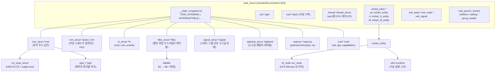
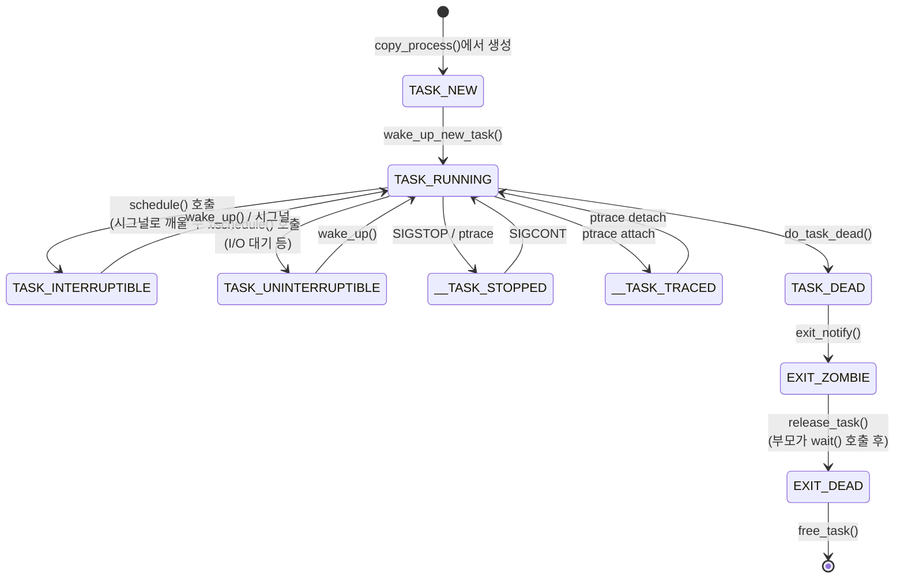
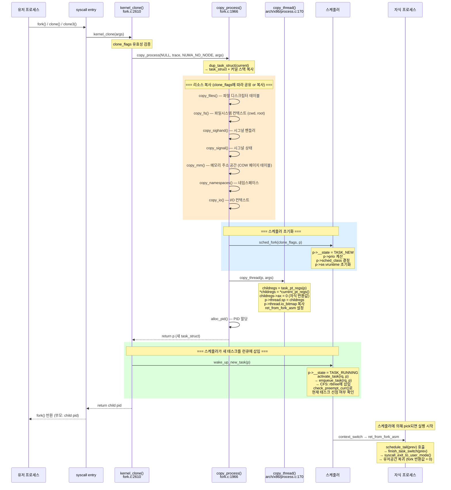
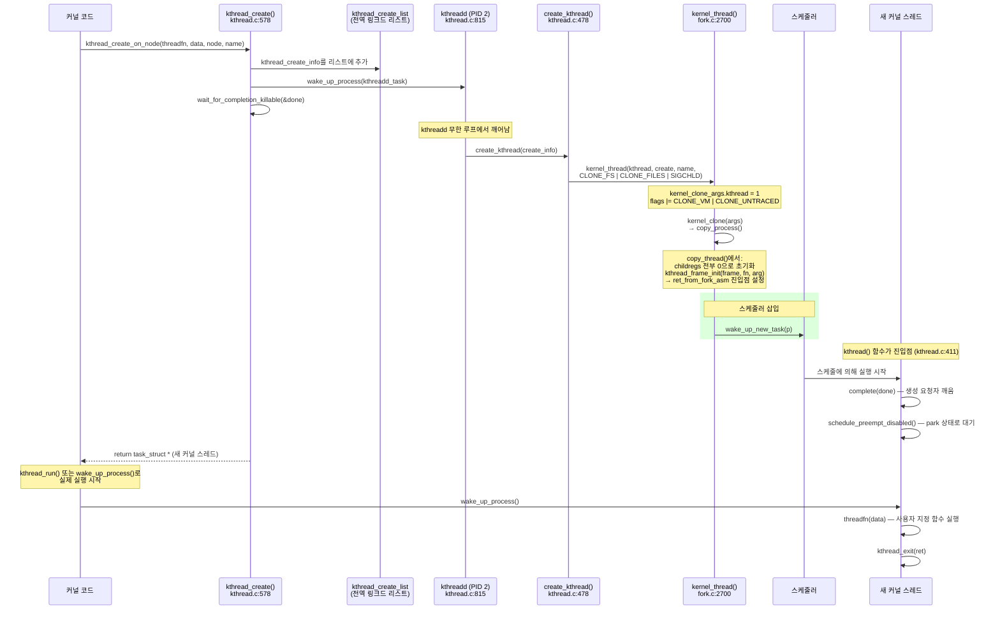
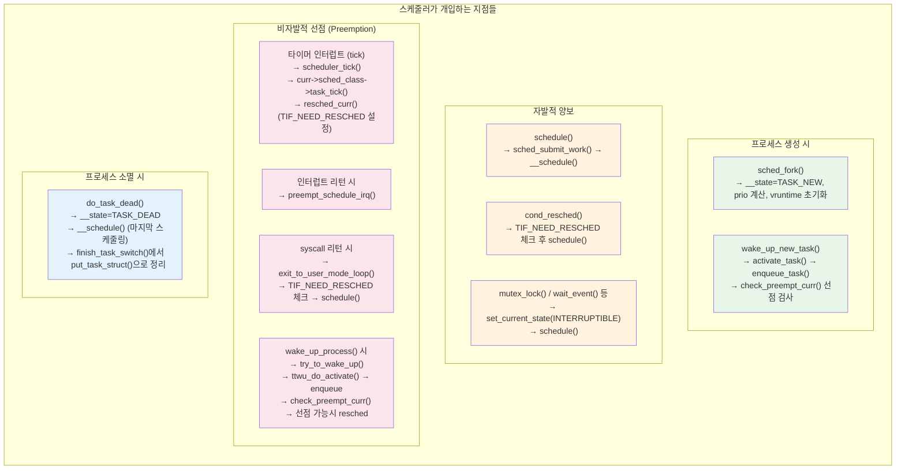
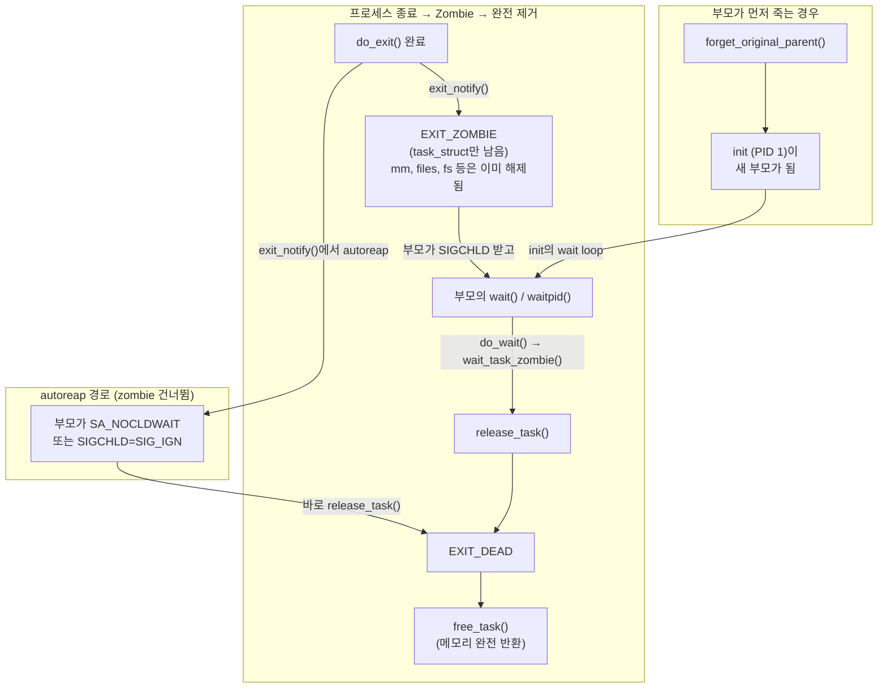
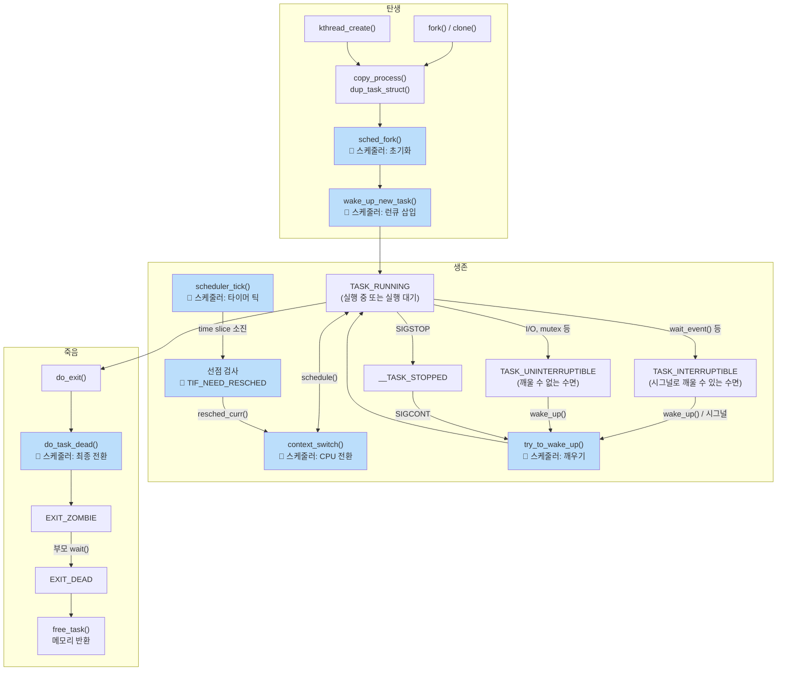

# Linux 6.19 커널 프로세스의 삶 — 생성, 전환, 소멸

> 소스 기준: `/home/inineapa/Lab/linux-6.19`

---

## 1. 핵심 자료구조와 관계

### 1.1 전체 구조 다이어그램



### 1.2 스케줄러 관련 자료구조


### 1.3 task_struct 상태 전이



---

## 2. 프로세스 생성

### 2.1 유저 공간 프로세스 생성 (fork / clone)



#### 핵심 코드 포인트

| 단계 | 함수 | 위치 | 핵심 동작 |
|------|------|------|-----------|
| 진입 | `kernel_clone()` | `fork.c:2610` | clone_flags 검증, copy_process 호출 |
| 복사 | `dup_task_struct()` | `fork.c:1052` | task_struct 메모리 할당 + 복사 |
| 스케줄러 초기화 | `sched_fork()` | `core.c` | 상태=TASK_NEW, vruntime 초기화 |
| arch 설정 | `copy_thread()` | `arch/x86/process.c:170` | 레지스터 프레임 설정, ax=0 |
| 런큐 삽입 | `wake_up_new_task()` | `core.c` | TASK_RUNNING 전환, enqueue |
| 자식 첫 실행 | `ret_from_fork_asm` | `entry_64.S` | schedule_tail() → 유저 복귀 |

**`CLONE_*` 플래그에 따른 공유 vs 복사:**

| 플래그 | 설정 시 | 미설정 시 |
|--------|---------|-----------|
| `CLONE_VM` | mm 공유 (스레드) | mm 복사 (COW) |
| `CLONE_FILES` | files_struct 공유 | 복사 |
| `CLONE_FS` | fs_struct 공유 | 복사 |
| `CLONE_SIGHAND` | sighand 공유 | 복사 |
| `CLONE_THREAD` | 같은 스레드 그룹 | 새 스레드 그룹 |

### 2.2 커널 스레드 생성



**커널 스레드 vs 유저 프로세스 차이:**

| 속성 | 커널 스레드 | 유저 프로세스 |
|------|-------------|---------------|
| `mm` | NULL (유저 주소 공간 없음) | 고유 mm_struct |
| `active_mm` | 이전 태스크에서 빌려씀 (lazy TLB) | == mm |
| `PF_KTHREAD` 플래그 | 설정됨 | 미설정 |
| 페이지 테이블 | 커널 페이지 테이블만 사용 | 유저+커널 |
| `copy_thread()` 동작 | childregs=0, kthread_frame_init | 부모 regs 복사, ax=0 |

---

## 3. 컨텍스트 스위치 (Context Switch)

### 3.1 전체 흐름


### 3.2 스케줄러 개입 지점 종합



### 3.3 x86_64에서의 CPU 상태 전환 상세

전환 시 저장/복원되는 CPU 상태:

| 분류 | 항목 | 저장 위치 | 전환 함수 |
|------|------|-----------|-----------|
| 범용 레지스터 | rbp, rbx, r12-r15 | 커널 스택 (push/pop) | `__switch_to_asm` |
| 스택 포인터 | rsp | `thread.sp` | `__switch_to_asm` |
| 페이지 테이블 | CR3 | `mm->pgd` | `switch_mm_irqs_off` |
| FPU/SSE/AVX | xmm, ymm, zmm 등 | `fpu->__fpstate` | `switch_fpu` |
| 세그먼트 레지스터 | FS, GS, DS, ES | `thread.fsbase/gsbase/ds/es` | `__switch_to` |
| TLS | GDT 엔트리 | `thread.tls_array` | `load_TLS` |
| 메모리 보호 키 | PKRU | `thread.pkru` | `x86_pkru_load` |
| per-CPU 변수 | `current_task` | GS base 기반 | `raw_cpu_write` |
| 스택 canary | `__stack_chk_guard` | per-CPU | `__switch_to_asm` |

---

## 4. 프로세스 소멸

### 4.1 전체 소멸 과정

```mermaid
sequenceDiagram
    participant U as 유저 프로세스
    participant SYS as syscall
    participant DGE as do_group_exit()<br/>exit.c:1087
    participant DE as do_exit()<br/>exit.c:896
    participant EN as exit_notify()<br/>exit.c:736
    participant PAR as 부모 프로세스
    participant RT as release_task()<br/>exit.c:244
    participant SCHED as 스케줄러
    participant RCU as RCU callback

    U->>SYS: exit(code) 또는 exit_group(code)
    SYS->>DGE: do_group_exit((code & 0xff) << 8)
    Note over DGE: signal->flags = SIGNAL_GROUP_EXIT<br/>zap_other_threads(current)<br/>→ 같은 스레드 그룹의 다른 스레드에 SIGKILL

    DGE->>DE: do_exit(exit_code)

    rect rgb(255, 245, 230)
        Note over DE: === Phase 1: 조기 정리 ===
        DE->>DE: exit_signals(tsk) — PF_EXITING 설정
        DE->>DE: ptrace_event(PTRACE_EVENT_EXIT)
        DE->>DE: io_uring_files_cancel()
    end

    rect rgb(255, 235, 205)
        Note over DE: === Phase 2: 리소스 해제 (순서 중요!) ===
        DE->>DE: exit_mm() — 메모리 주소 공간 해제
        DE->>DE: exit_sem() — System V 세마포어
        DE->>DE: exit_shm() — 공유 메모리
        DE->>DE: exit_files() — 파일 디스크립터 닫기
        DE->>DE: exit_fs() — 파일시스템 컨텍스트
        DE->>DE: disassociate_ctty(1) — 제어 터미널 분리
        DE->>DE: exit_nsproxy_namespaces() — 네임스페이스
        DE->>DE: exit_thread() — 아키텍처별 정리
        DE->>DE: exit_io_context()
    end

    rect rgb(220, 240, 255)
        Note over DE,EN: === Phase 3: 부모 통지 ===
        DE->>EN: exit_notify(tsk, group_dead)
        EN->>EN: forget_original_parent(tsk, &dead)
        Note over EN: 자식 프로세스들을 reaper(init)에게 재배정<br/>(reparenting)
        EN->>EN: tsk->exit_state = EXIT_ZOMBIE

        alt 부모가 SA_NOCLDWAIT 또는 SIG_IGN
            EN->>EN: tsk->exit_state = EXIT_DEAD (autoreap)
            EN->>RT: release_task(tsk) — 즉시 해제
        else 일반 종료
            EN->>PAR: do_notify_parent(tsk, SIGCHLD)
            Note over PAR: siginfo 구성:<br/>si_code = CLD_EXITED / CLD_KILLED<br/>si_status = exit_code or signal<br/>__wake_up_parent()로 wait() 깨움
        end
    end

    rect rgb(255, 220, 220)
        Note over DE,SCHED: === Phase 4: 최종 스케줄링 ===
        DE->>DE: exit_rcu() / exit_tasks_rcu_finish()
        DE->>SCHED: do_task_dead()
        Note over SCHED: __state = TASK_DEAD<br/>__schedule(SM_NONE) — 마지막 스케줄 호출<br/>→ 다른 태스크로 전환<br/>→ finish_task_switch()에서:<br/>   put_task_struct_rcu_user(prev)
    end

    Note over PAR: (나중에) wait4() / waitpid() 호출
    PAR->>RT: release_task(zombie)

    rect rgb(230, 255, 230)
        Note over RT: === Phase 5: task_struct 완전 제거 ===
        RT->>RT: __exit_signal() — 시그널 구조 정리, unhash
        RT->>RT: __unhash_process() — PID/태스크 리스트에서 제거
        RT->>RT: proc_flush_pid() — /proc 엔트리 제거
        RT->>RCU: put_task_struct_rcu_user(p)

        Note over RCU: RCU grace period 후:
        RCU->>RCU: delayed_put_task_struct()
        RCU->>RCU: __put_task_struct()
        Note over RCU: io_uring_free()<br/>cgroup_task_free()<br/>security_task_free()<br/>exit_creds()<br/>put_signal_struct()
        RCU->>RCU: free_task()
        Note over RCU: 커널 스택 해제<br/>arch_release_task_struct()<br/>free_task_struct()<br/>→ kmem_cache_free()
    end
```

### 4.2 리소스 해제 순서와 이유

```
do_exit() 내 리소스 해제 순서:

1. exit_mm()          ← 가장 먼저: 유저 메모리는 더 이상 접근 안 함
2. exit_sem()         ← IPC 세마포어 undo 리스트 정리
3. exit_shm()         ← 공유 메모리 세그먼트 분리
4. exit_files()       ← 열린 파일 닫기 (소켓, 파이프 포함)
5. exit_fs()          ← cwd, root 참조 해제
6. disassociate_ctty() ← 제어 터미널 분리 (세션 리더인 경우)
7. exit_nsproxy_namespaces() ← 네임스페이스 참조 해제
8. exit_thread()      ← 아키텍처별 정리 (I/O 비트맵 등)
9. exit_io_context()  ← 블록 I/O 스케줄러 컨텍스트

mm이 가장 먼저 해제되는 이유:
- 파일 close 등에서 유저 공간 접근이 필요 없음
- mm 해제 후 active_mm은 커널이 빌려쓸 수 있음
- COW 페이지 등 대량 메모리를 조기 반환
```

### 4.3 Zombie와 Wait의 관계



---

## 5. 프로세스의 전체 생애주기 통합 다이어그램



> 🔷 표시는 스케줄러가 직접 관여하는 지점

---

## 6. 주요 함수 빠른 참조

| 함수 | 파일:라인 | 역할 |
|------|-----------|------|
| `kernel_clone()` | `kernel/fork.c:2610` | fork/clone 진입점 |
| `copy_process()` | `kernel/fork.c:1966` | 프로세스 깊은 복사 |
| `dup_task_struct()` | `kernel/fork.c:1052` | task_struct 메모리 복사 |
| `copy_thread()` | `arch/x86/kernel/process.c:170` | x86 레지스터 프레임 설정 |
| `sched_fork()` | `kernel/sched/core.c` | 스케줄러 초기화 |
| `wake_up_new_task()` | `kernel/sched/core.c` | 새 태스크 런큐 삽입 |
| `kernel_thread()` | `kernel/fork.c:2700` | 커널 스레드 생성 |
| `kthreadd()` | `kernel/kthread.c:815` | 커널 스레드 데몬 (PID 2) |
| `schedule()` | `kernel/sched/core.c:6954` | 자발적 스케줄링 진입 |
| `__schedule()` | `kernel/sched/core.c:6722` | 스케줄링 핵심 로직 |
| `pick_next_task()` | `kernel/sched/core.c:5971` | 다음 실행 태스크 선택 |
| `context_switch()` | `kernel/sched/core.c:5201` | mm + 레지스터 전환 총괄 |
| `__switch_to_asm()` | `arch/x86/entry/entry_64.S:178` | 스택/레지스터 물리 전환 |
| `__switch_to()` | `arch/x86/kernel/process_64.c:610` | x86 CPU 상태 전환 |
| `finish_task_switch()` | `kernel/sched/core.c:5075` | 전환 후 정리 (new 스택) |
| `do_exit()` | `kernel/exit.c:896` | 프로세스 종료 메인 |
| `exit_notify()` | `kernel/exit.c:736` | 부모 통지 + 자식 재배정 |
| `release_task()` | `kernel/exit.c:244` | zombie 완전 제거 |
| `do_task_dead()` | `kernel/sched/core.c:6880` | 마지막 스케줄 호출 |
| `free_task()` | `kernel/fork.c:528` | task_struct 메모리 해제 |
