# The Life of a Linux 6.19 Kernel Process — Creation, Switching, and Destruction

> Source base: `/home/inineapa/Lab/linux-6.19`

---

## 1. Core Data Structures and Their Relationships

Every process in the Linux kernel is represented by a `task_struct`, defined at `include/linux/sched.h:819`. This single structure is the kernel's view of a process — it holds the process state, scheduling parameters, PID, kernel stack pointer, and pointers to every resource the process owns. Rather than embedding all data directly, `task_struct` points outward to separate structures that each manage a specific domain of the process's resources.

The `__state` field records the current scheduling state of the task: `TASK_RUNNING`, `TASK_INTERRUPTIBLE`, `TASK_UNINTERRUPTIBLE`, and so on. The `pid` and `tgid` fields identify the task at the individual thread level and the thread group level, respectively. The `void *stack` field points to the base of the kernel stack, which is allocated per-task and is used whenever the CPU is executing kernel code on behalf of this process.

The `thread` field, of type `thread_struct`, stores the architecture-specific CPU register state that must be saved and restored during context switches. On x86_64, this includes the stack pointer (`sp`), FS/GS base addresses, I/O permission bitmaps, and floating-point state.

Scheduling is governed by a trio of embedded entities: `sched_entity` (for CFS), `sched_rt_entity` (for real-time), and `sched_dl_entity` (for deadline scheduling). The `sched_class` pointer determines which scheduling class currently governs this task.

The exit-related fields — `exit_state`, `exit_code`, and `exit_signal` — track whether the process is alive, a zombie awaiting reaping, or fully dead. The family relationship fields (`real_parent`, `parent`, `children`, `sibling`, `group_leader`) form the process tree that determines signal delivery and wait semantics.

Each `task_struct` points to the following shared or per-process structures:

- **`mm_struct *mm`**: The user-space address space. Contains the page table root (`pgd`), the VMA tree (via maple tree), and memory accounting data. Kernel threads set this to NULL.
- **`mm_struct *active_mm`**: The address space currently loaded into the CPU's page table registers. For user processes this equals `mm`. For kernel threads, this is "borrowed" from the previous user process via lazy TLB switching.
- **`fs_struct *fs`**: The filesystem context — current working directory, root directory, and umask.
- **`files_struct *files`**: The file descriptor table, mapping integer file descriptors to `struct file *` pointers via the `fdtable`.
- **`signal_struct *signal`**: Thread-group-wide signal state, shared among all threads in a process.
- **`sighand_struct *sighand`**: The signal handler table, mapping signal numbers to their registered handlers.
- **`nsproxy *nsproxy`**: Namespace proxy, pointing to the PID, network, mount, UTS, and IPC namespaces this task belongs to.
- **`cred *cred`**: Credentials — UID, GID, and capabilities.

The `sched_entity` embedded in `task_struct` contains a `rb_node run_node` used to position the task within the CFS red-black tree, and a `u64 vruntime` that records the task's virtual runtime — the key by which CFS orders tasks for fairness.

### 1.1 task_struct Overall Structure

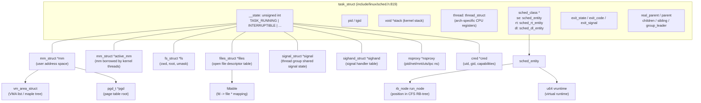

### 1.2 Scheduler-Related Data Structures

The scheduler operates on a per-CPU `struct rq` (runqueue), defined at `kernel/sched/sched.h:1119`. Each runqueue holds a spinlock, a count of runnable tasks (`nr_running`), pointers to the currently executing task (`curr`) and the idle task (`idle`), and embedded sub-runqueues for each scheduling class: `cfs_rq`, `rt_rq`, and `dl_rq`.

The CFS runqueue maintains a red-black tree sorted by `vruntime`. The task with the smallest `vruntime` is always the leftmost node in the tree and is the next candidate for execution. Each `sched_entity` within the tree carries a `load_weight` (derived from the task's nice value), the `run_node` for tree positioning, `vruntime`, `slice` (the time slice allocated), and `sum_exec_runtime` (total CPU time consumed).

The kernel defines five scheduling classes, checked in strict priority order from highest to lowest: `stop_sched_class` (used for CPU hotplug and migration), `dl_sched_class` (SCHED_DEADLINE), `rt_sched_class` (SCHED_FIFO / SCHED_RR), `fair_sched_class` (CFS, the default), and `idle_sched_class` (the idle task). The scheduler iterates through these classes in order; the first class that has a runnable task wins.

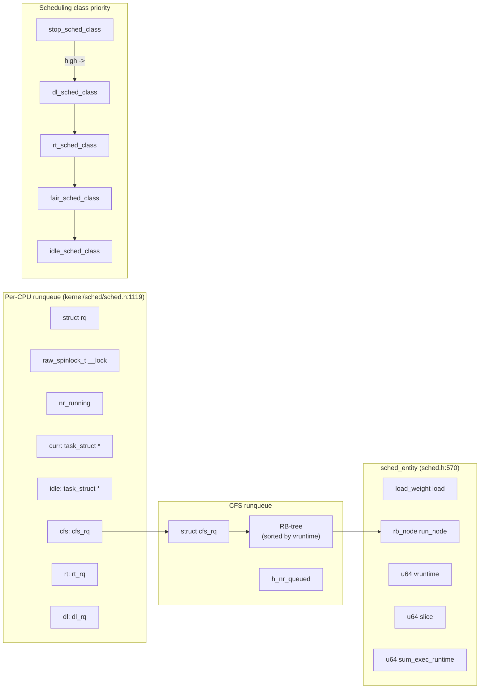

### 1.3 task_struct State Transitions

A task begins its life in the `TASK_NEW` state, set by `copy_process()` during creation. When `wake_up_new_task()` is called, it transitions to `TASK_RUNNING` and becomes eligible for scheduling. From `TASK_RUNNING`, a task may enter `TASK_INTERRUPTIBLE` (sleeping but can be woken by signals) or `TASK_UNINTERRUPTIBLE` (sleeping, only woken by the specific event it awaits — commonly I/O completion). It can also be stopped via `SIGSTOP` or traced via `ptrace`.

When the task terminates, `do_task_dead()` sets it to `TASK_DEAD`, and `exit_notify()` marks it as `EXIT_ZOMBIE`. The zombie remains until the parent calls `wait()`, at which point `release_task()` transitions it to `EXIT_DEAD` and `free_task()` reclaims the memory.

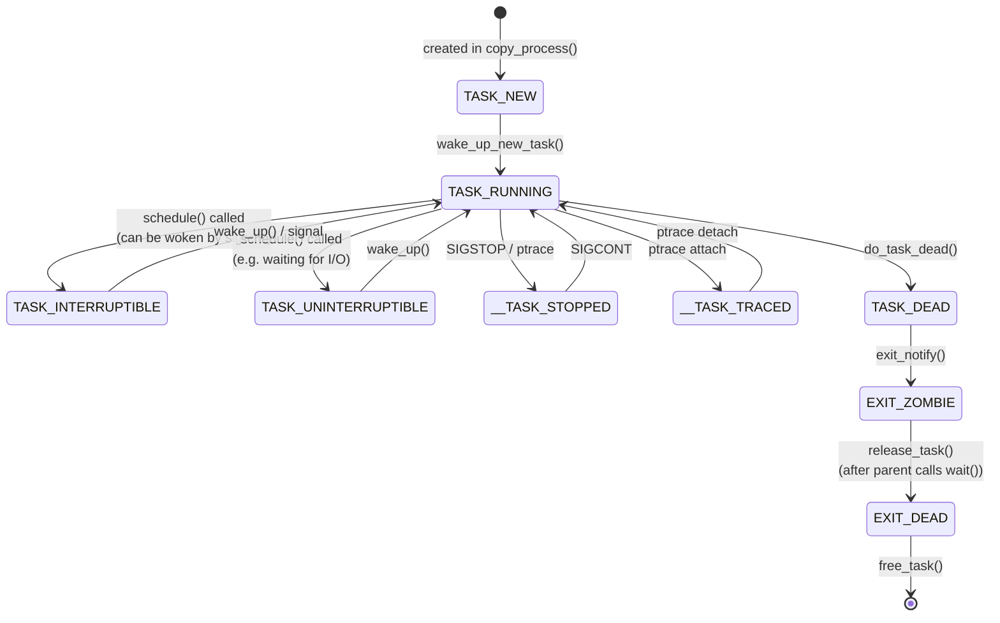

---

## 2. Process Creation

### 2.1 User-Space Process Creation (fork / clone)

When a user-space process calls `fork()`, `clone()`, or `clone3()`, the syscall entry layer routes the request to `kernel_clone()` (`fork.c:2610`). This function first validates the clone flags, then calls `copy_process()` (`fork.c:1966`) to perform the deep copy of the parent's `task_struct`.

Inside `copy_process()`, the first step is `dup_task_struct(current)` (`fork.c:1052`), which allocates a new `task_struct` and kernel stack, then copies the parent's entire `task_struct` into the new one. Following this, the function copies or shares each resource category depending on the `CLONE_*` flags provided. For example, `copy_mm()` either duplicates the entire memory address space with copy-on-write (COW) page table entries, or — if `CLONE_VM` is set — simply shares the parent's `mm_struct` (this is how threads work).

The remaining copy functions follow the same pattern: `copy_files()` for file descriptors, `copy_fs()` for the filesystem context, `copy_sighand()` for signal handlers, `copy_signal()` for signal state, `copy_namespaces()` for namespaces, and `copy_io()` for the I/O context. Each one either increments a reference count on the parent's structure (sharing) or allocates a new copy.

After resource copying, the scheduler is initialized via `sched_fork()`. This sets the child's state to `TASK_NEW`, computes its priority, determines its scheduling class, and initializes its `vruntime`.

Then `copy_thread()` (`arch/x86/kernel/process.c:170`) sets up the architecture-specific register frame. On x86_64, it copies the parent's `pt_regs` into the child's kernel stack, sets `childregs->ax = 0` (so that fork returns 0 in the child), stores the child's stack pointer, copies the I/O permission bitmap, and configures `ret_from_fork_asm` as the entry point for when the child is first scheduled.

Finally, `alloc_pid()` assigns a PID, and control returns to `kernel_clone()`, which calls `wake_up_new_task()` to insert the child into the scheduler's runqueue. This sets the child's state to `TASK_RUNNING`, calls `enqueue_task()` to place it in the CFS red-black tree, and invokes `check_preempt_curr()` to determine whether the new child should preempt the currently running task.

The parent receives the child's PID as the return value of `fork()`. The child, when eventually picked by the scheduler, begins execution at `ret_from_fork_asm`, calls `finish_task_switch()` to complete the context switch bookkeeping, then returns to user space with a return value of 0.

#### Key Code Points

| Stage | Function | Location | Core Action |
|-------|----------|----------|-------------|
| Entry | `kernel_clone()` | `fork.c:2610` | Validate clone_flags, call copy_process |
| Copy | `dup_task_struct()` | `fork.c:1052` | Allocate and copy task_struct + kernel stack |
| Scheduler init | `sched_fork()` | `core.c` | state=TASK_NEW, initialize vruntime |
| Arch setup | `copy_thread()` | `arch/x86/process.c:170` | Set up register frame, ax=0 |
| Enqueue | `wake_up_new_task()` | `core.c` | Transition to TASK_RUNNING, enqueue |
| Child first run | `ret_from_fork_asm` | `entry_64.S` | schedule_tail() -> return to user space |

**Sharing vs. copying based on `CLONE_*` flags:**

| Flag | When set | When unset |
|------|----------|------------|
| `CLONE_VM` | Share mm (thread) | Copy mm (COW) |
| `CLONE_FILES` | Share files_struct | Copy |
| `CLONE_FS` | Share fs_struct | Copy |
| `CLONE_SIGHAND` | Share sighand | Copy |
| `CLONE_THREAD` | Same thread group | New thread group |

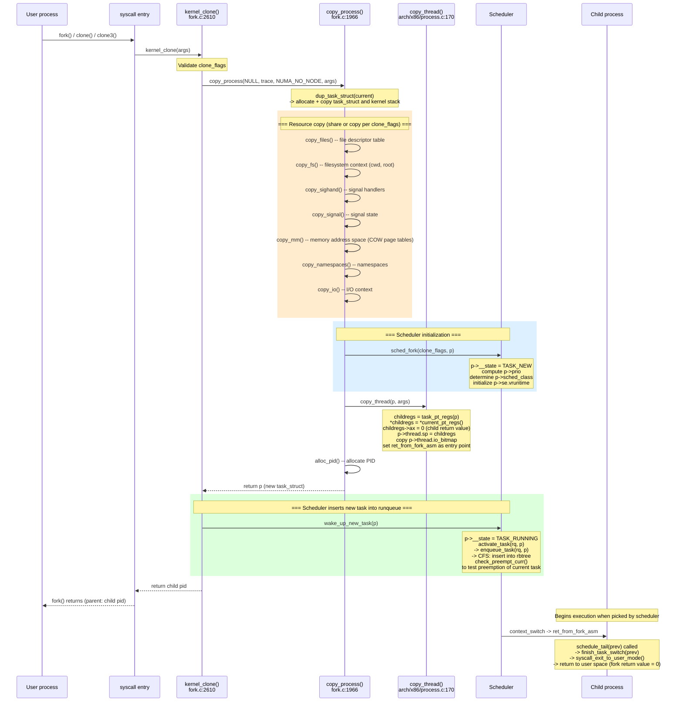

### 2.2 Kernel Thread Creation

Kernel threads are created through a different mechanism than user processes. The typical entry point is `kthread_create_on_node()` (`kthread.c:578`), which does not directly call `fork()`. Instead, it queues a `kthread_create_info` structure onto the global `kthread_create_list` and wakes up `kthreadd`, the kernel thread daemon (PID 2, `kthread.c:815`).

The `kthreadd` daemon runs an infinite loop. When it wakes, it dequeues a creation request and calls `create_kthread()` (`kthread.c:478`), which in turn calls `kernel_thread()` (`fork.c:2700`). This function sets up `kernel_clone_args` with the `kthread` flag set to 1, and forces `CLONE_VM | CLONE_UNTRACED` in addition to the caller-specified flags (typically `CLONE_FS | CLONE_FILES | SIGCHLD`).

Inside `copy_thread()`, the behavior differs from user process creation: all child registers (`childregs`) are zeroed out, and `kthread_frame_init()` sets up the kernel thread's function and argument pointers. The entry point is still `ret_from_fork_asm`, but the execution path diverges — the new thread enters the `kthread()` function (`kthread.c:411`) rather than returning to user space.

Once the kernel thread is scheduled for the first time, it calls `complete(done)` to notify the creator that it exists, then parks itself with `schedule_preempt_disabled()`. The creator receives the `task_struct *` pointer back and can either call `wake_up_process()` directly or use the convenience wrapper `kthread_run()` to immediately start the thread's designated function `threadfn(data)`.

When the kernel thread finishes its work, it calls `kthread_exit()`.

**Kernel thread vs. user process differences:**

| Property | Kernel thread | User process |
|----------|---------------|--------------|
| `mm` | NULL (no user address space) | Own mm_struct |
| `active_mm` | Borrowed from previous task (lazy TLB) | == mm |
| `PF_KTHREAD` flag | Set | Not set |
| Page tables | Kernel page tables only | User + kernel |
| `copy_thread()` behavior | childregs=0, kthread_frame_init | Copy parent regs, ax=0 |

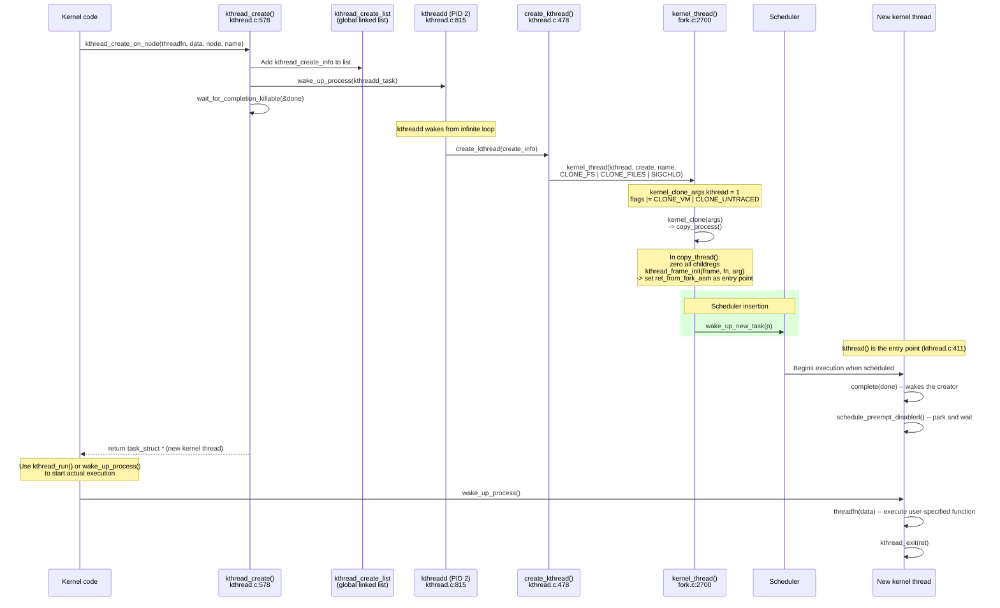

---

## 3. Context Switch

### 3.1 Overall Flow

A context switch is the mechanism by which the CPU stops executing one task and begins executing another. This can happen voluntarily (the task calls `schedule()` or `cond_resched()`), or involuntarily (the scheduler forces preemption via `preempt_schedule_irq()` at interrupt return, or via `exit_to_user_mode()` at syscall return).

Regardless of the trigger, the core function is `__schedule()` (`core.c:6722`). It begins by disabling local interrupts and acquiring the runqueue lock. It then reads the previous task's state. If the previous task is no longer `TASK_RUNNING` (for example, it has set its state to `TASK_INTERRUPTIBLE` before calling `schedule()`), the function calls `try_to_block_task()` to dequeue it from the runqueue.

Next, `pick_next_task()` iterates through the scheduling classes in priority order and selects the next task to run. For the common case where only CFS tasks are present, `pick_next_task_fair()` selects the `sched_entity` with the smallest `vruntime` from the red-black tree.

If the selected task is different from the currently running task, a context switch is necessary. `context_switch()` (`core.c:5201`) performs this in three stages:

**Stage 1 — Preparation:** `prepare_task_switch()` fires perf events for the scheduling-out task and marks the incoming task as on-CPU.

**Stage 2 — Memory space switch:** If the next task is a kernel thread (`next->mm == NULL`), the kernel simply enters lazy TLB mode — the next task borrows the previous task's `active_mm`, avoiding a costly TLB flush. If the next task is a user process, `switch_mm_irqs_off()` loads the new task's page directory (`pgd`) into the CR3 register, switching the page tables and (unless PCID is used) flushing the TLB.

**Stage 3 — CPU register switch:** `switch_to()` calls `__switch_to_asm()` (`entry_64.S:178`), which is the point where the CPU physically transitions from one task to another. This assembly routine pushes the callee-saved registers (`rbp`, `rbx`, `r12`-`r15`) onto the current (old) task's kernel stack, saves the old stack pointer to `prev->thread.sp`, loads the new task's stack pointer from `next->thread.sp` into `%rsp`, pops the new task's callee-saved registers, and fills the return speculation buffer (Spectre RSB mitigation). It then jumps to `__switch_to()` (`process_64.c:610`), which handles the remaining CPU state: FPU/SIMD state, FS/GS segment bases, TLS descriptors, segment registers, memory protection keys (PKRU), and the per-CPU `current_task` pointer.

From this point forward, the CPU is executing on the new task's kernel stack. The new task calls `finish_task_switch(prev)` (`core.c:5075`) to complete the transition: it fires perf scheduling-in events, clears `prev->on_cpu`, releases the runqueue lock, and — critically — if `prev` was in `TASK_DEAD` state, it calls `put_task_stack()` and `put_task_struct_rcu_user()` to begin the final cleanup of the dead task's resources (see Section 4).

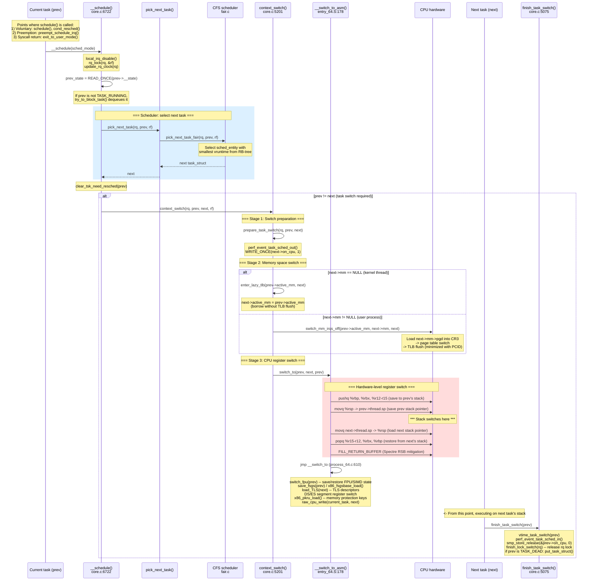

### 3.2 Summary of Scheduler Intervention Points

The scheduler intervenes at specific, well-defined points throughout a process's lifetime. During process creation, `sched_fork()` initializes the scheduling parameters and `wake_up_new_task()` enqueues the new task. During normal execution, voluntary scheduling occurs when a task calls `schedule()`, `cond_resched()`, or blocks on a mutex or wait queue. Involuntary preemption is triggered by the timer interrupt (`scheduler_tick()` sets `TIF_NEED_RESCHED`), checked at interrupt return (`preempt_schedule_irq()`), at syscall return (`exit_to_user_mode_loop()`), and when a higher-priority task is woken up (`try_to_wake_up()` calls `check_preempt_curr()`). At process death, `do_task_dead()` performs the final involuntary scheduling call, after which `finish_task_switch()` handles the dead task's cleanup.

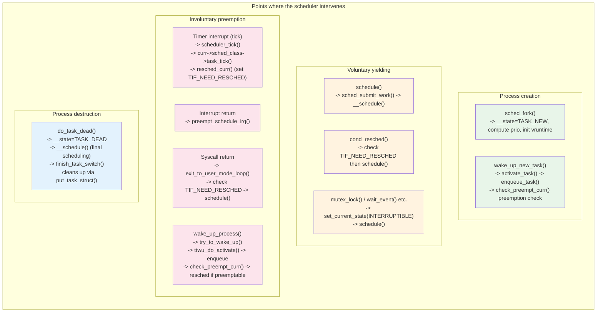

### 3.3 Detailed CPU State Switch on x86_64

The following table enumerates all CPU state that must be saved and restored during a context switch on x86_64:

| Category | Items | Saved in | Switch function |
|----------|-------|----------|-----------------|
| General-purpose registers | rbp, rbx, r12-r15 | Kernel stack (push/pop) | `__switch_to_asm` |
| Stack pointer | rsp | `thread.sp` | `__switch_to_asm` |
| Page tables | CR3 | `mm->pgd` | `switch_mm_irqs_off` |
| FPU/SSE/AVX | xmm, ymm, zmm etc. | `fpu->__fpstate` | `switch_fpu` |
| Segment registers | FS, GS, DS, ES | `thread.fsbase/gsbase/ds/es` | `__switch_to` |
| TLS | GDT entries | `thread.tls_array` | `load_TLS` |
| Memory protection keys | PKRU | `thread.pkru` | `x86_pkru_load` |
| Per-CPU variable | `current_task` | GS base relative | `raw_cpu_write` |
| Stack canary | `__stack_chk_guard` | per-CPU | `__switch_to_asm` |

---

## 4. Process Destruction

### 4.1 Two Paths to Death: exit() and Fatal Signals

A process can terminate in two fundamentally different ways: by voluntarily calling `exit()` (or `exit_group()`), or by receiving a fatal signal (such as `SIGKILL`, `SIGSEGV`, or `SIGTERM` with default disposition). Although the triggers differ, both paths converge on the same function: `do_exit()`.

**Voluntary exit:** When a process calls `exit()` (the single-thread variant), the syscall handler invokes `do_exit(code)` directly. When it calls `exit_group()`, the handler invokes `do_group_exit()` (`exit.c:1086`), which first sets `SIGNAL_GROUP_EXIT` on the thread group's `signal_struct`, then calls `zap_other_threads(current)` to send `SIGKILL` to every other thread in the group. After that, it calls `do_exit()`. Both `do_group_exit()` and `do_exit()` are annotated `__noreturn` — they never return to their caller.

**Signal-based termination:** When a fatal signal is delivered to a process, the signal delivery mechanism takes a different entry path. The function `complete_signal()` (`signal.c:963`) is called as part of `__send_signal_locked()`. For signals that are fatal and do not produce a core dump (e.g., `SIGKILL`, `SIGTERM`), `complete_signal()` immediately sets `SIGNAL_GROUP_EXIT` on the signal struct and force-enqueues `SIGKILL` on every thread in the thread group, waking each one with `signal_wake_up()`.

Each woken thread, upon returning from its current syscall or interrupt, enters the signal processing path. The function `get_signal()` (`signal.c:2799`) is called from the architecture-specific return-to-user-mode code. When `get_signal()` sees that `SIGNAL_GROUP_EXIT` is already set, it jumps directly to the fatal exit path, sets `PF_SIGNALED` on the task, and calls `do_group_exit(signr)`. For core-dumping signals (e.g., `SIGSEGV`, `SIGABRT`), `get_signal()` first calls `vfs_coredump()` to write the core dump, then proceeds to `do_group_exit()`.

The complete signal-to-death chain is: signal sent -> `__send_signal_locked()` -> `complete_signal()` (wakes all threads, sets `SIGNAL_GROUP_EXIT`) -> each thread returns to user mode -> `get_signal()` -> `do_group_exit()` -> `do_exit()` -> `do_task_dead()` -> `__schedule()` -> never returns.

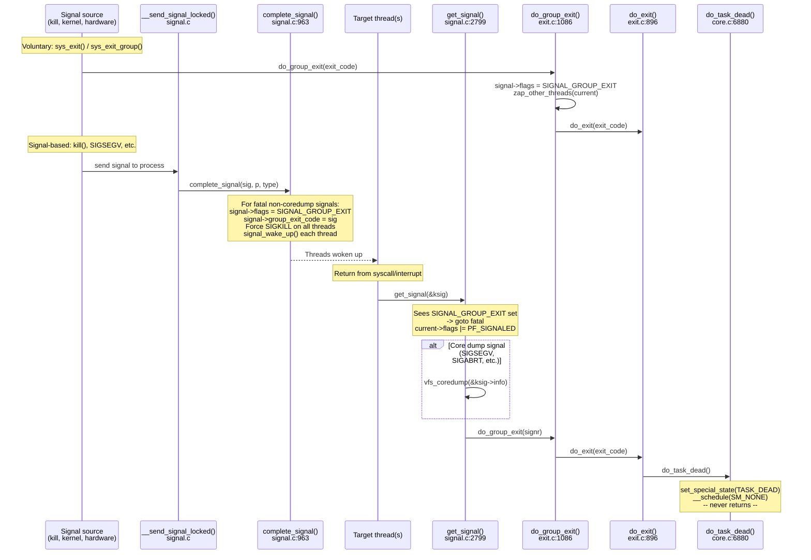

### 4.2 The Role of do_exit()

The function `do_exit()` (`exit.c:896`) is the central teardown routine for a dying process. It is declared as `void __noreturn do_exit(long code)` — meaning the compiler guarantees (and relies on the fact) that this function will never return. Everything after the call to `do_exit()` is dead code.

The function proceeds through several phases of cleanup, executed in a carefully ordered sequence:

**Phase 1 — Early cleanup:** `synchronize_group_exit()` sets `SIGNAL_GROUP_EXIT` and handles coredump serialization. Then `exit_signals()` sets the `PF_EXITING` flag on the current task, which serves as a signal to other parts of the kernel that this task is in the process of dying and should not receive further signals. `ptrace_event(PTRACE_EVENT_EXIT)` notifies any attached debugger, and `io_uring_files_cancel()` cancels outstanding asynchronous I/O operations.

**Phase 2 — Resource release:** This is the bulk of the function. Resources are released in a specific order that avoids use-after-free and lock ordering problems:

1. `exit_mm()` — Releases the user memory address space first, because after this point no user-space memory accesses will occur. Releasing the mm early also returns potentially large amounts of COW memory to the system as soon as possible. After `exit_mm()`, the `active_mm` can be borrowed by kernel threads via lazy TLB.
2. `exit_sem()` — Cleans up System V semaphore undo lists.
3. `exit_shm()` — Detaches shared memory segments.
4. `exit_files()` — Closes all open file descriptors (including sockets and pipes).
5. `exit_fs()` — Releases filesystem context (current working directory and root references).
6. `disassociate_ctty(1)` — Detaches the controlling terminal (relevant for session leaders).
7. `exit_nsproxy_namespaces()` — Drops namespace references.
8. `exit_thread()` — Architecture-specific cleanup (e.g., I/O permission bitmaps on x86).
9. `exit_io_context()` — Releases the block I/O scheduler context.

The reason `exit_mm()` comes first is threefold: the file close operations that follow do not need to access user-space memory; after releasing mm, the `active_mm` remains available for the kernel to borrow; and releasing COW pages early frees potentially large amounts of physical memory for other processes.

**Phase 3 — Parent notification:** `exit_notify()` (`exit.c:736`) performs two critical actions. First, `forget_original_parent()` reparents all of the dying task's children to either a subreaper or `init` (PID 1). Second, it sets `tsk->exit_state = EXIT_ZOMBIE`. If the parent has set `SA_NOCLDWAIT` or `SIGCHLD` to `SIG_IGN`, the task is auto-reaped: `exit_state` is set to `EXIT_DEAD` and `release_task()` is called immediately, skipping the zombie state entirely. Otherwise, `do_notify_parent()` sends `SIGCHLD` to the parent and wakes it from any `wait()` call.

**Phase 4 — Final scheduling (the point of no return):** After RCU cleanup (`exit_rcu()`, `exit_tasks_rcu_finish()`), the function calls `preempt_disable()` at line 1007 of `exit.c`. From this point, the task must not sleep or be preempted — it is about to die. The final call is `do_task_dead()`.

### 4.3 do_task_dead() and Why a Process Cannot Free Its Own Stack

The function `do_task_dead()` (`core.c:6880`) is the true point of no return. Its implementation is remarkably short:

```c
void __noreturn do_task_dead(void)
{
    set_special_state(TASK_DEAD);
    current->flags |= PF_NOFREEZE;
    __schedule(SM_NONE);
    BUG();
    for (;;)
        cpu_relax();
}
```

`set_special_state(TASK_DEAD)` atomically sets the task's `__state` to `TASK_DEAD` (value `0x0080`) while holding the `pi_lock`, which serializes against any in-flight wakeup attempts. The `PF_NOFREEZE` flag tells the freezer subsystem to ignore this task. Then `__schedule(SM_NONE)` is called directly — not through the normal `schedule()` wrapper, because the normal wrapper loops on `need_resched()`, which is not appropriate for a task that is about to die.

Inside `__schedule()`, because the task's state is `TASK_DEAD` (non-zero, non-running), `try_to_block_task()` dequeues it from the runqueue. The scheduler then picks the next task, and `context_switch()` physically switches the CPU's stack pointer to the new task's kernel stack via `switch_to()`.

Here lies the fundamental reason why a process cannot clean up after itself: **at the moment of the context switch, the dying task is still using its own kernel stack**. Every local variable, every return address, every function frame from `do_exit()` through `do_task_dead()` through `__schedule()` through `context_switch()` to `switch_to()` — all of these live on the dying task's kernel stack. If the task attempted to free its own stack before calling `switch_to()`, the CPU would immediately fault, because it would be executing code with a stack pointer pointing to freed memory.

Therefore, the cleanup of the dead task's stack and `task_struct` is delegated to the **next task that runs on the same CPU**. After the stack pointer switches, the CPU is executing on the new task's stack. The new task calls `finish_task_switch(prev)`, where `prev` points to the dead task. Inside `finish_task_switch()`, the code checks whether `prev_state == TASK_DEAD`, and if so:

1. Calls `prev->sched_class->task_dead(prev)` for scheduling-class-specific cleanup.
2. Calls `put_task_stack(prev)` to release the kernel stack memory.
3. Calls `put_task_struct_rcu_user(prev)` to drop the RCU user reference, which schedules `delayed_put_task_struct()` to run after an RCU grace period.

This is why `do_task_dead()` ends with `do_exit()` calling `__schedule()` as its final act — it is not merely "finishing with a schedule call" but rather the only possible mechanism for the task to hand off its own physical resources to another entity that can safely free them.

The `BUG()` and `for (;;) cpu_relax()` after `__schedule()` are unreachable code. They exist as a defensive measure: `BUG()` will panic the kernel if `__schedule()` somehow returns (which should be impossible for a `TASK_DEAD` task), and the infinite `cpu_relax()` loop prevents the compiler from complaining about falling off the end of a `__noreturn` function if `BUG()` is compiled as a no-op.

### 4.4 The `__noreturn` Attribute

Both `do_exit()` and `do_task_dead()` are declared with the `__noreturn` attribute, defined in `include/linux/compiler_attributes.h:262` as:

```c
#define __noreturn  __attribute__((__noreturn__))
```

This GCC/Clang attribute informs the compiler that the function will never return to its caller. The compiler uses this information in several important ways:

1. **Dead code elimination:** Any code following a call to a `__noreturn` function is provably unreachable. The compiler can safely discard it, reducing binary size.
2. **Epilogue omission:** The compiler does not need to generate function epilogue code (stack frame teardown, return instruction) for the calling function after the call site.
3. **Warning suppression:** Without `__noreturn`, the compiler would emit warnings like "control reaches end of non-void function" for callers of `do_exit()`, since many code paths invoke `do_exit()` without an explicit return statement afterward.
4. **Optimization propagation:** The compiler can propagate the "does not return" information upward through the call graph, enabling further optimizations in callers.

For `do_task_dead()` specifically, the `__noreturn` contract is upheld because `__schedule()` performs a context switch that physically replaces the CPU's execution context — from the dying task's perspective, the instruction pointer never returns past the `switch_to()` call. The `BUG()` after `__schedule()` is a runtime assertion that this invariant holds, and the `for (;;) cpu_relax()` loop is a compile-time safeguard against `BUG()` being defined as a no-op in some kernel configurations.

### 4.5 The Full Termination Sequence

The following diagram traces the complete path from process exit to final memory reclamation, covering both voluntary exit and signal-based termination.

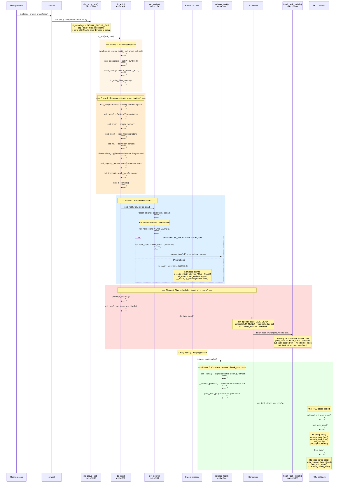

### 4.6 Resource Release Order and Rationale

The order in which `do_exit()` releases resources is not arbitrary. Each step is placed to avoid use-after-free conditions, lock ordering deadlocks, and unnecessary resource retention:

```
Resource release order inside do_exit():

1. exit_mm()                <- First: user memory is no longer accessed
2. exit_sem()               <- IPC semaphore undo list cleanup
3. exit_shm()               <- Shared memory segment detach
4. exit_files()             <- Close open files (sockets, pipes included)
5. exit_fs()                <- Release cwd, root references
6. disassociate_ctty()      <- Detach controlling terminal (if session leader)
7. exit_nsproxy_namespaces()<- Release namespace references
8. exit_thread()            <- Architecture-specific cleanup (I/O bitmap, etc.)
9. exit_io_context()        <- Block I/O scheduler context

Why mm is released first:
- File close operations do not need user-space memory access
- After mm release, active_mm can be borrowed by kernel threads
- COW pages and other large memory allocations are returned early
```

### 4.7 Zombies and the wait() Relationship

When a process finishes `do_exit()`, it does not simply vanish. Its `task_struct` lingers in one of two states: `EXIT_ZOMBIE` or `EXIT_DEAD`.

A zombie is a process that has released all of its resources (memory, files, etc.) but whose `task_struct` still exists because the parent has not yet called `wait()` to collect the exit status. The zombie is extremely lightweight — it holds only the `task_struct` shell with the exit code. Once the parent calls `wait()` (which internally calls `do_wait()` -> `wait_task_zombie()`), `release_task()` is invoked, which unhashes the process from all PID tables, removes its `/proc` entry, and schedules the final RCU-deferred `free_task()`.

In the autoreap path, the zombie state is skipped entirely. If the parent has set `SA_NOCLDWAIT` or has `SIGCHLD` set to `SIG_IGN`, `exit_notify()` sets the exit state directly to `EXIT_DEAD` and calls `release_task()` immediately.

If the parent dies before the child, `forget_original_parent()` reparents the child to `init` (PID 1) or the nearest subreaper process. The `init` process continuously calls `wait()` in a loop, ensuring that orphaned zombies are reaped promptly.

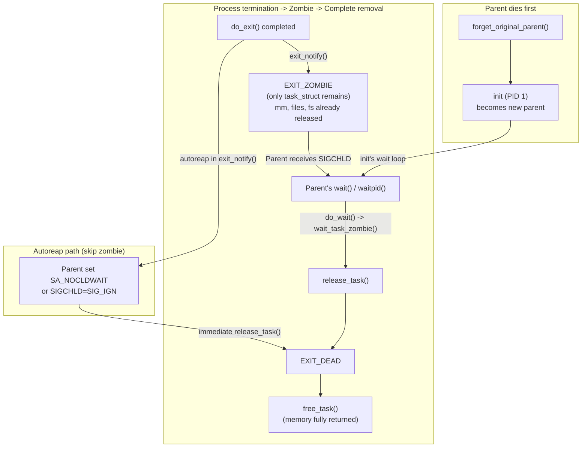

---

## 5. Integrated Lifecycle Diagram

The following diagram brings together all phases of a process's life — from creation through scheduling and context switching to final destruction. The blue-highlighted nodes indicate points where the scheduler is directly involved.

A process is born via `fork()`/`clone()` or `kthread_create()`, both of which go through `copy_process()` and `dup_task_struct()`. The scheduler initializes the new task in `sched_fork()` and inserts it into the runqueue via `wake_up_new_task()`. During its lifetime, the task cycles between `TASK_RUNNING` and various sleep states, with the scheduler mediating every transition via timer ticks, preemption checks, wakeups, and context switches. At death, `do_exit()` tears down resources, `do_task_dead()` performs the final context switch, and the zombie is reaped by the parent's `wait()` call.

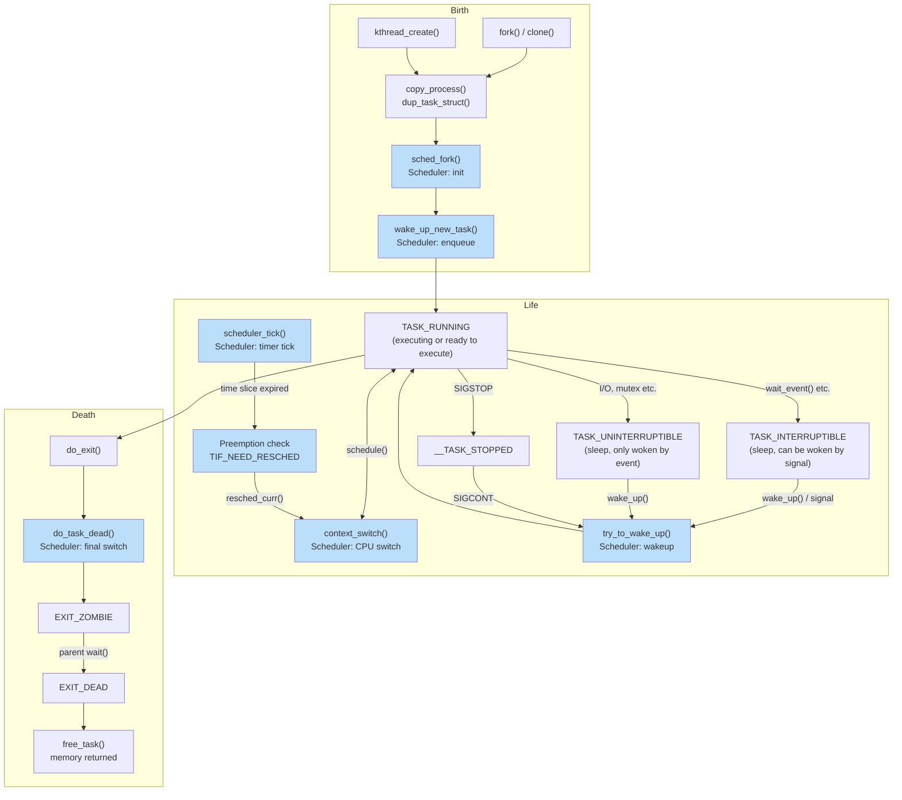

> Blue-highlighted nodes indicate points where the scheduler is directly involved.

---

## 6. Function Quick Reference

| Function | File:Line | Role |
|----------|-----------|------|
| `kernel_clone()` | `kernel/fork.c:2610` | fork/clone entry point |
| `copy_process()` | `kernel/fork.c:1966` | Deep copy of process |
| `dup_task_struct()` | `kernel/fork.c:1052` | Allocate and copy task_struct |
| `copy_thread()` | `arch/x86/kernel/process.c:170` | x86 register frame setup |
| `sched_fork()` | `kernel/sched/core.c` | Scheduler initialization |
| `wake_up_new_task()` | `kernel/sched/core.c` | Insert new task into runqueue |
| `kernel_thread()` | `kernel/fork.c:2700` | Create kernel thread |
| `kthreadd()` | `kernel/kthread.c:815` | Kernel thread daemon (PID 2) |
| `schedule()` | `kernel/sched/core.c:6954` | Voluntary scheduling entry |
| `__schedule()` | `kernel/sched/core.c:6722` | Core scheduling logic |
| `pick_next_task()` | `kernel/sched/core.c:5971` | Select next task to execute |
| `context_switch()` | `kernel/sched/core.c:5201` | Orchestrate mm + register switch |
| `__switch_to_asm()` | `arch/x86/entry/entry_64.S:178` | Physical stack/register switch |
| `__switch_to()` | `arch/x86/kernel/process_64.c:610` | x86 CPU state switch |
| `finish_task_switch()` | `kernel/sched/core.c:5075` | Post-switch cleanup (on new stack) |
| `do_exit()` | `kernel/exit.c:896` | Main process termination |
| `do_group_exit()` | `kernel/exit.c:1086` | Thread group termination |
| `exit_notify()` | `kernel/exit.c:736` | Parent notification + child reparenting |
| `release_task()` | `kernel/exit.c:244` | Complete zombie removal |
| `do_task_dead()` | `kernel/sched/core.c:6880` | Final schedule call |
| `free_task()` | `kernel/fork.c:528` | Free task_struct memory |
| `complete_signal()` | `kernel/signal.c:963` | Signal delivery completion |
| `get_signal()` | `kernel/signal.c:2799` | Dequeue and process signals |
