# The Life of a Linux 6.19 Kernel Process — Creation, Switching, and Destruction

> Source base: `/home/inineapa/Lab/linux-6.19`

---

## Before You Begin

In user space, a "process" is something you fork, exec, and wait on. You interact with it through PIDs, signals, and file descriptors. But in the kernel, a process is a collection of data structures — a `task_struct` that points to an address space, a file table, signal handlers, and scheduling metadata. Understanding what these structures contain and how they connect is the first step toward reading kernel code confidently.

This document traces a process from birth (`fork`) through life (scheduling and context switching) to death (`exit`), with source-level references to Linux 6.19. If you have been writing user-space C for a few years, you already know the syscall side of these operations. Here, we look at what happens on the other side of that syscall boundary.

---

## 1. Core Data Structures and Their Relationships

Every process in the Linux kernel is represented by a `task_struct`, defined at `include/linux/sched.h:819`. If you have ever used `getpid()`, `fork()`, or `kill()` from user space, you were operating on fields inside this structure without knowing it. The `task_struct` is the kernel's view of a process — it holds the process state, scheduling parameters, PID, kernel stack pointer, and pointers to every resource the process owns. Rather than embedding all data directly, `task_struct` points outward to separate structures that each manage a specific domain of the process's resources.

### 1.1 thread_info — The Low-Level Foundation

You can think of `thread_info` as the "fast-path metadata" that the kernel checks on every return from a syscall or interrupt. It lives inside `task_struct` but exists as a separate struct because its fields are accessed from hand-tuned assembly code on the kernel's hottest paths.

The very first field of `task_struct` is `struct thread_info`, embedded directly at offset zero (`include/linux/sched.h:822`, when `CONFIG_THREAD_INFO_IN_TASK` is set, which x86_64 always uses). This placement is deliberate: because `thread_info` sits at the start of `task_struct`, casting between the two is a zero-cost pointer identity — `(struct thread_info *)current` and `(struct task_struct *)ti` point to the same address.

The `thread_info` structure is architecture-specific. On x86_64 (`arch/x86/include/asm/thread_info.h:62`), it contains:

```c
struct thread_info {
    unsigned long    flags;        /* low level flags */
    unsigned long    syscall_work; /* SYSCALL_WORK_ flags */
    u32              status;       /* thread synchronous flags */
#ifdef CONFIG_SMP
    u32              cpu;          /* current CPU */
#endif
};
```

The `flags` field is the most important. It is a bitmask that the kernel's entry/exit code checks on every return from interrupt, exception, or syscall. The bits are divided into generic flags (bits 0–15, defined in `include/asm-generic/thread_info_tif.h`) and architecture-specific flags (bits 16+, in `arch/x86/include/asm/thread_info.h`). The most significant ones for understanding process behavior are:

| Flag | Bit | Purpose |
|------|-----|---------|
| `TIF_NEED_RESCHED` | 4 | The scheduler has determined this task should yield the CPU. Checked on every return to user mode and at `preempt_enable()`. |
| `TIF_NEED_RESCHED_LAZY` | 5 | A softer variant — allows the task to continue running until a natural scheduling point (new in kernel 6.x). |
| `TIF_SIGPENDING` | 1 | At least one signal is pending. Causes the kernel to enter signal delivery on return to user mode. |
| `TIF_NOTIFY_SIGNAL` | 2 | Lighter-weight signal notification (e.g., for io_uring). |
| `TIF_NOTIFY_RESUME` | 0 | A callback is pending before returning to user space (used by uprobes, rseq, etc.). |
| `TIF_POLLING_NRFLAG` | 6 | The idle loop is polling `TIF_NEED_RESCHED` directly rather than waiting for an IPI. |
| `TIF_NEED_FPU_LOAD` | 19 | FPU/SIMD state must be reloaded before returning to user space (x86-specific). |
| `TIF_SSBD` | 16 | Speculative Store Bypass Disable (Spectre v4 mitigation, x86-specific). |
| `TIF_SPEC_IB` | 17 | Indirect branch speculation control (STIBP/IBPB, x86-specific). |
| `TIF_ADDR32` | 28 | This is a 32-bit process running on a 64-bit kernel (x86-specific). |

The relationship between `TIF_NEED_RESCHED` and the scheduler is central to how preemption works: the scheduler sets this flag (via `resched_curr()`) when it determines that a task should be preempted, and the kernel's entry/exit paths check it at every transition point. This mechanism is explored in depth in Section 5.

The `syscall_work` field holds `SYSCALL_WORK_*` flags that govern syscall-level tracing and filtering. These are checked by the generic entry/exit code (`include/linux/entry-common.h`) on every syscall boundary:

| Flag | Purpose |
|------|---------|
| `SYSCALL_WORK_SECCOMP` | Seccomp BPF filtering is active for this task |
| `SYSCALL_WORK_SYSCALL_TRACE` | ptrace-based syscall tracing (`PTRACE_SYSCALL`) |
| `SYSCALL_WORK_SYSCALL_TRACEPOINT` | ftrace `sys_enter`/`sys_exit` tracepoints are enabled |
| `SYSCALL_WORK_SYSCALL_AUDIT` | The audit subsystem is tracing syscalls |
| `SYSCALL_WORK_SYSCALL_EMU` | Syscall emulation mode (ptrace stops without executing the syscall) |
| `SYSCALL_WORK_SYSCALL_USER_DISPATCH` | Redirect syscalls to a userspace handler |

The `status` field holds thread-synchronous flags that only the owning thread reads and writes, so no atomic access is needed. On x86_64, the primary flag is `TS_COMPAT` (`0x0002`), which indicates that a 32-bit (ia32) syscall is currently active on this 64-bit thread. The `in_ia32_syscall()` macro reads this flag.

The `cpu` field (present only with `CONFIG_SMP`) records which CPU this task is currently running on.

#### Why x86_64's thread_info Does Not Contain preempt_count

This subsection is a deep dive into a hardware-level design difference. If you are reading this document for the first time, you can safely skip it and come back later — the key takeaway is that `preempt_count` exists, it tracks whether the kernel can be preempted, and x86_64 accesses it via the `%gs` register while arm64 puts it in `thread_info`. The details below explain *why*.

On arm64, `thread_info` embeds the preempt counter directly as a `u64 preempt_count` field (`arch/arm64/include/asm/thread_info.h:30`). This 64-bit field uses a union with a struct to overlay a 32-bit `count` and a 32-bit `need_resched` side by side. When arm64's `__preempt_count_dec_and_test()` decrements the count, it reads the full 64-bit value: if the entire 64 bits are zero, both the preemption nesting depth and the need-resched flag are clear simultaneously, meaning preemption should proceed. This is elegant but requires non-atomic read-modify-write sequences (separate `READ_ONCE` / `WRITE_ONCE`) because arm64 lacks a single instruction that can both decrement and test a memory location in one atomic step.

x86_64 takes a fundamentally different approach: it stores `preempt_count` as a **per-CPU variable** (`DECLARE_PER_CPU_CACHE_HOT(int, __preempt_count)` in `arch/x86/include/asm/preempt.h`) rather than embedding it in `thread_info`. The reason is x86's `GS`-segment-based per-CPU addressing: on x86_64, the `GS` base register points to the per-CPU data area, and accessing a per-CPU variable is a single memory-operand instruction like `decl %gs:offset`. This means `__preempt_count_dec_and_test()` can be implemented as a single `decl` instruction with the zero-flag (`ZF`) test built into the CPU's ALU — if the result is zero, both the preemption count and the `PREEMPT_NEED_RESCHED` bit (bit 31, inverted) are zero, meaning the task is preemptible and needs rescheduling. This is done via the `GEN_UNARY_RMWcc("decl", ...)` macro, which generates a `decl` followed by a conditional branch on `ZF` — all without any load-modify-store sequence.

The per-CPU approach on x86 is faster for the common case because `preempt_enable()` / `preempt_disable()` are among the most frequently called operations in the kernel (they happen at every spinlock acquire/release, every RCU read-side critical section, etc.), and a single `incl`/`decl` with `%gs:` prefix is the tightest possible encoding. On arm64, which lacks segment-based per-CPU addressing, embedding the counter in `thread_info` (accessible via the `SP_EL0` register that always points to `current`) achieves a similarly fast access path. Each architecture chose the representation that maps best to its hardware capabilities.

In summary: the architectural difference exists because x86 has `%gs`-relative per-CPU memory with single-instruction read-modify-write, while arm64 has `SP_EL0`-relative `current` access. Both achieve the same goal — a fast preempt_count check at every `preempt_enable()` — but through different mechanisms.

### 1.2 Process Identification: pid vs. tgid

The `task_struct` contains two identity fields that are often confused: `pid` and `tgid` (`include/linux/sched.h:1060–1061`).

The `pid` field is the kernel's unique identifier for each schedulable entity — every `task_struct` has a distinct `pid`, whether it represents a process or a thread. The `tgid` (Thread Group ID) field identifies the POSIX process: all threads within the same process share the same `tgid`.

When `copy_process()` creates a new task, the assignment depends on the `CLONE_THREAD` flag (`kernel/fork.c:2290–2297`):

```c
p->pid = pid_nr(pid);       // Always a fresh unique PID
if (clone_flags & CLONE_THREAD) {
    p->group_leader = current->group_leader;
    p->tgid = current->tgid;   // Inherit: same thread group
} else {
    p->group_leader = p;
    p->tgid = p->pid;           // New process: tgid == pid
}
```

When `CLONE_THREAD` is set (as `pthread_create()` does internally), the new thread inherits the parent's `tgid` and `group_leader`. When it is not set (as `fork()` does), the new process gets a fresh `tgid` equal to its `pid`, and becomes its own group leader.

This distinction directly maps to POSIX semantics:
- `getpid()` returns `current->tgid` — the thread group identity, shared by all threads in the process.
- `gettid()` returns `current->pid` — the unique per-thread identity.

For single-threaded processes, `pid == tgid`. For additional threads, `pid != tgid` but they share the same `tgid`. The `kill()` syscall targets `tgid` (sending to the process), while `tgkill()` can target a specific `pid` (thread).

### 1.3 Family Relationships: real_parent vs. parent

The `task_struct` maintains two parent pointers (`include/linux/sched.h:1067–1076`):

```c
struct task_struct __rcu    *real_parent;  /* Real parent process */
struct task_struct __rcu    *parent;       /* Recipient of SIGCHLD, wait4() reports */
```

Under normal conditions, `parent == real_parent`, and both point to the process that called `fork()` to create this task. They diverge only when **ptrace** is involved.

When a debugger (such as `gdb` or `strace`) attaches to a process via `ptrace(PTRACE_ATTACH, ...)`, the kernel changes `parent` to point to the **tracer** while leaving `real_parent` unchanged. This means:

- `real_parent` always points to the **biological parent** — the process that originally created this task. It never changes unless the biological parent dies (in which case `forget_original_parent()` reparents to `init` or a subreaper).
- `parent` points to whichever process currently receives `SIGCHLD` and observes this task via `wait4()`. Under ptrace, this is the tracer. When the tracer detaches (or dies), `parent` is restored to `real_parent`.

The process tree is maintained through two additional list heads:
- `children` — a list of all direct children of this task.
- `sibling` — links this task into its parent's `children` list.

The tracer maintains a separate list: `ptraced` is a list of all tasks this process is currently tracing, and `ptrace_entry` links the tracee into that list.

### 1.4 Process Traversal and How `ps` Sees Every Process

The `task_struct` contains a `struct list_head tasks` field (`include/linux/sched.h:957`) that links every thread group leader into a global circular doubly-linked list, anchored at `init_task.tasks` (the idle task, PID 0). The kernel provides the macro `for_each_process()` (`include/linux/sched/signal.h:636`) to walk this list:

```c
#define for_each_process(p) \
    for (p = &init_task ; (p = next_task(p)) != &init_task ; )
```

This iterates over one `task_struct` per process (the thread group leader), not per thread. To iterate over all threads within a process, the kernel uses `for_each_thread(p, t)`, which walks the `signal_struct.thread_head` list via each thread's `thread_node`. The combined macro `for_each_process_thread(p, t)` visits every thread of every process.

When the `ps -ef` command enumerates all processes, it reads the `/proc` filesystem. The `/proc` directory contains one numeric subdirectory per process (e.g., `/proc/1`, `/proc/1234`). The kernel does not simply walk the `tasks` linked list to populate `/proc`. Instead, `proc_pid_readdir()` (`fs/proc/base.c:3536`) uses the PID namespace's **radix tree** via `find_ge_pid()` ("find PID greater than or equal to X"). This radix-tree-based lookup is `O(log N)` per step and supports efficient seek/resume across `getdents()` calls, which is important because `readdir()` may be called multiple times with different starting positions.

For each process found, `/proc` creates a directory named after the `tgid` (not the per-thread `pid`). Inside each process directory, the `/proc/[tgid]/task/` subdirectory lists individual threads by their `pid`. The information shown by `ps` — PID, PPID, state, command name, CPU time, etc. — is all read directly from the corresponding `task_struct` fields through the proc filesystem's handlers.

### 1.5 Other Key Fields and Pointers

The `__state` field records the current scheduling state of the task: `TASK_RUNNING`, `TASK_INTERRUPTIBLE`, `TASK_UNINTERRUPTIBLE`, and so on. The `void *stack` field points to the base of the kernel stack, which is allocated per-task and is used whenever the CPU is executing kernel code on behalf of this process.

The `thread` field, of type `thread_struct`, stores the architecture-specific CPU register state that must be saved and restored during context switches. On x86_64, this includes the stack pointer (`sp`), FS/GS base addresses, I/O permission bitmaps, and floating-point state. (This is distinct from `thread_info`, which holds low-level flags; `thread_struct` holds the full saved register context.)

Scheduling is governed by a trio of embedded entities: `sched_entity` (for CFS), `sched_rt_entity` (for real-time), and `sched_dl_entity` (for deadline scheduling). The `sched_class` pointer determines which scheduling class currently governs this task.

The exit-related fields — `exit_state`, `exit_code`, and `exit_signal` — track whether the process is alive, a zombie awaiting reaping, or fully dead.

Each `task_struct` points to the following shared or per-process structures:

- **`mm_struct *mm`**: The user-space address space. Contains the page table root (`pgd`), the VMA tree (via maple tree), and memory accounting data. Kernel threads set this to NULL.
- **`mm_struct *active_mm`**: The address space currently loaded into the CPU's page table registers. For user processes this equals `mm`. For kernel threads, this is "borrowed" from the previous user process via lazy TLB switching.
- **`fs_struct *fs`**: The filesystem context — current working directory, root directory, and umask.
- **`files_struct *files`**: The file descriptor table, mapping integer file descriptors to `struct file *` pointers via the `fdtable`.
- **`signal_struct *signal`**: Thread-group-wide signal state, shared among all threads in a process.
- **`sighand_struct *sighand`**: The signal handler table, mapping signal numbers to their registered handlers.
- **`nsproxy *nsproxy`**: Namespace proxy, pointing to the PID, network, mount, UTS, and IPC namespaces this task belongs to.
- **`cred *cred`**: Credentials — UID, GID, and capabilities.

The `sched_entity` embedded in `task_struct` contains a `rb_node run_node` used to position the task within the CFS red-black tree, and a `u64 vruntime` that records the task's virtual runtime — the key by which CFS orders tasks for fairness.

### 1.6 task_struct Overall Structure

```mermaid
graph TB
    subgraph "task_struct (include/linux/sched.h:819)"
        TS_TI["thread_info (first field)<br/>flags, syscall_work, status, cpu"]
        TS_STATE["__state: unsigned int<br/>TASK_RUNNING | INTERRUPTIBLE | ..."]
        TS_PID["pid / tgid"]
        TS_STACK["void *stack (kernel stack)"]
        TS_THREAD["thread: thread_struct<br/>(arch-specific CPU registers)"]
        TS_SCHED["sched_class *<br/>se: sched_entity<br/>rt: sched_rt_entity<br/>dl: sched_dl_entity"]
        TS_EXIT["exit_state / exit_code / exit_signal"]
        TS_REL["real_parent / parent<br/>children / sibling / group_leader"]
        TS_TASKS["tasks: list_head<br/>(global process list)"]
    end

    TS_STATE --- MM["mm_struct *mm<br/>(user address space)"]
    TS_STATE --- AMM["mm_struct *active_mm<br/>(mm borrowed by kernel threads)"]
    TS_STATE --- FS["fs_struct *fs<br/>(cwd, root, umask)"]
    TS_STATE --- FILES["files_struct *files<br/>(open file descriptor table)"]
    TS_STATE --- SIG["signal_struct *signal<br/>(thread group shared signal state)"]
    TS_STATE --- SIGHAND["sighand_struct *sighand<br/>(signal handler table)"]
    TS_STATE --- NSPROXY["nsproxy *nsproxy<br/>(pid/net/mnt/uts/ipc ns)"]
    TS_STATE --- CRED["cred *cred<br/>(uid, gid, capabilities)"]

    MM --> VMA["vm_area_struct<br/>(VMA list / maple tree)"]
    MM --> PGD["pgd_t *pgd<br/>(page table root)"]

    TS_SCHED --> SE["sched_entity"]
    SE --> RB["rb_node run_node<br/>(position in CFS RB-tree)"]
    SE --> VRT["u64 vruntime<br/>(virtual runtime)"]

    FILES --> FDT["fdtable<br/>(fd -> file * mapping)"]

    TS_TASKS --> INIT["init_task.tasks<br/>(global circular list anchor)"]
```

### 1.7 Scheduler-Related Data Structures

The scheduler operates on a per-CPU `struct rq` (runqueue), defined at `kernel/sched/sched.h:1119`. Each runqueue holds a spinlock, a count of runnable tasks (`nr_running`), pointers to the currently executing task (`curr`) and the idle task (`idle`), and embedded sub-runqueues for each scheduling class: `cfs_rq`, `rt_rq`, and `dl_rq`.

The CFS runqueue maintains a red-black tree sorted by `vruntime`. The task with the smallest `vruntime` is always the leftmost node in the tree and is the next candidate for execution. Each `sched_entity` within the tree carries a `load_weight` (derived from the task's nice value), the `run_node` for tree positioning, `vruntime`, `slice` (the time slice allocated), and `sum_exec_runtime` (total CPU time consumed).

The kernel defines five scheduling classes, checked in strict priority order from highest to lowest: `stop_sched_class` (used for CPU hotplug and migration), `dl_sched_class` (SCHED_DEADLINE), `rt_sched_class` (SCHED_FIFO / SCHED_RR), `fair_sched_class` (CFS, the default), and `idle_sched_class` (the idle task). The scheduler iterates through these classes in order; the first class that has a runnable task wins.

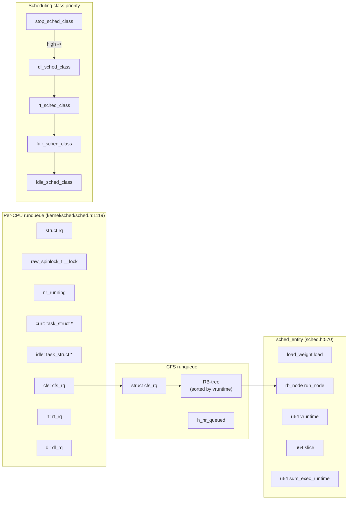

### 1.8 task_struct State Transitions

A task begins its life in the `TASK_NEW` state, set by `copy_process()` during creation. When `wake_up_new_task()` is called, it transitions to `TASK_RUNNING` and becomes eligible for scheduling. From `TASK_RUNNING`, a task may enter `TASK_INTERRUPTIBLE` (sleeping but can be woken by signals) or `TASK_UNINTERRUPTIBLE` (sleeping, only woken by the specific event it awaits — commonly I/O completion). It can also be stopped via `SIGSTOP` or traced via `ptrace`.

When the task terminates, `do_task_dead()` sets it to `TASK_DEAD`, and `exit_notify()` marks it as `EXIT_ZOMBIE`. The zombie remains until the parent calls `wait()`, at which point `release_task()` transitions it to `EXIT_DEAD` and `free_task()` reclaims the memory.

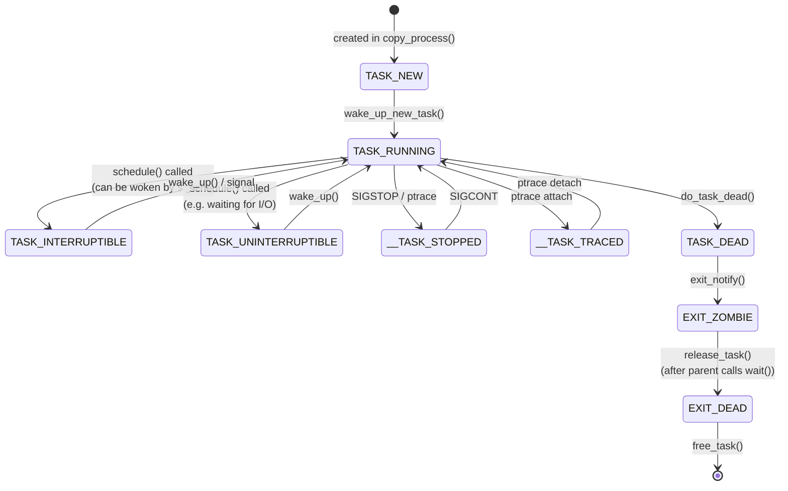

---

## 2. Process Creation

In user space, you call `fork()` and get a child PID back. That single syscall triggers a long chain of kernel operations: allocating a new `task_struct`, copying (or sharing) file descriptors, address space, signal handlers, and more. This section traces that chain.

### 2.1 User-Space Process Creation (fork / clone)

When a user-space process calls `fork()`, `clone()`, or `clone3()`, the syscall entry layer routes the request to `kernel_clone()` (`fork.c:2610`). This function first validates the clone flags, then calls `copy_process()` (`fork.c:1966`) to perform the deep copy of the parent's `task_struct`.

Inside `copy_process()`, the first step is `dup_task_struct(current)` (`fork.c:1052`), which allocates a new `task_struct` and kernel stack, then copies the parent's entire `task_struct` into the new one. Following this, the function copies or shares each resource category depending on the `CLONE_*` flags provided. For example, `copy_mm()` either duplicates the entire memory address space with copy-on-write (COW) page table entries, or — if `CLONE_VM` is set — simply shares the parent's `mm_struct` (this is how threads work).

The remaining copy functions follow the same pattern: `copy_files()` for file descriptors, `copy_fs()` for the filesystem context, `copy_sighand()` for signal handlers, `copy_signal()` for signal state, `copy_namespaces()` for namespaces, and `copy_io()` for the I/O context. Each one either increments a reference count on the parent's structure (sharing) or allocates a new copy.

After resource copying, the scheduler is initialized via `sched_fork()`. This sets the child's state to `TASK_NEW`, computes its priority, determines its scheduling class, and initializes its `vruntime`.

Then `copy_thread()` (`arch/x86/kernel/process.c:170`) sets up the architecture-specific register frame. On x86_64, it copies the parent's `pt_regs` into the child's kernel stack, sets `childregs->ax = 0` (so that fork returns 0 in the child), stores the child's stack pointer, copies the I/O permission bitmap, and configures `ret_from_fork_asm` as the entry point for when the child is first scheduled.

Finally, `alloc_pid()` assigns a PID. At this point, near the end of `copy_process()`, the tracepoint `task:task_newtask` fires (`fork.c:2468`), recording the new task's PID, comm, and clone flags. Control then returns to `kernel_clone()`, which fires `sched:sched_process_fork` (`fork.c:2661`) — recording the parent-child PID pair — and then calls `wake_up_new_task()` to insert the child into the scheduler's runqueue. Inside `wake_up_new_task()`, the tracepoint `sched:sched_wakeup_new` fires (`core.c:4759`) as the child is placed on a runqueue for the first time. This sets the child's state to `TASK_RUNNING`, calls `enqueue_task()` to place it in the CFS red-black tree, and invokes `check_preempt_curr()` to determine whether the new child should preempt the currently running task.

The parent receives the child's PID as the return value of `fork()`. The child, when eventually picked by the scheduler, begins execution at `ret_from_fork_asm`, calls `finish_task_switch()` to complete the context switch bookkeeping, then returns to user space with a return value of 0. The context switch itself is recorded by the `sched:sched_switch` tracepoint.

#### Key Code Points

| Stage | Function | Location | Core Action |
|-------|----------|----------|-------------|
| Entry | `kernel_clone()` | `fork.c:2610` | Validate clone_flags, call copy_process |
| Copy | `dup_task_struct()` | `fork.c:1052` | Allocate and copy task_struct + kernel stack |
| Scheduler init | `sched_fork()` | `core.c` | state=TASK_NEW, initialize vruntime |
| Arch setup | `copy_thread()` | `arch/x86/process.c:170` | Set up register frame, ax=0 |
| Enqueue | `wake_up_new_task()` | `core.c` | Transition to TASK_RUNNING, enqueue |
| Child first run | `ret_from_fork_asm` | `entry_64.S` | schedule_tail() -> return to user space |

**Sharing vs. copying based on `CLONE_*` flags:**

| Flag | When set | When unset |
|------|----------|------------|
| `CLONE_VM` | Share mm (thread) | Copy mm (COW) |
| `CLONE_FILES` | Share files_struct | Copy |
| `CLONE_FS` | Share fs_struct | Copy |
| `CLONE_SIGHAND` | Share sighand | Copy |
| `CLONE_THREAD` | Same thread group (tgid inherited) | New thread group (tgid = pid) |

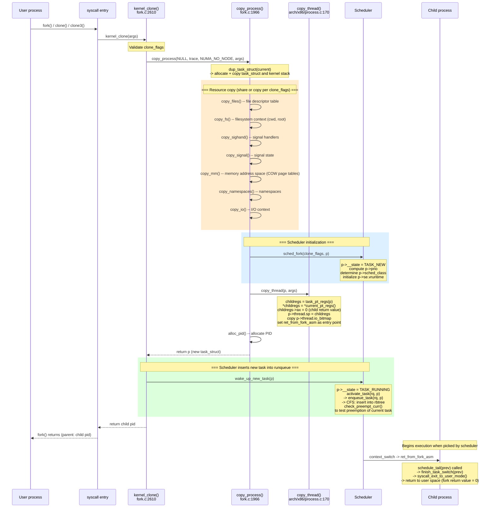

### 2.2 Kernel Thread Creation

Kernel threads are created through a different mechanism than user processes. The typical entry point is `kthread_create_on_node()` (`kthread.c:578`), which does not directly call `fork()`. Instead, it queues a `kthread_create_info` structure onto the global `kthread_create_list` and wakes up `kthreadd`, the kernel thread daemon (PID 2, `kthread.c:815`).

The `kthreadd` daemon runs an infinite loop. When it wakes, it dequeues a creation request and calls `create_kthread()` (`kthread.c:478`), which in turn calls `kernel_thread()` (`fork.c:2700`). This function sets up `kernel_clone_args` with the `kthread` flag set to 1, and forces `CLONE_VM | CLONE_UNTRACED` in addition to the caller-specified flags (typically `CLONE_FS | CLONE_FILES | SIGCHLD`).

Inside `copy_thread()`, the behavior differs from user process creation: all child registers (`childregs`) are zeroed out, and `kthread_frame_init()` sets up the kernel thread's function and argument pointers. The entry point is still `ret_from_fork_asm`, but the execution path diverges — the new thread enters the `kthread()` function (`kthread.c:411`) rather than returning to user space.

Once the kernel thread is scheduled for the first time, it calls `complete(done)` to notify the creator that it exists, then parks itself with `schedule_preempt_disabled()`. The creator receives the `task_struct *` pointer back and can either call `wake_up_process()` directly or use the convenience wrapper `kthread_run()` to immediately start the thread's designated function `threadfn(data)`.

When the kernel thread finishes its work, it calls `kthread_exit()`.

**Kernel thread vs. user process differences:**

| Property | Kernel thread | User process |
|----------|---------------|--------------|
| `mm` | NULL (no user address space) | Own mm_struct |
| `active_mm` | Borrowed from previous task (lazy TLB) | == mm |
| `PF_KTHREAD` flag | Set | Not set |
| Page tables | Kernel page tables only | User + kernel |
| `copy_thread()` behavior | childregs=0, kthread_frame_init | Copy parent regs, ax=0 |

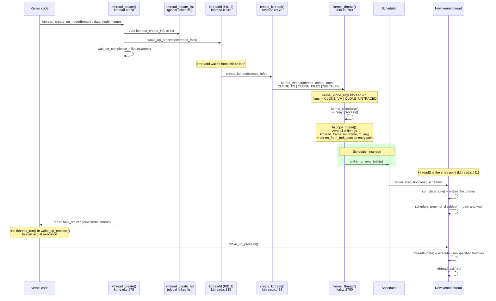

---

## 3. Context Switch

A context switch is what makes multitasking possible. In user space, you see it as "my process ran, then another process ran, then mine ran again." In the kernel, it is a precise sequence of saving one task's CPU state and loading another's. This is the most performance-critical path in the scheduler.

### 3.1 Overall Flow

A context switch is the mechanism by which the CPU stops executing one task and begins executing another. This can happen voluntarily (the task calls `schedule()` or `cond_resched()`), or involuntarily (the scheduler forces preemption via `preempt_schedule_irq()` at interrupt return, or via `exit_to_user_mode()` at syscall return).

Regardless of the trigger, the core function is `__schedule()` (`core.c:6722`). It begins by disabling local interrupts and acquiring the runqueue lock. It then reads the previous task's state. If the previous task is no longer `TASK_RUNNING` (for example, it has set its state to `TASK_INTERRUPTIBLE` before calling `schedule()`), the function calls `try_to_block_task()` to dequeue it from the runqueue.

Next, `pick_next_task()` iterates through the scheduling classes in priority order and selects the next task to run. For the common case where only CFS tasks are present, `pick_next_task_fair()` selects the `sched_entity` with the smallest `vruntime` from the red-black tree.

If the selected task is different from the currently running task, a context switch is necessary. At this point, immediately before calling `context_switch()`, the tracepoint `sched:sched_switch` fires (`core.c:6864`), recording the outgoing task's comm, PID, priority, and state, as well as the incoming task's comm, PID, and priority. The `prev_state` field encodes whether the outgoing task was preempted (`R+`) or voluntarily yielded (`S` for interruptible sleep, `D` for uninterruptible, `Z` for zombie, `X` for dead, etc.). This is one of the most important tracepoints for understanding scheduler behavior. `context_switch()` (`core.c:5201`) then performs the switch in three stages:

**Stage 1 — Preparation:** `prepare_task_switch()` fires perf events for the scheduling-out task and marks the incoming task as on-CPU.

**Stage 2 — Memory space switch:** If the next task is a kernel thread (`next->mm == NULL`), the kernel simply enters lazy TLB mode — the next task borrows the previous task's `active_mm`, avoiding a costly TLB flush. If the next task is a user process, `switch_mm_irqs_off()` loads the new task's page directory (`pgd`) into the CR3 register, switching the page tables and (unless PCID is used) flushing the TLB.

**Stage 3 — CPU register switch:** `switch_to()` calls `__switch_to_asm()` (`entry_64.S:178`), which is the point where the CPU physically transitions from one task to another. This assembly routine pushes the callee-saved registers (`rbp`, `rbx`, `r12`-`r15`) onto the current (old) task's kernel stack, saves the old stack pointer to `prev->thread.sp`, loads the new task's stack pointer from `next->thread.sp` into `%rsp`, pops the new task's callee-saved registers, and fills the return speculation buffer (Spectre RSB mitigation). It then jumps to `__switch_to()` (`process_64.c:610`), which handles the remaining CPU state: FPU/SIMD state, FS/GS segment bases, TLS descriptors, segment registers, memory protection keys (PKRU), and the per-CPU `current_task` pointer.

From this point forward, the CPU is executing on the new task's kernel stack. The new task calls `finish_task_switch(prev)` (`core.c:5075`) to complete the transition: it fires perf scheduling-in events, clears `prev->on_cpu`, releases the runqueue lock, and — critically — if `prev` was in `TASK_DEAD` state, it calls `put_task_stack()` and `put_task_struct_rcu_user()` to begin the final cleanup of the dead task's resources (see Section 4).

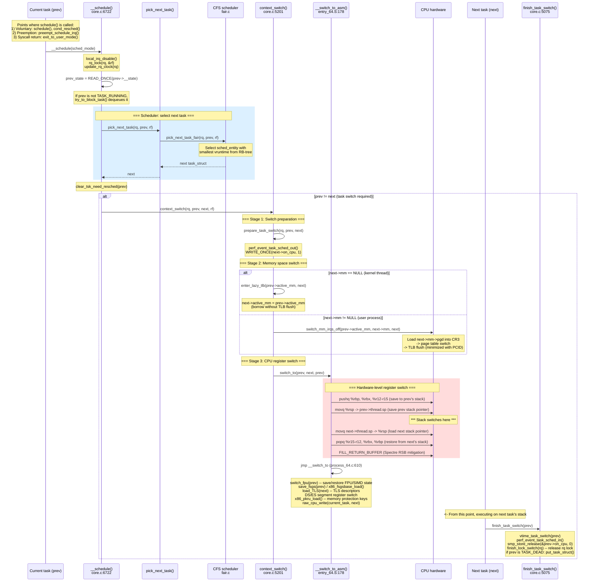

### 3.2 Summary of Scheduler Intervention Points

The scheduler intervenes at specific, well-defined points throughout a process's lifetime. During process creation, `sched_fork()` initializes the scheduling parameters and `wake_up_new_task()` enqueues the new task. During normal execution, voluntary scheduling occurs when a task calls `schedule()`, `cond_resched()`, or blocks on a mutex or wait queue. Involuntary preemption is triggered by the timer interrupt (`scheduler_tick()` sets `TIF_NEED_RESCHED`), checked at interrupt return (`preempt_schedule_irq()`), at syscall return (`exit_to_user_mode_loop()`), and when a higher-priority task is woken up (`try_to_wake_up()` calls `check_preempt_curr()`). The wakeup path fires two tracepoints: `sched:sched_waking` (`core.c:4095/4111`) from the waking CPU's context before the state change, and `sched:sched_wakeup` (`core.c:3607`) immediately after the target's state is set to `TASK_RUNNING`. If a task is migrated between CPUs, `sched:sched_migrate_task` fires (`core.c:3259`). At process death, `do_task_dead()` performs the final involuntary scheduling call, after which `finish_task_switch()` handles the dead task's cleanup.

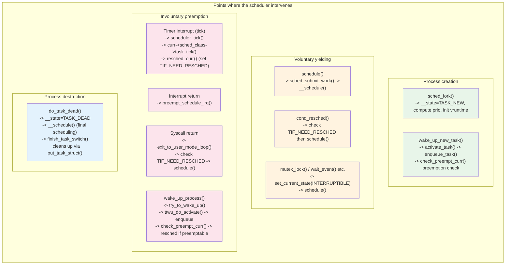

### 3.3 The x86_64 Register Switch in Detail

The physical act of switching from one task to another on x86_64 is split into two functions: `__switch_to_asm()` (assembly, `arch/x86/entry/entry_64.S:178`) handles the callee-saved general-purpose registers and the stack pointer, and `__switch_to()` (C, `arch/x86/kernel/process_64.c:610`) handles the remaining CPU state — segments, FPU, TLS, and per-CPU variables. This is x86_64's equivalent of ARM64's `cpu_switch_to()` (`arch/arm64/kernel/entry.S:823`), though the two architectures divide the work quite differently.

#### The Assembly Core: `__switch_to_asm()`

The function receives two arguments: `%rdi` = `prev` (the outgoing `task_struct *`) and `%rsi` = `next` (the incoming `task_struct *`). The entire function (`entry_64.S:178–218`) is shown below with annotations:

```asm
SYM_FUNC_START(__switch_to_asm)
    /* ---- Phase 1: Save prev's callee-saved registers to prev's kernel stack ---- */
    pushq   %rbp                    ; frame pointer
    pushq   %rbx                    ; callee-saved general register
    pushq   %r12                    ; callee-saved general register
    pushq   %r13                    ; callee-saved general register
    pushq   %r14                    ; callee-saved general register
    pushq   %r15                    ; callee-saved general register

    /* ---- Phase 2: Switch the stack pointer ---- */
    movq    %rsp, TASK_threadsp(%rdi)   ; prev->thread.sp = %rsp  (save prev's stack pointer)
    movq    TASK_threadsp(%rsi), %rsp   ; %rsp = next->thread.sp  (load next's stack pointer)
    ; *** FROM THIS INSTRUCTION ONWARD, THE CPU IS ON next's KERNEL STACK ***

    /* ---- Phase 3: Stack canary (Spectre/stack-smashing mitigation) ---- */
    movq    TASK_stack_canary(%rsi), %rbx       ; load next's canary value
    movq    %rbx, PER_CPU_VAR(__stack_chk_guard) ; install it into per-CPU guard

    /* ---- Phase 4: Spectre RSB (Return Stack Buffer) mitigation ---- */
    FILL_RETURN_BUFFER %r12, RSB_CLEAR_LOOPS, X86_FEATURE_RSB_CTXSW
    ; Overwrites the RSB with safe entries to prevent speculative execution
    ; using stale return addresses from the previous task's call stack.

    /* ---- Phase 5: Restore next's callee-saved registers from next's stack ---- */
    popq    %r15
    popq    %r14
    popq    %r13
    popq    %r12
    popq    %rbx
    popq    %rbp

    /* ---- Phase 6: Fall through to C-level switch ---- */
    jmp     __switch_to             ; tail-call into __switch_to() in C
SYM_FUNC_END(__switch_to_asm)
```

The `TASK_threadsp` constant is generated by `asm-offsets.c:45` (`OFFSET(TASK_threadsp, task_struct, thread.sp)`) and resolves to the byte offset of the `sp` field within `thread_struct`, which is embedded in `task_struct`. This is the only field that the assembly code accesses from the `task_struct` directly (apart from the stack canary).

The push/pop order is critical: it must exactly match the layout of `struct inactive_task_frame` (`arch/x86/include/asm/switch_to.h:23`), which defines the stack frame of a sleeping task:

```c
struct inactive_task_frame {
    unsigned long r15;
    unsigned long r14;
    unsigned long r13;
    unsigned long r12;
    unsigned long bx;
    unsigned long bp;
    unsigned long ret_addr;   // return address (pushed by CALL instruction)
};
```

When a task is sleeping (not currently on the CPU), its `thread.sp` points to the top of this frame on its kernel stack. The `ret_addr` at the bottom of the frame is the address that execution will resume at when the task is next switched to — this is the return address that was on the stack when the task last called `__switch_to_asm()`. For a brand-new task that has never been scheduled, `copy_thread()` sets `frame->ret_addr = (unsigned long) ret_from_fork_asm` (`arch/x86/kernel/process.c:186`), so the first context switch into the new task will "return" into `ret_from_fork_asm`.

**Why only six registers?** The x86_64 System V ABI defines `%rbp`, `%rbx`, `%r12`–`%r15` as callee-saved (non-volatile) registers. All other general-purpose registers (`%rax`, `%rcx`, `%rdx`, `%rsi`, `%rdi`, `%r8`–`%r11`) are caller-saved (volatile) — the C calling convention means that any function call may destroy them, so the caller is responsible for saving them if needed. Since `__switch_to_asm()` is called from C code (`context_switch()` via the `switch_to()` macro), the compiler has already ensured that any caller-saved registers it needs are either in callee-saved registers or spilled to the stack. The `%rsp` is not pushed — it is instead stored directly into `prev->thread.sp` and loaded from `next->thread.sp`.

The `jmp __switch_to` at the end is a tail call: `__switch_to_asm()` does not return to its caller; instead, it jumps to `__switch_to()`, which returns `prev_p` (the previous `task_struct *`) directly to the caller of `switch_to()`. This returned value is the `last` parameter in the `switch_to(prev, next, last)` macro, which allows `finish_task_switch()` to know which task it replaced.

#### The C-Level Switch: `__switch_to()`

After the assembly stub switches the stack and general-purpose registers, `__switch_to()` (`arch/x86/kernel/process_64.c:610`) handles all the CPU state that cannot (or need not) be managed in assembly. At this point, the CPU is already running on `next`'s kernel stack, but many hardware registers still reflect `prev`'s state. The function receives `prev_p` and `next_p` as arguments (passed via `%rdi` and `%rsi`, which survived the stack switch because they are set before `__switch_to_asm()` is called and remain valid across the `jmp`):

1. **FPU/SIMD state** (`switch_fpu(prev_p, cpu)`): Saves `prev`'s FPU/SSE/AVX/AVX-512 registers into `prev->fpu.__fpstate` using `XSAVE`/`FXSAVE`, and either restores `next`'s state eagerly or marks it for lazy restore via `TIF_NEED_FPU_LOAD`. This is the most expensive part of the context switch when large vector registers (e.g., 512-bit AVX-512) are in use.

2. **FS/GS segment bases** (`save_fsgs(prev_p)`, then `x86_fsgsbase_load(prev, next)`): FS and GS are special on x86_64 — `%fs` is used by glibc for thread-local storage (TLS), and `%gs` is used by the kernel for per-CPU data. The base addresses are saved into `thread.fsbase`/`thread.gsbase` and restored for the next task. On CPUs with `FSGSBASE` support, this uses the fast `RDFSBASE`/`WRFSBASE` instructions; on older CPUs, it falls back to MSR reads/writes.

3. **TLS descriptors** (`load_TLS(next, cpu)`): Loads the next task's TLS entries into the GDT. Each task can have up to three TLS descriptors (`tls_array[GDT_ENTRY_TLS_ENTRIES]`), used by `set_thread_area()`.

4. **DS/ES segment registers**: Saved and restored only if non-zero (the common case on x86_64 is zero — these segments are only used by 32-bit compatibility code).

5. **Memory protection keys** (`x86_pkru_load(prev, next)`): Saves and restores the PKRU register, which controls per-page access permissions in user space.

6. **Per-CPU `current` pointer** (`raw_cpu_write(current_task, next_p)`): Updates the per-CPU `current_task` variable so that the `current` macro returns the correct `task_struct *` for the new task. Also updates `cpu_current_top_of_stack` so the kernel knows where the top of the new task's kernel stack is (used for syscall entry).

7. **sp0 reload** (`update_task_stack(next_p)`): On Xen PV guests, updates the TSS `sp0` field so that hardware interrupts and exceptions transition to the correct kernel stack.

8. **Extra switch work** (`switch_to_extra(prev_p, next_p)`): Handles I/O permission bitmaps, debugging breakpoints (`ptrace` hardware watchpoints), and speculation control MSRs (STIBP, SSBD).

9. **Bug workarounds**: The AMD SYSRET SS attribute bug (`X86_BUG_SYSRET_SS_ATTRS`) requires the kernel to ensure the SS segment selector is never NULL during context switches.

10. **Cache allocation** (`resctrl_arch_sched_in(next_p)`): Loads the Intel RDT (Resource Director Technology) PQR MSR for cache partitioning.

The function returns `prev_p`, which propagates back through the `switch_to()` macro as the `last` parameter.

#### The `fork_frame` and How New Tasks Get Their First Context Switch

When `copy_thread()` (`arch/x86/kernel/process.c:170`) sets up a newly forked task, it constructs a `fork_frame` on the new task's kernel stack. This structure (`arch/x86/include/asm/switch_to.h:44`) is:

```c
struct fork_frame {
    struct inactive_task_frame frame;   // the six callee-saved regs + ret_addr
    struct pt_regs regs;                // full user-space register set
};
```

The layout on the new task's kernel stack looks like this (addresses grow downward):

```
High address (top of kernel stack)
  ┌──────────────────────────────┐
  │     struct pt_regs           │  ← task_pt_regs(p), user-space register snapshot
  │     (rax=0 for child)        │     childregs->ax = 0 means fork returns 0
  ├──────────────────────────────┤
  │     inactive_task_frame      │
  │       .ret_addr = ret_from_fork_asm   ← "return address" for first switch
  │       .bp       = encoded frame ptr
  │       .bx       = 0  (or kernel fn for kthread)
  │       .r12      = 0  (or fn_arg for kthread)
  │       .r13      = 0
  │       .r14      = 0
  │       .r15      = 0
  ├──────────────────────────────┤
  │     p->thread.sp points here │  ← set by copy_thread: p->thread.sp = fork_frame
  └──────────────────────────────┘
Low address
```

When the scheduler first context-switches to this new task, `__switch_to_asm()` loads `next->thread.sp` into `%rsp`, pops `%r15`–`%r12`, `%rbx`, and `%rbp` from the `inactive_task_frame`, then `jmp __switch_to`. When `__switch_to()` returns (via `ret`), the CPU pops `ret_addr` from the stack — which is `ret_from_fork_asm`. Execution thus enters `ret_from_fork_asm` (`entry_64.S:229`), which calls `ret_from_fork()` with `prev` (in `%rax`, the return value of `__switch_to`), `regs` (`%rsp`, pointing to the `pt_regs`), `fn` (`%rbx`), and `fn_arg` (`%r12`). For user processes, `fn` is NULL, so `ret_from_fork()` calls `schedule_tail(prev)` and then returns to user space via `syscall_exit_to_user_mode()`.

For kernel threads, `copy_thread()` calls `kthread_frame_init(frame, args->fn, args->fn_arg)` (`switch_to.h:81`), which stores the kernel function pointer in `frame->bx` and its argument in `frame->r12`. When `ret_from_fork_asm` runs, it passes these to `ret_from_fork()`, which calls `fn(fn_arg)` — this is how a kernel thread's function is invoked for the first time.

#### Comparison with ARM64's `cpu_switch_to()`

ARM64's equivalent function, `cpu_switch_to()` (`arch/arm64/kernel/entry.S:823`), takes a fundamentally different approach. Annotated:

```asm
SYM_FUNC_START(cpu_switch_to)
    save_and_disable_daif x11       ; Save and disable interrupts (DAIF flags in x11)
    mov     x10, #THREAD_CPU_CONTEXT
    add     x8, x0, x10            ; x8 = &prev->thread.cpu_context
    mov     x9, sp
    stp     x19, x20, [x8], #16    ; Save callee-saved registers to prev->thread.cpu_context
    stp     x21, x22, [x8], #16    ;   (stored directly in task_struct, NOT on the stack)
    stp     x23, x24, [x8], #16
    stp     x25, x26, [x8], #16
    stp     x27, x28, [x8], #16
    stp     x29, x9, [x8], #16     ; x29 = frame pointer, x9 = sp
    str     lr, [x8]               ; lr = return address
    add     x8, x1, x10            ; x8 = &next->thread.cpu_context
    ldp     x19, x20, [x8], #16    ; Restore callee-saved registers from next's context
    ldp     x21, x22, [x8], #16
    ldp     x23, x24, [x8], #16
    ldp     x25, x26, [x8], #16
    ldp     x27, x28, [x8], #16
    ldp     x29, x9, [x8], #16
    ldr     lr, [x8]
    mov     sp, x9                 ; Restore stack pointer
    msr     sp_el0, x1             ; Set SP_EL0 = next task_struct (used by current macro)
    ptrauth_keys_install_kernel x1, x8, x9, x10  ; Pointer authentication keys
    scs_save x0                    ; Shadow Call Stack: save prev's SCS pointer
    scs_load_current               ; Shadow Call Stack: load next's SCS pointer
    restore_irq x11               ; Restore interrupt state
    ret                            ; Return (to next's saved LR)
SYM_FUNC_END(cpu_switch_to)
```

The key architectural differences are:

| Aspect | x86_64 `__switch_to_asm` | ARM64 `cpu_switch_to` |
|--------|--------------------------|----------------------|
| **Register save location** | Push onto the kernel stack (via `pushq`); `thread.sp` saves the stack pointer | Store directly into `thread.cpu_context` (a struct inside `task_struct`) — registers are **not** saved on the stack |
| **Stack pointer switch** | Two `movq` instructions through memory (`TASK_threadsp`) | `mov sp, x9` after loading from `cpu_context` |
| **Return address** | Implicitly on the stack as part of the call frame; the `jmp __switch_to` tail-calls into C, whose `ret` pops the return address | Explicitly saved/restored via `str lr` / `ldr lr`; returns directly with `ret` |
| **Interrupt handling** | Interrupts are already disabled by `__schedule()` before entry; no explicit save/restore | `save_and_disable_daif` / `restore_irq` — ARM64 saves and restores interrupt flags as part of the switch |
| **`current` pointer** | Updated by C code via `raw_cpu_write(current_task, next_p)` using `%gs`-relative per-CPU variable | Updated by `msr sp_el0, x1` — ARM64 uses the `SP_EL0` system register to point to `current` |
| **Segment/TLS state** | Handled in C (`__switch_to`) — FS/GS bases, DS/ES, TLS GDT entries | Not applicable — ARM64 has no segment registers |
| **FPU state** | Handled in C (`switch_fpu()`) | Handled separately in the scheduler path |
| **Speculative execution** | `FILL_RETURN_BUFFER` (RSB stuffing) for Spectre v2 mitigation | `ptrauth_keys_install_kernel` for pointer authentication |
| **Shadow Call Stack** | Stack canary loaded into per-CPU `__stack_chk_guard` | `scs_save` / `scs_load_current` — ARM64 has hardware Shadow Call Stack support |
| **Two-phase split** | Assembly (`__switch_to_asm`) does registers + stack; C (`__switch_to`) does everything else | Single assembly function does the complete register switch; C-level work (FPU, TLS) is handled elsewhere |

The fundamental design difference is that x86_64 uses the stack itself as the save area (push/pop with the stack pointer saved in `thread.sp`), while ARM64 stores registers directly into a dedicated `cpu_context` structure within the `task_struct`. The x86 approach means the `inactive_task_frame` layout must exactly match the push/pop order in the assembly, and new tasks must have a properly constructed frame on their kernel stack before they can be switched to. ARM64's approach is more straightforward — registers go into a flat struct — but requires that `SP_EL0` always points to the current `task_struct`, which is how ARM64 implements the `current` macro without per-CPU memory.

#### CPU State Switch Summary

The following table enumerates all CPU state that must be saved and restored during a context switch on x86_64:

| Category | Items | Saved in | Switch function |
|----------|-------|----------|-----------------|
| General-purpose registers | rbp, rbx, r12-r15 | Kernel stack (push/pop) | `__switch_to_asm` |
| Stack pointer | rsp | `thread.sp` | `__switch_to_asm` |
| Page tables | CR3 | `mm->pgd` | `switch_mm_irqs_off` |
| FPU/SSE/AVX | xmm, ymm, zmm etc. | `fpu->__fpstate` | `switch_fpu` |
| Segment registers | FS, GS, DS, ES | `thread.fsbase/gsbase/ds/es` | `__switch_to` |
| TLS | GDT entries | `thread.tls_array` | `load_TLS` |
| Memory protection keys | PKRU | `thread.pkru` | `x86_pkru_load` |
| Per-CPU variable | `current_task` | GS base relative | `raw_cpu_write` |
| Stack canary | `__stack_chk_guard` | per-CPU | `__switch_to_asm` |

---

## 4. Process Destruction

In user space, calling `exit()` or receiving a `SIGKILL` ends your process. But from the kernel's perspective, process death is a surprisingly careful sequence: every resource must be released in the right order, the parent must be notified, and — most interestingly — the dying process cannot free its own kernel stack (because it is still using it). This section explains how the kernel solves each of these problems.

### 4.1 Two Paths to Death: exit() and Fatal Signals

A process can terminate in two fundamentally different ways: by voluntarily calling `exit()` (or `exit_group()`), or by receiving a fatal signal (such as `SIGKILL`, `SIGSEGV`, or `SIGTERM` with default disposition). Although the triggers differ, both paths converge on the same function: `do_exit()`.

**Voluntary exit:** When a process calls `exit()` (the single-thread variant), the syscall handler invokes `do_exit(code)` directly. When it calls `exit_group()`, the handler invokes `do_group_exit()` (`exit.c:1086`), which first sets `SIGNAL_GROUP_EXIT` on the thread group's `signal_struct`, then calls `zap_other_threads(current)` to send `SIGKILL` to every other thread in the group. After that, it calls `do_exit()`. Both `do_group_exit()` and `do_exit()` are annotated `__noreturn` — they never return to their caller.

**Signal-based termination:** When a fatal signal is delivered to a process, the signal delivery mechanism takes a different entry path. The function `complete_signal()` (`signal.c:963`) is called as part of `__send_signal_locked()`. For signals that are fatal and do not produce a core dump (e.g., `SIGKILL`, `SIGTERM`), `complete_signal()` immediately sets `SIGNAL_GROUP_EXIT` on the signal struct and force-enqueues `SIGKILL` on every thread in the thread group, waking each one with `signal_wake_up()`.

Each woken thread, upon returning from its current syscall or interrupt, enters the signal processing path. The function `get_signal()` (`signal.c:2799`) is called from the architecture-specific return-to-user-mode code. When `get_signal()` sees that `SIGNAL_GROUP_EXIT` is already set, it jumps directly to the fatal exit path, sets `PF_SIGNALED` on the task, and calls `do_group_exit(signr)`. For core-dumping signals (e.g., `SIGSEGV`, `SIGABRT`), `get_signal()` first calls `vfs_coredump()` to write the core dump, then proceeds to `do_group_exit()`.

The complete signal-to-death chain is: signal sent -> `__send_signal_locked()` -> `complete_signal()` (wakes all threads, sets `SIGNAL_GROUP_EXIT`) -> each thread returns to user mode -> `get_signal()` -> `do_group_exit()` -> `do_exit()` -> `do_task_dead()` -> `__schedule()` -> never returns. The tracepoint `signal:signal_generate` fires inside `__send_signal_locked()` (`signal.c:1155`) when the signal is queued, recording the signal number, target task, and delivery result. Later, `signal:signal_deliver` fires inside `get_signal()` (`signal.c:2870/2929`) when the signal is actually dequeued and about to be handled.

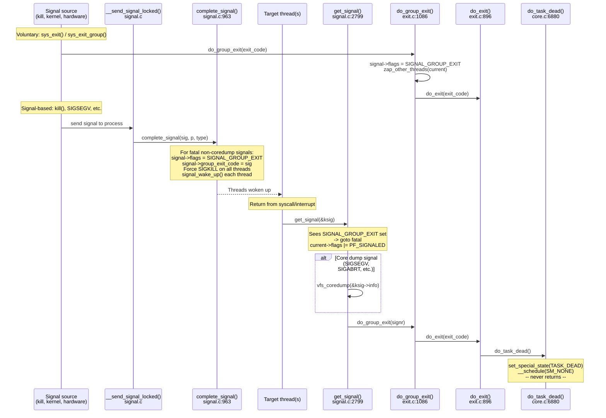

### 4.2 The Role of do_exit()

The function `do_exit()` (`exit.c:896`) is the central teardown routine for a dying process. It is declared as `void __noreturn do_exit(long code)` — meaning the compiler guarantees (and relies on the fact) that this function will never return. Everything after the call to `do_exit()` is dead code.

The function proceeds through several phases of cleanup, executed in a carefully ordered sequence:

**Phase 1 — Early cleanup:** `synchronize_group_exit()` sets `SIGNAL_GROUP_EXIT` and handles coredump serialization. Then `exit_signals()` sets the `PF_EXITING` flag on the current task, which serves as a signal to other parts of the kernel that this task is in the process of dying and should not receive further signals. `ptrace_event(PTRACE_EVENT_EXIT)` notifies any attached debugger, and `io_uring_files_cancel()` cancels outstanding asynchronous I/O operations. After the exit code is stored, the tracepoint `sched:sched_process_exit` fires (`exit.c:942`), recording the dying task's comm, PID, priority, and whether this is the last thread in the group (`group_dead`).

**Phase 2 — Resource release:** This is the bulk of the function. Resources are released in a specific order that avoids use-after-free and lock ordering problems:

1. `exit_mm()` — Releases the user memory address space first, because after this point no user-space memory accesses will occur. Releasing the mm early also returns potentially large amounts of COW memory to the system as soon as possible. After `exit_mm()`, the `active_mm` can be borrowed by kernel threads via lazy TLB.
2. `exit_sem()` — Cleans up System V semaphore undo lists.
3. `exit_shm()` — Detaches shared memory segments.
4. `exit_files()` — Closes all open file descriptors (including sockets and pipes).
5. `exit_fs()` — Releases filesystem context (current working directory and root references).
6. `disassociate_ctty(1)` — Detaches the controlling terminal (relevant for session leaders).
7. `exit_nsproxy_namespaces()` — Drops namespace references.
8. `exit_thread()` — Architecture-specific cleanup (e.g., I/O permission bitmaps on x86).
9. `exit_io_context()` — Releases the block I/O scheduler context.

The reason `exit_mm()` comes first is threefold: the file close operations that follow do not need to access user-space memory; after releasing mm, the `active_mm` remains available for the kernel to borrow; and releasing COW pages early frees potentially large amounts of physical memory for other processes.

**Phase 3 — Parent notification:** `exit_notify()` (`exit.c:736`) performs two critical actions. First, `forget_original_parent()` reparents all of the dying task's children to either a subreaper or `init` (PID 1). Second, it sets `tsk->exit_state = EXIT_ZOMBIE`. If the parent has set `SA_NOCLDWAIT` or `SIGCHLD` to `SIG_IGN`, the task is auto-reaped: `exit_state` is set to `EXIT_DEAD` and `release_task()` is called immediately, skipping the zombie state entirely. Otherwise, `do_notify_parent()` sends `SIGCHLD` to the parent and wakes it from any `wait()` call.

**Phase 4 — Final scheduling (the point of no return):** After RCU cleanup (`exit_rcu()`, `exit_tasks_rcu_finish()`), the function calls `preempt_disable()` at line 1007 of `exit.c`. From this point, the task must not sleep or be preempted — it is about to die. The final call is `do_task_dead()`.

### 4.3 do_task_dead() and Why a Process Cannot Free Its Own Stack

The function `do_task_dead()` (`core.c:6880`) is the true point of no return. Its implementation is remarkably short:

```c
void __noreturn do_task_dead(void)
{
    set_special_state(TASK_DEAD);
    current->flags |= PF_NOFREEZE;
    __schedule(SM_NONE);
    BUG();
    for (;;)
        cpu_relax();
}
```

`set_special_state(TASK_DEAD)` atomically sets the task's `__state` to `TASK_DEAD` (value `0x0080`) while holding the `pi_lock`, which serializes against any in-flight wakeup attempts. The `PF_NOFREEZE` flag tells the freezer subsystem to ignore this task. Then `__schedule(SM_NONE)` is called directly — not through the normal `schedule()` wrapper, because the normal wrapper loops on `need_resched()`, which is not appropriate for a task that is about to die.

Inside `__schedule()`, because the task's state is `TASK_DEAD` (non-zero, non-running), `try_to_block_task()` dequeues it from the runqueue. The scheduler then picks the next task, and `context_switch()` physically switches the CPU's stack pointer to the new task's kernel stack via `switch_to()`.

Here lies the fundamental reason why a process cannot clean up after itself: **at the moment of the context switch, the dying task is still using its own kernel stack**. Every local variable, every return address, every function frame from `do_exit()` through `do_task_dead()` through `__schedule()` through `context_switch()` to `switch_to()` — all of these live on the dying task's kernel stack. If the task attempted to free its own stack before calling `switch_to()`, the CPU would immediately fault, because it would be executing code with a stack pointer pointing to freed memory.

Therefore, the cleanup of the dead task's stack and `task_struct` is delegated to the **next task that runs on the same CPU**. After the stack pointer switches, the CPU is executing on the new task's stack. The new task calls `finish_task_switch(prev)`, where `prev` points to the dead task. Inside `finish_task_switch()`, the code checks whether `prev_state == TASK_DEAD`, and if so:

1. Calls `prev->sched_class->task_dead(prev)` for scheduling-class-specific cleanup.
2. Calls `put_task_stack(prev)` to release the kernel stack memory.
3. Calls `put_task_struct_rcu_user(prev)` to drop the RCU user reference, which schedules `delayed_put_task_struct()` to run after an RCU grace period. Inside that RCU callback, the tracepoint `sched:sched_process_free` fires (`exit.c:230`) — this is the very last moment the `task_struct` is valid before `put_task_struct()` frees it.

This is why `do_task_dead()` ends with `do_exit()` calling `__schedule()` as its final act — it is not merely "finishing with a schedule call" but rather the only possible mechanism for the task to hand off its own physical resources to another entity that can safely free them.

The `BUG()` and `for (;;) cpu_relax()` after `__schedule()` are unreachable code. They exist as a defensive measure: `BUG()` will panic the kernel if `__schedule()` somehow returns (which should be impossible for a `TASK_DEAD` task), and the infinite `cpu_relax()` loop prevents the compiler from complaining about falling off the end of a `__noreturn` function if `BUG()` is compiled as a no-op.

### 4.4 The `__noreturn` Attribute

Both `do_exit()` and `do_task_dead()` are declared with the `__noreturn` attribute, defined in `include/linux/compiler_attributes.h:262` as:

```c
#define __noreturn  __attribute__((__noreturn__))
```

This GCC/Clang attribute informs the compiler that the function will never return to its caller. The compiler uses this information in several important ways:

1. **Dead code elimination:** Any code following a call to a `__noreturn` function is provably unreachable. The compiler can safely discard it, reducing binary size.
2. **Epilogue omission:** The compiler does not need to generate function epilogue code (stack frame teardown, return instruction) for the calling function after the call site.
3. **Warning suppression:** Without `__noreturn`, the compiler would emit warnings like "control reaches end of non-void function" for callers of `do_exit()`, since many code paths invoke `do_exit()` without an explicit return statement afterward.
4. **Optimization propagation:** The compiler can propagate the "does not return" information upward through the call graph, enabling further optimizations in callers.

For `do_task_dead()` specifically, the `__noreturn` contract is upheld because `__schedule()` performs a context switch that physically replaces the CPU's execution context — from the dying task's perspective, the instruction pointer never returns past the `switch_to()` call. The `BUG()` after `__schedule()` is a runtime assertion that this invariant holds, and the `for (;;) cpu_relax()` loop is a compile-time safeguard against `BUG()` being defined as a no-op in some kernel configurations.

### 4.5 The Full Termination Sequence

The following diagram traces the complete path from process exit to final memory reclamation, covering both voluntary exit and signal-based termination.

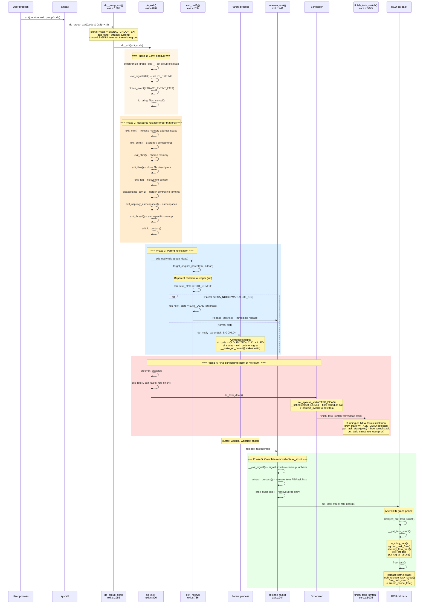

### 4.6 Resource Release Order and Rationale

The order in which `do_exit()` releases resources is not arbitrary. Each step is placed to avoid use-after-free conditions, lock ordering deadlocks, and unnecessary resource retention:

```
Resource release order inside do_exit():

1. exit_mm()                <- First: user memory is no longer accessed
2. exit_sem()               <- IPC semaphore undo list cleanup
3. exit_shm()               <- Shared memory segment detach
4. exit_files()             <- Close open files (sockets, pipes included)
5. exit_fs()                <- Release cwd, root references
6. disassociate_ctty()      <- Detach controlling terminal (if session leader)
7. exit_nsproxy_namespaces()<- Release namespace references
8. exit_thread()            <- Architecture-specific cleanup (I/O bitmap, etc.)
9. exit_io_context()        <- Block I/O scheduler context

Why mm is released first:
- File close operations do not need user-space memory access
- After mm release, active_mm can be borrowed by kernel threads
- COW pages and other large memory allocations are returned early
```

### 4.7 Zombies and the wait() Relationship

When a process finishes `do_exit()`, it does not simply vanish. Its `task_struct` lingers in one of two states: `EXIT_ZOMBIE` or `EXIT_DEAD`.

A zombie is a process that has released all of its resources (memory, files, etc.) but whose `task_struct` still exists because the parent has not yet called `wait()` to collect the exit status. The zombie is extremely lightweight — it holds only the `task_struct` shell with the exit code. Once the parent calls `wait()`, the tracepoint `sched:sched_process_wait` fires at the entry of `do_wait()` (`exit.c:1708`), recording the waiting parent and the target PID. Internally, `do_wait()` calls `wait_task_zombie()`, then `release_task()` is invoked, which unhashes the process from all PID tables, removes its `/proc` entry, and schedules the final RCU-deferred `free_task()`.

In the autoreap path, the zombie state is skipped entirely. If the parent has set `SA_NOCLDWAIT` or has `SIGCHLD` set to `SIG_IGN`, `exit_notify()` sets the exit state directly to `EXIT_DEAD` and calls `release_task()` immediately.

If the parent dies before the child, `forget_original_parent()` reparents the child to `init` (PID 1) or the nearest subreaper process. The `init` process continuously calls `wait()` in a loop, ensuring that orphaned zombies are reaped promptly.

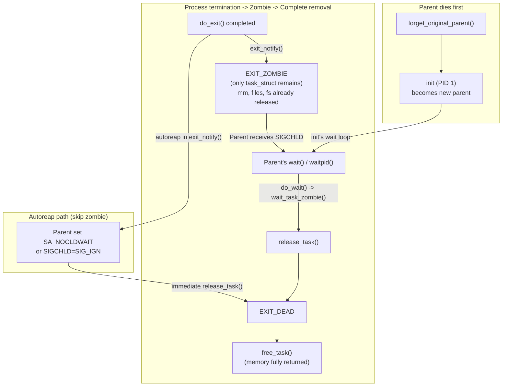

---

## 5. Preemption and Interrupts in the Context of Processes

If you have wondered how the kernel takes the CPU away from a process that is in an infinite loop (without the process cooperating), this section is the answer. "Preemption" is the kernel's ability to interrupt a running task and give the CPU to someone else. The mechanism builds on two things you have already seen: the `TIF_NEED_RESCHED` flag in `thread_info` (Section 1.1) and the `preempt_count` variable (Section 1.1, preempt_count subsection). For a deeper look at the hardware interrupt delivery mechanism itself, see `interrupt.md`.

Understanding how processes are interrupted and preempted is essential to understanding why certain data structures (like `thread_info.flags` and `preempt_count`) exist and how they interact with the scheduler.

### 5.1 Interrupts and the Kernel Entry/Exit Path

When a hardware interrupt fires, the CPU immediately saves a minimal register frame and jumps to the corresponding interrupt handler. In the Linux kernel, interrupt handlers run in the context of whatever task happened to be executing at the time — they do not have their own `task_struct` or kernel stack (on x86_64, the CPU switches to a per-CPU interrupt stack via the IST or `irq_stack_union`, but the "current" task remains unchanged).

Upon return from an interrupt, the kernel checks the interrupted task's `thread_info.flags` for work that needs to be done before resuming. The key flags checked at this point are:

- `TIF_NEED_RESCHED` — If set, the scheduler should run. If the interrupt occurred while the task was in kernel mode and preemption is enabled (i.e., `preempt_count == 0`), the kernel calls `preempt_schedule_irq()` to perform a preemptive context switch. If the interrupt occurred while in user mode, the scheduler runs via `exit_to_user_mode_loop()`.
- `TIF_SIGPENDING` — If set, signal delivery is needed before returning to user mode.
- `TIF_NOTIFY_RESUME` — If set, various callbacks (uprobes, rseq, task_work) must run before returning to user mode.

This is why `thread_info.flags` is so performance-critical: it is checked on every single return from interrupt, exception, and syscall. The flags are designed to fit in a single cache line, and on x86 the `TIF_NEED_RESCHED` check is further optimized by mirroring it in the per-CPU `preempt_count` (see Section 1.1).

### 5.2 preempt_count — The Preemption Guard

The `preempt_count` is a 32-bit integer that encodes multiple nesting depths in a single value (`include/linux/preempt.h`):

```
Bit layout:
  bits  0- 7: PREEMPT_MASK  (0x000000ff) — preempt_disable() nesting depth
  bits  8-15: SOFTIRQ_MASK  (0x0000ff00) — softirq disable depth
  bits 16-19: HARDIRQ_MASK  (0x000f0000) — hard IRQ nesting depth
  bits 20-23: NMI_MASK      (0x00f00000) — NMI nesting depth
  bit     31: PREEMPT_NEED_RESCHED (x86 only, inverted)
```

A task is preemptible only when the entire `preempt_count` is zero (meaning no preemption disabling, no softirq processing, no hardirq handling, and no NMI). The kernel provides context-testing macros derived from this:

- `in_task()` — True if not in any interrupt context (hardirq, softirq, or NMI).
- `in_hardirq()` — True if executing in a hardware interrupt handler.
- `in_softirq()` — True if softirqs are disabled (includes BH-disabled sections).
- `in_atomic()` — True if preemption is disabled for any reason.

When kernel code calls `preempt_disable()`, it increments the preempt nesting count (bits 0–7). When it calls `preempt_enable()`, it decrements. If the decrement brings the count to zero and `TIF_NEED_RESCHED` is set, the kernel immediately calls `preempt_schedule()` to invoke the scheduler.

On x86_64, `preempt_count` is a per-CPU variable (not stored in `thread_info`), accessed via `%gs:`-relative addressing. The `preempt_enable()` path compiles down to a single `decl %gs:__preempt_count` instruction, and the CPU's zero flag (`ZF`) simultaneously tests both the preempt nesting depth and the inverted `PREEMPT_NEED_RESCHED` bit (bit 31). This is one of the most heavily optimized paths in the kernel.

### 5.3 How Preemption Actually Happens

Preemption can occur at two distinct points:

**Kernel preemption from `preempt_enable()`:** When a task calls `preempt_enable()` and the decrement hits zero with `TIF_NEED_RESCHED` set, `preempt_schedule()` (`core.c:7033`) is called. This function verifies the task is preemptible (not in an interrupt, `preempt_count == 0`), then calls `__schedule(SM_PREEMPT)`. The `SM_PREEMPT` mode tells the scheduler this is an involuntary preemption, which affects how the outgoing task's state is recorded in the `sched:sched_switch` tracepoint (it appears as `R+` rather than `S` or `D`).

**Kernel preemption from interrupt return:** When an interrupt handler finishes and is about to return to kernel mode, `preempt_schedule_irq()` (`core.c:7079`) is called if `TIF_NEED_RESCHED` is set and `preempt_count == 0`. This function re-enables interrupts (since they were disabled by the interrupt return path), calls `__schedule(SM_PREEMPT)`, then disables interrupts again before returning. It loops in case another preemption request arrives during the schedule.

**User-mode return:** When returning from a syscall or interrupt to user mode, `exit_to_user_mode_loop()` checks `TIF_NEED_RESCHED` and calls `schedule()` if set. This is not technically "preemption" (it occurs at a natural boundary), but it ensures that the scheduler runs before the task resumes in user space.

### 5.4 Preemption Models

Linux 6.19 supports multiple preemption models, selectable at build time or dynamically at boot (via `CONFIG_PREEMPT_DYNAMIC`):

| Model | `preempt_schedule()` | `cond_resched()` | Characteristics |
|-------|---------------------|-----------------|-----------------|
| PREEMPT_NONE | Disabled (NOP) | Active | Maximum throughput, no kernel preemption. Tasks yield only at explicit `cond_resched()` or syscall/interrupt return. |
| PREEMPT_VOLUNTARY | Disabled (NOP) | Active | Same as NONE but with more `cond_resched()` points in long-running kernel paths. Traditional server default. |
| PREEMPT (Full) | Active | Returns 0 (NOP) | Any kernel code is preemptible unless preemption is explicitly disabled. Low latency for desktop/interactive use. |
| PREEMPT_LAZY | Active (lazy flag) | Returns 0 (NOP) | New in 6.x. Uses `TIF_NEED_RESCHED_LAZY` to defer preemption to natural scheduling points, but still allows urgent preemption via `TIF_NEED_RESCHED`. Balances latency and throughput. |
| PREEMPT_RT | Active | Active | Hard real-time. Most spinlocks become sleeping locks, allowing preemption even in critical sections. |

The choice of preemption model affects how aggressively the scheduler can interrupt running kernel code, which in turn affects the latency experienced by processes waiting to be scheduled.

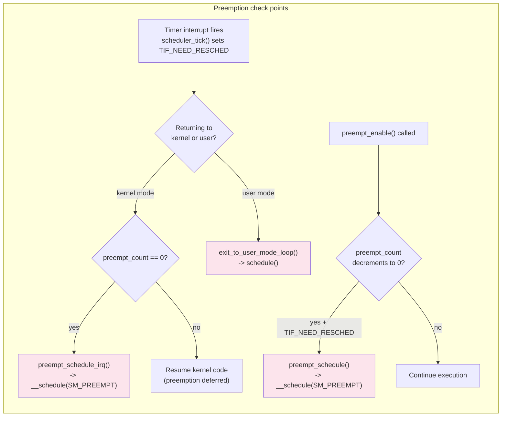

---

## 6. Integrated Lifecycle Diagram

The following diagram brings together all phases of a process's life — from creation through scheduling and context switching to final destruction. The blue-highlighted nodes indicate points where the scheduler is directly involved.

A process is born via `fork()`/`clone()` or `kthread_create()`, both of which go through `copy_process()` and `dup_task_struct()`. The scheduler initializes the new task in `sched_fork()` and inserts it into the runqueue via `wake_up_new_task()`. During its lifetime, the task cycles between `TASK_RUNNING` and various sleep states, with the scheduler mediating every transition via timer ticks, preemption checks, wakeups, and context switches. At death, `do_exit()` tears down resources, `do_task_dead()` performs the final context switch, and the zombie is reaped by the parent's `wait()` call.

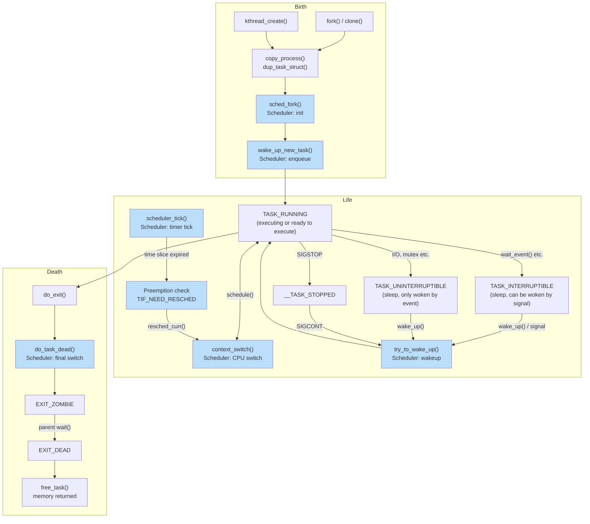

> Blue-highlighted nodes indicate points where the scheduler is directly involved.

---

## 7. Function Quick Reference

| Function | File:Line | Role |
|----------|-----------|------|
| `kernel_clone()` | `kernel/fork.c:2610` | fork/clone entry point |
| `copy_process()` | `kernel/fork.c:1966` | Deep copy of process |
| `dup_task_struct()` | `kernel/fork.c:1052` | Allocate and copy task_struct |
| `copy_thread()` | `arch/x86/kernel/process.c:170` | x86 register frame setup |
| `sched_fork()` | `kernel/sched/core.c` | Scheduler initialization |
| `wake_up_new_task()` | `kernel/sched/core.c` | Insert new task into runqueue |
| `kernel_thread()` | `kernel/fork.c:2700` | Create kernel thread |
| `kthreadd()` | `kernel/kthread.c:815` | Kernel thread daemon (PID 2) |
| `schedule()` | `kernel/sched/core.c:6954` | Voluntary scheduling entry |
| `__schedule()` | `kernel/sched/core.c:6722` | Core scheduling logic |
| `pick_next_task()` | `kernel/sched/core.c:5971` | Select next task to execute |
| `context_switch()` | `kernel/sched/core.c:5201` | Orchestrate mm + register switch |
| `__switch_to_asm()` | `arch/x86/entry/entry_64.S:178` | Save/restore callee-saved regs, switch stack pointer |
| `__switch_to()` | `arch/x86/kernel/process_64.c:610` | FPU, segments, TLS, per-CPU current, PKRU switch |
| `ret_from_fork_asm` | `arch/x86/entry/entry_64.S:229` | Entry point for newly forked tasks on first schedule |
| `cpu_switch_to()` | `arch/arm64/kernel/entry.S:823` | ARM64 equivalent: register switch via cpu_context |
| `finish_task_switch()` | `kernel/sched/core.c:5075` | Post-switch cleanup (on new stack) |
| `do_exit()` | `kernel/exit.c:896` | Main process termination |
| `do_group_exit()` | `kernel/exit.c:1086` | Thread group termination |
| `exit_notify()` | `kernel/exit.c:736` | Parent notification + child reparenting |
| `release_task()` | `kernel/exit.c:244` | Complete zombie removal |
| `do_task_dead()` | `kernel/sched/core.c:6880` | Final schedule call |
| `free_task()` | `kernel/fork.c:528` | Free task_struct memory |
| `complete_signal()` | `kernel/signal.c:963` | Signal delivery completion |
| `get_signal()` | `kernel/signal.c:2799` | Dequeue and process signals |
| `preempt_schedule()` | `kernel/sched/core.c:7033` | Preemption from preempt_enable() |
| `preempt_schedule_irq()` | `kernel/sched/core.c:7079` | Preemption from interrupt return |

---

## 8. Observing the Process Lifecycle with trace-cmd (ftrace)

The Linux kernel embeds tracepoints at every major point in the process lifecycle. These tracepoints are compiled into the kernel and can be dynamically enabled at runtime via ftrace. The `trace-cmd` tool provides a convenient command-line interface for recording and analyzing these traces without manually writing to `/sys/kernel/debug/tracing/` files.

The tracepoints discussed in this section correspond directly to the code paths described in the preceding chapters. Each one fires at a specific point in the kernel source, and together they allow an observer to reconstruct the complete birth-to-death timeline of any process.

### 8.1 Tracepoint Map

The following table lists every tracepoint relevant to the process lifecycle, where it fires in the source code, and what fields it exports. The "Lifecycle phase" column maps each tracepoint to the corresponding section in this document.

| Tracepoint | Source location | Fires when | Exported fields | Lifecycle phase |
|------------|----------------|------------|-----------------|-----------------|
| `task:task_newtask` | `kernel/fork.c:2468` | `copy_process()` completes — new task_struct is fully initialized but not yet runnable | `pid`, `comm`, `clone_flags`, `oom_score_adj` | Creation (2.1) |
| `sched:sched_process_fork` | `kernel/fork.c:2661` | `kernel_clone()` records the parent-child relationship, just before waking the child | `parent_comm`, `parent_pid`, `child_comm`, `child_pid` | Creation (2.1) |
| `sched:sched_wakeup_new` | `kernel/sched/core.c:4759` | `wake_up_new_task()` places the newly forked child on a runqueue for the first time | `comm`, `pid`, `prio`, `target_cpu` | Creation (2.1) |
| `sched:sched_waking` | `kernel/sched/core.c:4095, 4111` | `try_to_wake_up()` makes the wakeup decision, from the waking CPU's context | `comm`, `pid`, `prio`, `target_cpu` | Scheduling (3.2) |
| `sched:sched_wakeup` | `kernel/sched/core.c:3607` | `ttwu_do_wakeup()` sets `p->__state = TASK_RUNNING` | `comm`, `pid`, `prio`, `target_cpu` | Scheduling (3.2) |
| `sched:sched_switch` | `kernel/sched/core.c:6864` | `__schedule()`, immediately before `context_switch()` — the actual CPU handover | `prev_comm`, `prev_pid`, `prev_prio`, `prev_state`, `next_comm`, `next_pid`, `next_prio` | Context switch (3.1) |
| `sched:sched_migrate_task` | `kernel/sched/core.c:3259` | `set_task_cpu()` — a task is about to be moved to a different CPU | `comm`, `pid`, `prio`, `orig_cpu`, `dest_cpu` | Scheduling (3.2) |
| `sched:sched_stat_runtime` | `kernel/sched/fair.c:1159` | `update_curr()` — CFS accounts CPU time each tick (requires `CONFIG_SCHEDSTATS`) | `comm`, `pid`, `runtime` (ns) | Scheduling (3.1) |
| `sched:sched_process_exit` | `kernel/exit.c:942` | `do_exit()` — the task is dying, exit_code is set | `comm`, `pid`, `prio`, `group_dead` | Destruction (4.2) |
| `sched:sched_process_wait` | `kernel/exit.c:1708` | `do_wait()` — the parent enters `wait4()`/`waitpid()` | `comm` (waiter), `pid` (waited), `prio` | Destruction (4.7) |
| `sched:sched_process_free` | `kernel/exit.c:230` | `delayed_put_task_struct()` — RCU callback, last moment before `task_struct` is freed | `comm`, `pid`, `prio` | Destruction (4.3) |
| `signal:signal_generate` | `kernel/signal.c:1155, 2083` | `__send_signal_locked()` — a signal is queued to a task | `sig`, `errno`, `code`, `comm`, `pid`, `group`, `result` | Signal death (4.1) |
| `signal:signal_deliver` | `kernel/signal.c:2870, 2929` | `get_signal()` — a signal is dequeued and about to be handled | `sig`, `errno`, `code`, `sa_handler`, `sa_flags` | Signal death (4.1) |

### 8.2 Recording Traces

All commands below require root privileges. `trace-cmd` wraps ftrace; the `record` subcommand enables the specified tracepoints, runs the workload (or records system-wide), and writes a binary `trace.dat` file. The `report` subcommand reads `trace.dat` and prints human-readable output.

#### Full lifecycle of a specific command

To trace the complete lifecycle of a process — from fork through scheduling to exit — recording all relevant tracepoints while running a command:

```bash
# Record all lifecycle tracepoints for a specific command
sudo trace-cmd record -e task:task_newtask \
                      -e sched:sched_process_fork \
                      -e sched:sched_wakeup_new \
                      -e sched:sched_waking \
                      -e sched:sched_wakeup \
                      -e sched:sched_switch \
                      -e sched:sched_process_exit \
                      -e sched:sched_process_wait \
                      -e sched:sched_process_free \
                      -e signal:signal_generate \
                      -e signal:signal_deliver \
                      -- ls /tmp

# View the trace
trace-cmd report
```

The output will show events in chronological order across all CPUs. A typical fork+exec+exit sequence looks like:

```
bash-1234  [002]  100.001: task:task_newtask:        pid=5678 comm=bash clone_flags=0x1200000
bash-1234  [002]  100.001: sched:sched_process_fork: comm=bash pid=1234 child_comm=bash child_pid=5678
bash-1234  [002]  100.001: sched:sched_wakeup_new:   comm=bash pid=5678 prio=120 target_cpu=003
   ...     [003]  100.002: sched:sched_switch:        prev_comm=idle prev_pid=0 ... ==> next_comm=bash next_pid=5678
bash-5678  [003]  100.003: sched:sched_process_exit:  comm=ls pid=5678 prio=120
   ...     [003]  100.004: sched:sched_process_free:  comm=ls pid=5678 prio=120
```

#### Tracing context switches only

Context switches are recorded by `sched:sched_switch`, the single most informative tracepoint for understanding scheduler behavior. The `prev_state` field reveals why the outgoing task was descheduled:

```bash
# Record only context switches for 5 seconds
sudo trace-cmd record -e sched:sched_switch sleep 5

# Report, filtering for a specific process
trace-cmd report | grep "my_process"
```

The `prev_state` values in the output are encoded as:

| Symbol | Meaning | Corresponding kernel state |
|--------|---------|---------------------------|
| `R` | Running (preempted) | `TASK_RUNNING` |
| `R+` | Running, preempted | `TASK_RUNNING` + preempt flag |
| `S` | Interruptible sleep | `TASK_INTERRUPTIBLE` |
| `D` | Uninterruptible sleep | `TASK_UNINTERRUPTIBLE` |
| `T` | Stopped | `__TASK_STOPPED` |
| `t` | Traced | `__TASK_TRACED` |
| `X` | Dead | `TASK_DEAD` / `EXIT_DEAD` |
| `Z` | Zombie | `EXIT_ZOMBIE` |
| `I` | Idle | `TASK_IDLE` |

#### Tracing wakeups and wakeup latency

The `sched_waking` -> `sched_wakeup` -> `sched_switch` sequence reveals the latency between a task being woken and actually getting CPU time:

```bash
# Record wakeups and switches together
sudo trace-cmd record -e sched:sched_waking \
                      -e sched:sched_wakeup \
                      -e sched:sched_switch \
                      sleep 5

trace-cmd report
```

To measure wakeup latency, look for the timestamp delta between `sched_waking` (wakeup initiated) and the `sched_switch` where the task appears as `next_comm`.

#### Tracing signal delivery and signal-caused death

To observe the full signal path — from generation through delivery to process exit:

```bash
# Record signal + exit tracepoints while sending a signal
sudo trace-cmd record -e signal:signal_generate \
                      -e signal:signal_deliver \
                      -e sched:sched_process_exit \
                      -e sched:sched_process_free &
TRACE_PID=$!

# In another terminal, run a process and kill it
sleep 100 &
TARGET=$!
kill -TERM $TARGET

sudo kill -INT $TRACE_PID   # stop trace-cmd
wait $TRACE_PID
trace-cmd report
```

The output will show:
1. `signal_generate` — `SIGTERM` queued to the target (with `result=0` meaning `TRACE_SIGNAL_DELIVERED`)
2. `signal_deliver` — `SIGTERM` dequeued inside `get_signal()`, `sa_handler=0` (SIG_DFL)
3. `sched_process_exit` — `do_exit()` called
4. `sched_process_free` — `task_struct` freed after RCU grace period

#### Tracing process creation and destruction together

To see the complete birth-to-death cycle including the parent's `wait()`:

```bash
# Trace fork + exit + wait
sudo trace-cmd record -e task:task_newtask \
                      -e sched:sched_process_fork \
                      -e sched:sched_wakeup_new \
                      -e sched:sched_process_exit \
                      -e sched:sched_process_wait \
                      -e sched:sched_process_free \
                      -- bash -c 'sleep 0.1'

trace-cmd report
```

#### Tracing CPU migration

When the scheduler moves a task between CPUs (for load balancing or NUMA optimization), the `sched_migrate_task` tracepoint fires:

```bash
# Record migration events for 10 seconds
sudo trace-cmd record -e sched:sched_migrate_task sleep 10

trace-cmd report
```

Each event shows `orig_cpu` and `dest_cpu`, allowing you to track how the scheduler distributes work across cores.

### 8.3 Filtering Traces

`trace-cmd` supports per-event filters using the ftrace filter syntax. This is useful when the system is busy and you only want events related to a specific process or condition.

```bash
# Only record context switches involving PID 1234
sudo trace-cmd record -e sched:sched_switch \
    -f 'prev_pid == 1234 || next_pid == 1234' \
    sleep 5

# Only record forks where the parent is bash
sudo trace-cmd record -e sched:sched_process_fork \
    -f 'parent_comm == "bash"' \
    sleep 5

# Only record SIGKILL signals
sudo trace-cmd record -e signal:signal_generate \
    -f 'sig == 9' \
    sleep 10
```

### 8.4 Using trace-cmd with function tracing

Beyond tracepoints, `trace-cmd` can also record function calls. This is useful for tracing the internal call chain of functions described in this document:

```bash
# Trace function calls in the fork path
sudo trace-cmd record -p function_graph \
    -g kernel_clone \
    -- ls /tmp

trace-cmd report
```

This produces a hierarchical call graph showing the exact execution path through `kernel_clone()` -> `copy_process()` -> `dup_task_struct()` -> etc., with timestamps for each function entry and exit.

```bash
# Trace the exit path
sudo trace-cmd record -p function_graph \
    -g do_group_exit \
    -- bash -c 'exit 0'

trace-cmd report
```

```bash
# Trace the context switch path
sudo trace-cmd record -p function_graph \
    -g __schedule \
    -o switch_trace.dat \
    sleep 1

trace-cmd report -i switch_trace.dat
```

### 8.5 Lifecycle Event Ordering

When all tracepoints are enabled simultaneously, the events for a single process's life appear in the following order. This sequence maps directly to the code paths described throughout this document:

```
Birth:
  1. task:task_newtask          fork.c:2468    copy_process() — struct allocated
  2. sched:sched_process_fork   fork.c:2661    kernel_clone() — parent/child recorded
  3. sched:sched_wakeup_new     core.c:4759    wake_up_new_task() — first enqueue

Life (repeating):
  4. sched:sched_waking         core.c:4095    try_to_wake_up() — wakeup initiated
  5. sched:sched_wakeup         core.c:3607    ttwu_do_wakeup() — state = RUNNING
  6. sched:sched_switch         core.c:6864    __schedule() — context switch
  7. sched:sched_migrate_task   core.c:3259    set_task_cpu() — CPU migration
  8. sched:sched_stat_runtime   fair.c:1159    update_curr() — runtime accounting

Signals (if any):
  9. signal:signal_generate     signal.c:1155  __send_signal_locked() — signal queued
 10. signal:signal_deliver      signal.c:2929  get_signal() — signal dequeued

Death:
 11. sched:sched_process_exit   exit.c:942     do_exit() — task dying
 12. sched:sched_switch         core.c:6864    __schedule() — final switch (prev_state=X)
 13. sched:sched_process_wait   exit.c:1708    do_wait() — parent waits
 14. sched:sched_process_free   exit.c:230     delayed_put_task_struct() — struct freed
```

Note that event 12 (the final `sched_switch`) will show `prev_state=X` (dead) for the dying task, and the `next_comm`/`next_pid` will be whatever task the scheduler picks to run next. This is the last `sched_switch` event where the dying task appears as `prev`.
