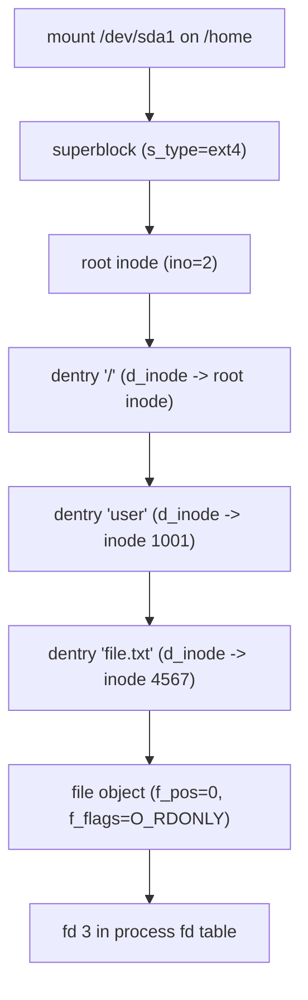
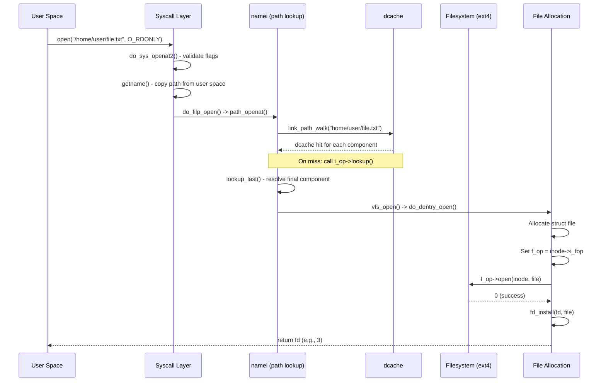
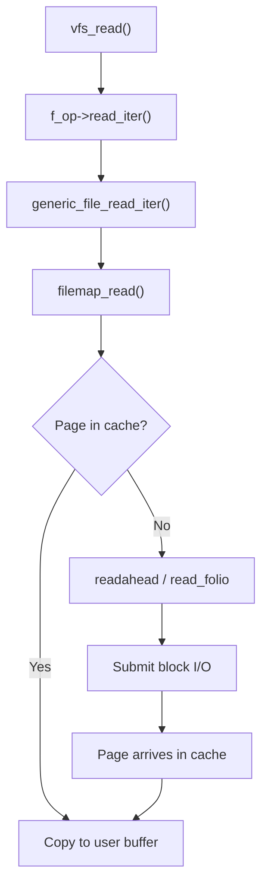

# VFS and the Filesystem Layer in Linux 6.19

> Source base: `/home/inineapa/Lab/linux-6.19`

---

## Before You Begin

In user space, you call `open()`, `read()`, `write()`, and `close()` without thinking about whether the file lives on ext4, XFS, NFS, or a RAM-based filesystem like tmpfs. You might `stat()` a file, `readdir()` a directory, and `mmap()` a shared library -- all through the same system calls. This uniformity is not an accident. It is the job of the **Virtual Filesystem Switch** (VFS), a kernel-internal abstraction layer that sits between your system calls and the actual filesystem implementation on disk (or in memory, or across the network).

This document walks through the VFS from the perspective of a developer who is comfortable writing user-space C but new to kernel internals. We start with the four core objects that the VFS uses to represent everything about files, then trace the most important code paths: opening a file, reading from it, writing to it, and looking up paths. By the end, you will understand what happens between your `open("/etc/passwd", O_RDONLY)` call and the bytes arriving in your buffer.

The code references use the format `file:line` and point to the Linux 6.19 source tree. If you want to follow along, keep the source open in another window.

---

## 1. The Big Picture: What VFS Does

### 1.1 The Problem VFS Solves

Linux supports dozens of filesystems: ext4, XFS, Btrfs, NFS, CIFS, FAT32, tmpfs, procfs, sysfs, and many more. Each has wildly different on-disk formats, metadata structures, and semantics. Without VFS, every program would need to know which filesystem a file resides on and call different functions for each one. That would be a nightmare.

VFS solves this by defining a common set of in-memory objects and operations. Every filesystem implements the same interfaces. When you call `read()`, the kernel dispatches to the correct filesystem-specific `read` implementation through a function pointer table -- you never see the difference.

### 1.2 The Four Core Objects

The entire VFS revolves around four objects. Every operation you perform on a file touches at least one of them:

| Object | Represents | Lifetime | Defined In |
|--------|-----------|----------|------------|
| **superblock** | A mounted filesystem instance | From mount to unmount | `include/linux/fs/super_types.h:129` |
| **inode** | A single file (metadata, not data) | Cached in memory, evicted under pressure | `include/linux/fs.h:765` |
| **dentry** | A path component (links a name to an inode) | Cached in the dcache | `include/linux/dcache.h:92` |
| **file** | An open file (per `open()` call) | From `open()` to `close()` | `include/linux/fs.h:1258` |

### 1.3 How They Relate

When you mount a filesystem, the kernel creates a **superblock** to represent that mounted instance. The superblock points to the root **inode** of the filesystem. As you navigate paths (`/home/user/file.txt`), the kernel builds a tree of **dentries** -- each dentry maps a filename component to an inode. When you call `open()`, the kernel creates a **file** object that holds your current position and flags, pointing to the dentry and inode.



The mental model: **superblock** is the filesystem, **inode** is the file, **dentry** is the name, and **file** is the open handle.

---

## 2. The Superblock -- One Per Mounted Filesystem

Every time you run `mount /dev/sda1 /mnt`, the kernel creates a `struct super_block` to represent that mounted filesystem. If you mount the same device twice (e.g., bind mount), there may still be only one superblock. The superblock holds global filesystem metadata: block size, maximum file size, pointers to the root dentry, and the operations table that the filesystem driver provides.

### 2.1 struct super_block

Defined at `include/linux/fs/super_types.h:129`. Key fields:

| Field | Type | Purpose |
|-------|------|---------|
| `s_dev` | `dev_t` | Device number (`major:minor`). For pseudo-filesystems like procfs, this is auto-assigned. |
| `s_blocksize` | `unsigned long` | Block size in bytes (typically 4096 for ext4). |
| `s_blocksize_bits` | `unsigned char` | log2 of `s_blocksize` (12 for 4096). |
| `s_maxbytes` | `loff_t` | Maximum file size this filesystem supports. |
| `s_type` | `struct file_system_type *` | Pointer back to the filesystem type (ext4, xfs, etc.). |
| `s_op` | `const struct super_operations *` | The operations table -- how to allocate inodes, sync, get stats, etc. |
| `s_root` | `struct dentry *` | The root dentry of this filesystem (the `/` of the mount). |
| `s_flags` | `unsigned long` | Mount flags: `SB_RDONLY`, `SB_NOSUID`, `SB_NOEXEC`, etc. |
| `s_bdev` | `struct block_device *` | The underlying block device (NULL for pseudo-filesystems). |
| `s_fs_info` | `void *` | Filesystem-private data. ext4 stores its `ext4_sb_info` here. |
| `s_magic` | `unsigned long` | Magic number identifying the filesystem type (e.g., `0xEF53` for ext4). |
| `s_uuid` | `uuid_t` | UUID of the filesystem. |

### 2.2 struct super_operations

Defined at `include/linux/fs/super_types.h:82`. This is the vtable that each filesystem provides to tell the VFS how to manage inodes and the filesystem as a whole:

```c
struct super_operations {
    struct inode *(*alloc_inode)(struct super_block *sb);
    void (*destroy_inode)(struct inode *inode);
    void (*free_inode)(struct inode *inode);
    void (*dirty_inode)(struct inode *inode, int flags);
    int (*write_inode)(struct inode *inode, struct writeback_control *wbc);
    int (*drop_inode)(struct inode *inode);
    void (*evict_inode)(struct inode *inode);
    void (*put_super)(struct super_block *sb);
    int (*sync_fs)(struct super_block *sb, int wait);
    int (*statfs)(struct dentry *dentry, struct kstatfs *kstatfs);
    int (*remount_fs)(struct super_block *, int *, char *);
    void (*umount_begin)(struct super_block *sb);
    /* ... additional operations for quotas, caching, shutdown ... */
};
```

The most important operations:

| Operation | When Called | What It Does |
|-----------|-----------|--------------|
| `alloc_inode` | Creating a new in-memory inode | Allocates filesystem-specific inode (e.g., `ext4_inode_info` which embeds `struct inode`) |
| `write_inode` | Syncing inode to disk | Writes the in-memory inode metadata back to the on-disk format |
| `evict_inode` | Removing inode from cache | Cleans up filesystem-specific data when the inode is no longer needed |
| `sync_fs` | `sync` or `syncfs` syscall | Flushes all dirty data and metadata to persistent storage |
| `statfs` | `statfs()` / `df` command | Returns filesystem statistics (total blocks, free blocks, etc.) |
| `put_super` | Unmounting | Releases filesystem-private resources |

### 2.3 Key Functions in fs/super.c

- `sget_fc()` (`fs/super.c:731`) -- Find or create a superblock during mount. It searches for an existing superblock that matches the mount criteria; if none is found, it allocates a new one.
- `generic_shutdown_super()` -- Called during unmount to flush data, evict inodes, and release the superblock.

---

## 3. The Inode -- One Per File on Disk

An inode is the kernel's in-memory representation of a file's metadata. Every file, directory, symlink, device node, socket, and FIFO has exactly one inode. The inode does **not** store the filename -- that is the dentry's job. The inode stores the file's size, permissions, ownership, timestamps, and pointers to the operations tables.

If you have used `ls -i` to see inode numbers, you have seen the on-disk inode number. The in-memory `struct inode` is a superset of the on-disk metadata, enriched with kernel-internal bookkeeping.

### 3.1 struct inode

Defined at `include/linux/fs.h:765`. Key fields:

| Field | Type | Purpose |
|-------|------|---------|
| `i_mode` | `umode_t` | File type and permissions (same bits you see in `stat.st_mode`). |
| `i_uid` | `kuid_t` | Owner user ID. |
| `i_gid` | `kgid_t` | Owner group ID. |
| `i_ino` | `unsigned long` | Inode number (unique within the filesystem). |
| `i_size` | `loff_t` | File size in bytes. |
| `i_atime_sec` | `time64_t` | Last access time (seconds since epoch). |
| `i_mtime_sec` | `time64_t` | Last modification time. |
| `i_ctime_sec` | `time64_t` | Last metadata change time. |
| `i_op` | `const struct inode_operations *` | Operations for this inode (lookup, create, mkdir, etc.). |
| `i_fop` | `const struct file_operations *` | Default file operations -- copied into `struct file` on `open()`. |
| `i_sb` | `struct super_block *` | The superblock this inode belongs to. |
| `i_mapping` | `struct address_space *` | The page cache for this inode's data (see Section 9). |
| `i_nlink` | `unsigned int` | Hard link count. When it reaches 0 and no process has the file open, the file is deleted. |
| `i_blocks` | `blkcnt_t` | Number of 512-byte blocks allocated to this file. |
| `i_count` | `atomic_t` | In-memory reference count. When it reaches 0, the inode can be evicted. |
| `i_lock` | `spinlock_t` | Protects `i_blocks`, `i_bytes`, and sometimes `i_size`. |
| `i_rwsem` | `struct rw_semaphore` | Read-write lock for the inode. Taken during read/write, truncate, etc. |

### 3.2 struct inode_operations

Defined at `include/linux/fs.h:1988`. This is the interface for directory and metadata operations:

```c
struct inode_operations {
    struct dentry * (*lookup)(struct inode *, struct dentry *, unsigned int);
    int (*create)(struct mnt_idmap *, struct inode *, struct dentry *, umode_t, bool);
    int (*link)(struct dentry *, struct inode *, struct dentry *);
    int (*unlink)(struct inode *, struct dentry *);
    int (*symlink)(struct mnt_idmap *, struct inode *, struct dentry *, const char *);
    struct dentry *(*mkdir)(struct mnt_idmap *, struct inode *, struct dentry *, umode_t);
    int (*rmdir)(struct inode *, struct dentry *);
    int (*rename)(struct mnt_idmap *, struct inode *, struct dentry *,
                  struct inode *, struct dentry *, unsigned int);
    int (*permission)(struct mnt_idmap *, struct inode *, int);
    int (*setattr)(struct mnt_idmap *, struct dentry *, struct iattr *);
    int (*getattr)(struct mnt_idmap *, const struct path *, struct kstat *, u32, unsigned int);
    /* ... */
};
```

Key operations:

| Operation | When Called | What It Does |
|-----------|-----------|--------------|
| `lookup` | Path resolution hits a cache miss | Asks the filesystem to find the inode for a given name within a directory |
| `create` | `open(path, O_CREAT)` | Creates a new regular file |
| `mkdir` | `mkdir()` syscall | Creates a new directory |
| `unlink` | `unlink()` / `rm` | Removes a directory entry (decrements link count) |
| `rename` | `rename()` syscall | Moves/renames a file |
| `permission` | Every access check | Checks whether the current process can access this inode |

### 3.3 Key Functions in fs/inode.c

- `new_inode()` (`fs/inode.c:1171`) -- Allocates a fresh inode for a new file. Calls `sb->s_op->alloc_inode()` if the filesystem provides one, otherwise uses the generic slab allocator.
- `iget_locked()` (`fs/inode.c:1448`) -- Looks up an inode by number in the inode hash table. If found, returns it with an incremented reference count. If not found, allocates a new one and returns it locked (with `I_NEW` set) so the filesystem can fill in its fields.
- `iput()` (`fs/inode.c:1966`) -- Decrements the reference count. When it reaches zero, the inode becomes reclaimable -- the kernel may evict it from memory when memory pressure demands.

### 3.4 The Inode Cache

Reading inode metadata from disk is expensive. The kernel maintains an in-memory **inode cache** (icache) that keeps recently-used inodes in a hash table indexed by `(superblock, inode_number)`. When you `stat()` a file, the kernel first checks the icache. Only on a miss does it go to disk (via the filesystem's `lookup` and read operations).

You can observe inode cache statistics via:

```bash
cat /proc/slabinfo | grep inode
# Or with slabtop for a live view
```

The cache is managed by the slab allocator. Each filesystem may have its own slab cache (e.g., `ext4_inode_cache`) because its inode struct embeds `struct inode` inside a larger filesystem-specific struct.

---

## 4. The Dentry -- Pathnames to Inodes

A dentry (directory entry) connects a **name** to an **inode**. When you access `/home/user/file.txt`, the kernel needs four dentries: one for `/`, one for `home`, one for `user`, and one for `file.txt`. Each dentry points to the inode that the name resolves to.

Dentries exist purely in memory -- there is no on-disk "dentry." The on-disk directory contains (name, inode_number) pairs, which the kernel reads and converts into dentries.

### 4.1 struct dentry

Defined at `include/linux/dcache.h:92`. Key fields:

| Field | Type | Purpose |
|-------|------|---------|
| `d_flags` | `unsigned int` | State flags (protected by `d_lock`). |
| `d_seq` | `seqcount_spinlock_t` | Per-dentry sequence lock for RCU path walk. |
| `d_hash` | `struct hlist_bl_node` | Hash bucket linkage for the dcache hash table. |
| `d_parent` | `struct dentry *` | Parent directory's dentry. For the root dentry, `d_parent` points to itself. |
| `d_name` | `struct qstr` | The name of this component (e.g., `"file.txt"`). Contains both the string and a precomputed hash. |
| `d_inode` | `struct inode *` | The inode this name refers to. **NULL for negative dentries** (see below). |
| `d_op` | `const struct dentry_operations *` | Optional operations table (`include/linux/dcache.h:151`). Used by filesystems that need custom name comparison (case-insensitive) or revalidation (NFS). |
| `d_sb` | `struct super_block *` | The superblock this dentry belongs to. |
| `d_children` | `struct hlist_head` | List of child dentries (subdirectories and files). |
| `d_sib` | `struct hlist_node` | Sibling linkage (other entries in the same parent directory). |
| `d_lockref` | `struct lockref` | Combined spinlock and reference count (an optimization to avoid two separate atomic operations). |

### 4.2 The Dentry Cache (dcache)

Path lookup is the **single hottest code path in the kernel**. Every `open()`, `stat()`, `access()`, `readlink()`, and `exec()` call triggers a path lookup. The dentry cache (dcache) makes this fast by caching the results of previous lookups in a large hash table.

The dcache is a global hash table (`fs/dcache.c`) indexed by `(parent_dentry, name_hash)`. When the kernel needs to resolve a path component, it first checks the dcache. On a hit, no disk I/O is needed -- the dentry already points to the correct inode.

**Cache hit rates are typically 99%+** on a running system. This means that for most file operations, the kernel never touches the disk for metadata -- it finds everything it needs in memory.

### 4.3 Key Functions in fs/dcache.c

- `d_lookup()` (`fs/dcache.c:2387`) -- Searches the dcache for a dentry with the given parent and name. Takes `rename_lock` to protect against concurrent renames. Returns the dentry if found, NULL otherwise.
- `__d_lookup()` (`fs/dcache.c:2417`) -- A faster version of `d_lookup()` that skips the `rename_lock`. Slightly racy but safe for the common case. Used in the RCU path walk fast path.
- `d_alloc()` (`fs/dcache.c:1817`) -- Allocates a new dentry and links it to its parent.
- `__d_alloc()` (`fs/dcache.c:1734`) -- Low-level dentry allocation from the dentry slab cache.

### 4.4 Negative Dentries

When you call `open("nonexistent_file", O_RDONLY)` and get `ENOENT`, the kernel has to do work: it looks up the parent directory, searches for the name, and discovers it does not exist. To avoid repeating this work, the kernel caches the **negative result** as a **negative dentry** -- a dentry with `d_inode == NULL`.

Next time something tries to access `"nonexistent_file"` in the same directory, the dcache immediately returns the negative dentry, and the kernel can return `ENOENT` without touching the disk. This is surprisingly important -- build systems like `make` check for hundreds of non-existent header paths before finding the right one.

Negative dentries are evicted under memory pressure, just like positive dentries.

---

## 5. The File Object -- One Per open()

Every time a process calls `open()`, the kernel creates a `struct file`. This object represents the **open instance** of a file -- it tracks the current read/write position (`f_pos`), the access mode (`O_RDONLY`, `O_WRONLY`, `O_RDWR`), and the operations table. Multiple processes can have different `struct file` objects pointing to the same inode (e.g., two processes reading the same log file at different offsets).

### 5.1 struct file

Defined at `include/linux/fs.h:1258`. Key fields:

| Field | Type | Purpose |
|-------|------|---------|
| `f_op` | `const struct file_operations *` | The operations table -- how to read, write, mmap, ioctl, etc. Copied from `i_fop` during `open()`. |
| `f_inode` | `struct inode *` | The inode this file refers to. |
| `f_path` | `struct path` | Contains `(vfsmount, dentry)` pair -- identifies both the file and the mount point. |
| `f_pos` | `loff_t` | Current read/write offset (the "file position"). Updated by `read()`, `write()`, `lseek()`. |
| `f_flags` | `unsigned int` | Open flags (`O_RDONLY`, `O_APPEND`, `O_NONBLOCK`, etc.). |
| `f_mode` | `fmode_t` | Access mode derived from `f_flags` (`FMODE_READ`, `FMODE_WRITE`). |
| `f_mapping` | `struct address_space *` | Points to the page cache for this file's data. Usually same as `f_inode->i_mapping`. |
| `f_cred` | `const struct cred *` | Credentials of the process that opened the file (for permission checks). |
| `f_ref` | `file_ref_t` | Reference count. Incremented by `dup()`, `fork()`, etc. Decremented by `close()`. When it reaches zero, the file is released. |
| `f_lock` | `spinlock_t` | Protects `f_flags` and other mutable fields. |
| `f_ra` | `struct file_ra_state` | Read-ahead state (inside a union). Tracks how aggressively the kernel should pre-fetch data. |

### 5.2 struct file_operations

Defined at `include/linux/fs.h:1918`. This is arguably the most important vtable in the kernel -- it defines how data flows to and from a file:

```c
struct file_operations {
    struct module *owner;
    fop_flags_t fop_flags;
    loff_t (*llseek)(struct file *, loff_t, int);
    ssize_t (*read)(struct file *, char __user *, size_t, loff_t *);
    ssize_t (*write)(struct file *, const char __user *, size_t, loff_t *);
    ssize_t (*read_iter)(struct kiocb *, struct iov_iter *);
    ssize_t (*write_iter)(struct kiocb *, struct iov_iter *);
    __poll_t (*poll)(struct file *, struct poll_table_struct *);
    long (*unlocked_ioctl)(struct file *, unsigned int, unsigned long);
    int (*mmap)(struct file *, struct vm_area_struct *);
    int (*open)(struct inode *, struct file *);
    int (*release)(struct inode *, struct file *);
    int (*fsync)(struct file *, loff_t, loff_t, int datasync);
    ssize_t (*splice_read)(struct file *, loff_t *, struct pipe_inode_info *, size_t, unsigned int);
    ssize_t (*splice_write)(struct pipe_inode_info *, struct file *, loff_t *, size_t, unsigned int);
    int (*fadvise)(struct file *, loff_t, loff_t, int);
    int (*uring_cmd)(struct io_uring_cmd *ioucmd, unsigned int issue_flags);
    /* ... */
};
```

Note the two read/write interfaces:

| Interface | Signature | Used By |
|-----------|----------|---------|
| `read` / `write` | Buffer + count + position | Legacy interface, still used by simple drivers |
| `read_iter` / `write_iter` | `struct kiocb` + `struct iov_iter` | Modern interface. Supports scatter/gather I/O, async I/O, and splice. All modern filesystems use this. |

If a filesystem provides `read_iter` but not `read`, the VFS wraps the call automatically via `new_sync_read()` (`fs/read_write.c`).

### 5.3 The File Descriptor Table

User space sees files as integer file descriptors (0 for stdin, 1 for stdout, etc.). The kernel maps these integers to `struct file` pointers through a per-process file descriptor table.

**struct fdtable** (`include/linux/fdtable.h:26`):

| Field | Type | Purpose |
|-------|------|---------|
| `max_fds` | `unsigned int` | Current capacity of the fd array. Grows dynamically. |
| `fd` | `struct file __rcu **` | Array of pointers to `struct file`. Index = file descriptor number. |
| `close_on_exec` | `unsigned long *` | Bitmap: which fds have the `O_CLOEXEC` flag. |
| `open_fds` | `unsigned long *` | Bitmap: which fd slots are currently in use. |

**struct files_struct** (`include/linux/fdtable.h:38`) is the per-process wrapper:

| Field | Type | Purpose |
|-------|------|---------|
| `count` | `atomic_t` | Reference count. Shared across threads via `CLONE_FILES`. |
| `fdt` | `struct fdtable __rcu *` | Pointer to the current fd table (may be replaced when growing). |
| `fdtab` | `struct fdtable` | Inline "small" fd table (avoids allocation for processes with few open files). |
| `fd_array` | `struct file __rcu *[NR_OPEN_DEFAULT]` | Inline array for the first `BITS_PER_LONG` fds (64 on x86_64). |
| `next_fd` | `unsigned int` | Hint for the next fd to allocate (optimization to avoid scanning from 0). |

### 5.4 Key Functions in fs/file.c

- `alloc_fd()` (`fs/file.c:570`) -- Finds the lowest available file descriptor number within the allowed range.
- `fd_install()` (`fs/file.c:680`) -- Installs a `struct file` pointer into the fd table at the given index. After this call, user space can use the fd.

---

## 6. Path Lookup -- The Heart of VFS

Path lookup is the process of converting a pathname string like `"/home/user/file.txt"` into a `(vfsmount, dentry)` pair. It is the most performance-critical code in VFS, and one of the most complex subsystems in the entire kernel. The implementation lives in `fs/namei.c` (namei = "name to inode").

### 6.1 What Happens When You Call open("/home/user/file.txt", O_RDONLY)

Let us trace the path lookup step by step:


1. **Start at the root**: The path begins with `/`, so the kernel starts at `current->fs->root` (the process's root dentry).

2. **Walk "home"**: The kernel calls `d_lookup(root_dentry, "home")` to search the dcache. If found (cache hit), it gets the dentry for `/home` immediately. If not found (cache miss), it calls `inode->i_op->lookup()` on the root directory's inode, which reads the directory from disk and creates a new dentry.

3. **Walk "user"**: Same process -- dcache lookup for "user" under the `/home` dentry.

4. **Walk "file.txt"**: Same process for the final component. This is the **last component** and gets special handling (the kernel may need to create the file if `O_CREAT` is set).

5. **Mount point crossing**: If `/home` is a separate mount, the kernel detects this and switches to the new filesystem's superblock and root dentry transparently.

6. **Symlink resolution**: If any component is a symlink, the kernel reads the link target and restarts the walk from there (with a depth limit to prevent infinite loops).

### 6.2 The Three Main Functions

**`link_path_walk()`** (`fs/namei.c:2519`) -- The workhorse. It walks the path one component at a time in a `for(;;)` loop:

```c
static int link_path_walk(const char *name, struct nameidata *nd)
{
    int depth = 0;
    int err;

    nd->last_type = LAST_ROOT;
    nd->flags |= LOOKUP_PARENT;
    /* skip leading slashes */
    if (*name == '/') {
        do { name++; } while (unlikely(*name == '/'));
    }

    for(;;) {
        /* hash the next component name */
        nd->last.name = name;
        name = hash_name(nd, name, &lastword);

        /* handle "." and ".." specially */
        switch(lastword) {
        case LAST_WORD_IS_DOTDOT: /* go up one level */
        case LAST_WORD_IS_DOT:    /* stay in place  */
        }

        /* look up the component in the dcache or on disk */
        /* handle mount crossings and symlinks */
        /* advance to next component */
    }
}
```

For each component, it hashes the name, checks the dcache, handles `.` and `..`, follows mount points, and resolves symlinks.

**`path_lookupat()`** (`fs/namei.c:2742`) -- The entry point for simple lookups (stat, access, etc.). It initializes the `nameidata` struct, calls `link_path_walk()`, and handles the final component:

```c
static int path_lookupat(struct nameidata *nd, unsigned flags, struct path *path)
{
    const char *s = path_init(nd, flags);   /* set starting point */
    int err;

    while (!(err = link_path_walk(s, nd)) &&
           (s = lookup_last(nd)) != NULL)
        ;
    if (!err)
        err = complete_walk(nd);
    /* ... */
}
```

**`filename_lookup()`** (`fs/namei.c:2775`) -- The top-level function called by VFS operations like `stat()`. Sets up the `nameidata` and calls `path_lookupat()`.

### 6.3 RCU Path Walk (The Fast Path)

The performance trick that makes path lookup fast is **RCU (Read-Copy-Update) walk mode**. In this mode, the kernel walks the entire path **without taking any locks or incrementing any reference counts**. It uses sequence counters (`d_seq` in each dentry) to detect concurrent modifications.

The algorithm:

1. Enter RCU read-side critical section (`rcu_read_lock()`).
2. For each component, look up the dentry in the dcache using `__d_lookup()` (the lockless variant).
3. Read the dentry's `d_seq` before and after reading its fields. If the sequence number changed, a concurrent rename happened -- fall back to the locked (REF) path.
4. If the entire walk completes without conflicts, take a reference on the final dentry and exit RCU.

This fast path succeeds in the vast majority of cases. Only when there is actual contention (concurrent renames, mount changes) does the kernel fall back to the slower locked walk.

### 6.4 Symlink Resolution

When `link_path_walk()` encounters a symlink, it:

1. Reads the link target via `inode->i_op->get_link()`.
2. If the target starts with `/`, restarts from the root.
3. Otherwise, continues from the current directory.
4. Tracks recursion depth (maximum 40 levels, defined by `MAXSYMLINKS`) to prevent infinite loops.

### 6.5 Mount Point Crossing

When the kernel steps into a directory that is a mount point, it transparently switches to the mounted filesystem:

1. After resolving a dentry, the kernel checks if there is a mount on top of it.
2. If yes, it follows the mount chain to the topmost filesystem and switches to that filesystem's root dentry.
3. This is completely invisible to user space -- the path walk continues seamlessly across filesystem boundaries.

---

## 7. The open() System Call -- Full Path

Let us trace what happens when user space calls `open("/home/user/file.txt", O_RDONLY)` from the syscall entry to the file descriptor being returned.

### 7.1 Syscall Entry

```c
// fs/open.c:1440
SYSCALL_DEFINE3(open, const char __user *, filename, int, flags, umode_t, mode)
{
    if (force_o_largefile())
        flags |= O_LARGEFILE;
    return do_sys_open(AT_FDCWD, filename, flags, mode);
}
```

`do_sys_open()` (`fs/open.c:1433`) builds an `open_how` struct and calls `do_sys_openat2()`.

### 7.2 do_sys_openat2()

The real work happens here (`fs/open.c:1415`):

```c
static int do_sys_openat2(int dfd, const char __user *filename,
                          struct open_how *how)
{
    struct open_flags op;
    struct filename *tmp = getname(filename);  /* copy path from user space */

    err = build_open_flags(how, &op);          /* validate and translate flags */
    return FD_ADD(how->flags, do_filp_open(dfd, tmp, &op));
}
```

### 7.3 The Full Sequence



Step by step:

1. **Copy the path** from user space using `getname()`.
2. **Validate flags** with `build_open_flags()`.
3. **Path lookup** via `path_openat()` which calls `link_path_walk()` for all but the last component, then `lookup_last()` for the final component.
4. **Allocate a file descriptor** using `alloc_fd()`.
5. **Allocate a struct file** from the file slab cache.
6. **Open the file**: `do_dentry_open()` sets up the file struct -- copies `i_fop` to `f_op`, sets `f_mapping`, and calls the filesystem's `f_op->open()` if it exists.
7. **Install the fd**: `fd_install()` places the `struct file` pointer into the process's fd table.
8. **Return the fd** to user space.

---

## 8. read() and write() -- Data Flow

### 8.1 The read() System Call

When you call `read(fd, buf, count)`, here is the full path:

```c
// fs/read_write.c:722
SYSCALL_DEFINE3(read, unsigned int, fd, char __user *, buf, size_t, count)
{
    return ksys_read(fd, buf, count);
}
```

**`ksys_read()`** (`fs/read_write.c:704`):

```c
ssize_t ksys_read(unsigned int fd, char __user *buf, size_t count)
{
    CLASS(fd_pos, f)(fd);           /* look up struct file from fd table */
    ssize_t ret = -EBADF;

    if (!fd_empty(f)) {
        loff_t pos, *ppos = file_ppos(fd_file(f));
        if (ppos) {
            pos = *ppos;
            ppos = &pos;
        }
        ret = vfs_read(fd_file(f), buf, count, ppos);
        if (ret >= 0 && ppos)
            fd_file(f)->f_pos = pos;  /* update file position */
    }
    return ret;
}
```

**`vfs_read()`** (`fs/read_write.c:552`) -- The VFS dispatch point:

```c
ssize_t vfs_read(struct file *file, char __user *buf, size_t count, loff_t *pos)
{
    /* Permission checks */
    if (!(file->f_mode & FMODE_READ))
        return -EBADF;
    if (!(file->f_mode & FMODE_CAN_READ))
        return -EINVAL;
    if (unlikely(!access_ok(buf, count)))
        return -EFAULT;

    ret = rw_verify_area(READ, file, pos, count);

    /* Dispatch to filesystem */
    if (file->f_op->read)
        ret = file->f_op->read(file, buf, count, pos);
    else if (file->f_op->read_iter)
        ret = new_sync_read(file, buf, count, pos);
    else
        ret = -EINVAL;

    /* Accounting */
    if (ret > 0) {
        fsnotify_access(file);
        add_rchar(current, ret);
    }
    inc_syscr(current);
    return ret;
}
```

The flow: check permissions, verify the access range, dispatch to the filesystem's read function, and update accounting.

### 8.2 The write() Path

`vfs_write()` (`fs/read_write.c:666`) mirrors `vfs_read()`:

1. Check `FMODE_WRITE` and `FMODE_CAN_WRITE`.
2. Call `file_start_write()` (for freeze protection on regular files).
3. Dispatch to `f_op->write` or `f_op->write_iter`.
4. Call `file_end_write()`.
5. Notify inotify/fanotify via `fsnotify_modify()`.

### 8.3 The Iterator Interface: read_iter / write_iter

Modern filesystems implement `read_iter` and `write_iter` instead of the legacy `read`/`write`. The key difference is the `struct iov_iter` parameter, which abstracts the data source/destination:

```
struct iov_iter can represent:
  - A user-space buffer (iovec)
  - A kernel buffer (kvec)
  - A pipe
  - A bio_vec (for block I/O)
  - An xarray (for page cache operations)
```

This lets the same filesystem code handle `read()`, `readv()`, `pread()`, `splice()`, and `io_uring` read operations through a single code path.

### 8.4 How Data Reaches User Space (Regular Files)

For a regular file on ext4, the `read_iter` path goes through the **page cache**:



The actual data copy from the page cache to the user buffer happens in `filemap_read()` (`mm/filemap.c:2763`). We cover this in detail in Section 9.

---

## 9. The Page Cache

The page cache is the kernel's mechanism for caching file data in memory. It is the reason that reading the same file twice is fast -- the second read comes from RAM, not disk. Virtually all regular file I/O goes through the page cache (unless `O_DIRECT` is used).

### 9.1 How the Page Cache Works

Every inode has an `address_space` (pointed to by `i_mapping`) that serves as the page cache for that file. The `address_space` is essentially a radix tree (xarray) that maps file offsets to pages (folios) in memory.

When you `read()` a file:

1. The kernel computes which page(s) contain the requested byte range.
2. It looks up those pages in the `address_space` xarray.
3. **Cache hit**: The page is already in memory -- copy the data to user space. No disk I/O.
4. **Cache miss**: Trigger readahead (pre-fetch multiple pages) or read a single folio from disk via `address_space_operations->read_folio()`.

### 9.2 struct address_space_operations

Defined at `include/linux/fs.h:403`. This is the interface between the page cache and the filesystem:

| Operation | Purpose |
|-----------|---------|
| `read_folio` | Read a single folio (page or compound page) from the backing store into the page cache |
| `readahead` | Read multiple folios ahead of the current read position |
| `writepages` | Write dirty pages back to the backing store |
| `dirty_folio` | Mark a folio as dirty (modified, needs writeback) |
| `write_begin` | Prepare to write data into a page (allocate blocks, read partial page) |
| `write_end` | Finish writing data into a page (mark dirty, update metadata) |
| `direct_IO` | Bypass the page cache for O_DIRECT I/O |

### 9.3 filemap_read() -- The Page Cache Read Path

`filemap_read()` (`mm/filemap.c:2763`) is the function that actually reads data from the page cache:

```c
ssize_t filemap_read(struct kiocb *iocb, struct iov_iter *iter,
                     ssize_t already_read)
{
    struct file *filp = iocb->ki_filp;
    struct file_ra_state *ra = &filp->f_ra;
    struct address_space *mapping = filp->f_mapping;
    struct inode *inode = mapping->host;

    do {
        /* Find folios in the page cache (or trigger readahead) */
        /* For each folio found: */
        /*   - Wait for it to become up-to-date if I/O is pending */
        /*   - Copy data from the folio to the user buffer */
        /*   - Advance the position */
    } while (/* more data requested */);
}
```

The loop handles multiple pages, readahead triggers, short reads, and async I/O in a single unified path.

### 9.4 Readahead

When the kernel detects sequential reading (which it almost always is), it pre-fetches pages **ahead** of what the process has asked for. This means that by the time the process issues the next `read()`, the data is already in memory.

The readahead logic:
- Starts conservatively (small window).
- Doubles the window size as sequential access continues.
- Backs off if the process starts seeking randomly.
- Maximum readahead window is typically 256 KB (configurable per block device via `/sys/block/*/queue/read_ahead_kb`).

### 9.5 Dirty Pages and Writeback

When you `write()` data, the kernel does **not** immediately write to disk. Instead:

1. The data is written into the page cache (the page is marked "dirty").
2. A background kernel thread (`kworker/writeback`) periodically flushes dirty pages to disk.
3. The `sync()` syscall forces all dirty pages to be written immediately.

Dirty page thresholds:
- When dirty pages exceed a certain percentage of memory (~20% by default), the kernel starts background writeback.
- When dirty pages exceed a higher threshold (~40%), processes that write are throttled (they block in the write path).

This design gives you fast writes (you only write to RAM) while ensuring data eventually reaches disk. The tradeoff is that a crash before writeback completes can lose recent writes (unless you call `fsync()`).

### 9.6 Why the Page Cache Makes VFS Fast

The page cache is the reason the VFS performs well despite its abstraction overhead:

| Operation | Without Page Cache | With Page Cache |
|-----------|-------------------|----------------|
| Read same file twice | 2 disk reads | 1 disk read + 1 memory copy |
| Write then read | disk write + disk read | 2 memory copies |
| Multiple processes read same file | N disk reads | 1 disk read + N memory copies |
| Sequential read | many small disk reads | 1 large readahead + memory copies |

---

## 10. Registering a Filesystem

### 10.1 struct file_system_type

Every filesystem that the kernel supports is described by a `struct file_system_type` (`include/linux/fs.h:2264`):

```c
struct file_system_type {
    const char *name;           /* "ext4", "xfs", "tmpfs", etc. */
    int fs_flags;               /* FS_REQUIRES_DEV, FS_ALLOW_IDMAP, etc. */
    int (*init_fs_context)(struct fs_context *);
    const struct fs_parameter_spec *parameters;
    struct dentry *(*mount)(struct file_system_type *, int, const char *, void *);
    void (*kill_sb)(struct super_block *);
    struct module *owner;
    struct file_system_type *next;  /* linked list of all registered fs types */
    struct hlist_head fs_supers;    /* all superblocks of this type */
    /* ... lock class keys ... */
};
```

Key flags:

| Flag | Meaning |
|------|---------|
| `FS_REQUIRES_DEV` | Filesystem needs a block device (ext4, XFS, Btrfs) |
| `FS_ALLOW_IDMAP` | Filesystem supports VFS ID-mapped mounts |
| `FS_MGTIME` | Uses multigrain timestamps |
| `FS_USERNS_MOUNT` | Can be mounted inside user namespaces |

### 10.2 register_filesystem() and unregister_filesystem()

Defined in `fs/filesystems.c:72`:

```c
int register_filesystem(struct file_system_type *fs)
```

This function adds the filesystem type to a global linked list. After registration, the filesystem can be mounted using `mount -t <name>`. You can see all registered filesystems in `/proc/filesystems`.

### 10.3 The Mount Callback

In modern kernels (6.x), filesystems use `init_fs_context` rather than the legacy `mount` callback. The `init_fs_context` function sets up a `struct fs_context` that describes how to create a superblock:

1. Parse mount options via the `parameters` table.
2. Call `sget_fc()` to find or create a superblock.
3. Fill in the superblock (read the on-disk superblock, create the root inode and dentry).
4. Return the root dentry.

### 10.4 Example: How ext4 Registers

In `fs/ext4/super.c:7450`:

```c
static struct file_system_type ext4_fs_type = {
    .owner              = THIS_MODULE,
    .name               = "ext4",
    .init_fs_context    = ext4_init_fs_context,
    .parameters         = ext4_param_specs,
    .kill_sb            = ext4_kill_sb,
    .fs_flags           = FS_REQUIRES_DEV | FS_ALLOW_IDMAP | FS_MGTIME | FS_LBS,
};
MODULE_ALIAS_FS("ext4");
```

And in `ext4_init_fs()` (`fs/ext4/super.c:7461`):

```c
static int __init ext4_init_fs(void)
{
    /* ... initialization ... */
    err = register_filesystem(&ext4_fs_type);
    /* ... */
}
```

When ext4 is compiled as a module, `ext4_init_fs()` runs at module load time. When compiled into the kernel, it runs during boot.

---

## 11. Special Filesystems

Not all filesystems store data on disk. Linux has several "pseudo-filesystems" that present kernel data structures as files and directories. They use the same VFS interfaces, which is why you can `cat /proc/cpuinfo` with the same tools you use for regular files.

### 11.1 procfs (/proc)

**Source**: `fs/proc/`

Provides a view into kernel and process internals:

| Path | Content |
|------|---------|
| `/proc/[pid]/maps` | Process virtual memory layout |
| `/proc/[pid]/fd/` | Open file descriptors (symlinks to actual files) |
| `/proc/[pid]/status` | Process status (name, state, memory usage) |
| `/proc/cpuinfo` | CPU information |
| `/proc/meminfo` | Memory statistics |
| `/proc/mounts` | Mounted filesystems |
| `/proc/filesystems` | Registered filesystem types |
| `/proc/slabinfo` | Slab allocator statistics |

procfs has no block device. Its inodes are created on-the-fly when you access a path. The `read` operation for each file is a custom function that formats kernel data structures into text.

### 11.2 sysfs (/sys)

**Source**: `fs/sysfs/`

Exports the kernel's device model as a filesystem:

```
/sys/
  block/          -- block devices (sda, nvme0n1, etc.)
  bus/            -- bus types (pci, usb, etc.)
  class/          -- device classes (net, block, tty, etc.)
  devices/        -- all devices in a hierarchy
  fs/             -- filesystem-specific parameters
  kernel/         -- kernel tuning parameters
  module/         -- loaded modules
```

Each file in sysfs typically represents a single kernel attribute (e.g., `/sys/block/sda/queue/read_ahead_kb`). Reading returns the attribute value; writing changes it.

### 11.3 tmpfs

**Source**: `mm/shmem.c`

A filesystem backed entirely by memory (and swap). Files exist only in the page cache and swap. Used for `/tmp` on many distributions and for POSIX shared memory (`/dev/shm`).

Key difference from a ramdisk: tmpfs pages can be swapped out under memory pressure, so tmpfs does not permanently consume RAM.

### 11.4 devtmpfs

**Source**: `drivers/base/devtmpfs.c`

Automatically populates `/dev` with device nodes as the kernel discovers hardware. Works with udev/systemd-udevd which then applies permission rules and creates symlinks.

### 11.5 How They Differ From On-Disk Filesystems

| Aspect | On-Disk (ext4, XFS) | Pseudo (procfs, sysfs) |
|--------|---------------------|----------------------|
| Block device | Required | None |
| Persistent data | Yes | No (data generated on access) |
| `FS_REQUIRES_DEV` | Set | Not set |
| Inode allocation | From disk | Dynamic, on demand |
| Page cache usage | Caches disk data | Rarely used |
| Superblock | Reads from disk | Created in memory |

---

## 12. Function Quick Reference

### Core VFS Functions

| Function | File:Line | Purpose |
|----------|-----------|---------|
| `vfs_read()` | `fs/read_write.c:552` | VFS read dispatch -- checks permissions, calls `f_op->read` or `f_op->read_iter` |
| `vfs_write()` | `fs/read_write.c:666` | VFS write dispatch -- checks permissions, calls `f_op->write` or `f_op->write_iter` |
| `ksys_read()` | `fs/read_write.c:704` | Looks up fd, gets file position, calls `vfs_read()` |
| `ksys_write()` | `fs/read_write.c:727` | Looks up fd, gets file position, calls `vfs_write()` |
| `do_sys_openat2()` | `fs/open.c:1415` | Main open implementation -- validates flags, resolves path, creates file |
| `do_sys_open()` | `fs/open.c:1433` | Wrapper that builds `open_how` and calls `do_sys_openat2()` |

### Path Lookup Functions

| Function | File:Line | Purpose |
|----------|-----------|---------|
| `link_path_walk()` | `fs/namei.c:2519` | Walks a path component by component |
| `path_lookupat()` | `fs/namei.c:2742` | Entry point for path resolution |
| `filename_lookup()` | `fs/namei.c:2775` | Top-level lookup called by VFS operations |

### Inode Functions

| Function | File:Line | Purpose |
|----------|-----------|---------|
| `new_inode()` | `fs/inode.c:1171` | Allocate a fresh inode for a new file |
| `iget_locked()` | `fs/inode.c:1448` | Find or allocate inode by number (returns locked if new) |
| `iput()` | `fs/inode.c:1966` | Release an inode reference |

### Dentry Functions

| Function | File:Line | Purpose |
|----------|-----------|---------|
| `d_lookup()` | `fs/dcache.c:2387` | Search dcache with rename protection |
| `__d_lookup()` | `fs/dcache.c:2417` | Fast dcache search (slightly racy, used in RCU walk) |
| `d_alloc()` | `fs/dcache.c:1817` | Allocate a new dentry and attach to parent |
| `__d_alloc()` | `fs/dcache.c:1734` | Low-level dentry allocation |

### File Descriptor Functions

| Function | File:Line | Purpose |
|----------|-----------|---------|
| `alloc_fd()` | `fs/file.c:570` | Find lowest available fd number |
| `fd_install()` | `fs/file.c:680` | Install a `struct file` into the fd table |

### Superblock Functions

| Function | File:Line | Purpose |
|----------|-----------|---------|
| `sget_fc()` | `fs/super.c:731` | Find or create a superblock during mount |
| `register_filesystem()` | `fs/filesystems.c:72` | Register a filesystem type with the kernel |

### Page Cache Functions

| Function | File:Line | Purpose |
|----------|-----------|---------|
| `filemap_read()` | `mm/filemap.c:2763` | Read data from the page cache (or trigger I/O) |

### Core Data Structures

| Structure | File:Line | Purpose |
|-----------|-----------|---------|
| `struct super_block` | `include/linux/fs/super_types.h:129` | Represents a mounted filesystem |
| `struct super_operations` | `include/linux/fs/super_types.h:82` | Superblock method table |
| `struct inode` | `include/linux/fs.h:765` | Represents a file (metadata) |
| `struct inode_operations` | `include/linux/fs.h:1988` | Inode method table (lookup, create, etc.) |
| `struct dentry` | `include/linux/dcache.h:92` | Path component to inode mapping |
| `struct dentry_operations` | `include/linux/dcache.h:151` | Dentry method table (revalidate, hash, etc.) |
| `struct file` | `include/linux/fs.h:1258` | Open file instance |
| `struct file_operations` | `include/linux/fs.h:1918` | File method table (read, write, mmap, etc.) |
| `struct file_system_type` | `include/linux/fs.h:2264` | Filesystem type descriptor |
| `struct address_space_operations` | `include/linux/fs.h:403` | Page cache method table |
| `struct fdtable` | `include/linux/fdtable.h:26` | File descriptor to file pointer mapping |
| `struct files_struct` | `include/linux/fdtable.h:38` | Per-process open file table |

---

## 13. Debugging and Observing VFS

### 13.1 Inspecting Mounted Filesystems

```bash
# List all mounted filesystems with types and options
cat /proc/mounts

# More human-readable output
mount | column -t

# Show filesystem statistics (type, total/used/free space)
df -Th

# List all filesystem types the kernel knows about
cat /proc/filesystems
# "nodev" prefix means no block device required (pseudo-filesystem)
```

### 13.2 Tracing System Calls with strace

`strace` is the easiest way to see which VFS operations a program triggers:

```bash
# Trace file-related syscalls for a command
strace -e trace=open,openat,read,write,close,stat,fstat,lstat ls /tmp

# Trace with timestamps to find slow operations
strace -T -e trace=file ls /tmp

# Trace a running process
strace -p <pid> -e trace=file

# Count syscalls (find which operations dominate)
strace -c find /usr -name "*.h"
```

Example output for `cat /etc/hostname`:

```
openat(AT_FDCWD, "/etc/hostname", O_RDONLY) = 3
fstat(3, {st_mode=S_IFREG|0644, st_size=8, ...}) = 0
read(3, "myhost\n", 131072)             = 8
write(1, "myhost\n", 8)                 = 8
close(3)                                = 0
```

Each line corresponds to a VFS operation we discussed: `openat` -> Section 7, `read` -> Section 8, etc.

### 13.3 ftrace -- Tracing Kernel Functions

ftrace lets you trace VFS functions inside the kernel without recompiling:

```bash
# Enable function tracing for VFS read/write
cd /sys/kernel/debug/tracing
echo vfs_read > set_ftrace_filter
echo vfs_write >> set_ftrace_filter
echo function > current_tracer
echo 1 > tracing_on

# Run your workload, then read the trace
cat trace

# Disable
echo 0 > tracing_on
echo nop > current_tracer
```

For deeper analysis, use function_graph tracer to see the call tree:

```bash
echo vfs_read > set_graph_function
echo function_graph > current_tracer
echo 1 > tracing_on
# Run workload
cat trace
```

This shows the full call chain from `vfs_read()` down to the filesystem's read implementation and the page cache.

### 13.4 Inode and Dentry Cache Statistics

```bash
# Dentry and inode cache slab statistics
cat /proc/slabinfo | head -2   # header
cat /proc/slabinfo | grep -E 'dentry|inode'

# Interactive slab viewer (needs root)
sudo slabtop -s c

# Memory pressure on caches
cat /proc/meminfo | grep -E 'Slab|SReclaimable|SUnreclaim'
```

Typical output:

```
# slabinfo - version: 2.1
# name            <active_objs> <num_objs> <objsize> ...
dentry              145832       146016      192 ...
ext4_inode_cache     82451        82560     1192 ...
inode_cache           1234         1260      680 ...
```

The dentry cache usually has the most objects because path lookup creates dentries for every component.

### 13.5 Observing the Page Cache

```bash
# See how much memory is used by the page cache
cat /proc/meminfo | grep -E '^(Cached|Buffers|Dirty|Writeback)'

# See page cache status for a specific file (needs vmtouch)
vmtouch /path/to/file

# Drop all caches (for benchmarking -- do NOT do this in production)
echo 3 | sudo tee /proc/sys/vm/drop_caches
```

### 13.6 VFS Event Tracing

The kernel provides tracepoints specifically for filesystem events:

```bash
# List available filesystem tracepoints
ls /sys/kernel/debug/tracing/events/filelock/
ls /sys/kernel/debug/tracing/events/writeback/

# Trace writeback events (see dirty page flushing)
echo 1 > /sys/kernel/debug/tracing/events/writeback/enable
cat /sys/kernel/debug/tracing/trace_pipe

# Trace ext4 operations
echo 1 > /sys/kernel/debug/tracing/events/ext4/enable
# Now perform file operations and watch the events
```

### 13.7 Common Debugging Scenarios

**Problem: "Which filesystem is slow?"**

```bash
# Use BPF tools (bcc/bpftrace) to measure per-filesystem latency
sudo biolatency -D          # block I/O latency by device
sudo ext4slower 1           # ext4 operations slower than 1ms
sudo fileslower 1           # all filesystem operations slower than 1ms
```

**Problem: "Too many open files"**

```bash
# Check per-process limits
cat /proc/<pid>/limits | grep "open files"

# Count open fds for a process
ls /proc/<pid>/fd | wc -l

# System-wide limit
cat /proc/sys/fs/file-nr
# Output: <allocated> <unused> <max>
```

**Problem: "Dentry cache consuming too much memory"**

```bash
# Check current pressure
cat /proc/meminfo | grep Slab

# The kernel automatically reclaims dcache under memory pressure
# You can manually trigger reclaim (careful in production):
echo 2 | sudo tee /proc/sys/vm/drop_caches  # free dentries and inodes
```
